# 1.3.42 基于表面的压力渗透

**产品：**Abaqus/Standard  

### 测试的元件

CPE4    CPE8    CAX4    CAX8    SAX1    SAX2    

C3D4    C3D6    C3D8    C3D10    C3D10M    C3D15    C3D20    

CCL9    CCL12    CCL18    CCL24    

S4    SC6R    SC8R    M3D4    

### 测试的功能

通过使用压力渗透载荷来测试可变形体与刚性表面之间的接触，以及暴露于流体压力的两个可变形表面之间的接触。

### 问题描述

**图 1.3.42–1** 二维中可变形表面与刚性表面之间的接触。

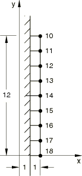

**材料：**

杨氏模量 = 1×10^5；泊松比 = 0.3。

**边界条件：**

二维模型：刚性表面在所有自由度上被约束。当考虑两个可变形表面之间的接触时，[图 1.3.42–2](ch01s03abv45.md#verpresspen-deform-match)中  0处的节点和[图 1.3.42–3](ch01s03abv45.md#verpresspen-deform-nomatch)中  0处的节点在所有自由度上被约束。

三维模型（[图 1.3.42–4](ch01s03abv45.md#ver-elm-ppen-rigid-3d-model)和[图 1.3.42–5](ch01s03abv45.md#ver-elm-ppen-3d-model)）：刚性表面在所有自由度上被约束。环两端节点在第一个自由度上被约束，背面节点在第三个自由度上被约束；当考虑两个可变形表面之间的接触时，模型的内环表面和外环表面也在所有自由度上被约束。

**载荷：**

对于[图 1.3.42–1](ch01s03abv45.md#verpresspen-deform-rigid)和[图 1.3.42–2](ch01s03abv45.md#verpresspen-deform-match)所示的二维模型：
- 步骤1：当使用实体元件时，在  2.0处的表面上沿负x方向施加非均匀位移 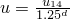。 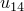 是节点14处的位移，d是从节点14测量的距离。当使用壳元件时，在  2.0处的表面上施加非均匀压力 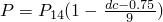。 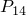 是包含节点14的元件处的压力， 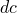 是从节点14到元件中心的距离。
- 步骤2：接触表面的两端（ 0 和  12.0）暴露于大小为800.0的流体压力。
- 步骤3：将两端的流体压力增加到900.0。

对于[图 1.3.42–3](ch01s03abv45.md#verpresspen-deform-nomatch)所示的模型：
- 步骤1：在  2.0处的表面上沿负y方向施加非均匀位移 。
- 步骤2：接触表面的一端  2 暴露于大小为550的流体压力；另一端  14 暴露于大小为800的流体压力。
- 步骤3：分别将两端的流体压力从550增加到650，从800增加到900。

对于[图 1.3.42–4](ch01s03abv45.md#ver-elm-ppen-rigid-3d-model)和[图 1.3.42–5](ch01s03abv45.md#ver-elm-ppen-3d-model)所示的三维模型：
- 步骤1：模型由两个部分组成，接触表面最初过盈接触。这种初始过盈接触通过使用接触干涉定义中的自动收缩配合功能在该步中自动消除。
- 步骤2：有两个地方最初暴露于大小为20000的流体压力；环下端的接触表面外角，以及环上端接触表面的整个边缘。

**图 1.3.42–2** 二维中具有匹配网格的两个可变形表面之间的接触。

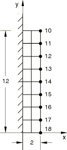

**图 1.3.42–3** 二维中具有非匹配网格的两个可变形表面之间的接触。

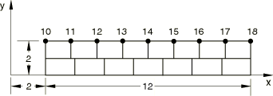

**图 1.3.42–4** 三维中可变形表面与刚性表面之间的接触。

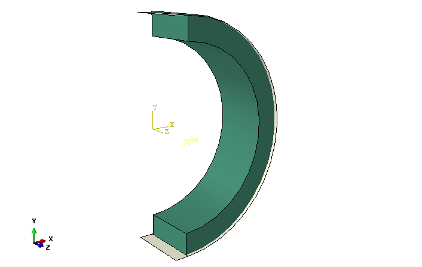

**图 1.3.42–5** 三维中两个可变形表面之间的接触。

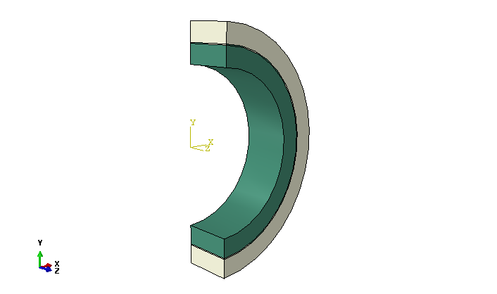

### 结果与讨论

输出接触表面上每个从节点的接触压力和流体压力。[图 1.3.42–6](ch01s03abv45.md#ver-elm-ppen-3d-results)特别显示了步骤2中间三维模型的变形。

**图 1.3.42–6** 三维中具有两个可变形表面的模型的变形。

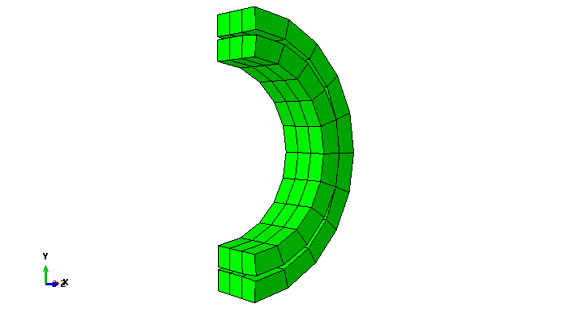

### 输入文件

#### 可变形表面与刚性表面接触：

[ei22srs1_ppen.inp](../eif/ei22srs1_ppen.inp)

CPE4元件。

[ei23srs1_ppen.inp](../eif/ei23srs1_ppen.inp)

CPE8元件。

[eia2srs1_ppen.inp](../eif/eia2srs1_ppen.inp)

CAX4元件。

[eia2srs3_ppen.inp](../eif/eia2srs3_ppen.inp)

使用MAX1元件创建的刚性体的CAX4元件。

[eia3srs1_ppen.inp](../eif/eia3srs1_ppen.inp)

CAX8元件。

[eia3srs1_ppen_auglagr.inp](../eif/eia3srs1_ppen_auglagr.inp)

CAX8元件。

[eia3srs3_ppen.inp](../eif/eia3srs3_ppen.inp)

使用MAX1元件创建的刚性体的CAX8元件。

[eia3srs3_ppen_auglagr.inp](../eif/eia3srs3_ppen_auglagr.inp)

使用MAX1元件创建的刚性体的CAX8元件。

[eia2srs2_ppen.inp](../eif/eia2srs2_ppen.inp)

SAX1元件。

[eia2srs4_ppen.inp](../eif/eia2srs4_ppen.inp)

使用SAX1元件创建的刚性体的SAX1元件。

[eia3srs2_ppen.inp](../eif/eia3srs2_ppen.inp)

SAX2元件。

[eia3srs4_ppen.inp](../eif/eia3srs4_ppen.inp)

使用SAX1元件创建的刚性体的SAX2元件。

[ver-ppen-c3d4-rigid.inp](../eif/ver-ppen-c3d4-rigid.inp)

具有解析刚性表面的C3D4元件。

[ver-ppen-c3d6-rigid.inp](../eif/ver-ppen-c3d6-rigid.inp)

具有解析刚性表面的C3D6元件。

[ver-ppen-c3d8-rigid.inp](../eif/ver-ppen-c3d8-rigid.inp)

具有解析刚性表面的C3D8元件。

[ver-ppen-c3d10-rigid.inp](../eif/ver-ppen-c3d10-rigid.inp)

具有解析刚性表面的C3D10元件。

[ver-ppen-c3d10m-rigid.inp](../eif/ver-ppen-c3d10m-rigid.inp)

具有解析刚性表面的C3D10M元件。

[ver-ppen-c3d15-rigid.inp](../eif/ver-ppen-c3d15-rigid.inp)

具有解析刚性表面的C3D15元件。

[ver-ppen-c3d20-rigid.inp](../eif/ver-ppen-c3d20-rigid.inp)

具有解析刚性表面的C3D20元件。

[ver-ppen-ccl9-rigid.inp](../eif/ver-ppen-ccl9-rigid.inp)

具有解析刚性表面的CCL9元件。

[ver-ppen-ccl12-rigid.inp](../eif/ver-ppen-ccl12-rigid.inp)

具有解析刚性表面的CCL12元件。

[ver-ppen-ccl18-rigid.inp](../eif/ver-ppen-ccl18-rigid.inp)

具有解析刚性表面的CCL18元件。

[ver-ppen-ccl24-rigid.inp](../eif/ver-ppen-ccl24-rigid.inp)

具有解析刚性表面的CCL24元件。

[ver-ppen-s4-rigid.inp](../eif/ver-ppen-s4-rigid.inp)

具有解析刚性表面的S4元件。

[ver-ppen-sc6r-rigid.inp](../eif/ver-ppen-sc6r-rigid.inp)

具有解析刚性表面的SC6R元件。

[ver-ppen-sc8r-rigid.inp](../eif/ver-ppen-sc8r-rigid.inp)

具有解析刚性表面的SC8R元件。

[ver-ppen-m3d4-rigid.inp](../eif/ver-ppen-m3d4-rigid.inp)

具有解析刚性表面的M3D4元件。

#### 两个具有匹配网格的可变形表面相互接触：

[ei22sss1_ppen.inp](../eif/ei22sss1_ppen.inp)

CPE4元件。

[ei23sss1_ppen.inp](../eif/ei23sss1_ppen.inp)

CPE8元件。

[ei23sss1_ppen_auglagr.inp](../eif/ei23sss1_ppen_auglagr.inp)

CPE8元件。

[eia2sss1_ppen.inp](../eif/eia2sss1_ppen.inp)

CAX4元件。

[eia2sss2_ppen.inp](../eif/eia2sss2_ppen.inp)

SAX1元件。

[eia2sss3_ppen.inp](../eif/eia2sss3_ppen.inp)

SAX1和CAX4元件。

[ver-ppen-c3d4.inp](../eif/ver-ppen-c3d4.inp)

C3D4元件。

[ver-ppen-c3d6.inp](../eif/ver-ppen-c3d6.inp)

C3D6元件。

[ver-ppen-c3d8.inp](../eif/ver-ppen-c3d8.inp)

C3D8元件。

[ver-ppen-c3d10.inp](../eif/ver-ppen-c3d10.inp)

C3D10元件。

[ver-ppen-c3d10m.inp](../eif/ver-ppen-c3d10m.inp)

C3D10M元件。

[ver-ppen-c3d15.inp](../eif/ver-ppen-c3d15.inp)

C3D15元件。

[ver-ppen-c3d20.inp](../eif/ver-ppen-c3d20.inp)

C3D20元件。

[ver-ppen-ccl9.inp](../eif/ver-ppen-ccl9.inp)

CCL9元件。

[ver-ppen-ccl12.inp](../eif/ver-ppen-ccl12.inp)

CCL12元件。

[ver-ppen-ccl18.inp](../eif/ver-ppen-ccl18.inp)

CCL18元件。

[ver-ppen-ccl24.inp](../eif/ver-ppen-ccl24.inp)

CCL24元件。

[ver-ppen-s4.inp](../eif/ver-ppen-s4.inp)

S4元件。

[ver-ppen-sc6r.inp](../eif/ver-ppen-sc6r.inp)

SC6R元件。

[ver-ppen-sc8r.inp](../eif/ver-ppen-sc8r.inp)

SC8R元件。

[ver-ppen-m3d4.inp](../eif/ver-ppen-m3d4.inp)

M3D4元件。

#### 两个具有非匹配网格的可变形表面相互接触：

[ei22sss2_ppen.inp](../eif/ei22sss2_ppen.inp)

CPE4元件。

[eia2sss4_ppen.inp](../eif/eia2sss4_ppen.inp)

CAX4元件。

[ver-ppen-c3d4-mismatch.inp](../eif/ver-ppen-c3d4-mismatch.inp)

C3D4元件。

[ver-ppen-c3d8-mismatch.inp](../eif/ver-ppen-c3d8-mismatch.inp)

C3D8元件。

