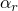
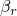

# 1.3.46 直接求解稳态动力学分析的科里奥利载荷

**产品：**Abaqus/Standard  

### 测试的元件

T2D2    T2D3    T3D2    T3D3    

CPE3    CPS3    CPE4    CPS4    CPE6    CPS6    CPE6M    CPS6M    CPE8    CPS8    

CPEG3    CPEG4    CPEG6    CPEG8    

C3D4    C3D6    C3D8    C3D10    C3D10M    C3D15    C3D20    C3D27    

### 问题描述

验证直接求解稳态动力学分析中科里奥利载荷的效果。对于桁架，对单位长度杆执行四步直接求解稳态动力学过程；对于二维实体，对单位正方形板执行；对于三维实体，对单位立方体执行。三角和棱柱元件形状使用两个单元，四面体元件形状使用五个单元，其他所有元件形状使用一个单元。所有节点上的单元都被约束，并在一个自由度上产生位移：步骤1和2中为自由度1，步骤3和4中为自由度2。科里奥利载荷在步骤2和4中被激活，通过与解析值比较来验证由此产生的附加反作用力和相位偏移。为稳态动力学分析中可用的所有实体和桁架单元类型测试了一个代表性单元类型，这些单元类型支持科里奥利载荷。通过使用CPE4元件执行全局和子模型分析来验证子模型功能的使用。

**材料：**

| 桁架模型的长度 | 1 |
| --- | --- |
| 面积 | 1 |
| 二维实体的平面尺寸 | 1×1 |
| 厚度 | 1 |
| 三维实体的立方体尺寸 | 1×1×1 |
| 杨氏模量 | 1000.0 |
| 泊松比 | 0.3 |
| 密度 | 1.0 |
| 阻尼 | =1.0，=0.0 |
| 科里奥利载荷 | 1.0 |
| 科里奥利旋转轴 | 通过点(0.5, 10, 0)的(0, 0, 1) |

### 结果与讨论

所有测试单元的科里奥利载荷引起的反作用力和相位角偏移与解析结果一致。

### 输入文件

[ece4sfdg.inp](../eif/ece4sfdg.inp)

CPE4元件，全局模型。

[ece4sfds.inp](../eif/ece4sfds.inp)

CPE4元件，子模型。

[et22sfdc.inp](../eif/et22sfdc.inp)

T2D2元件。

[et23sfdc.inp](../eif/et23sfdc.inp)

T2D3元件。

[et32sfdc.inp](../eif/et32sfdc.inp)

T3D2元件。

[et33sfdc.inp](../eif/et33sfdc.inp)

T3D3元件。

[ece3sfdc.inp](../eif/ece3sfdc.inp)

CPE3元件。

[ecs3sfdc.inp](../eif/ecs3sfdc.inp)

CPS3元件。

[ece4sfdc.inp](../eif/ece4sfdc.inp)

CPE4元件。

[ecs4sfdc.inp](../eif/ecs4sfdc.inp)

CPS4元件。

[ece6sfdc.inp](../eif/ece6sfdc.inp)

CPE6元件。

[ecs6sfdc.inp](../eif/ecs6sfdc.inp)

CPS6元件。

[ece6smdc.inp](../eif/ece6smdc.inp)

CPE6M元件。

[ecs6smdc.inp](../eif/ecs6smdc.inp)

CPS6M元件。

[ece8sfdc.inp](../eif/ece8sfdc.inp)

CPE8元件。

[ecs8sfdc.inp](../eif/ecs8sfdc.inp)

CPS8元件。

[ecg3sfdc.inp](../eif/ecg3sfdc.inp)

CPEG3元件。

[ecg4sfdc.inp](../eif/ecg4sfdc.inp)

CPEG4元件。

[ecg6sfdc.inp](../eif/ecg6sfdc.inp)

CPEG6元件。

[ecg8sfdc.inp](../eif/ecg8sfdc.inp)

CPEG8元件。

[ec34sfdc.inp](../eif/ec34sfdc.inp)

C3D4元件。

[ec36sfdc.inp](../eif/ec36sfdc.inp)

C3D6元件。

[ec38sfdc.inp](../eif/ec38sfdc.inp)

C3D8元件。

[ec3asfdc.inp](../eif/ec3asfdc.inp)

C3D10元件。

[ec3asmdc.inp](../eif/ec3asmdc.inp)

C3D10M元件。

[ec3fsfdc.inp](../eif/ec3fsfdc.inp)

C3D15元件。

[ec3ksfdc.inp](../eif/ec3ksfdc.inp)

C3D20元件。

[ec3rsfdc.inp](../eif/ec3rsfdc.inp)

C3D27元件。

