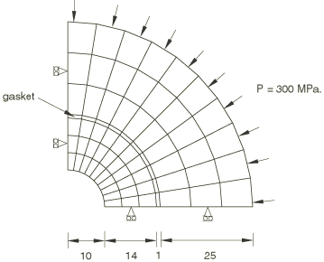

# 1.3.44 Gasket element assembly

**Product: **Abaqus/Standard  

### Elements tested

GKPE4    GKPE6    GKPS4    GKPS4N    GKPS6    GKPS6N    

GK3D6    GK3D6N    GK3D8    GK3D8N    GK3D12M    GK3D12MN    GK3D18    GK3D18N    

### Problem description

The different methods for joining gaskets to the remainder of the mesh are tested in this section. A 1 mm thick cylindrical gasket, sandwiched between two coaxial cylindrical tubes, is considered. The inner cylindrical tube has an inner radius of 10 mm and an outer radius of 24 mm, whereas the outer cylindrical tube has an inner radius of 25 mm and an outer radius of 50 mm. The outer cylinder is subjected to a pressure of 300 MPa on the outer surface.

The problem is modeled either as a plane strain problem, a plane stress problem, or a three-dimensional problem. Using symmetry conditions, a quarter of the geometry is modeled. A unit-thickness slice is modeled in all cases. The thickness direction of all gasket elements is the positive radial direction. Therefore, for any gasket element the surface closest to the cylindrical axis represents the bottom surface and the farthest surface represents the top surface. The thickness direction is specified with the user-specified normal definition at the symmetry planes. The gasket is modeled either as a single- or two-layer gasket. The gasket is joined to the rest of the model by using shared nodes, TIE and PIN MPCs, or contact pairs with no friction. When contact pairs are used, the input files demonstrate the use of general and tied contact conditions.

Different element types are used to model the tubes and the gasket, and suitable methods are chosen to join the two materials. For example, element types C3D27R and GK3D18 are used with shared nodes, whereas C3D20R and GK3D18N are used with contact pairs. A user-defined coordinate system is used to specify the local 2 and 3 directions for all three-dimensional gasket elements. No mesh convergence studies of the solution have been performed.

**Material: **

Cylindrical tubes: Young's modulus = 2.0  105 MPa, Poisson's ratio = 0.3.

Gasket: The thickness-direction behavior is linear elastic such that, for a gasket of unit thickness, the pressure is 400 MPa for a closure of 0.002 mm. The damage model with no unloading curve is used to specify this behavior. The membrane behavior of the gasket has the same Young's modulus and Poisson's ratio as the cylindrical tubes. Depending on the type of gasket elements used and the method used to join them to the cylindrical tubes, the membrane behavior may or may not be used.

### Results and discussion

The generalized strains in the gasket elements are consistent with the displacements of their top and bottom surfaces, and the generalized stresses are obtained correctly from the generalized strains through the specified gasket behavior.

### Input files

[ege4gdxf.inp](../eif/ege4gdxf.inp)

GKPE4 elements.

[ege6gdxf.inp](../eif/ege6gdxf.inp)

GKPE6 elements.

[egs4gdxf.inp](../eif/egs4gdxf.inp)

GKPS4 elements.

[egs4gdxs.inp](../eif/egs4gdxs.inp)

GKPS4 elements; SOLID ELEMENT NUMBERING.

[eg24ndxf.inp](../eif/eg24ndxf.inp)

GKPS4N elements.

[egs6gdxf.inp](../eif/egs6gdxf.inp)

GKPS6 elements.

[egs6gdxs.inp](../eif/egs6gdxs.inp)

GKPS6 elements; SOLID ELEMENT NUMBERING.

[eg26ndxf.inp](../eif/eg26ndxf.inp)

GKPS6N elements.

[eg36gdxf.inp](../eif/eg36gdxf.inp)

GK3D6 elements.

[eg36ndxf.inp](../eif/eg36ndxf.inp)

GK3D6N elements.

[eg38gdxf.inp](../eif/eg38gdxf.inp)

GK3D8 elements.

[eg38ndxf.inp](../eif/eg38ndxf.inp)

GK3D8N elements.

[eg3agdxf.inp](../eif/eg3agdxf.inp)

GK3D12M elements.

[eg3agdxs.inp](../eif/eg3agdxs.inp)

GK3D12M elements; SOLID ELEMENT NUMBERING.

[eg3andxf.inp](../eif/eg3andxf.inp)

GK3D12MN elements.

[eg3rgdxf.inp](../eif/eg3rgdxf.inp)

GK3D18 elements.

[eg3rgdxm.inp](../eif/eg3rgdxm.inp)

GK3D18 elements; generation of missing nodes.

[eg3rgdxs.inp](../eif/eg3rgdxs.inp)

GK3D18 elements; SOLID ELEMENT NUMBERING.

[eg3rndxf.inp](../eif/eg3rndxf.inp)

GK3D18N elements.

[eg3rndxm.inp](../eif/eg3rndxm.inp)

GK3D18N elements; generation of missing nodes.

