# 1.3.45 Cohesive elements

**Products: **Abaqus/Standard  Abaqus/Explicit  

### Features tested

This section provides verification for the following:
- Element properties for cohesive elements.
- Material and contact properties to define damage initiation.
- Material properties to define damage evolution.

The pressure continuity is also verified for the undamaged pore pressure cohesive elements in Abaqus/Standard.

### I. Element kinematics

### Elements tested

COH3D8    COH3D6    COH2D4    COHAX4    

### Problem description

The following three types of constitutive response for cohesive elements are verified in this test:
- Cohesive elements used as gaskets or small adhesive patches.
- A finite-thickness adhesive layer modeled using a continuum-based constitutive response.
- A negligibly thin layer of adhesive modeled using a traction-separation-based response.

Each response  is verified for deformation in pure normal and two pure shear modes (one shear mode for two-dimensional and axisymmetric elements) by applying appropriate displacement boundary conditions.

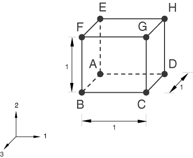

**Model: **

This test comprises single-element models, the geometry of which is defined so that the initial thickness is 1.0 for each case. The thickness direction for the elements is set to the global 1-direction, except for COH3D6, for which the thickness direction is set to the default direction.

**Material: **

The response of cohesive elements is tested for the following material models:
- Linear elastic
- Hyperelastic
- Hyperfoam
- Mises plasticity
- Drucker-Prager plasticity

**Boundary conditions: **

**Pure normal mode:**

 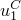 = 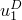 = 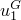 =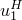 = 1.0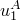 = 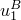 = 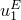 =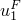 =1.0

**Pure shear in the first shear direction:**

 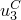 = 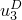 = 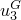 =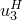 = 1.0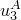 = 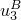 = 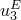 =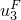 =1.0

**Pure shear in the second shear direction:**

 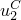 = 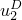 = 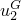 =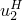 = 1.0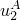 = 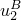 = 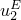 =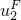 =1.0

All degrees of freedom other than those listed above are fixed.

### Results and discussion

The response of the cohesive elements matches the analytical results.

### Input files

##### **Abaqus/Standard input files**

[lk_coh3d8_ts_stack1_std.inp](../eif/lk_coh3d8_ts_stack1_std.inp)

TRACTION SEPARATION response for COH3D8.

[lk_coh3d8_co_stack1_std.inp](../eif/lk_coh3d8_co_stack1_std.inp)

CONTINUUM response for COH3D8.

[lk_coh3d8_gk_stack1_std.inp](../eif/lk_coh3d8_gk_stack1_std.inp)

GASKET response for COH3D8.

[lk_coh3d6_ts_std.inp](../eif/lk_coh3d6_ts_std.inp)

TRACTION SEPARATION response for COH3D6.

[lk_coh3d6_co_std.inp](../eif/lk_coh3d6_co_std.inp)

CONTINUUM response for COH3D6.

[lk_coh3d6_gk_std.inp](../eif/lk_coh3d6_gk_std.inp)

GASKET response for COH3D6.

[lk_coh2d4_ts_stack1_std.inp](../eif/lk_coh2d4_ts_stack1_std.inp)

TRACTION SEPARATION response for COH2D4.

[lk_coh2d4_co_stack1_std.inp](../eif/lk_coh2d4_co_stack1_std.inp)

CONTINUUM response for COH2D4.

[lk_coh2d4_gk_stack1_std.inp](../eif/lk_coh2d4_gk_stack1_std.inp)

GASKET response for COH2D4.

[lk_cohax4_ts_stack1_std.inp](../eif/lk_cohax4_ts_stack1_std.inp)

TRACTION SEPARATION response for COHAX4.

[lk_cohax4_co_stack1_std.inp](../eif/lk_cohax4_co_stack1_std.inp)

CONTINUUM response for COHAX4.

[lk_cohax4_gk_stack1_std.inp](../eif/lk_cohax4_gk_stack1_std.inp)

GASKET response for COHAX4.

[coh_co_hyper_std.inp](../eif/coh_co_hyper_std.inp)

CONTINUUM response for COH3D8, COH3D6, COH2D4, COHAX4 with hyperelasticity.

[coh_gk_hyper_std.inp](../eif/coh_gk_hyper_std.inp)

GASKET response for COH3D8, COH3D6, COH2D4, COHAX4 with hyperelasticity.

[coh_co_hyperfoam_std.inp](../eif/coh_co_hyperfoam_std.inp)

CONTINUUM response for COH3D8, COH3D6, COH2D4, COHAX4 with hyperfoam material.

[coh_gk_hyperfoam_std.inp](../eif/coh_gk_hyperfoam_std.inp)

GASKET response for COH3D8, COH3D6, COH2D4, COHAX4 with hyperfoam material.

[coh_co_mises_std.inp](../eif/coh_co_mises_std.inp)

CONTINUUM response for COH3D8, COH3D6, COH2D4, COHAX4 with Mises plasticity.

[coh_gk_mises_std.inp](../eif/coh_gk_mises_std.inp)

GASKET response for COH3D8, COH3D6, COH2D4, COHAX4 with Mises plasticity.

[coh_co_dp_std.inp](../eif/coh_co_dp_std.inp)

CONTINUUM response for COH3D8, COH3D6, COH2D4, COHAX4 with Drucker-Prager plasticity.

[coh_transshear_std.inp](../eif/coh_transshear_std.inp)

COH3D8, COH3D6, COH2D4, COHAX4 with uncoupled transverse shear stiffness specified using the [*TRANSVERSE SHEAR STIFFNESS](../key/key-link.md#usb-kws-mtransshearstiff) option.

##### **Abaqus/Explicit input files**

[lk_coh3d8_ts_stack1_xpl.inp](../eif/lk_coh3d8_ts_stack1_xpl.inp)

TRACTION SEPARATION response for COH3D8.

[lk_coh3d8_co_stack1_xpl.inp](../eif/lk_coh3d8_co_stack1_xpl.inp)

CONTINUUM response for COH3D8.

[lk_coh3d8_gk_stack1_xpl.inp](../eif/lk_coh3d8_gk_stack1_xpl.inp)

GASKET response for COH3D8.

[lk_coh3d6_ts_xpl.inp](../eif/lk_coh3d6_ts_xpl.inp)

TRACTION SEPARATION response for COH3D6.

[lk_coh3d6_co_xpl.inp](../eif/lk_coh3d6_co_xpl.inp)

CONTINUUM response for COH3D6.

[lk_coh3d6_gk_xpl.inp](../eif/lk_coh3d6_gk_xpl.inp)

GASKET response for COH3D6.

[lk_coh2d4_ts_stack1_xpl.inp](../eif/lk_coh2d4_ts_stack1_xpl.inp)

TRACTION SEPARATION response for COH2D4.

[lk_coh2d4_co_stack1_xpl.inp](../eif/lk_coh2d4_co_stack1_xpl.inp)

CONTINUUM response for COH2D4.

[lk_coh2d4_gk_stack1_xpl.inp](../eif/lk_coh2d4_gk_stack1_xpl.inp)

GASKET response for COH2D4.

[lk_cohax4_ts_stack1_xpl.inp](../eif/lk_cohax4_ts_stack1_xpl.inp)

TRACTION SEPARATION response for COHAX4.

[lk_cohax4_co_stack1_xpl.inp](../eif/lk_cohax4_co_stack1_xpl.inp)

CONTINUUM response for COHAX4.

[lk_cohax4_gk_stack1_xpl.inp](../eif/lk_cohax4_gk_stack1_xpl.inp)

GASKET response for COHAX4.

[coh_co_hyper_xpl.inp](../eif/coh_co_hyper_xpl.inp)

CONTINUUM response for COH3D8, COH3D6, COH2D4, COHAX4 with hyperelasticity.

[coh_gk_hyper_xpl.inp](../eif/coh_gk_hyper_xpl.inp)

GASKET response for COH3D8, COH3D6, COH2D4, COHAX4 with hyperelasticity.

[coh_co_hyperfoam_xpl.inp](../eif/coh_co_hyperfoam_xpl.inp)

CONTINUUM response for COH3D8, COH3D6, COH2D4, COHAX4 with hyperfoam material.

[coh_gk_hyperfoam_xpl.inp](../eif/coh_gk_hyperfoam_xpl.inp)

GASKET response for COH3D8, COH3D6, COH2D4, COHAX4 with hyperfoam material.

[coh_transshear_xpl.inp](../eif/coh_transshear_xpl.inp)

COH3D8, COH3D6, COH2D4, COHAX4 with uncoupled transverse shear stiffness specified using the [*TRANSVERSE SHEAR STIFFNESS](../key/key-link.md#usb-kws-mtransshearstiff) option.

### II. Damage modeling verification

### Elements tested

COH3D8    COH3D6    COH2D4    COHAX4    COH3D8P    COH3D6P    COH2D4P    COHAX4P    

### Problem description

This test verifies damage modeling for cohesive elements using different damage initiation criteria and damage evolution laws to simulate the failure of cohesive layers. A linear elastic material model is used to verify the damage initiation criteria based on the maximum nominal strain for cohesive elements and based on the quadratic traction-interaction for cohesive elements. Damage initiation criteria based on the ductile strain and based on the shear failure strain are tested with Mises and Drucker-Prager plasticity, respectively.

Damage evolution is defined based on either effective displacement or energy dissipated. Linear, exponential, and tabular softening laws are defined to specify the nature of the evolution of the damage variable. Each damage model is verified for damage in pure normal and two pure shear modes (one shear mode for two-dimensional and axisymmetric elements). The dependence of damage evolution on the mode mix measure specified in tabular, power law, or Benzeggagh-Kenane form is also considered in this test. In addition, the test verifies the overall damage of cohesive elements when multiple damage initiation criteria are active for the same material definition.

### Results and discussion

Degradation of the response of a cohesive element begins when the specified damage initiation criterion is met. The damage variable evolves according to the evolution law specified in terms of displacement or energy dissipation. 

### Input files

##### **Abaqus/Standard input files**

[coh3d8_mxe_damdisp_softlin_std.inp](../eif/coh3d8_mxe_damdisp_softlin_std.inp)

MAXE damage initiation, displacement-based damage evolution with LINEAR softening for COH3D8.

[coh3d8_qds_damdisp_softlin_std.inp](../eif/coh3d8_qds_damdisp_softlin_std.inp)

QUADS damage initiation, displacement-based damage evolution with LINEAR softening for COH3D8.

[coh3d8_mxe_damdisp_softexp_std.inp](../eif/coh3d8_mxe_damdisp_softexp_std.inp)

MAXE damage initiation, displacement-based damage evolution with EXPONENTIAL softening for COH3D8.

[coh3d8_qds_damdisp_softexp_std.inp](../eif/coh3d8_qds_damdisp_softexp_std.inp)

QUADS damage initiation, displacement-based damage evolution with EXPONENTIAL softening for COH3D8.

[coh3d8_mxe_damdisp_softtab_std.inp](../eif/coh3d8_mxe_damdisp_softtab_std.inp)

MAXE damage initiation, displacement-based damage evolution with TABULAR softening for COH3D8.

[coh3d8_qds_damdisp_softtab_std.inp](../eif/coh3d8_qds_damdisp_softtab_std.inp)

QUADS damage initiation, displacement-based damage evolution with TABULAR softening for COH3D8.

[coh3d8_mxe_damener_softlin_std.inp](../eif/coh3d8_mxe_damener_softlin_std.inp)

MAXE damage initiation, energy-based damage evolution with LINEAR softening for COH3D8.

[coh3d8_qds_damener_softlin_std.inp](../eif/coh3d8_qds_damener_softlin_std.inp)

QUADS damage initiation, energy-based damage evolution with LINEAR softening for COH3D8.

[coh3d8_mxe_damener_softexp_std.inp](../eif/coh3d8_mxe_damener_softexp_std.inp)

MAXE damage initiation, energy-based damage evolution with EXPONENTIAL softening for COH3D8.

[coh3d8_qds_damener_softexp_std.inp](../eif/coh3d8_qds_damener_softexp_std.inp)

QUADS damage initiation, energy-based damage evolution with EXPONENTIAL softening for COH3D8.

[coh3d8_nomodemix_std.inp](../eif/coh3d8_nomodemix_std.inp)

Damage evolution independent of mode mix for COH3D8.

[coh3d8p_mxe_damdisp_softlin_std.inp](../eif/coh3d8p_mxe_damdisp_softlin_std.inp)

MAXE damage initiation, displacement-based damage evolution with LINEAR softening for COH3D8P.

[coh3d6_mxe_damdisp_softlin_std.inp](../eif/coh3d6_mxe_damdisp_softlin_std.inp)

MAXE damage initiation, displacement-based damage evolution with LINEAR softening for COH3D6.

[coh3d6_qds_damdisp_softlin_std.inp](../eif/coh3d6_qds_damdisp_softlin_std.inp)

QUADS damage initiation, displacement-based damage evolution with LINEAR softening for COH3D6.

[coh3d6_mxe_damdisp_softexp_std.inp](../eif/coh3d6_mxe_damdisp_softexp_std.inp)

MAXE damage initiation, displacement-based damage evolution with EXPONENTIAL softening for COH3D6.

[coh3d6_qds_damdisp_softexp_std.inp](../eif/coh3d6_qds_damdisp_softexp_std.inp)

QUADS damage initiation, displacement-based damage evolution with EXPONENTIAL softening for COH3D6.

[coh3d6_mxe_damdisp_softtab_std.inp](../eif/coh3d6_mxe_damdisp_softtab_std.inp)

MAXE damage initiation, displacement-based damage evolution with TABULAR softening for COH3D6.

[coh3d6_qds_damdisp_softtab_std.inp](../eif/coh3d6_qds_damdisp_softtab_std.inp)

QUADS damage initiation, displacement-based damage evolution with TABULAR softening for COH3D6.

[coh3d6_mxe_damener_softlin_std.inp](../eif/coh3d6_mxe_damener_softlin_std.inp)

MAXE damage initiation, energy-based damage evolution with LINEAR softening for COH3D6.

[coh3d6_qds_damener_softlin_std.inp](../eif/coh3d6_qds_damener_softlin_std.inp)

QUADS damage initiation, energy-based damage evolution with LINEAR softening for COH3D6.

[coh3d6_mxe_damener_softexp_std.inp](../eif/coh3d6_mxe_damener_softexp_std.inp)

MAXE damage initiation, energy-based damage evolution with EXPONENTIAL softening for COH3D6.

[coh3d6_qds_damener_softexp_std.inp](../eif/coh3d6_qds_damener_softexp_std.inp)

QUADS damage initiation, energy-based damage evolution with EXPONENTIAL softening for COH3D6.

[coh3d6_nomodemix_std.inp](../eif/coh3d6_nomodemix_std.inp)

Damage evolution independent of mode mix for COH3D6.

[coh3d6p_mxe_damdisp_softlin_std.inp](../eif/coh3d6p_mxe_damdisp_softlin_std.inp)

MAXE damage initiation, displacement-based damage evolution with LINEAR softening for COH3D6P.

[coh2d4_mxe_damdisp_softlin_std.inp](../eif/coh2d4_mxe_damdisp_softlin_std.inp)

MAXE damage initiation, displacement-based damage evolution with LINEAR softening for COH2D4.

[coh2d4_qds_damdisp_softlin_std.inp](../eif/coh2d4_qds_damdisp_softlin_std.inp)

QUADS damage initiation, displacement-based damage evolution with LINEAR softening for COH2D4.

[coh2d4_mxe_damdisp_softexp_std.inp](../eif/coh2d4_mxe_damdisp_softexp_std.inp)

MAXE damage initiation, displacement-based damage evolution with EXPONENTIAL softening for COH2D4.

[coh2d4_qds_damdisp_softexp_std.inp](../eif/coh2d4_qds_damdisp_softexp_std.inp)

QUADS damage initiation, displacement-based damage evolution with EXPONENTIAL softening for COH2D4.

[coh2d4_mxe_damdisp_softtab_std.inp](../eif/coh2d4_mxe_damdisp_softtab_std.inp)

MAXE damage initiation, displacement-based damage evolution with TABULAR softening for COH2D4.

[coh2d4_qds_damdisp_softtab_std.inp](../eif/coh2d4_qds_damdisp_softtab_std.inp)

QUADS damage initiation, displacement-based damage evolution with TABULAR softening for COH2D4.

[coh2d4_mxe_damener_softlin_std.inp](../eif/coh2d4_mxe_damener_softlin_std.inp)

MAXE damage initiation, energy-based damage evolution with LINEAR softening for COH2D4.

[coh2d4_qds_damener_softlin_std.inp](../eif/coh2d4_qds_damener_softlin_std.inp)

QUADS damage initiation, energy-based damage evolution with LINEAR softening for COH2D4.

[coh2d4_mxe_damener_softexp_std.inp](../eif/coh2d4_mxe_damener_softexp_std.inp)

MAXE damage initiation, energy-based damage evolution with EXPONENTIAL softening for COH2D4.

[coh2d4_qds_damener_softexp_std.inp](../eif/coh2d4_qds_damener_softexp_std.inp)

QUADS damage initiation, energy-based damage evolution with EXPONENTIAL softening for COH2D4.

[coh2d4_nomodemix_std.inp](../eif/coh2d4_nomodemix_std.inp)

Damage evolution independent of mode mix for COH2D4.

[coh2d4p_mxe_damdisp_softlin_std.inp](../eif/coh2d4p_mxe_damdisp_softlin_std.inp)

MAXE damage initiation, displacement-based damage evolution with LINEAR softening for COH2D4P.

[cohax4_mxe_damdisp_softlin_std.inp](../eif/cohax4_mxe_damdisp_softlin_std.inp)

MAXE damage initiation, displacement-based damage evolution with LINEAR softening for COHAX4.

[cohax4_qds_damdisp_softlin_std.inp](../eif/cohax4_qds_damdisp_softlin_std.inp)

QUADS damage initiation, displacement-based damage evolution with LINEAR softening for COHAX4.

[cohax4_mxe_damdisp_softexp_std.inp](../eif/cohax4_mxe_damdisp_softexp_std.inp)

MAXE damage initiation, displacement-based damage evolution with EXPONENTIAL softening for COHAX4.

[cohax4_qds_damdisp_softexp_std.inp](../eif/cohax4_qds_damdisp_softexp_std.inp)

QUADS damage initiation, displacement-based damage evolution with EXPONENTIAL softening for COHAX4.

[cohax4_mxe_damdisp_softtab_std.inp](../eif/cohax4_mxe_damdisp_softtab_std.inp)

MAXE damage initiation, displacement-based damage evolution with TABULAR softening for COHAX4.

[cohax4_qds_damdisp_softtab_std.inp](../eif/cohax4_qds_damdisp_softtab_std.inp)

QUADS damage initiation, displacement-based damage evolution with TABULAR softening for COHAX4.

[cohax4_mxe_damener_softlin_std.inp](../eif/cohax4_mxe_damener_softlin_std.inp)

MAXE damage initiation, energy-based damage evolution with LINEAR softening for COHAX4.

[cohax4_qds_damener_softlin_std.inp](../eif/cohax4_qds_damener_softlin_std.inp)

QUADS damage initiation, energy-based damage evolution with LINEAR softening for COHAX4.

[cohax4_mxe_damener_softexp_std.inp](../eif/cohax4_mxe_damener_softexp_std.inp)

MAXE damage initiation, energy-based damage evolution with EXPONENTIAL softening for COHAX4.

[cohax4_qds_damener_softexp_std.inp](../eif/cohax4_qds_damener_softexp_std.inp)

QUADS damage initiation, energy-based damage evolution with EXPONENTIAL softening for COHAX4.

[cohax4_nomodemix_std.inp](../eif/cohax4_nomodemix_std.inp)

Damage evolution independent of mode mix for COHAX4.

[cohax4p_mxe_damdisp_softlin_std.inp](../eif/cohax4p_mxe_damdisp_softlin_std.inp)

MAXE damage initiation, displacement-based damage evolution with LINEAR softening for COHAX4P.

[coh3d8_coupled_multi_std.inp](../eif/coh3d8_coupled_multi_std.inp)

COH3D8 with multiple damage models and coupled traction-separation behavior.

[coh2d4_coupled_multi_std.inp](../eif/coh2d4_coupled_multi_std.inp)

COH2D4 with multiple damage models and coupled traction-separation behavior.

[coh3d8_ts_dam_loadcycle_std.inp](../eif/coh3d8_ts_dam_loadcycle_std.inp)

COH3D8 subjected to loading and unloading in pure normal (both tension and compression) and pure shear modes after partial damage.

[coh2d4_damdisp_mixtrac_std.inp](../eif/coh2d4_damdisp_mixtrac_std.inp)

Displacement-based damage evolution with traction-dependent mode mix measure for COH2D4.

[coh2d4_damdisp_mixener_std.inp](../eif/coh2d4_damdisp_mixener_std.inp)

Displacement-based damage evolution with energy-dependent mode mix measure for COH2D4.

[coh2d4_damener_mixtrac_std.inp](../eif/coh2d4_damener_mixtrac_std.inp)

Energy-based damage evolution with traction-dependent mode mix measure for COH2D4.

[coh2d4_damener_mixener_std.inp](../eif/coh2d4_damener_mixener_std.inp)

Energy-based damage evolution with energy-dependent mode mix measure for COH2D4.

[coh3d8_damdisp_mixtrac_std.inp](../eif/coh3d8_damdisp_mixtrac_std.inp)

Displacement-based damage evolution with traction-dependent mode mix measure for COH3D8.

[coh3d8_damdisp_mixener_std.inp](../eif/coh3d8_damdisp_mixener_std.inp)

Displacement-based damage evolution with energy-dependent mode mix measure for COH3D8.

[coh3d8_damener_mixtrac_std.inp](../eif/coh3d8_damener_mixtrac_std.inp)

Energy-based damage evolution with traction-dependent mode mix measure for COH3D8.

[coh3d8_damener_mixener_std.inp](../eif/coh3d8_damener_mixener_std.inp)

Energy-based damage evolution with energy-dependent mode mix measure for COH3D8.

[coh_co_misesduct_std.inp](../eif/coh_co_misesduct_std.inp)

DUCTILE damage initiation; CONTINUUM response for COH3D8, COH3D6, COH2D4, COHAX4 with Mises plasticity.

[coh_co_misesshear_std.inp](../eif/coh_co_misesshear_std.inp)

SHEAR damage initiation; CONTINUUM response for COH3D8, COH3D6, COH2D4, COHAX4 with Mises plasticity.

[coh_co_dpduct_std.inp](../eif/coh_co_dpduct_std.inp)

DUCTILE damage initiation; CONTINUUM response for COH3D8, COH3D6, COH2D4, COHAX4 with Drucker-Prager plasticity.

[coh_co_dpshear_std.inp](../eif/coh_co_dpshear_std.inp)

SHEAR damage initiation; CONTINUUM response for COH3D8, COH3D6, COH2D4, COHAX4 with Drucker-Prager plasticity.

##### **Abaqus/Explicit input files**

[coh3d8_mxe_damdisp_softlin_xpl.inp](../eif/coh3d8_mxe_damdisp_softlin_xpl.inp)

MAXE damage initiation, displacement-based damage evolution with LINEAR softening for COH3D8.

[coh3d8_qds_damdisp_softlin_xpl.inp](../eif/coh3d8_qds_damdisp_softlin_xpl.inp)

QUADS damage initiation, displacement-based damage evolution with LINEAR softening for COH3D8.

[coh3d8_mxe_damdisp_softexp_xpl.inp](../eif/coh3d8_mxe_damdisp_softexp_xpl.inp)

MAXE damage initiation, displacement-based damage evolution with EXPONENTIAL softening for COH3D8.

[coh3d8_qds_damdisp_softexp_xpl.inp](../eif/coh3d8_qds_damdisp_softexp_xpl.inp)

QUADS damage initiation, displacement-based damage evolution with EXPONENTIAL softening for COH3D8.

[coh3d8_mxe_damdisp_softtab_xpl.inp](../eif/coh3d8_mxe_damdisp_softtab_xpl.inp)

MAXE damage initiation, displacement-based damage evolution with TABULAR softening for COH3D8.

[coh3d8_qds_damdisp_softtab_xpl.inp](../eif/coh3d8_qds_damdisp_softtab_xpl.inp)

QUADS damage initiation, displacement-based damage evolution with TABULAR softening for COH3D8.

[coh3d8_mxe_damener_softlin_xpl.inp](../eif/coh3d8_mxe_damener_softlin_xpl.inp)

MAXE damage initiation, energy-based damage evolution with LINEAR softening for COH3D8.

[coh3d8_qds_damener_softlin_xpl.inp](../eif/coh3d8_qds_damener_softlin_xpl.inp)

QUADS damage initiation, energy-based damage evolution with LINEAR softening for COH3D8.

[coh3d8_mxe_damener_softexp_xpl.inp](../eif/coh3d8_mxe_damener_softexp_xpl.inp)

MAXE damage initiation, energy-based damage evolution with EXPONENTIAL softening for COH3D8.

[coh3d8_qds_damener_softexp_xpl.inp](../eif/coh3d8_qds_damener_softexp_xpl.inp)

QUADS damage initiation, energy-based damage evolution with EXPONENTIAL softening for COH3D8.

[coh3d8_nomodemix_xpl.inp](../eif/coh3d8_nomodemix_xpl.inp)

Damage evolution independent of mode mix for COH3D8.

[coh3d6_mxe_damdisp_softlin_xpl.inp](../eif/coh3d6_mxe_damdisp_softlin_xpl.inp)

MAXE damage initiation, displacement-based damage evolution with LINEAR softening for COH3D6.

[coh3d6_qds_damdisp_softlin_xpl.inp](../eif/coh3d6_qds_damdisp_softlin_xpl.inp)

QUADS damage initiation, displacement-based damage evolution with LINEAR softening for COH3D6.

[coh3d6_mxe_damdisp_softexp_xpl.inp](../eif/coh3d6_mxe_damdisp_softexp_xpl.inp)

MAXE damage initiation, displacement-based damage evolution with EXPONENTIAL softening for COH3D6.

[coh3d6_qds_damdisp_softexp_xpl.inp](../eif/coh3d6_qds_damdisp_softexp_xpl.inp)

QUADS damage initiation, displacement-based damage evolution with EXPONENTIAL softening for COH3D6.

[coh3d6_mxe_damdisp_softtab_xpl.inp](../eif/coh3d6_mxe_damdisp_softtab_xpl.inp)

MAXE damage initiation, displacement-based damage evolution with TABULAR softening for COH3D6.

[coh3d6_qds_damdisp_softtab_xpl.inp](../eif/coh3d6_qds_damdisp_softtab_xpl.inp)

QUADS damage initiation, displacement-based damage evolution with TABULAR softening for COH3D6.

[coh3d6_mxe_damener_softlin_xpl.inp](../eif/coh3d6_mxe_damener_softlin_xpl.inp)

MAXE damage initiation, energy-based damage evolution with LINEAR softening for COH3D6.

[coh3d6_qds_damener_softlin_xpl.inp](../eif/coh3d6_qds_damener_softlin_xpl.inp)

QUADS damage initiation, energy-based damage evolution with LINEAR softening for COH3D6.

[coh3d6_mxe_damener_softexp_xpl.inp](../eif/coh3d6_mxe_damener_softexp_xpl.inp)

MAXE damage initiation, energy-based damage evolution with EXPONENTIAL softening for COH3D6.

[coh3d6_qds_damener_softexp_xpl.inp](../eif/coh3d6_qds_damener_softexp_xpl.inp)

QUADS damage initiation, energy-based damage evolution with EXPONENTIAL softening for COH3D6.

[coh3d6_nomodemix_xpl.inp](../eif/coh3d6_nomodemix_xpl.inp)

Damage evolution independent of mode mix for COH3D6.

[coh2d4_mxe_damdisp_softlin_xpl.inp](../eif/coh2d4_mxe_damdisp_softlin_xpl.inp)

MAXE damage initiation, displacement-based damage evolution with LINEAR softening for COH2D4.

[coh2d4_qds_damdisp_softlin_xpl.inp](../eif/coh2d4_qds_damdisp_softlin_xpl.inp)

QUADS damage initiation, displacement-based damage evolution with LINEAR softening for COH2D4.

[coh2d4_mxe_damdisp_softexp_xpl.inp](../eif/coh2d4_mxe_damdisp_softexp_xpl.inp)

MAXE damage initiation, displacement-based damage evolution with EXPONENTIAL softening for COH2D4.

[coh2d4_qds_damdisp_softexp_xpl.inp](../eif/coh2d4_qds_damdisp_softexp_xpl.inp)

QUADS damage initiation, displacement-based damage evolution with EXPONENTIAL softening for COH2D4.

[coh2d4_mxe_damdisp_softtab_xpl.inp](../eif/coh2d4_mxe_damdisp_softtab_xpl.inp)

MAXE damage initiation, displacement-based damage evolution with TABULAR softening for COH2D4.

[coh2d4_qds_damdisp_softtab_xpl.inp](../eif/coh2d4_qds_damdisp_softtab_xpl.inp)

QUADS damage initiation, displacement-based damage evolution with TABULAR softening for COH2D4.

[coh2d4_mxe_damener_softlin_xpl.inp](../eif/coh2d4_mxe_damener_softlin_xpl.inp)

MAXE damage initiation, energy-based damage evolution with LINEAR softening for COH2D4.

[coh2d4_qds_damener_softlin_xpl.inp](../eif/coh2d4_qds_damener_softlin_xpl.inp)

QUADS damage initiation, energy-based damage evolution with LINEAR-softening for COH2D4.

[coh2d4_mxe_damener_softexp_xpl.inp](../eif/coh2d4_mxe_damener_softexp_xpl.inp)

MAXE damage initiation, energy-based damage evolution with EXPONENTIAL softening for COH2D4.

[coh2d4_qds_damener_softexp_xpl.inp](../eif/coh2d4_qds_damener_softexp_xpl.inp)

QUADS damage initiation, energy-based damage evolution with EXPONENTIAL softening for COH2D4.

[coh2d4_nomodemix_xpl.inp](../eif/coh2d4_nomodemix_xpl.inp)

Damage evolution independent of mode mix for COH2D4.

[cohax4_mxe_damdisp_softlin_xpl.inp](../eif/cohax4_mxe_damdisp_softlin_xpl.inp)

MAXE damage initiation, displacement-based damage evolution with LINEAR softening for COHAX4.

[cohax4_qds_damdisp_softlin_xpl.inp](../eif/cohax4_qds_damdisp_softlin_xpl.inp)

QUADS damage initiation, displacement-based damage evolution with LINEAR softening for COHAX4.

[cohax4_mxe_damdisp_softexp_xpl.inp](../eif/cohax4_mxe_damdisp_softexp_xpl.inp)

MAXE damage initiation, displacement-based damage evolution with EXPONENTIAL softening for COHAX4.

[cohax4_qds_damdisp_softexp_xpl.inp](../eif/cohax4_qds_damdisp_softexp_xpl.inp)

QUADS damage initiation, displacement-based damage evolution with EXPONENTIAL softening for COHAX4.

[cohax4_mxe_damdisp_softtab_xpl.inp](../eif/cohax4_mxe_damdisp_softtab_xpl.inp)

MAXE damage initiation, displacement-based damage evolution with TABULAR softening for COHAX4.

[cohax4_qds_damdisp_softtab_xpl.inp](../eif/cohax4_qds_damdisp_softtab_xpl.inp)

QUADS damage initiation, displacement-based damage evolution with TABULAR softening for COHAX4.

[cohax4_mxe_damener_softlin_xpl.inp](../eif/cohax4_mxe_damener_softlin_xpl.inp)

MAXE damage initiation, energy-based damage evolution with LINEAR softening for COHAX4.

[cohax4_qds_damener_softlin_xpl.inp](../eif/cohax4_qds_damener_softlin_xpl.inp)

QUADS damage initiation, energy-based damage evolution with LINEAR softening for COHAX4.

[cohax4_mxe_damener_softexp_xpl.inp](../eif/cohax4_mxe_damener_softexp_xpl.inp)

MAXE damage initiation, energy-based damage evolution with EXPONENTIAL softening for COHAX4.

[cohax4_qds_damener_softexp_xpl.inp](../eif/cohax4_qds_damener_softexp_xpl.inp)

QUADS damage initiation, energy-based damage evolution with EXPONENTIAL softening for COHAX4.

[cohax4_nomodemix_xpl.inp](../eif/cohax4_nomodemix_xpl.inp)

Damage evolution independent of mode mix for COHAX4.

[coh_co_misesduct_xpl.inp](../eif/coh_co_misesduct_xpl.inp)

DUCTILE damage initiation; CONTINUUM response for COH3D8, COH3D6, COH2D4, COHAX4 with Mises plasticity.

[coh_gk_misesduct_xpl.inp](../eif/coh_gk_misesduct_xpl.inp)

DUCTILE damage initiation; GASKET response for COH3D8, COH3D6, COH2D4, COHAX4 with Mises plasticity.

[coh_co_misesshear_xpl.inp](../eif/coh_co_misesshear_xpl.inp)

SHEAR damage initiation; CONTINUUM response for COH3D8, COH3D6, COH2D4, COHAX4 with Mises plasticity.

[coh_gk_misesshear_xpl.inp](../eif/coh_gk_misesshear_xpl.inp)

SHEAR damage initiation; GASKET response for COH3D8, COH3D6, COH2D4, COHAX4 with Mises plasticity.

[coh_co_dpduct_xpl.inp](../eif/coh_co_dpduct_xpl.inp)

DUCTILE damage initiation; CONTINUUM response for COH3D8, COH3D6, COH2D4, COHAX4 with Drucker-Prager plasticity.

[coh_co_dpshear_xpl.inp](../eif/coh_co_dpshear_xpl.inp)

SHEAR damage initiation; CONTINUUM response for COH3D8, COH3D6, COH2D4, COHAX4 with Drucker-Prager plasticity.

[coh3d8_coupled_multi_xpl.inp](../eif/coh3d8_coupled_multi_xpl.inp)

COH3D8 with multiple damage models and coupled traction-separation behavior. 

[coh2d4_coupled_multi_xpl.inp](../eif/coh2d4_coupled_multi_xpl.inp)

COH2D4 with multiple damage models and coupled traction-separation behavior. 

[coh3d8_ts_dam_loadcycle_xpl.inp](../eif/coh3d8_ts_dam_loadcycle_xpl.inp)

COH3D8 subjected to loading and unloading in pure normal (both tension and compression) and pure shear modes after partial damage. 

[coh2d4_damdisp_mixtrac_xpl.inp](../eif/coh2d4_damdisp_mixtrac_xpl.inp)

Displacement-based damage evolution with traction-dependent mode mix measure for COH2D4.

[coh2d4_damdisp_mixener_xpl.inp](../eif/coh2d4_damdisp_mixener_xpl.inp)

Displacement-based damage evolution with energy-dependent mode mix measure for COH2D4.

[coh2d4_damener_mixtrac_xpl.inp](../eif/coh2d4_damener_mixtrac_xpl.inp)

Energy-based damage evolution with traction-dependent mode mix measure for COH2D4.

[coh2d4_damener_mixener_xpl.inp](../eif/coh2d4_damener_mixener_xpl.inp)

Energy-based damage evolution with energy-dependent mode mix measure for COH2D4.

[coh3d8_damdisp_mixtrac_xpl.inp](../eif/coh3d8_damdisp_mixtrac_xpl.inp)

Displacement-based damage evolution with traction-dependent mode mix measure for COH3D8.

[coh3d8_damdisp_mixener_xpl.inp](../eif/coh3d8_damdisp_mixener_xpl.inp)

Displacement-based damage evolution with energy-dependent mode mix measure for COH3D8.

[coh3d8_damener_mixtrac_xpl.inp](../eif/coh3d8_damener_mixtrac_xpl.inp)

Energy-based damage evolution with traction-dependent mode mix measure for COH3D8.

[coh3d8_damener_mixener_xpl.inp](../eif/coh3d8_damener_mixener_xpl.inp)

Energy-based damage evolution with energy-dependent mode mix measure for COH3D8.

### III. Pressure continuity for pore pressure cohesive elements

### Elements tested

COH3D8P    COH3D6P    COH2D4P    COHAX4P    

### Problem description

This test verifies the pressure continuity for pore pressure cohesive elements without damage. 

The model contains two blocks meshed by using pore pressure solid elements. One block is on the top, while another one is on the bottom. They are connected to each other through a layer of pore pressure cohesive elements. No damage is introduced to the pore pressure cohesive elements in the tests. When different pressure is specified at the top and the bottom sides of model, the driven fluid flows smoothly across the layer of cohesive elements generating the same pressure gradient everywhere. In some tests resistance is introduced to the flow by building a “filter cake” by defining leakoff coefficients for pore pressure cohesive elements. In some tests the solid and cohesive elements have different mesh densities; therefore, a surface-based tie constraint will be used to connect them to each other.

### Results and discussion

The smooth variation of pore pressure can be observed crossing the layer of cohesive elements.

### Input files

##### **Available only in Abaqus/Standard **

[coh2d4p_cont.inp](../eif/coh2d4p_cont.inp)

 CPE4P with COH2D4P.

[coh3d6p_cont.inp](../eif/coh3d6p_cont.inp)

C3D8P with COH3D6P.

[coh3d8p_cont.inp](../eif/coh3d8p_cont.inp)

C3D8P with COH3D8P.

[cohax4p_cont.inp](../eif/cohax4p_cont.inp)

 CAX4P with COHAX4P.

[coh2d4p_cont_leak.inp](../eif/coh2d4p_cont_leak.inp)

 CPE4P with COH2D4P using [*FLUID LEAKOFF](../key/key-link.md#usb-kws-mfluidleakoff).

[coh3d6p_cont_leak.inp](../eif/coh3d6p_cont_leak.inp)

C3D8P with COH3D6P using [*FLUID LEAKOFF](../key/key-link.md#usb-kws-mfluidleakoff).

[coh3d8p_cont_leak.inp](../eif/coh3d8p_cont_leak.inp)

C3D8P with COH3D8P using [*FLUID LEAKOFF](../key/key-link.md#usb-kws-mfluidleakoff).

[cohax4p_cont_leak.inp](../eif/cohax4p_cont_leak.inp)

 CAX4P with COHAX4P using [*FLUID LEAKOFF](../key/key-link.md#usb-kws-mfluidleakoff).

[coh2d4p_cont_tie.inp](../eif/coh2d4p_cont_tie.inp)

 CPE4P with COH2D4P using [*TIE](../key/key-link.md#usb-kws-mtie).

[coh3d6p_cont_tie.inp](../eif/coh3d6p_cont_tie.inp)

C3D8P with COH3D6P using [*TIE](../key/key-link.md#usb-kws-mtie).

[coh3d8p_cont_tie.inp](../eif/coh3d8p_cont_tie.inp)

C3D8P with COH3D8P using [*TIE](../key/key-link.md#usb-kws-mtie).

[cohax4p_cont_tie.inp](../eif/cohax4p_cont_tie.inp)

 CAX4P with COHAX4P using [*TIE](../key/key-link.md#usb-kws-mtie).

