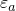
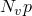
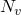
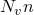
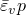
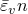
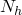
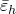

# 1.3.47 Pipe-soil interaction elements

**Product: **Abaqus/Standard  

### Elements tested

PSI24    PSI26    PSI34    PSI36    

### Features tested

The constitutive behavior of the pipe-soil interaction (PSI) elements is tested. The material is defined with different material response in the different directions. The axial and transverse vertical response is symmetric about the origin, while the vertical response uses different behavior for positive and negative relative displacement. An isotropic model, which uses the same material model in all the directions, is also tested.

The local coordinate system procedure is also tested. Temperature and field variable dependence of material properties is tested. 

### Problem description

The problem consists of a single PSI element subjected to a prescribed displacement history. The far-field edge is fixed, and the displacement history is applied to the pipeline side. The value of the prescribed displacement changes in such a way that the constitutive response corresponding to negative and positive relative displacement is verified. 

Each input file contains as many PSI elements as the number of coordinate directions; i.e., two for the two-dimensional elements (PSI24 and PSI26) and three for the three-dimensional elements (PSI34 and PSI36). The prescribed displacement applied to each element is in a different direction. The elements are not connected in any way. Both regular static steps, with small and large displacements, and linear perturbation steps are considered.

**Material: **

| Elastic stiffness in axial direction: | 1.0 106 |
| --- | --- |
| Elastic stiffness in vertical direction: | 2.0 106 |
| Elastic stiffness in horizontal direction: | 4.0 106 |

| ASCE formulae for sand: |
| --- |
| Axial direction: |  |
|  | 19000.0 |
|  | 0.3 |
|  | 30.0 |
| *D* | 0.6 |
|  | 0.003 |
| Vertical direction: |
|  | 24000.0 |
|  | 0.5 |
|  | 0.4 |
|  | 0.3 |
|  | 0.15 |
|  | 0.015 |
| Horizontal direction: |
|  | 0.25 |
|  | 0.1 |

| ASCE formulae for clay: |
| --- |
| Axial direction: |
| *S* | 1000 |
|  | 1.0 |
| *D* | 0.6 |
|  | 0.005 |
| Vertical direction: |
|  | 0.8 |
|  | 0.4 |
|  | 0.15 |
|  | 0.1 |
| Horizontal direction: |
|  | 0.25 |
|  | 0.1 |

### Results and discussion

The forces applied to the pipeline match the analytical values.

### Input files

#### Linear material behavior:

[epsi24ls1.inp](../eif/epsi24ls1.inp)

PSI24 element with small displacements.

[epsi24ls2.inp](../eif/epsi24ls2.inp)

PSI24 element with user-defined orientation, small displacements.

[epsi24ls3.inp](../eif/epsi24ls3.inp)

PSI24 element with user-defined orientation, unsymmetric stiffness, small displacements.

[epsi34ls1.inp](../eif/epsi34ls1.inp)

PSI34 element with small displacements, isotropic behavior.

[epsi24ln3.inp](../eif/epsi24ln3.inp)

PSI24 element with field variable dependence, large displacements, isotropic behavior.

[epsi26ln1.inp](../eif/epsi26ln1.inp)

PSI26 element with large displacements.

[epsi26ln2.inp](../eif/epsi26ln2.inp)

PSI26 element with user-defined orientation, unsymmetric stiffness, large displacements.

[epsi36lp1.inp](../eif/epsi36lp1.inp)

PSI36 element with perturbations.

[epsi36ln1.inp](../eif/epsi36ln1.inp)

PSI36 element with temperature dependence, large displacements.

#### Nonlinear material behavior:

[epsi24ns1.inp](../eif/epsi24ns1.inp)

PSI24 element with small displacements.

[epsi26ns1.inp](../eif/epsi26ns1.inp)

PSI26 element with isotropic behavior.

[epsi26nn2.inp](../eif/epsi26nn2.inp)

PSI26 element with temperature dependence, large displacements.

[epsi34np1.inp](../eif/epsi34np1.inp)

PSI34 element with perturbation.

[epsi34ns1.inp](../eif/epsi34ns1.inp)

PSI34 element with temperature dependence, small displacements.

[epsi36ns1.inp](../eif/epsi36ns1.inp)

PSI36 element with large displacements.

#### ASCE formulae for sand:

[epsi24ss1.inp](../eif/epsi24ss1.inp)

PSI24 element with small displacements.

[epsi24sn1.inp](../eif/epsi24sn1.inp)

PSI24 element with large displacements, user-defined orientation.

[epsi34sn1.inp](../eif/epsi34sn1.inp)

PSI34 element with temperature dependence, large displacements.

[epsi36sn1.inp](../eif/epsi36sn1.inp)

PSI36 element with large displacements, temperature dependence.

#### ASCE formulae for clay:

[epsi24cn1.inp](../eif/epsi24cn1.inp)

PSI24 element with large displacements, user-defined orientation.

[epsi26cn1.inp](../eif/epsi26cn1.inp)

PSI26 element with large displacements, user-defined orientation.

[epsi34cs1.inp](../eif/epsi34cs1.inp)

PSI34 element with small displacements.

[epsi34cn3.inp](../eif/epsi34cn3.inp)

PSI34 element with field variable dependence, large displacements.

#### User subroutine:

[epsi26un1.inp](../eif/epsi26un1.inp)

PSI26 element with large displacements.

[epsi26un1.f](../eif/epsi26un1.f)

The user subroutine used with epsi26un1.inp.

[epsi34us1.inp](../eif/epsi34us1.inp)

PSI34 element with small displacements.

[epsi34us1.f](../eif/epsi34us1.f)

The user subroutine used with epsi34us1.inp.

