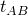
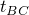
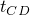
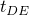
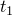
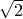

# 1.4.2 Beam stress/displacement elements

**Product: **Abaqus/Standard  

### I. Load types: CENT, CENTRIF, GRAV, PX, PY, PZ, P1, P2, predefined temperature, ROTA

### Problem description

**Model: **

| Length | 15.0 |
| --- | --- |
| Centrifugal axis of rotation | (0, 0, 1) through (7.5, 0, 0) |
| Gravity load vector | (1, 0, 0) |
| Beam section data: |  |
| Arbitrary (closed) | *n* = 4, *A* = (.995, 1.49), *B* = (.995, 1.49), |
|  |  = 0.01, *C* = (.995, 1.49),  = 0.02, |
|  | *D* = (.995, 1.49),  = 0.01, *E* = (.995, 1.49), |
|  |  = 0.02 |
| Arbitrary (open) | *n* = 2, *A* = (0.0, 3.95), *B* = (0.0, 0.0),  = 0.1, |
|  | *C* = (3.95, 0.0),  = 0.1 |
| Box | *a* = 2.0, *b* = 3.0,  =  = 0.01,  =  = 0.02 |
| Circle | *r* = 2.0 |
| General | *A* = 12.566,  =  = 12.566, *J* = 25.133 |
| Hexagonal | *r* = 2, *t* = 0.02 |
| I-section | *h* = 2.4, *l* = 1.2,  = 3.0,  = 2.0,  =  =  = 0.02 |
| L-section | *a* = 4.0, *b* = 4.0, *c* = 0.1, *d* = 0.1 |
| Pipe | *r* = 2.0, *t* = 0.2 |
| Rectangular | *a* = 2.0, *b* = 3.0 |
| Trapezoidal | *a* = 2.0, *b* = 3.0, *c* = 2.0, *d* = 1.5 |

**Material: **

| Young's modulus | 3 106 |
| --- | --- |
| Poisson's ratio | 0.3 |
| Density | 0.16667 |
| Coefficient of thermal expansion | 0.0001 |

**Initial conditions: **

| Initial temperature | ALL, 10.0 |
| --- | --- |

### Results and discussion

The calculated reactions are in agreement with the applied loads.

### Input files

##### **Rectangular section**

#### B21 element load tests:

[eb22qxd1.inp](../eif/eb22qxd1.inp)

CENT, CENTRIF, GRAV, PX, PY, P2, [*TEMPERATURE](../key/key-link.md#usb-kws-htemperature).

[eb22qxdi.inp](../eif/eb22qxdi.inp)

P, [*TEMPERATURE](../key/key-link.md#usb-kws-htemperature).

[eb22rgd1.inp](../eif/eb22rgd1.inp)

CENT, CENTRIF, GRAV, PX, PY, P2, [*TEMPERATURE](../key/key-link.md#usb-kws-htemperature).

[eb22rgdi.inp](../eif/eb22rgdi.inp)

P, [*TEMPERATURE](../key/key-link.md#usb-kws-htemperature).

[eb22rvd1.inp](../eif/eb22rvd1.inp)

CENT, CENTRIF, GRAV, PX, PY, P2, [*TEMPERATURE](../key/key-link.md#usb-kws-htemperature).

[eb22rvdi.inp](../eif/eb22rvdi.inp)

P, [*TEMPERATURE](../key/key-link.md#usb-kws-htemperature).

[eb22rxdr.inp](../eif/eb22rxdr.inp)

ROTA.

#### B21H element load tests:

[eb2hqxd1.inp](../eif/eb2hqxd1.inp)

CENT, CENTRIF, GRAV, PX, PY, P2, [*TEMPERATURE](../key/key-link.md#usb-kws-htemperature).

[eb2hqxdi.inp](../eif/eb2hqxdi.inp)

P, [*TEMPERATURE](../key/key-link.md#usb-kws-htemperature).

[eb2hrgd1.inp](../eif/eb2hrgd1.inp)

CENT, CENTRIF, GRAV, PX, PY, P2, [*TEMPERATURE](../key/key-link.md#usb-kws-htemperature).

[eb2hrgdi.inp](../eif/eb2hrgdi.inp)

P, [*TEMPERATURE](../key/key-link.md#usb-kws-htemperature).

[eb2hrvd1.inp](../eif/eb2hrvd1.inp)

CENT, CENTRIF, GRAV, PX, PY, P2, [*TEMPERATURE](../key/key-link.md#usb-kws-htemperature).

[eb2hrvdi.inp](../eif/eb2hrvdi.inp)

P, [*TEMPERATURE](../key/key-link.md#usb-kws-htemperature).

[eb2hrxdr.inp](../eif/eb2hrxdr.inp)

ROTA.

#### B22 element load tests:

[eb23qxd1.inp](../eif/eb23qxd1.inp)

CENT, CENTRIF, GRAV, PX, PY, P2,[*TEMPERATURE](../key/key-link.md#usb-kws-htemperature).

[eb23qxdi.inp](../eif/eb23qxdi.inp)

P, [*TEMPERATURE](../key/key-link.md#usb-kws-htemperature).

[eb23rgd1.inp](../eif/eb23rgd1.inp)

CENT, CENTRIF, GRAV, PX, PY, P2, [*TEMPERATURE](../key/key-link.md#usb-kws-htemperature).

[eb23rgdi.inp](../eif/eb23rgdi.inp)

P, [*TEMPERATURE](../key/key-link.md#usb-kws-htemperature).

[eb23rvd1.inp](../eif/eb23rvd1.inp)

CENT, CENTRIF, GRAV, PX, PY, P2, [*TEMPERATURE](../key/key-link.md#usb-kws-htemperature).

[eb23rvdi.inp](../eif/eb23rvdi.inp)

P, [*TEMPERATURE](../key/key-link.md#usb-kws-htemperature).

[eb23rxdr.inp](../eif/eb23rxdr.inp)

ROTA.

#### B22H element load tests:

[eb2iqxd1.inp](../eif/eb2iqxd1.inp)

CENT, CENTRIF, GRAV, PX, PY, P2, [*TEMPERATURE](../key/key-link.md#usb-kws-htemperature).

[eb2iqxdi.inp](../eif/eb2iqxdi.inp)

P, [*TEMPERATURE](../key/key-link.md#usb-kws-htemperature).

[eb2irgd1.inp](../eif/eb2irgd1.inp)

CENT, CENTRIF, GRAV, PX, PY, P2, [*TEMPERATURE](../key/key-link.md#usb-kws-htemperature).

[eb2irgdi.inp](../eif/eb2irgdi.inp)

P, [*TEMPERATURE](../key/key-link.md#usb-kws-htemperature).

[eb2irvd1.inp](../eif/eb2irvd1.inp)

CENT, CENTRIF, GRAV, PX, PY, P2, [*TEMPERATURE](../key/key-link.md#usb-kws-htemperature).

[eb2irvdi.inp](../eif/eb2irvdi.inp)

P, [*TEMPERATURE](../key/key-link.md#usb-kws-htemperature).

[eb2irxdr.inp](../eif/eb2irxdr.inp)

ROTA.

#### B23 element load tests:

[eb2aqxd1.inp](../eif/eb2aqxd1.inp)

CENT, CENTRIF, GRAV, PX, PY, P2, [*TEMPERATURE](../key/key-link.md#usb-kws-htemperature).

[eb2aqxdi.inp](../eif/eb2aqxdi.inp)

P, [*TEMPERATURE](../key/key-link.md#usb-kws-htemperature).

[eb2argd1.inp](../eif/eb2argd1.inp)

CENT, CENTRIF, GRAV, PX, PY, P2, [*TEMPERATURE](../key/key-link.md#usb-kws-htemperature).

[eb2argdi.inp](../eif/eb2argdi.inp)

P, [*TEMPERATURE](../key/key-link.md#usb-kws-htemperature).

[eb2arvd1.inp](../eif/eb2arvd1.inp)

CENT, CENTRIF, GRAV, PX, PY, P2, [*TEMPERATURE](../key/key-link.md#usb-kws-htemperature).

[eb2arvdi.inp](../eif/eb2arvdi.inp)

P, [*TEMPERATURE](../key/key-link.md#usb-kws-htemperature).

[eb2arxdr.inp](../eif/eb2arxdr.inp)

ROTA.

#### B23H element load tests:

[eb2jqxd1.inp](../eif/eb2jqxd1.inp)

CENT, CENTRIF, GRAV, PX, PY, P2, [*TEMPERATURE](../key/key-link.md#usb-kws-htemperature).

[eb2jqxdi.inp](../eif/eb2jqxdi.inp)

P, [*TEMPERATURE](../key/key-link.md#usb-kws-htemperature).

[eb2jrgd1.inp](../eif/eb2jrgd1.inp)

CENT, CENTRIF, GRAV, PX, PY, P2, [*TEMPERATURE](../key/key-link.md#usb-kws-htemperature).

[eb2jrgdi.inp](../eif/eb2jrgdi.inp)

P, [*TEMPERATURE](../key/key-link.md#usb-kws-htemperature).

[eb2jrvd1.inp](../eif/eb2jrvd1.inp)

CENT, CENTRIF, GRAV, PX, PY, P2, [*TEMPERATURE](../key/key-link.md#usb-kws-htemperature).

[eb2jrvdi.inp](../eif/eb2jrvdi.inp)

P, [*TEMPERATURE](../key/key-link.md#usb-kws-htemperature).

[eb2jrxdr.inp](../eif/eb2jrxdr.inp)

ROTA.

#### B31 element load tests:

[eb32qxd1.inp](../eif/eb32qxd1.inp)

CENT, CENTRIF, GRAV, PX, PY, PZ, P1, P2, [*TEMPERATURE](../key/key-link.md#usb-kws-htemperature).

[eb32rgd1.inp](../eif/eb32rgd1.inp)

CENT, CENTRIF, GRAV, PX, PY, PZ, P1, P2, [*TEMPERATURE](../key/key-link.md#usb-kws-htemperature).

[eb32rvd1.inp](../eif/eb32rvd1.inp)

CENT, CENTRIF, GRAV, PX, PY, PZ, P1, P2, [*TEMPERATURE](../key/key-link.md#usb-kws-htemperature).

[eb32rxdr.inp](../eif/eb32rxdr.inp)

ROTA.

#### B31H element load tests:

[eb3hqxd1.inp](../eif/eb3hqxd1.inp)

CENT, CENTRIF, GRAV, PX, PY, PZ, P1, P2, [*TEMPERATURE](../key/key-link.md#usb-kws-htemperature).

[eb3hrgd1.inp](../eif/eb3hrgd1.inp)

CENT, CENTRIF, GRAV, PX, PY, PZ, P1, P2, [*TEMPERATURE](../key/key-link.md#usb-kws-htemperature).

[eb3hrvd1.inp](../eif/eb3hrvd1.inp)

CENT, CENTRIF, GRAV, PX, PY, PZ, P1, P2, [*TEMPERATURE](../key/key-link.md#usb-kws-htemperature).

[eb3hrxdr.inp](../eif/eb3hrxdr.inp)

ROTA.

#### B32 element load tests:

[eb33qxd1.inp](../eif/eb33qxd1.inp)

CENT, CENTRIF, GRAV, PX, PY, PZ, P1, P2, [*TEMPERATURE](../key/key-link.md#usb-kws-htemperature).

[eb33rgd1.inp](../eif/eb33rgd1.inp)

CENT, CENTRIF, GRAV, PX, PY, PZ, P1, P2, [*TEMPERATURE](../key/key-link.md#usb-kws-htemperature).

[eb33rvd1.inp](../eif/eb33rvd1.inp)

CENT, CENTRIF, GRAV, PX, PY, PZ, P1, P2, [*TEMPERATURE](../key/key-link.md#usb-kws-htemperature).

[eb33rxdr.inp](../eif/eb33rxdr.inp)

ROTA.

#### B32H element load tests:

[eb3iqxd1.inp](../eif/eb3iqxd1.inp)

CENT, CENTRIF, GRAV, PX, PY, PZ, P1, P2, [*TEMPERATURE](../key/key-link.md#usb-kws-htemperature).

[eb3irgd1.inp](../eif/eb3irgd1.inp)

CENT, CENTRIF, GRAV, PX, PY, PZ, P1, P2, [*TEMPERATURE](../key/key-link.md#usb-kws-htemperature).

[eb3irvd1.inp](../eif/eb3irvd1.inp)

CENT, CENTRIF, GRAV, PX, PY, PZ, P1, P2, [*TEMPERATURE](../key/key-link.md#usb-kws-htemperature).

[eb3irxdr.inp](../eif/eb3irxdr.inp)

ROTA.

#### B33 element load tests:

[eb3aqxd1.inp](../eif/eb3aqxd1.inp)

CENT, CENTRIF, GRAV, PX, PY, PZ, P1, P2, [*TEMPERATURE](../key/key-link.md#usb-kws-htemperature).

[eb3argd1.inp](../eif/eb3argd1.inp)

CENT, CENTRIF, GRAV, PX, PY, PZ, P1, P2, [*TEMPERATURE](../key/key-link.md#usb-kws-htemperature).

[eb3arvd1.inp](../eif/eb3arvd1.inp)

CENT, CENTRIF, GRAV, PX, PY, PZ, P1, P2, [*TEMPERATURE](../key/key-link.md#usb-kws-htemperature).

[eb3arxdr.inp](../eif/eb3arxdr.inp)

ROTA.

#### B33H element load tests:

[eb3jqxd1.inp](../eif/eb3jqxd1.inp)

CENT, CENTRIF, GRAV, PX, PY, PZ, P1, P2, [*TEMPERATURE](../key/key-link.md#usb-kws-htemperature).

[eb3jrgd1.inp](../eif/eb3jrgd1.inp)

CENT, CENTRIF, GRAV, PX, PY, PZ, P1, P2, [*TEMPERATURE](../key/key-link.md#usb-kws-htemperature).

[eb3jrvd1.inp](../eif/eb3jrvd1.inp)

CENT, CENTRIF, GRAV, PX, PY, PZ, P1, P2, [*TEMPERATURE](../key/key-link.md#usb-kws-htemperature).

[eb32rxdr.inp](../eif/eb32rxdr.inp)

ROTA.

##### **I-section**

#### B22H element load tests:

[eb2iigd1.inp](../eif/eb2iigd1.inp)

CENT, CENTRIF, GRAV, PX, PY, PZ, P1, P2, [*TEMPERATURE](../key/key-link.md#usb-kws-htemperature).

[eb2iigdi.inp](../eif/eb2iigdi.inp)

P, [*TEMPERATURE](../key/key-link.md#usb-kws-htemperature).

[eb2iivd1.inp](../eif/eb2iivd1.inp)

CENT, CENTRIF, GRAV, PX, PY, PZ, P1, P2, [*TEMPERATURE](../key/key-link.md#usb-kws-htemperature).

[eb2iivdi.inp](../eif/eb2iivdi.inp)

P, [*TEMPERATURE](../key/key-link.md#usb-kws-htemperature).

[eb2ikxd1.inp](../eif/eb2ikxd1.inp)

CENT, CENTRIF, GRAV, PX, PY, PZ, P1, P2, [*TEMPERATURE](../key/key-link.md#usb-kws-htemperature).

[eb2ikxdi.inp](../eif/eb2ikxdi.inp)

P, [*TEMPERATURE](../key/key-link.md#usb-kws-htemperature).

#### B31OS element load tests:

[ebo2igd1.inp](../eif/ebo2igd1.inp)

CENT, CENTRIF, GRAV, PX, PY, PZ, P1, P2, [*TEMPERATURE](../key/key-link.md#usb-kws-htemperature).

[ebo2ivd1.inp](../eif/ebo2ivd1.inp)

CENT, CENTRIF, GRAV, PX, PY, PZ, P1, P2, [*TEMPERATURE](../key/key-link.md#usb-kws-htemperature).

[ebo2ixdr.inp](../eif/ebo2ixdr.inp)

ROTA.

[ebo2kxd1.inp](../eif/ebo2kxd1.inp)

CENT, CENTRIF, GRAV, PX, PY, PZ, P1, P2, [*TEMPERATURE](../key/key-link.md#usb-kws-htemperature).

#### B31OSH element load tests:

[ebohigd1.inp](../eif/ebohigd1.inp)

CENT, CENTRIF, GRAV, PX, PY, PZ, P1, P2, [*TEMPERATURE](../key/key-link.md#usb-kws-htemperature).

[ebohivd1.inp](../eif/ebohivd1.inp)

CENT, CENTRIF, GRAV, PX, PY, PZ, P1, P2, [*TEMPERATURE](../key/key-link.md#usb-kws-htemperature).

[ebohixdr.inp](../eif/ebohixdr.inp)

ROTA.

[ebohkxd1.inp](../eif/ebohkxd1.inp)

CENT, CENTRIF, GRAV, PX, PY, PZ, P1, P2, [*TEMPERATURE](../key/key-link.md#usb-kws-htemperature).

#### B32H element load tests:

[eb3iigd1.inp](../eif/eb3iigd1.inp)

CENT, CENTRIF, GRAV, PX, PY, PZ, P1, P2, [*TEMPERATURE](../key/key-link.md#usb-kws-htemperature).

[eb3iivd1.inp](../eif/eb3iivd1.inp)

CENT, CENTRIF, GRAV, PX, PY, PZ, P1, P2, [*TEMPERATURE](../key/key-link.md#usb-kws-htemperature).

[eb3ikxd1.inp](../eif/eb3ikxd1.inp)

CENT, CENTRIF, GRAV, PX, PY, PZ, P1, P2, [*TEMPERATURE](../key/key-link.md#usb-kws-htemperature).

#### B32OS element load tests:

[ebo3igd1.inp](../eif/ebo3igd1.inp)

CENT, CENTRIF, GRAV, PX, PY, PZ, P1, P2, [*TEMPERATURE](../key/key-link.md#usb-kws-htemperature).

[ebo3ivd1.inp](../eif/ebo3ivd1.inp)

CENT, CENTRIF, GRAV, PX, PY, PZ, P1, P2, [*TEMPERATURE](../key/key-link.md#usb-kws-htemperature).

[ebo3ixdr.inp](../eif/ebo3ixdr.inp)

ROTA.

[ebo3kxd1.inp](../eif/ebo3kxd1.inp)

CENT, CENTRIF, GRAV, PX, PY, PZ, P1, P2, [*TEMPERATURE](../key/key-link.md#usb-kws-htemperature).

#### B32OSH element load tests:

[eboiigd1.inp](../eif/eboiigd1.inp)

CENT, CENTRIF, GRAV, PX, PY, PZ, P1, P2, [*TEMPERATURE](../key/key-link.md#usb-kws-htemperature).

[eboiivd1.inp](../eif/eboiivd1.inp)

CENT, CENTRIF, GRAV, PX, PY, PZ, P1, P2, [*TEMPERATURE](../key/key-link.md#usb-kws-htemperature).

[eboiixdr.inp](../eif/eboiixdr.inp)

ROTA.

[eboikxd1.inp](../eif/eboikxd1.inp)

CENT, CENTRIF, GRAV, PX, PY, PZ, P1, P2, [*TEMPERATURE](../key/key-link.md#usb-kws-htemperature).

##### **Box section, arbitrary closed section**

#### B22H element load tests:

[eb2ibgd1.inp](../eif/eb2ibgd1.inp)

CENT, CENTRIF, GRAV, PX, PY, PZ, P1, P2, [*TEMPERATURE](../key/key-link.md#usb-kws-htemperature).

[eb2ibgdi.inp](../eif/eb2ibgdi.inp)

P, [*TEMPERATURE](../key/key-link.md#usb-kws-htemperature).

[eb2ibvd1.inp](../eif/eb2ibvd1.inp)

CENT, CENTRIF, GRAV, PX, PY, PZ, P1, P2, [*TEMPERATURE](../key/key-link.md#usb-kws-htemperature).

[eb2ibvdi.inp](../eif/eb2ibvdi.inp)

P, [*TEMPERATURE](../key/key-link.md#usb-kws-htemperature).

[eb2iexd1.inp](../eif/eb2iexd1.inp)

CENT, CENTRIF, GRAV, PX, PY, PZ, P1, P2, [*TEMPERATURE](../key/key-link.md#usb-kws-htemperature).

[eb2iexdi.inp](../eif/eb2iexdi.inp)

P, [*TEMPERATURE](../key/key-link.md#usb-kws-htemperature).

#### B32H element load tests:

[eb3ibgd1.inp](../eif/eb3ibgd1.inp)

CENT, CENTRIF, GRAV, PX, PY, PZ, P1, P2, [*TEMPERATURE](../key/key-link.md#usb-kws-htemperature).

[eb3ibvd1.inp](../eif/eb3ibvd1.inp)

CENT, CENTRIF, GRAV, PX, PY, PZ, P1, P2, [*TEMPERATURE](../key/key-link.md#usb-kws-htemperature).

[eb3iexd1.inp](../eif/eb3iexd1.inp)

CENT, CENTRIF, GRAV, PX, PY, PZ, P1, P2, [*TEMPERATURE](../key/key-link.md#usb-kws-htemperature).

[eb3iabd1.inp](../eif/eb3iabd1.inp)

CENT, CENTRIF, GRAV, PX, PY, PZ, P1, P2, [*TEMPERATURE](../key/key-link.md#usb-kws-htemperature).

[eb3ia1d1.inp](../eif/eb3ia1d1.inp)

CENT, CENTRIF, GRAV, PX, PY, PZ, P1, P2, [*TEMPERATURE](../key/key-link.md#usb-kws-htemperature).

[eb3idbd1.inp](../eif/eb3idbd1.inp)

CENT, CENTRIF, GRAV, PX, PY, PZ, P1, P2, [*TEMPERATURE](../key/key-link.md#usb-kws-htemperature).

##### **Circular section**

#### B22H element load tests:

[eb2icgd1.inp](../eif/eb2icgd1.inp)

CENT, CENTRIF, GRAV, PX, PY, PZ, P1, P2, [*TEMPERATURE](../key/key-link.md#usb-kws-htemperature).

[eb2icgdi.inp](../eif/eb2icgdi.inp)

P, [*TEMPERATURE](../key/key-link.md#usb-kws-htemperature).

[eb2icvd1.inp](../eif/eb2icvd1.inp)

CENT, CENTRIF, GRAV, PX, PY, PZ, P1, P2, [*TEMPERATURE](../key/key-link.md#usb-kws-htemperature).

[eb2icvdi.inp](../eif/eb2icvdi.inp)

P, [*TEMPERATURE](../key/key-link.md#usb-kws-htemperature).

[eb2ifxd1.inp](../eif/eb2ifxd1.inp)

CENT, CENTRIF, GRAV, PX, PY, PZ, P1, P2, [*TEMPERATURE](../key/key-link.md#usb-kws-htemperature).

[eb2ifxdi.inp](../eif/eb2ifxdi.inp)

P, [*TEMPERATURE](../key/key-link.md#usb-kws-htemperature).

#### B32H element load tests:

[eb3icgd1.inp](../eif/eb3icgd1.inp)

CENT, CENTRIF, GRAV, PX, PY, PZ, P1, P2, [*TEMPERATURE](../key/key-link.md#usb-kws-htemperature).

[eb3icvd1.inp](../eif/eb3icvd1.inp)

CENT, CENTRIF, GRAV, PX, PY, PZ, P1, P2, [*TEMPERATURE](../key/key-link.md#usb-kws-htemperature).

[eb3ifxd1.inp](../eif/eb3ifxd1.inp)

CENT, CENTRIF, GRAV, PX, PY, PZ, P1, P2, [*TEMPERATURE](../key/key-link.md#usb-kws-htemperature).

##### **General section**

#### B22H element load tests:

[eb2igxd1.inp](../eif/eb2igxd1.inp)

CENT, CENTRIF, GRAV, PX, PY, PZ, P1, P2, [*TEMPERATURE](../key/key-link.md#usb-kws-htemperature).

[eb2igxdi.inp](../eif/eb2igxdi.inp)

P, [*TEMPERATURE](../key/key-link.md#usb-kws-htemperature).

#### B32H element load test:

[eb3igxd1.inp](../eif/eb3igxd1.inp)

CENT, CENTRIF, GRAV, PX, PY, PZ, P1, P2, [*TEMPERATURE](../key/key-link.md#usb-kws-htemperature).

##### **Hexagonal section**

#### B22H element load tests:

[eb2ihgd1.inp](../eif/eb2ihgd1.inp)

CENT, CENTRIF, GRAV, PX, PY, PZ, P1, P2, [*TEMPERATURE](../key/key-link.md#usb-kws-htemperature).

[eb2ihgdi.inp](../eif/eb2ihgdi.inp)

P, [*TEMPERATURE](../key/key-link.md#usb-kws-htemperature).

[eb2ihvd1.inp](../eif/eb2ihvd1.inp)

CENT, CENTRIF, GRAV, PX, PY, PZ, P1, P2, [*TEMPERATURE](../key/key-link.md#usb-kws-htemperature).

[eb2ijxd1.inp](../eif/eb2ijxd1.inp)

CENT, CENTRIF, GRAV, PX, PY, PZ, P1, P2, [*TEMPERATURE](../key/key-link.md#usb-kws-htemperature).

[eb2ijxdi.inp](../eif/eb2ijxdi.inp)

P, [*TEMPERATURE](../key/key-link.md#usb-kws-htemperature).

#### B32H element load tests:

[eb3ihgd1.inp](../eif/eb3ihgd1.inp)

CENT, CENTRIF, GRAV, PX, PY, PZ, P1, P2, [*TEMPERATURE](../key/key-link.md#usb-kws-htemperature).

[eb3ihvd1.inp](../eif/eb3ihvd1.inp)

CENT, CENTRIF, GRAV, PX, PY, PZ, P1, P2, [*TEMPERATURE](../key/key-link.md#usb-kws-htemperature).

[eb3ijxd1.inp](../eif/eb3ijxd1.inp)

CENT, CENTRIF, GRAV, PX, PY, PZ, P1, P2, [*TEMPERATURE](../key/key-link.md#usb-kws-htemperature).

##### **L-section, arbitrary open section**

#### B32H element load tests:

[eb3ilgd1.inp](../eif/eb3ilgd1.inp)

CENT, CENTRIF, GRAV, PX, PY, PZ, P1, P2, [*TEMPERATURE](../key/key-link.md#usb-kws-htemperature).

[eb3ilvd1.inp](../eif/eb3ilvd1.inp)

CENT, CENTRIF, GRAV, PX, PY, PZ, P1, P2, [*TEMPERATURE](../key/key-link.md#usb-kws-htemperature).

[eb3imxd1.inp](../eif/eb3imxd1.inp)

CENT, CENTRIF, GRAV, PX, PY, PZ, P1, P2, [*TEMPERATURE](../key/key-link.md#usb-kws-htemperature).

[eb3iald1.inp](../eif/eb3iald1.inp)

CENT, CENTRIF, GRAV, PX, PY, PZ, P1, P2, [*TEMPERATURE](../key/key-link.md#usb-kws-htemperature).

[eb3ia2d1.inp](../eif/eb3ia2d1.inp)

CENT, CENTRIF, GRAV, PX, PY, PZ, P1, P2, [*TEMPERATURE](../key/key-link.md#usb-kws-htemperature).

[eb3idld1.inp](../eif/eb3idld1.inp)

CENT, CENTRIF, GRAV, PX, PY, PZ, P1, P2, [*TEMPERATURE](../key/key-link.md#usb-kws-htemperature).

##### **Pipe section**

#### B22H element load tests:

[eb2ipgd1.inp](../eif/eb2ipgd1.inp)

CENT, CENTRIF, GRAV, PX, PY, PZ, P1, P2, [*TEMPERATURE](../key/key-link.md#usb-kws-htemperature).

[eb2ipgdi.inp](../eif/eb2ipgdi.inp)

P, [*TEMPERATURE](../key/key-link.md#usb-kws-htemperature).

[eb2ipvd1.inp](../eif/eb2ipvd1.inp)

CENT, CENTRIF, GRAV, PX, PY, PZ, P1, P2, [*TEMPERATURE](../key/key-link.md#usb-kws-htemperature).

[eb2ipvdi.inp](../eif/eb2ipvdi.inp)

P, [*TEMPERATURE](../key/key-link.md#usb-kws-htemperature).

[eb2ioxd1.inp](../eif/eb2ioxd1.inp)

CENT, CENTRIF, GRAV, PX, PY, PZ, P1, P2, [*TEMPERATURE](../key/key-link.md#usb-kws-htemperature).

[eb2ioxdi.inp](../eif/eb2ioxdi.inp)

P, [*TEMPERATURE](../key/key-link.md#usb-kws-htemperature).

#### B32H element load tests:

[eb3ipgd1.inp](../eif/eb3ipgd1.inp)

CENT, CENTRIF, GRAV, PX, PY, PZ, P1, P2, [*TEMPERATURE](../key/key-link.md#usb-kws-htemperature).

[eb3ipvd1.inp](../eif/eb3ipvd1.inp)

CENT, CENTRIF, GRAV, PX, PY, PZ, P1, P2, [*TEMPERATURE](../key/key-link.md#usb-kws-htemperature).

[eb3ioxd1.inp](../eif/eb3ioxd1.inp)

CENT, CENTRIF, GRAV, PX, PY, PZ, P1, P2, [*TEMPERATURE](../key/key-link.md#usb-kws-htemperature).

##### **Trapezoidal section**

#### B22H element load tests:

[eb2itgd1.inp](../eif/eb2itgd1.inp)

CENT, CENTRIF, GRAV, PX, PY, PZ, P1, P2, [*TEMPERATURE](../key/key-link.md#usb-kws-htemperature).

[eb2itgdi.inp](../eif/eb2itgdi.inp)

P, [*TEMPERATURE](../key/key-link.md#usb-kws-htemperature).

[eb2itvd1.inp](../eif/eb2itvd1.inp)

CENT, CENTRIF, GRAV, PX, PY, PZ, P1, P2, [*TEMPERATURE](../key/key-link.md#usb-kws-htemperature).

[eb2itvdi.inp](../eif/eb2itvdi.inp)

P, [*TEMPERATURE](../key/key-link.md#usb-kws-htemperature).

[eb2isxd1.inp](../eif/eb2isxd1.inp)

CENT, CENTRIF, GRAV, PX, PY, PZ, P1, P2, [*TEMPERATURE](../key/key-link.md#usb-kws-htemperature).

[eb2isxdi.inp](../eif/eb2isxdi.inp)

P, [*TEMPERATURE](../key/key-link.md#usb-kws-htemperature).

#### B32H element load tests:

[eb3itgd1.inp](../eif/eb3itgd1.inp)

CENT, CENTRIF, GRAV, PX, PY, PZ, P1, P2, [*TEMPERATURE](../key/key-link.md#usb-kws-htemperature).

[eb3itvd1.inp](../eif/eb3itvd1.inp)

CENT, CENTRIF, GRAV, PX, PY, PZ, P1, P2, [*TEMPERATURE](../key/key-link.md#usb-kws-htemperature).

[eb3isxd1.inp](../eif/eb3isxd1.inp)

CENT, CENTRIF, GRAV, PX, PY, PZ, P1, P2, [*TEMPERATURE](../key/key-link.md#usb-kws-htemperature).

### II. Load types: F1, F2

### Problem description

**Model: **

| Length | 15.0 |
| --- | --- |
| Rectangular section data | *a* = 2.0, *b* = 3.0 |
| I-section data | *h* = 2.4, *l* = 1.2,  = 3.0,  = 2.0,  =  = = 0.2 |

**Material: **

| Young's modulus | 3 106 |
| --- | --- |
| Poisson's ratio | 0.3 |
|  |

### Results and discussion

The calculated reactions are in agreement with the applied loads.

### Input files

##### **Rectangular section**

[eb22rxd3.inp](../eif/eb22rxd3.inp)

B21: F2.

[eb2hrxd3.inp](../eif/eb2hrxd3.inp)

B21H: F2.

[eb23rxd3.inp](../eif/eb23rxd3.inp)

B22: F2.

[eb2irxd3.inp](../eif/eb2irxd3.inp)

B22H: F2.

[eb2arxd3.inp](../eif/eb2arxd3.inp)

B23: F2.

[eb2jrxd3.inp](../eif/eb2jrxd3.inp)

B23H: F2.

[eb32rxd2.inp](../eif/eb32rxd2.inp)

B31: F1.

[eb32rxd3.inp](../eif/eb32rxd3.inp)

B31: F2.

[eb3hrxd2.inp](../eif/eb3hrxd2.inp)

B31H: F1.

[eb3hrxd3.inp](../eif/eb3hrxd3.inp)

B31H: F2.

[eb33rxd2.inp](../eif/eb33rxd2.inp)

B32: F1.

[eb33rxd3.inp](../eif/eb33rxd3.inp)

B32: F2.

[eb3irxd2.inp](../eif/eb3irxd2.inp)

B32H: F1.

[eb3irxd3.inp](../eif/eb3irxd3.inp)

B32H: F2.

[eb3arxd2.inp](../eif/eb3arxd2.inp)

B33: F1.

[eb3arxd3.inp](../eif/eb3arxd3.inp)

B33: F2.

[eb3jrxd2.inp](../eif/eb3jrxd2.inp)

B33H: F1.

[eb3jrxd3.inp](../eif/eb3jrxd3.inp)

B33H: F2.

##### **I-section**

[ebo2ixd2.inp](../eif/ebo2ixd2.inp)

B31OS: F1.

[ebo2ixd3.inp](../eif/ebo2ixd3.inp)

B31OS: F2.

[ebohixd2.inp](../eif/ebohixd2.inp)

B31OSH: F1.

[ebohixd3.inp](../eif/ebohixd3.inp)

B31OSH: F2.

[ebo3ixd2.inp](../eif/ebo3ixd2.inp)

B32OS: F1.

[ebo3ixd3.inp](../eif/ebo3ixd3.inp)

B32OS: F2.

[eboiixd2.inp](../eif/eboiixd2.inp)

B32OSH: F1.

[eboiixd3.inp](../eif/eboiixd3.inp)

B32OSH: F2.

### III. Foundation types: FX, FY, FZ

### Problem description

**Model: **

| Length | 10 |
| --- | --- |
| Orientation | 45 with horizontal axis |
| Pipe section data | *r* = 1.0, *t* = 0.05 |
| I-section data | *h* = 2.4, *l* = 1.2,  = 3.0,  = 2.0,  =  =  = 0.2 |

**Material: **

| Young's modulus | 30 106 |
| --- | --- |
| Poisson's ratio | 0.3 |

### Results and discussion

The calculated reactions are in agreement with the applied loads.

### Input files

##### **Pipe section**

[eb22pxd9.inp](../eif/eb22pxd9.inp)

B21: FX, FY.

[eb2hpxd9.inp](../eif/eb2hpxd9.inp)

B21H: FX, FY.

[eb23pxd9.inp](../eif/eb23pxd9.inp)

B22: FX, FY.

[eb2ipxd9.inp](../eif/eb2ipxd9.inp)

B22H: FX, FY.

[eb2apxd9.inp](../eif/eb2apxd9.inp)

B23: FX, FY.

[eb2jpxd9.inp](../eif/eb2jpxd9.inp)

B23H: FX, FY.

[eb32pxd9.inp](../eif/eb32pxd9.inp)

B31: FX, FY, FZ.

[eb3hpxd9.inp](../eif/eb3hpxd9.inp)

B31H: FX, FY, FZ.

[eb33pxd9.inp](../eif/eb33pxd9.inp)

B32: FX, FY, FZ.

[eb3ipxd9.inp](../eif/eb3ipxd9.inp)

B32H: FX, FY, FZ.

[eb3apxd9.inp](../eif/eb3apxd9.inp)

B33: FX, FY, FZ.

[eb3jpxd9.inp](../eif/eb3jpxd9.inp)

B33H: FX, FY, FZ.

##### **I-section**

[ebo2ixd9.inp](../eif/ebo2ixd9.inp)

B31OS: FX, FY, FZ.

[ebohixd9.inp](../eif/ebohixd9.inp)

B31OSH: FX, FY, FZ.

[ebo3ixd9.inp](../eif/ebo3ixd9.inp)

B32OS: FX, FY, FZ.

[eboiixd9.inp](../eif/eboiixd9.inp)

B32OSH: FX, FY, FZ.

### IV. Coriolis loading

### Problem description

**Model: **

| Pipe section data | *r* = 10.0, *t* = 1.0 |
| --- | --- |
| I-section data | *h* = 2.4, *l* = 1.2,  = 3.0,  = 2.0,  =  =  = 0.2 |
| Axis of rotation | (0, 0, 1) through (0, 0, 0) |

**Material: **

| Young's modulus | 30 106 |
| --- | --- |

**Initial conditions: **

| Initial velocity | ALL, 1, 10.0 |
| --- | --- |
|  | ALL, 2, 5.0 |
|  | ALL, 3, 2.0 (for 3D beams) |

### Results and discussion

The calculated reactions are in agreement with the applied loads.

### Input files

All elements are tested with the CORIO load.

##### **Pipe section**

[eb22pxda.inp](../eif/eb22pxda.inp)

B21 element.

[eb2hpxda.inp](../eif/eb2hpxda.inp)

B21H element.

[eb23pxda.inp](../eif/eb23pxda.inp)

B22 element.

[eb2ipxda.inp](../eif/eb2ipxda.inp)

B22H element.

[eb2apxda.inp](../eif/eb2apxda.inp)

B23 element.

[eb2jpxda.inp](../eif/eb2jpxda.inp)

B23H element.

[eb32pxda.inp](../eif/eb32pxda.inp)

B31 element.

[eb3hpxda.inp](../eif/eb3hpxda.inp)

B31H element.

[eb33pxda.inp](../eif/eb33pxda.inp)

B32 element.

[eb3ipxda.inp](../eif/eb3ipxda.inp)

B32H element.

[eb3apxda.inp](../eif/eb3apxda.inp)

B33 element.

[eb3jpxda.inp](../eif/eb3jpxda.inp)

B33H element.

##### **I-section**

[ebo2ixda.inp](../eif/ebo2ixda.inp)

B31OS element.

[ebohixda.inp](../eif/ebohixda.inp)

B31OSH element.

[ebo3ixda.inp](../eif/ebo3ixda.inp)

B32OS element.

[eboiixda.inp](../eif/eboiixda.inp)

B32OSH element.

