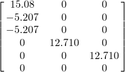

# 1.4.11 Piezoelectric elements

**Product: **Abaqus/Standard  

Piezoelectric elements have both displacements and electric potentials as degrees of freedom. These elements include truss, plane stress, plane strain, axisymmetric, or three-dimensional continuum. The elements are identical to the basic stress/displacement elements except for the coupling between the stress field and the electrical potential gradients. The mechanical loads are tested for these elements but are not reported here since they are identical to those reported in the section for continuum stress/displacement elements. Only the additional loads associated with body and distributed charges are reported in this section.

### I. Truss elements

### Problem description

**Model: **

| Length | 1.0 |
| --- | --- |
| Area | 0.1 |
| Centrifugal axis of rotation | (0, 1, 0) through (.5, 0, 0) |
| Gravitational load vector | (0, 1, 0) |

**Material: **

| Young's modulus | 3 106 |
| --- | --- |
| Coefficient of thermal expansion | .0001 |
| Density | 5 105 |
| Piezoelectric coupling matrix |  |
| Dielectric term | 5.872 109 |

**Initial conditions: **

| Initial temperature | ALL, 10.0 |
| --- | --- |

### Results and discussion

The calculated reactions are in agreement with the applied loads.

### Input files

#### T2D2E element load tests:

[et22efdf.inp](../eif/et22efdf.inp)

BX, BY, GRAV, CENT, CENTRIF, EBF.

[et22efdr.inp](../eif/et22efdr.inp)

 ROTA.

#### T3D2E element load tests:

[et32efdf.inp](../eif/et32efdf.inp)

BX, BY, BZ, GRAV, CENT, CENTRIF, EBF.

[et32efdr.inp](../eif/et32efdr.inp)

 ROTA.

#### T2D3E element load tests:

[et23efdf.inp](../eif/et23efdf.inp)

BX, BY, GRAV, CENT, CENTRIF, EBF.

[et23efdr.inp](../eif/et23efdr.inp)

 ROTA.

#### T3D3E element load tests:

[et33efdf.inp](../eif/et33efdf.inp)

BX, BY, BZ, GRAV, CENT, CENTRIF, EBF.

[et33efdr.inp](../eif/et33efdr.inp)

 ROTA.

### II. Plane stress and plane strain elements

### Problem description

**Model: **

| Square dimensions | 7 7 |
| --- | --- |
| Thickness | 1.0 |
| Centrifugal axis of rotation | (0, 1, 0) through origin |
| Gravitational load vector | (0, 1, 0) |

**Material: **

| Young's modulus | 3 106 |
| --- | --- |
| Poisson's ratio | 0.3 |
| Coefficient of thermal expansion | .0001 |
| Density | 5 105 |
| Piezoelectric coupling matrix |  |
| Dielectric term | 5.872 109 |

**Initial conditions: **

| Initial temperature | ALL, 10.0 |
| --- | --- |
| Hydrostatic pressure datum | lower-order elements: 7.0 |
|  | higher-order elements: 3.0 |
| Hydrostatic pressure elevation | 0.0 |

### Results and discussion

The calculated reactions are in agreement with the applied loads.

### Input files

#### CPS3E element load tests:

[ecs3efdf.inp](../eif/ecs3efdf.inp)

BX, BY, GRAV, CENT, CENTRIF, P1, P2, P3, HP1, HP2, HP3, EBF, ES1, ES2, ES3.

[ecs3efdr.inp](../eif/ecs3efdr.inp)

 ROTA.

[ecs3efdm.inp](../eif/ecs3efdm.inp)

ES, HP, P.

#### CPE3E element load tests:

[ece3efdf.inp](../eif/ece3efdf.inp)

BX, BY, GRAV, CENT, CENTRIF, P1, P2, P3, HP1, HP2, HP3, EBF, ES1, ES2, ES3.

[ece3efdr.inp](../eif/ece3efdr.inp)

 ROTA.

[ece3efdm.inp](../eif/ece3efdm.inp)

ES, HP, P.

#### CPS4E element load tests:

[ecs4efdf.inp](../eif/ecs4efdf.inp)

BX, BY, GRAV, CENT, CENTRIF, P1, P2, P3, P4, HP1, HP2, HP3, HP4, EBF, ES1, ES2, ES3, ES4.

[ecs4efdr.inp](../eif/ecs4efdr.inp)

 ROTA.

[ecs4efdm.inp](../eif/ecs4efdm.inp)

ES, HP, P.

#### CPE4E element load tests:

[ece4efdf.inp](../eif/ece4efdf.inp)

BX, BY, GRAV, CENT, CENTRIF, P1, P2, P3, P4, HP1, HP2, HP3, HP4, EBF, ES1, ES2, ES3, ES4.

[ece4efdr.inp](../eif/ece4efdr.inp)

 ROTA.

[ece4efdm.inp](../eif/ece4efdm.inp)

ES, HP, P.

#### CPS6E element load tests:

[ecs6efdf.inp](../eif/ecs6efdf.inp)

BX, BY, GRAV, CENT, CENTRIF, P1, P2, P3, HP1, HP2, HP3, EBF, ES1, ES2, ES3.

[ecs6efdr.inp](../eif/ecs6efdr.inp)

 ROTA.

[ecs6efdm.inp](../eif/ecs6efdm.inp)

ES, HP, P.

#### CPE6E element load tests:

[ece6efdf.inp](../eif/ece6efdf.inp)

BX, BY, GRAV, CENT, CENTRIF, P1, P2, P3, HP1, HP2, HP3, EBF, ES1, ES2, ES3.

[ece6efdr.inp](../eif/ece6efdr.inp)

 ROTA.

[ece6efdm.inp](../eif/ece6efdm.inp)

ES, HP, P.

#### CPS8E element load tests:

[ecs8efdf.inp](../eif/ecs8efdf.inp)

BX, BY, GRAV, CENT, CENTRIF, P1, P2, P3, P4, HP1, HP2, HP3, HP4, EBF, ES1, ES2, ES3, ES4.

[ecs8efdr.inp](../eif/ecs8efdr.inp)

 ROTA.

[ecs8efdm.inp](../eif/ecs8efdm.inp)

ES, HP, P.

#### CPE8E element load tests:

[ece8efdf.inp](../eif/ece8efdf.inp)

BX, BY, GRAV, CENT, CENTRIF, P1, P2, P3, P4, HP1, HP2, HP3, HP4, EBF, ES1, ES2, ES3, ES4.

[ece8efdr.inp](../eif/ece8efdr.inp)

 ROTA.

[ece8efdm.inp](../eif/ece8efdm.inp)

ES, HP, P.

#### CPS8RE element load tests:

[ecs8erdf.inp](../eif/ecs8erdf.inp)

BX, BY, GRAV, CENT, CENTRIF, P1, P2, P3, P4, HP1, HP2, HP3, HP4, EBF, ES1, ES2, ES3, ES4.

[ecs8erdr.inp](../eif/ecs8erdr.inp)

 ROTA.

[ecs8erdm.inp](../eif/ecs8erdm.inp)

ES, HP, P.

#### CPE8RE element load tests:

[ece8erdf.inp](../eif/ece8erdf.inp)

BX, BY, GRAV, CENT, CENTRIF, P1, P2, P3, P4, HP1, HP2, HP3, HP4, EBF, ES1, ES2, ES3, ES4.

[ece8erdr.inp](../eif/ece8erdr.inp)

 ROTA.

[ece8erdm.inp](../eif/ece8erdm.inp)

ES, HP, P.

### III. Axisymmetric elements

### Problem description

**Model: **

| Planar dimensions | 3 3 |
| --- | --- |
| Inside radius | 1.0 |
| Outside radius | 4.0 |
| Centrifugal axis of rotation | (0, 1, 0) through origin |
| Gravitational load vector | (0, 1, 0) |

**Material: **

| Young's modulus | 3 106 |
| --- | --- |
| Poisson's ratio | 0.3 |
| Coefficient of thermal expansion | .0001 |
| Density | 5 105 |
| Piezoelectric coupling matrix |  |
| Dielectric term | 5.872 109 |

**Initial conditions: **

| Hydrostatic pressure datum | 3.0 |
| --- | --- |
| Hydrostatic pressure elevation | 0.0 |

### Results and discussion

The calculated reactions are in agreement with the applied loads.

### Input files

#### CAX3E element load tests:

[eca3efdf.inp](../eif/eca3efdf.inp)

BZ, GRAV, CENT, P1, P2, P3, HP1, HP2, HP3, EBF, ES1, ES2, ES3.

[eca3efdm.inp](../eif/eca3efdm.inp)

ES, HP, P.

#### CAX4E element load tests:

[eca4efdf.inp](../eif/eca4efdf.inp)

BZ, GRAV, CENT, P1, P2, P3, P4, HP1, HP2, HP3, HP4, EBF, ES1, ES2, ES3, ES4.

[eca4efdm.inp](../eif/eca4efdm.inp)

ES, HP, P.

#### CAX6E element load tests:

[eca6efdf.inp](../eif/eca6efdf.inp)

BZ, GRAV, CENT, P1, P2, P3, HP1, HP2, HP3, EBF, ES1, ES2, ES3.

[eca6efdm.inp](../eif/eca6efdm.inp)

ES, HP, P.

#### CAX8E element load tests:

[eca8efdf.inp](../eif/eca8efdf.inp)

BZ, GRAV, CENT, P1, P2, P3, P4, HP1, HP2, HP3, HP4, EBF, ES1, ES2, ES3, ES4.

[eca8efdm.inp](../eif/eca8efdm.inp)

ES, HP, P.

#### CAX8RE element load tests:

[eca8erdf.inp](../eif/eca8erdf.inp)

BZ, GRAV, CENT, P1, P2, P3, P4, HP1, HP2, HP3, HP4, EBF, ES1, ES2, ES3, ES4.

[eca8erdm.inp](../eif/eca8erdm.inp)

ES, HP, P.

### IV. Three-dimensional solids

### Problem description

**Model: **

| Cubic dimensions | 7 7 7 |
| --- | --- |
| Centrifugal axes of rotation | (0, 1, 0) through (1000, 3.5, 3.5) |
| Gravitational load vector | (1, 0, 0) |

**Material: **

| Young's modulus | 3 106 |
| --- | --- |
| Poisson's ratio | 0.3 |
| Coefficient of thermal expansion | .0001 |
| Density | 10.0 |
| Piezoelectric coupling matrix |  |
| Dielectric term | 5.872 109 |

**Initial conditions: **

| Initial temperature | ALL, 10.0 |
| --- | --- |
| Hydrostatic pressure datum | 0.0 |
| Hydrostatic pressure elevation | 7.0 |

### Results and discussion

The calculated reactions are in agreement with the applied loads.

### Input files

#### C3D4E element load tests:

[ec34efdf.inp](../eif/ec34efdf.inp)

BX, BY, BZ, GRAV, CENT, CENTRIF, P1, P2, P3, P4, HP1, HP2, HP3, HP4, EBF, ES1, ES2, ES3, ES4.

[ec34efdr.inp](../eif/ec34efdr.inp)

 ROTA.

[ec34efdm.inp](../eif/ec34efdm.inp)

ES, HP, P.

#### C3D6E element load tests:

[ec36efdf.inp](../eif/ec36efdf.inp)

BX, BY, BZ, GRAV, CENT, CENTRIF, P1, P2, P3, P4, P5, HP1, HP2, HP3, HP4, HP5, EBF, ES1, ES2, ES3, ES4, ES5.

[ec36efdr.inp](../eif/ec36efdr.inp)

 ROTA.

[ec36efdm.inp](../eif/ec36efdm.inp)

ES, HP, P.

#### C3D8E element load tests:

[ec38efdf.inp](../eif/ec38efdf.inp)

BX, BY, BZ, GRAV, CENT, CENTRIF, P1, P2, P3, P4, P5, P6, HP1, HP2, HP3, HP4, HP5, HP6, EBF, ES1, ES2, ES3, ES4, ES5, ES6.

[ec38efdr.inp](../eif/ec38efdr.inp)

 ROTA.

[ec38efdm.inp](../eif/ec38efdm.inp)

ES, HP, P.

#### C3D10E element load tests:

[ec3aefdf.inp](../eif/ec3aefdf.inp)

BX, BY, BZ, GRAV, CENT, CENTRIF, P1, P2, P3, P4, HP1, HP2, HP3, HP4, EBF, ES1, ES2, ES3, ES4.

[ec3aefdr.inp](../eif/ec3aefdr.inp)

 ROTA.

[ec3aefdm.inp](../eif/ec3aefdm.inp)

ES, HP, P.

#### C3D15E element load tests:

[ec3fefdf.inp](../eif/ec3fefdf.inp)

BX, BY, BZ, GRAV, CENT, CENTRIF, P1, P2, P3, P4, P5, HP1, HP2, HP3, HP4, HP5, EBF, ES1, ES2, ES3, ES4, ES5.

[ec3fefdr.inp](../eif/ec3fefdr.inp)

 ROTA.

[ec3fefdm.inp](../eif/ec3fefdm.inp)

ES, HP, P.

#### C3D20E element load tests:

[ec3kefdf.inp](../eif/ec3kefdf.inp)

BX, BY, BZ, GRAV, CENT, CENTRIF, P1, P2, P3, P4, P5, P6, HP1, HP2, HP3, HP4, HP5, HP6, EBF, ES1, ES2, ES3, ES4, ES5, ES6.

[ec3kefdr.inp](../eif/ec3kefdr.inp)

 ROTA.

[ec3kefdm.inp](../eif/ec3kefdm.inp)

ES, HP, P.

#### C3D20RE element load tests:

[ec3kerdf.inp](../eif/ec3kerdf.inp)

BX, BY, BZ, GRAV, CENT, CENTRIF, P1, P2, P3, P4, P5, P6, HP1, HP2, HP3, HP4, HP5, HP6, EBF, ES1, ES2, ES3, ES4, ES5, ES6.

[ec3kerdr.inp](../eif/ec3kerdr.inp)

 ROTA.

[ec3kerdm.inp](../eif/ec3kerdm.inp)

ES, HP, P.

