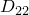

# 1.4.12 连续体质量扩散单元

**产品：**Abaqus/Standard  

### I. 平面实体质量扩散单元

### 问题描述

**模型：**

| 方形尺寸 | 7×7 |
| --- | --- |
| 厚度 | 1.0 |

**材料：**

| 溶解度 | 1.0 |
| --- | --- |

### 结果与讨论

计算的反作用力与施加的载荷一致。

### 输入文件

[ec23mfdc.inp](../eif/ec23mfdc.inp)

DC2D3；扩散率：3.77×10^5 ()，7.54×10^5 ()，11.31×10^5 ()；载荷：BF、S1、S2、S3。

[ec23mfdc.inp](../eif/ec23mfdc.inp)

DC2D3；扩散率：3.77×10^5 ()，7.54×10^5 ()，11.31×10^5 ()；载荷：BF、S1、S2、S3。

[ec24mfdc.inp](../eif/ec24mfdc.inp)

DC2D4；扩散率：3.77×10^5；载荷：BF、S1、S2、S3、S4。

[ec26mfdc.inp](../eif/ec26mfdc.inp)

DC2D6；扩散率：3.77×10^5 ()，3.77×10^6 ()，7.54×10^5 ()，3.77×10^6 ()，3.77×10^6 ()，11.31×10^5 ()；载荷：BF、S1、S2、S3。

[ec28mfdc.inp](../eif/ec28mfdc.inp)

DC2D8；扩散率：3.77×10^5；载荷：BF、S1、S2、S3、S4。

### II. 轴对称实体质量扩散单元

### 问题描述

**模型：**

| 平面尺寸 | 7×7 |
| --- | --- |
| 内半径 | 1.0 |

**材料：**

| 扩散率 | 3.77×10^5 |
| --- | --- |
| 溶解度 | 1.0 |

### 结果与讨论

计算的反作用力与施加的载荷一致。

### 输入文件

[eca3mfdc.inp](../eif/eca3mfdc.inp)

DCAX3：BF、S1、S2、S3。

[eca4mfdc.inp](../eif/eca4mfdc.inp)

DCAX4：BF、S1、S2、S3、S4。

[eca6mfdc.inp](../eif/eca6mfdc.inp)

DCAX6：BF、S1、S2、S3。

[eca8mfdc.inp](../eif/eca8mfdc.inp)

DCAX8：BF、S1、S2、S3、S4。

### III. 三维实体质量扩散单元

### 问题描述

**模型：**

| 立方体尺寸 | 7×7×7 |
| --- | --- |

**材料：**

| 扩散率 | 3.77×10^5 |
| --- | --- |
| 溶解度 | 1.0 |

### 结果与讨论

计算的反作用力与施加的载荷一致。

### 输入文件

[ec34mfdc.inp](../eif/ec34mfdc.inp)

DC3D4：BF、S1、S2、S3、S4。

[ec36mfdc.inp](../eif/ec36mfdc.inp)

DC3D6：BF、S1、S2、S3、S4、S5。

[ec36mfdc_po.inp](../eif/ec36mfdc_po.inp)

[*POST OUTPUT](../key/key-link.md#usb-kws-hpostoutput)分析。

[ec38mfdc.inp](../eif/ec38mfdc.inp)

DC3D8：BF、S1、S2、S3、S4、S5、S6。

[ec3amfdc.inp](../eif/ec3amfdc.inp)

DC3D10：BF、S1、S2、S3、S4。

[ec3amfdc_po.inp](../eif/ec3amfdc_po.inp)

[*POST OUTPUT](../key/key-link.md#usb-kws-hpostoutput)分析。

[ec3fmfdc.inp](../eif/ec3fmfdc.inp)

DC3D15：BF、S1、S2、S3、S4、S5。

[ec3kmfdc.inp](../eif/ec3kmfdc.inp)

DC3D20：BF、S1、S2、S3、S4、S5、S6。

