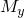
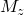

# 1.4.15 质量和转动惯量单元

**产品：**Abaqus/Standard  

### 问题描述

**模型：**

| 各向同性质量 | |
| --- | --- |
|  | 100.0 |
| 各向异性质量 | |
|  | 100.0 |
|  | 200.0 |
|  | 300.0 |
| 转动惯量 | |
|  | 100.0 |
|  | 200.0 |
|  | 300.0 |
| 旋转离心轴 | (0, 0, 1)，通过 (0, 0, 0) |
| 重力载荷向量 | (0, 1, 0) |
| 旋转加速度轴 | (0, 0, 1)，通过 (0, 0, 0) |

ROTARYI单元和各向异性MASS单元也使用局部坐标系和有限旋转进行了测试。

### 结果与讨论

计算的反作用力与施加的载荷一致。

### 输入文件

[emassd1.inp](../eif/emassd1.inp)

各向同性MASS：GRAV、CENTRIF、ROTA。

[emassd_anis.inp](../eif/emassd_anis.inp)

各向异性MASS：GRAV、CENTRIF、ROTA。

[emassd_anis_orient.inp](../eif/emassd_anis_orient.inp)

带[*ORIENTATION](../key/key-link.md#usb-kws-morientation)的各向异性MASS：GRAV、CENTRIF、ROTA。

[erotaryidr.inp](../eif/erotaryidr.inp)

ROTARYI：ROTA。

