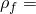
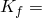
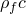

# 1.4.17 入射波载荷

**产品：**Abaqus/Standard  Abaqus/Explicit  

### 测试的功能

- 入射波
- 入射波流体特性
- 入射波相互作用
- 入射波相互作用特性
- 入射波载荷公式
- 入射波特性
- 入射波反射

### I. 声学单元测试

### 测试的单元

AC2D3、AC2D4、AC2D4R、AC2D6、AC2D8、

AC3D4、AC3D5、AC3D6、AC3D8、AC3D8R、AC3D10、AC3D15、AC3D20、

ACAX3、ACAX4、ACAX4R、ACAX6、ACAX8、

### 测试的功能

Abaqus/Standard和Abaqus/Explicit中声学单元上的入射波载荷。

### 问题描述

在此验证集中测试了一维入射波载荷。模型由1米长的流体柱组成，横截面积为10^4平方米。长度方向为*x*轴，横截面平行于*y*和*z*轴。在轴对称情况下，柱体沿轴向放置。一阶单元模型：四边形情况使用100个单元，三边形情况使用200个单元。二阶单元模型：四边形情况使用50个单元，三边形情况使用100个单元。所有情况在宽度和高度方向上均使用一个单元。

通过阻抗边界条件在一端施加非反射边界条件。平面波声源位于(10, 0, 0)，球面波声源位于(100000, 0, 0)，而 standoff点位于(0, 0, 0)。流体材料属性与周围介质相同。使用的材料是空气，属性如下：密度  = 1.21 kg/m³；体积模量  = 1.424×10^5 Pa。

声源激励通过两种方式施加：通过压力幅值和通过相应的加速度幅值。压力作为斜坡函数施加，从零开始，在4.4 ms结束时达到1.826 Pa的幅值。加速度幅值通过幅值为1 m/s²的阶跃函数施加。在Abaqus/Standard和Abaqus/Explicit中都执行了瞬态模拟。通过将第一个节点的POR值与步骤结束时的预期值1.826 Pa进行比较来验证解的有效性。

还测试了总波公式选项。使用总波公式选项获得的指定入射波载荷下的声学解与使用默认散射波公式选项获得的声学解进行了比较。

还创建了类似的模型来测试气泡载荷，使用水作为材料而不是空气。

### 结果与讨论

使用这些测试中的网格，除了AC3D4外所有单元在节点1处的结果为POR=1.825 Pa。AC3D4网格在节点1处产生值为POR=1.865 Pa。更细的网格产生更准确的结果。

使用总波公式选项获得的结果与使用默认散射波公式选项获得的结果相同。

### 输入文件

##### **Abaqus/Standard输入文件**

#### 平面波前，压力幅值：

[iw_1d_ac2d3_dyl_p_pa.inp](../eif/iw_1d_ac2d3_dyl_p_pa.inp)

AC2D3单元。

[iw_1d_ac2d4_dyl_p_pa.inp](../eif/iw_1d_ac2d4_dyl_p_pa.inp)

AC2D4单元。

[iw_1d_ac2d6_dyl_p_pa.inp](../eif/iw_1d_ac2d6_dyl_p_pa.inp)

AC2D6单元。

[iw_1d_ac2d8_dyl_p_pa.inp](../eif/iw_1d_ac2d8_dyl_p_pa.inp)

AC2D8单元。

[iw_1d_ac3d4_dyl_p_pa.inp](../eif/iw_1d_ac3d4_dyl_p_pa.inp)

AC3D4单元。

[iw_1d_ac3d5_dyl_p_pa.inp](../eif/iw_1d_ac3d5_dyl_p_pa.inp)

AC3D5单元。

[iw_1d_ac3d6_dyl_p_pa.inp](../eif/iw_1d_ac3d6_dyl_p_pa.inp)

AC3D6单元。

[iw_1d_ac3d8_dyl_p_pa.inp](../eif/iw_1d_ac3d8_dyl_p_pa.inp)

AC3D8单元。

[iw_1d_ac3d10_dyl_p_pa.inp](../eif/iw_1d_ac3d10_dyl_p_pa.inp)

AC3D10单元。

[iw_1d_ac3d15_dyl_p_pa.inp](../eif/iw_1d_ac3d15_dyl_p_pa.inp)

AC3D15单元。

[iw_1d_ac3d20_dyl_p_pa.inp](../eif/iw_1d_ac3d20_dyl_p_pa.inp)

AC3D20单元。

[iw_1d_acax3_dyl_p_pa.inp](../eif/iw_1d_acax3_dyl_p_pa.inp)

ACAX3单元。

[iw_1d_acax4_dyl_p_pa.inp](../eif/iw_1d_acax4_dyl_p_pa.inp)

ACAX4单元。

[iw_1d_acax6_dyl_p_pa.inp](../eif/iw_1d_acax6_dyl_p_pa.inp)

ACAX6单元。

[iw_1d_acax8_dyl_p_pa.inp](../eif/iw_1d_acax8_dyl_p_pa.inp)

ACAX8单元。

#### 球面波前，压力幅值：

[iw_1d_ac2d3_dyl_s_pa.inp](../eif/iw_1d_ac2d3_dyl_s_pa.inp)

AC2D3单元。

[iw_1d_ac2d4_dyl_s_pa.inp](../eif/iw_1d_ac2d4_dyl_s_pa.inp)

AC2D4单元。

[iw_1d_ac2d6_dyl_s_pa.inp](../eif/iw_1d_ac2d6_dyl_s_pa.inp)

AC2D6单元。

[iw_1d_ac2d8_dyl_s_pa.inp](../eif/iw_1d_ac2d8_dyl_s_pa.inp)

AC2D8单元。

[iw_1d_ac3d4_dyl_s_pa.inp](../eif/iw_1d_ac3d4_dyl_s_pa.inp)

AC3D4单元。

[iw_1d_ac3d5_dyl_s_pa.inp](../eif/iw_1d_ac3d5_dyl_s_pa.inp)

AC3D5单元。

[iw_1d_ac3d6_dyl_s_pa.inp](../eif/iw_1d_ac3d6_dyl_s_pa.inp)

AC3D6单元。

[iw_1d_ac3d8_dyl_s_pa.inp](../eif/iw_1d_ac3d8_dyl_s_pa.inp)

AC3D8单元。

[iw_1d_ac3d10_dyl_s_pa.inp](../eif/iw_1d_ac3d10_dyl_s_pa.inp)

AC3D10单元。

[iw_1d_ac3d15_dyl_s_pa.inp](../eif/iw_1d_ac3d15_dyl_s_pa.inp)

AC3D15单元。

[iw_1d_ac3d20_dyl_s_pa.inp](../eif/iw_1d_ac3d20_dyl_s_pa.inp)

AC3D20单元。

[iw_1d_acax3_dyl_s_pa.inp](../eif/iw_1d_acax3_dyl_s_pa.inp)

ACAX3单元。

[iw_1d_acax4_dyl_s_pa.inp](../eif/iw_1d_acax4_dyl_s_pa.inp)

ACAX4单元。

[iw_1d_acax6_dyl_s_pa.inp](../eif/iw_1d_acax6_dyl_s_pa.inp)

ACAX6单元。

[iw_1d_acax8_dyl_s_pa.inp](../eif/iw_1d_acax8_dyl_s_pa.inp)

ACAX8单元。

#### 平面波前，加速度幅值：

[iw_1d_ac2d3_dyl_p_aa.inp](../eif/iw_1d_ac2d3_dyl_p_aa.inp)

AC2D3单元。

[iw_1d_ac2d4_dyl_p_aa.inp](../eif/iw_1d_ac2d4_dyl_p_aa.inp)

AC2D4单元。

[iw_1d_ac2d6_dyl_p_aa.inp](../eif/iw_1d_ac2d6_dyl_p_aa.inp)

AC2D6单元。

[iw_1d_ac2d8_dyl_p_aa.inp](../eif/iw_1d_ac2d8_dyl_p_aa.inp)

AC2D8单元。

[iw_1d_ac3d4_dyl_p_aa.inp](../eif/iw_1d_ac3d4_dyl_p_aa.inp)

AC3D4单元。

[iw_1d_ac3d5_dyl_p_aa.inp](../eif/iw_1d_ac3d5_dyl_p_aa.inp)

AC3D5单元。

[iw_1d_ac3d6_dyl_p_aa.inp](../eif/iw_1d_ac3d6_dyl_p_aa.inp)

AC3D6单元。

[iw_1d_ac3d8_dyl_p_aa.inp](../eif/iw_1d_ac3d8_dyl_p_aa.inp)

AC3D8单元。

[iw_1d_ac3d10_dyl_p_aa.inp](../eif/iw_1d_ac3d10_dyl_p_aa.inp)

AC3D10单元。

[iw_1d_ac3d15_dyl_p_aa.inp](../eif/iw_1d_ac3d15_dyl_p_aa.inp)

AC3D15单元。

[iw_1d_ac3d20_dyl_p_aa.inp](../eif/iw_1d_ac3d20_dyl_p_aa.inp)

AC3D20单元。

[iw_1d_acax3_dyl_p_aa.inp](../eif/iw_1d_acax3_dyl_p_aa.inp)

ACAX3单元。

[iw_1d_acax4_dyl_p_aa.inp](../eif/iw_1d_acax4_dyl_p_aa.inp)

ACAX4单元。

[iw_1d_acax6_dyl_p_aa.inp](../eif/iw_1d_acax6_dyl_p_aa.inp)

ACAX6单元。

[iw_1d_acax8_dyl_p_aa.inp](../eif/iw_1d_acax8_dyl_p_aa.inp)

ACAX8单元。

#### 气泡载荷幅值：

[iw_1d_ac2d3_dyl_b_pa.inp](../eif/iw_1d_ac2d3_dyl_b_pa.inp)

AC2D3单元。

[bubbledrag_iwi.inp](../eif/bubbledrag_iwi.inp)

S4单元，[*INCIDENT WAVE INTERACTION](../key/key-link.md#usb-kws-hincidentwaveinteraction)（首选界面）。

[bubbledrag_iw.inp](../eif/bubbledrag_iw.inp)

S4单元，[*INCIDENT WAVE](../key/key-link.md#usb-kws-hincidentwave)（替代界面）。

##### **Abaqus/Explicit输入文件**

#### 平面波前，压力幅值：

[iw_1d_ac2d3_xpl_p_pa.inp](../eif/iw_1d_ac2d3_xpl_p_pa.inp)

AC2D3单元。

[iw_1d_ac2d4r_xpl_p_pa.inp](../eif/iw_1d_ac2d4r_xpl_p_pa.inp)

AC2D4R单元。

[iw_1d_ac3d4_xpl_p_pa.inp](../eif/iw_1d_ac3d4_xpl_p_pa.inp)

AC3D4单元。

[iw_1d_ac3d6_xpl_p_pa.inp](../eif/iw_1d_ac3d6_xpl_p_pa.inp)

AC3D6单元。

[iw_1d_ac3d8r_xpl_p_pa.inp](../eif/iw_1d_ac3d8r_xpl_p_pa.inp)

AC3D8R单元。

[iw_1d_acax3_xpl_p_pa.inp](../eif/iw_1d_acax3_xpl_p_pa.inp)

ACAX3单元。

[iw_1d_acax4r_xpl_p_pa.inp](../eif/iw_1d_acax4r_xpl_p_pa.inp)

ACAX4R单元。

[iwt_1d_ac2d4r_xpl_p_pa.inp](../eif/iwt_1d_ac2d4r_xpl_p_pa.inp)

AC2D4R单元，总波公式。

[iwt_1d_ac3d6_xpl_p_pa.inp](../eif/iwt_1d_ac3d6_xpl_p_pa.inp)

AC3D6单元，总波公式。

[iwt_1d_acax4r_xpl_p_pa.inp](../eif/iwt_1d_acax4r_xpl_p_pa.inp)

ACAX4R单元，总波公式。

#### 球面波前，压力幅值：

[iw_1d_ac2d3_xpl_s_pa.inp](../eif/iw_1d_ac2d3_xpl_s_pa.inp)

AC2D3单元。

[iw_1d_ac2d4r_xpl_s_pa.inp](../eif/iw_1d_ac2d4r_xpl_s_pa.inp)

AC2D4R单元。

[iw_1d_ac3d4_xpl_s_pa.inp](../eif/iw_1d_ac3d4_xpl_s_pa.inp)

AC3D4单元。

[iw_1d_ac3d6_xpl_s_pa.inp](../eif/iw_1d_ac3d6_xpl_s_pa.inp)

AC3D6单元。

[iw_1d_ac3d8r_xpl_s_pa.inp](../eif/iw_1d_ac3d8r_xpl_s_pa.inp)

AC3D8R单元。

[iw_1d_acax3_xpl_s_pa.inp](../eif/iw_1d_acax3_xpl_s_pa.inp)

ACAX3单元。

[iw_1d_acax4r_xpl_s_pa.inp](../eif/iw_1d_acax4r_xpl_s_pa.inp)

ACAX4R单元。

[iwt_1d_ac2d3_xpl_s_pa.inp](../eif/iwt_1d_ac2d3_xpl_s_pa.inp)

AC2D3单元，总波公式。

[iwt_1d_ac3d8r_xpl_s_pa.inp](../eif/iwt_1d_ac3d8r_xpl_s_pa.inp)

AC3D8R单元，总波公式。

[iwt_1d_acax3_xpl_s_pa.inp](../eif/iwt_1d_acax3_xpl_s_pa.inp)

ACAX3单元，总波公式。

#### 平面波前，加速度幅值：

[iw_1d_ac2d3_xpl_p_aa.inp](../eif/iw_1d_ac2d3_xpl_p_aa.inp)

AC2D3单元。

[iw_1d_ac2d4r_xpl_p_aa.inp](../eif/iw_1d_ac2d4r_xpl_p_aa.inp)

AC2D4R单元。

[iw_1d_ac3d4_xpl_p_aa.inp](../eif/iw_1d_ac3d4_xpl_p_aa.inp)

AC3D4单元。

[iw_1d_ac3d6_xpl_p_aa.inp](../eif/iw_1d_ac3d6_xpl_p_aa.inp)

AC3D6单元。

[iw_1d_ac3d8r_xpl_p_aa.inp](../eif/iw_1d_ac3d8r_xpl_p_aa.inp)

AC3D8R单元。

[iw_1d_acax3_xpl_p_aa.inp](../eif/iw_1d_acax3_xpl_p_aa.inp)

ACAX3单元。

[iw_1d_acax4r_xpl_p_aa.inp](../eif/iw_1d_acax4r_xpl_p_aa.inp)

ACAX4R单元。

[iwt_1d_ac2d3_xpl_p_aa.inp](../eif/iwt_1d_ac2d3_xpl_p_aa.inp)

AC2D3单元，总波公式。

[iwt_1d_ac3d4_xpl_p_aa.inp](../eif/iwt_1d_ac3d4_xpl_p_aa.inp)

AC3D4单元，总波公式。

[iwt_1d_ac3d8r_xpl_p_aa.inp](../eif/iwt_1d_ac3d8r_xpl_p_aa.inp)

AC3D8R单元，总波公式。

[iwt_1d_acax3_xpl_p_aa.inp](../eif/iwt_1d_acax3_xpl_p_aa.inp)

ACAX3单元，总波公式。

#### 气泡载荷幅值：

[iw_1d_ac2d3_xpl_b_pa.inp](../eif/iw_1d_ac2d3_xpl_b_pa.inp)

AC2D3单元。

#### 球面波，广义衰减：

[iw_1d_ac3d4_xpl_s_pa_gendecay.inp](../eif/iw_1d_ac3d4_xpl_s_pa_gendecay.inp)

AC3D4单元；广义衰减。

[iw_1d_ac3d8r_xpl_s_pa_gendecay.inp](../eif/iw_1d_ac3d8r_xpl_s_pa_gendecay.inp)

AC3D8R单元；广义衰减。

[iw_aco_fastdecay.inp](../eif/iw_aco_fastdecay.inp)

AC3D8R单元；高空间衰减。

[iw_aco_highc.inp](../eif/iw_aco_highc.inp)

AC3D8R单元；高声速。

[iw_aco_nearlyacoustic.inp](../eif/iw_aco_nearlyacoustic.inp)

AC3D8R单元；广义的，但接近声学的，衰减。

[iw_aco_slowdecay.inp](../eif/iw_aco_slowdecay.inp)

AC3D8R单元；广义的，但非常缓慢的，衰减。

[iw_b31_fastdecay.inp](../eif/iw_b31_fastdecay.inp)

B31单元；高空间衰减。

[iw_b31_highc.inp](../eif/iw_b31_highc.inp)

B31单元；高声速。

[iw_b31_nearlyacoustic.inp](../eif/iw_b31_nearlyacoustic.inp)

B31单元；广义的，但接近声学的，衰减。

[iw_b31_slowdecay.inp](../eif/iw_b31_slowdecay.inp)

B31单元；广义的，但非常缓慢的，衰减。

[iw_cpl_fastdecay.inp](../eif/iw_cpl_fastdecay.inp)

耦合S4R和AC3D8R单元；高空间衰减。

[iw_cpl_highc.inp](../eif/iw_cpl_highc.inp)

耦合S4R和AC3D8R单元；高声速。

[iw_cpl_nearlyacoustic.inp](../eif/iw_cpl_nearlyacoustic.inp)

耦合S4R和AC3D8R单元；广义的，但接近声学的，衰减。

[iw_cpl_nearlyacoustic0.inp](../eif/iw_cpl_nearlyacoustic0.inp)

耦合S4R和AC3D8R单元；广义的，但接近声学的，衰减。不同模型属性的第二个测试。

[iw_cpl_slowdecay.inp](../eif/iw_cpl_slowdecay.inp)

耦合S4R和AC3D8R单元；广义的，但非常缓慢的，衰减。

[iw_shl_fastdecay.inp](../eif/iw_shl_fastdecay.inp)

S4R单元；高空间衰减。

[iw_shl_highc.inp](../eif/iw_shl_highc.inp)

S4R单元；高声速。

[iw_shl_nearlyacoustic.inp](../eif/iw_shl_nearlyacoustic.inp)

S4R单元；广义的，但接近声学的，衰减。

[iw_shl_slowdecay.inp](../eif/iw_shl_slowdecay.inp)

S4R单元；广义的，但非常缓慢的，衰减。

### II. 声学场初始化

### 测试的单元

AC2D3、AC2D4、AC2D4R、AC2D6、AC2D8、

AC3D4、AC3D5、AC3D6、AC3D8、AC3D8R、AC3D10、AC3D15、AC3D20、

ACAX3、ACAX4、ACAX4R、ACAX6、ACAX8、

### 测试的功能

在Abaqus/Standard和Abaqus/Explicit中使用入射波载荷和总波公式的声学单元上的入射波载荷。

### 问题描述

这些是多单元测试，对平面波和球面波声源在管道中激发行波进行建模。研究了两种情况：使用指数衰减时间幅值的球面波源和使用正弦幅值的平面波源。在两种情况下都使用总波公式，并且入射波载荷的standoff点被指定在有限元网格内部。因此，在分析开始时，入射波已经进入有限元域。这些测试表明，在分析第一个动态步骤开始时，声场被正确初始化为入射波场的值。

### 结果与讨论

所有情况的结果都与预期值匹配。

### 输入文件

##### **Abaqus/Standard输入文件**

[std_twinit_2d_dcay.inp](../eif/std_twinit_2d_dcay.inp)

球面波前的衰减幅值；二维单元。

[std_twinit_3d_dcay.inp](../eif/std_twinit_3d_dcay.inp)

球面波前的衰减幅值；三维单元。

[std_twinit_ax_dcay.inp](../eif/std_twinit_ax_dcay.inp)

球面波前的衰减幅值；轴对称单元。

[std_twinit_2d_sine.inp](../eif/std_twinit_2d_sine.inp)

平面波前的正弦幅值；二维单元。

[std_twinit_3d_sine.inp](../eif/std_twinit_3d_sine.inp)

平面波前的正弦幅值；三维单元。

[std_twinit_ax_sine.inp](../eif/std_twinit_ax_sine.inp)

平面波前的正弦幅值；轴对称单元。

##### **Abaqus/Explicit输入文件**

[xpl_twinit_2d_dcay.inp](../eif/xpl_twinit_2d_dcay.inp)

球面波前的衰减幅值；二维单元。

[xpl_twinit_3d_dcay.inp](../eif/xpl_twinit_3d_dcay.inp)

球面波前的衰减幅值；三维单元。

[xpl_twinit_ax_dcay.inp](../eif/xpl_twinit_ax_dcay.inp)

球面波前的衰减幅值；轴对称单元。

[xpl_twinit_2d_sine.inp](../eif/xpl_twinit_2d_sine.inp)

平面波前的正弦幅值；二维单元。

[xpl_twinit_3d_sine.inp](../eif/xpl_twinit_3d_sine.inp)

平面波前的正弦幅值；三维单元。

[xpl_twinit_ax_sine.inp](../eif/xpl_twinit_ax_sine.inp)

平面波前的正弦幅值；轴对称单元。

### III. 梁单元测试

### 测试的单元

B21、B21H、B22、B22H、B23、B23H、B31、PIPE21、PIPE31、

### 测试的功能

Abaqus/Standard和Abaqus/Explicit中二维梁单元上的入射波载荷。还在Abaqus/Explicit中测试了管道单元和三维梁。

### 问题描述

在二维建模的情况下，使用单单元测试来验证二维梁和管道单元上的入射波载荷，其中平面波波源位于(0.5, 10)，球面波波源位于(0.5, 100000)。每种情况的单个单元沿*x*轴放置，端点为(0, 0)和(1, 0)。所有节点完全固定。standoff点位于(0.5, 0)。梁单元具有横截面积为1×10^4平方米的方形截面，而管道的外径为1.0×10^2米，厚度为1.0×10^3米。梁的材料属性为  = 1.0×10^6 Pa，  = 1000 kg/m³。周围介质的属性与上一节中使用的相同。

载荷作为斜坡函数施加，在0.5 ms结束时达到1000 Pa的最大值。比较单元节点上的反作用力。对于线性单元，每个端节点的预期反作用力为500 N。对于二次单元，每个端节点的预期反作用力为166.7 N，中间节点为666.7 N。

还测试了气泡载荷，但使用水作为材料而不是空气。

在Abaqus/Explicit中验证三维梁和管道单元的三维建模情况下，使用由50个梁（B31）或管道（PIPE31）单元组成的梁，沿*x*轴放置，端点为(50, 0, 0)和(50, 0, 0)。两种情况都使用管道类型的横截面，外径为2.5米，厚度为0.1米。梁的材料属性为  = 2.0×10^11 Pa，  = 10000 kg/m³。

由于水下爆炸产生的球面波源位于(0, 30, 0)；standoff点位于(0, 5, 0)。波载荷施加在用表面膜单元（SFM3D4R）建模的圆柱形表皮上，绑定到梁的外表面。梁上的边界条件不允许沿*y*和*z*轴的轴向位移和旋转。计算0.1秒的解。

### 结果与讨论

所有情况的结果都与预期值完全匹配。

### 输入文件

##### **Abaqus/Standard输入文件**

#### 平面波前，几何非线性被忽略：

[iw_1d_b21_dyl_p_pp.inp](../eif/iw_1d_b21_dyl_p_pp.inp)

B21单元。

[iw_1d_b21h_dyl_p_pp.inp](../eif/iw_1d_b21h_dyl_p_pp.inp)

B21H单元。

[iw_1d_b22_dyl_p_pp.inp](../eif/iw_1d_b22_dyl_p_pp.inp)

B22单元。

[iw_1d_b22h_dyl_p_pp.inp](../eif/iw_1d_b22h_dyl_p_pp.inp)

B22H单元。

[iw_1d_b23_dyl_p_pp.inp](../eif/iw_1d_b23_dyl_p_pp.inp)

B23单元。

[iw_1d_b23h_dyl_p_pp.inp](../eif/iw_1d_b23h_dyl_p_pp.inp)

B23H单元。

#### 球面波前，几何非线性被忽略：

[iw_1d_b21_dyl_s_pp.inp](../eif/iw_1d_b21_dyl_s_pp.inp)

B21单元。

[iw_1d_b21h_dyl_s_pp.inp](../eif/iw_1d_b21h_dyl_s_pp.inp)

B21H单元。

[iw_1d_b22_dyl_s_pp.inp](../eif/iw_1d_b22_dyl_s_pp.inp)

B22单元。

[iw_1d_b22h_dyl_s_pp.inp](../eif/iw_1d_b22h_dyl_s_pp.inp)

B22H单元。

[iw_1d_b23_dyl_s_pp.inp](../eif/iw_1d_b23_dyl_s_pp.inp)

B23单元。

[iw_1d_b23h_dyl_s_pp.inp](../eif/iw_1d_b23h_dyl_s_pp.inp)

B23H单元。

#### 平面波前，考虑几何非线性：

[iw_1d_b21_dyn_p_pp.inp](../eif/iw_1d_b21_dyn_p_pp.inp)

B21单元。

[iw_1d_b21h_dyn_p_pp.inp](../eif/iw_1d_b21h_dyn_p_pp.inp)

B21H单元。

[iw_1d_b22_dyn_p_pp.inp](../eif/iw_1d_b22_dyn_p_pp.inp)

B22单元。

[iw_1d_b22h_dyn_p_pp.inp](../eif/iw_1d_b22h_dyn_p_pp.inp)

B22H单元。

[iw_1d_b23_dyn_p_pp.inp](../eif/iw_1d_b23_dyn_p_pp.inp)

B23单元。

[iw_1d_b23h_dyn_p_pp.inp](../eif/iw_1d_b23h_dyn_p_pp.inp)

B23H单元。

#### 球面波前，考虑几何非线性：

[iw_1d_b21_dyn_s_pp.inp](../eif/iw_1d_b21_dyn_s_pp.inp)

B21单元。

[iw_1d_b21h_dyn_s_pp.inp](../eif/iw_1d_b21h_dyn_s_pp.inp)

B21H单元。

[iw_1d_b22_dyn_s_pp.inp](../eif/iw_1d_b22_dyn_s_pp.inp)

B22单元。

[iw_1d_b22h_dyn_s_pp.inp](../eif/iw_1d_b22h_dyn_s_pp.inp)

B22H单元。

[iw_1d_b23_dyn_s_pp.inp](../eif/iw_1d_b23_dyn_s_pp.inp)

B23单元。

[iw_1d_b23h_dyn_s_pp.inp](../eif/iw_1d_b23h_dyn_s_pp.inp)

B23H单元。

#### 气泡载荷幅值：

[iw_1d_b21_dyl_b_pp.inp](../eif/iw_1d_b21_dyl_b_pp.inp)

B21单元。

##### **Abaqus/Explicit输入文件**

[iw_1d_b21_xpl_p_pp.inp](../eif/iw_1d_b21_xpl_p_pp.inp)

具有平面波前的B21单元。

[iw_1d_b21_xpl_s_pp.inp](../eif/iw_1d_b21_xpl_s_pp.inp)

具有球面波前的B21单元。

[iwt_1d_b21_xpl_p_pp.inp](../eif/iwt_1d_b21_xpl_p_pp.inp)

具有平面波前的B21单元。

[iwt_1d_b21_xpl_s_pp.inp](../eif/iwt_1d_b21_xpl_s_pp.inp)

具有球面波前的B21单元。

[iw_1d_p21_xpl_p_pp.inp](../eif/iw_1d_p21_xpl_p_pp.inp)

具有平面波前的PIPE21单元。

[b31_sfm_iw.inp](../eif/b31_sfm_iw.inp)

具有球面波前的B31单元。

[p31_sfm_iw.inp](../eif/p31_sfm_iw.inp)

具有球面波前的PIPE31单元。

#### 气泡载荷幅值：

[iw_1d_b21_xpl_b_pp.inp](../eif/iw_1d_b21_xpl_b_pp.inp)

B21单元。

### IV. 壳单元测试

### 测试的单元

S3R、S3RS、S4R、S4R5、S4RS、S4RSW、S8R、S8R5、S9R5、STRI3、STRI65、

SAX1、SAX2、

### 测试的功能

Abaqus/Standard和Abaqus/Explicit中壳单元上的入射波载荷。

### 问题描述

这些是单单元测试，对平面壳声源在(0.5, 0.5, 10)、轴对称壳声源在(0, 10)进行建模，用于平面波。对于球面波，声源移至(0.5, 0.5, 100000)用于平面壳，(0, 100000)用于轴对称壳。平面壳建模在*X-Y*平面内，各边长度为1。standoff点位于(0.5, 0.5, 0)。在轴对称情况下，壳沿径向放置，standoff点位于(0, 0)。壳厚度为10^(-4)m。壳材料属性与上一节中梁的属性相同。周围介质的属性与先前情况中使用的相同。所有节点完全固定。载荷作为斜坡函数施加，在0.5 ms结束时达到1000 Pa的最大值。将反作用力与预期值进行比较，总力应为1000 N。

还创建了类似的模型来测试气泡载荷，使用水作为材料而不是空气。

### 结果与讨论

所有测试单元的结果与预期值完全匹配。

### 输入文件

##### **Abaqus/Standard输入文件**

#### 平面波前，几何非线性被忽略：

[iw_1d_s3r_dyl_p_pp.inp](../eif/iw_1d_s3r_dyl_p_pp.inp)

S3R单元。

[iw_1d_s4_dyl_p_pp.inp](../eif/iw_1d_s4_dyl_p_pp.inp)

S4单元。

[iw_1d_s4r_dyl_p_pp.inp](../eif/iw_1d_s4r_dyl_p_pp.inp)

S4R单元。

[iw_1d_s4r5_dyl_p_pp.inp](../eif/iw_1d_s4r5_dyl_p_pp.inp)

S4R5单元。

[iw_1d_s8r_dyl_p_pp.inp](../eif/iw_1d_s8r_dyl_p_pp.inp)

S8R单元。

[iw_1d_s8r5_dyl_p_pp.inp](../eif/iw_1d_s8r5_dyl_p_pp.inp)

S8R5单元。

[iw_1d_s9r5_dyl_p_pp.inp](../eif/iw_1d_s9r5_dyl_p_pp.inp)

S9R5单元。

[iw_1d_stri3_dyl_p_pp.inp](../eif/iw_1d_stri3_dyl_p_pp.inp)

STRI3单元。

[iw_1d_stri65_dyl_p_pp.inp](../eif/iw_1d_stri65_dyl_p_pp.inp)

STRI65单元。

[iw_1d_sax1_dyl_p_pp.inp](../eif/iw_1d_sax1_dyl_p_pp.inp)

SAX1单元。

[iw_1d_sax2_dyl_p_pp.inp](../eif/iw_1d_sax2_dyl_p_pp.inp)

SAX2单元。

#### 球面波前，几何非线性被忽略：

[iw_1d_s3r_dyl_s_pp.inp](../eif/iw_1d_s3r_dyl_s_pp.inp)

S3R单元。

[iw_1d_s4_dyl_s_pp.inp](../eif/iw_1d_s4_dyl_s_pp.inp)

S4单元。

[iw_1d_s4r_dyl_s_pp.inp](../eif/iw_1d_s4r_dyl_s_pp.inp)

S4R单元。

[iw_1d_s4r5_dyl_s_pp.inp](../eif/iw_1d_s4r5_dyl_s_pp.inp)

S4R5单元。

[iw_1d_s8r_dyl_s_pp.inp](../eif/iw_1d_s8r_dyl_s_pp.inp)

S8R单元。

[iw_1d_s8r5_dyl_s_pp.inp](../eif/iw_1d_s8r5_dyl_s_pp.inp)

S8R5单元。

[iw_1d_s9r5_dyl_s_pp.inp](../eif/iw_1d_s9r5_dyl_s_pp.inp)

S9R5单元。

[iw_1d_stri3_dyl_s_pp.inp](../eif/iw_1d_stri3_dyl_s_pp.inp)

STRI3单元。

[iw_1d_stri65_dyl_s_pp.inp](../eif/iw_1d_stri65_dyl_s_pp.inp)

STRI65单元。

[iw_1d_sax1_dyl_s_pp.inp](../eif/iw_1d_sax1_dyl_s_pp.inp)

SAX1单元。

[iw_1d_sax2_dyl_s_pp.inp](../eif/iw_1d_sax2_dyl_s_pp.inp)

SAX2单元。

#### 平面波前，考虑几何非线性：

[iw_1d_s3r_dyn_p_pp.inp](../eif/iw_1d_s3r_dyn_p_pp.inp)

S3R单元。

[iw_1d_s4_dyn_p_pp.inp](../eif/iw_1d_s4_dyn_p_pp.inp)

S4单元。

[iw_1d_s4r_dyn_p_pp.inp](../eif/iw_1d_s4r_dyn_p_pp.inp)

S4R单元。

[iw_1d_s4r5_dyn_p_pp.inp](../eif/iw_1d_s4r5_dyn_p_pp.inp)

S4R5单元。

[iw_1d_s8r_dyn_p_pp.inp](../eif/iw_1d_s8r_dyn_p_pp.inp)

S8R单元。

[iw_1d_s8r5_dyn_p_pp.inp](../eif/iw_1d_s8r5_dyn_p_pp.inp)

S8R5单元。

[iw_1d_s9r5_dyn_p_pp.inp](../eif/iw_1d_s9r5_dyn_p_pp.inp)

S9R5单元。

[iw_1d_stri3_dyn_p_pp.inp](../eif/iw_1d_stri3_dyn_p_pp.inp)

STRI3单元。

[iw_1d_stri65_dyn_p_pp.inp](../eif/iw_1d_stri65_dyn_p_pp.inp)

STRI65单元。

[iw_1d_sax1_dyn_p_pp.inp](../eif/iw_1d_sax1_dyn_p_pp.inp)

SAX1单元。

[iw_1d_sax2_dyn_p_pp.inp](../eif/iw_1d_sax2_dyn_p_pp.inp)

SAX2单元。

#### 球面波前，考虑几何非线性：

[iw_1d_s3r_dyn_s_pp.inp](../eif/iw_1d_s3r_dyn_s_pp.inp)

S3R单元。

[iw_1d_s4_dyn_s_pp.inp](../eif/iw_1d_s4_dyn_s_pp.inp)

S4单元。

[iw_1d_s4r_dyn_s_pp.inp](../eif/iw_1d_s4r_dyn_s_pp.inp)

S4R单元。

[iw_1d_s4r5_dyn_s_pp.inp](../eif/iw_1d_s4r5_dyn_s_pp.inp)

S4R5单元。

[iw_1d_s8r_dyn_s_pp.inp](../eif/iw_1d_s8r_dyn_s_pp.inp)

S8R单元。

[iw_1d_s8r5_dyn_s_pp.inp](../eif/iw_1d_s8r5_dyn_s_pp.inp)

S8R5单元。

[iw_1d_s9r5_dyn_s_pp.inp](../eif/iw_1d_s9r5_dyn_s_pp.inp)

S9R5单元。

[iw_1d_stri3_dyn_s_pp.inp](../eif/iw_1d_stri3_dyn_s_pp.inp)

STRI3单元。

[iw_1d_stri65_dyn_s_pp.inp](../eif/iw_1d_stri65_dyn_s_pp.inp)

STRI65单元。

[iw_1d_sax1_dyn_s_pp.inp](../eif/iw_1d_sax1_dyn_s_pp.inp)

SAX1单元。

[iw_1d_sax2_dyn_s_pp.inp](../eif/iw_1d_sax2_dyn_s_pp.inp)

SAX2单元。

#### 气泡载荷幅值：

[iw_1d_s4_dyl_b_pp.inp](../eif/iw_1d_s4_dyl_b_pp.inp)

S4单元。

##### **Abaqus/Explicit输入文件**

#### 平面波前：

[iw_1d_s3r_xpl_p_pp.inp](../eif/iw_1d_s3r_xpl_p_pp.inp)

S3R单元。

[iw_1d_s3rs_xpl_p_pp.inp](../eif/iw_1d_s3rs_xpl_p_pp.inp)

S3RS单元。

[iw_1d_s4r_xpl_p_pp.inp](../eif/iw_1d_s4r_xpl_p_pp.inp)

S4R单元。

[iw_1d_s4rs_xpl_p_pp.inp](../eif/iw_1d_s4rs_xpl_p_pp.inp)

S4RS单元。

[iw_1d_s4rsw_xpl_p_pp.inp](../eif/iw_1d_s4rsw_xpl_p_pp.inp)

S4RSW单元。

[iw_1d_sax1_xpl_p_pp.inp](../eif/iw_1d_sax1_xpl_p_pp.inp)

SAX1单元。

[iwt_1d_sax1_xpl_p_pp.inp](../eif/iwt_1d_sax1_xpl_p_pp.inp)

SAX1单元。

#### 球面波前：

[iw_1d_s3r_xpl_s_pp.inp](../eif/iw_1d_s3r_xpl_s_pp.inp)

S3R单元。

[iw_1d_s3rs_xpl_s_pp.inp](../eif/iw_1d_s3rs_xpl_s_pp.inp)

S3RS单元。

[iw_1d_s4r_xpl_s_pp.inp](../eif/iw_1d_s4r_xpl_s_pp.inp)

S4R单元。

[iw_1d_s4rs_xpl_s_pp.inp](../eif/iw_1d_s4rs_xpl_s_pp.inp)

S4RS单元。

[iw_1d_s4rsw_xpl_s_pp.inp](../eif/iw_1d_s4rsw_xpl_s_pp.inp)

S4RSW单元。

[iw_1d_sax1_xpl_s_pp.inp](../eif/iw_1d_sax1_xpl_s_pp.inp)

SAX1单元。

[iwt_1d_s3rs_xpl_s_pp.inp](../eif/iwt_1d_s3rs_xpl_s_pp.inp)

S3RS单元。

[iwt_1d_s4r_xpl_s_pp.inp](../eif/iwt_1d_s4r_xpl_s_pp.inp)

S4R单元。

#### 气泡载荷幅值：

[iw_1d_s4r_xpl_b_pp.inp](../eif/iw_1d_s4r_xpl_b_pp.inp)

S4R单元。

### V. 实体单元测试

### 测试的单元

CPE3、CPE4I、CPE4R、CPEG4I、CPEG4R、CPE6M、CPEG6M、CPE8、CPEG8、

CPS3、CPS4I、CPS4R、CPS6、CPS6M、CPS8R、

C3D4、C3D6、C3D8I、C3D8R、C3D10M、C3D15V、C3D20、

CAX3、CAX4R、CAX6、CAX6M、CAX8R、

### 测试的功能

Abaqus/Standard和Abaqus/Explicit中实体单元上的入射波载荷。

### 问题描述

这些测试使用的几何与声学单元测试完全相同，只是长度减小到0.1米。因此，四边形情况使用10个一阶单元，三边形情况使用20个一阶单元；四边形情况使用5个二阶单元，三边形情况使用10个二阶单元。平面波声源位于(10, 0)，球面波声源位于(100000, 0, 0)。所有节点在*y*方向固定，而远离声源的表面上的端节点另外在*x*方向固定。将单元中的应力与使用等效分布表面载荷获得的结果进行比较。

还创建了类似的模型来测试气泡载荷，使用水作为材料而不是空气。

### 结果与讨论

解与使用等效分布表面载荷获得的解完全相同，除了CPE6M单元在Abaqus/Explicit分析中产生少量百分比误差。

### 输入文件

##### **Abaqus/Standard输入文件**

#### 平面波前，几何非线性被忽略：

[iw_1d_cpe3_dyl_p_pp.inp](../eif/iw_1d_cpe3_dyl_p_pp.inp)

CPE3单元。

[iw_1d_cpe4i_dyl_p_pp.inp](../eif/iw_1d_cpe4i_dyl_p_pp.inp)

CPE4I单元。

[iw_1d_cpe4r_dyl_p_pp.inp](../eif/iw_1d_cpe4r_dyl_p_pp.inp)

CPE4R单元。

[iw_1d_cpeg4i_dyl_p_pp.inp](../eif/iw_1d_cpeg4i_dyl_p_pp.inp)

CPEG4I单元。

[iw_1d_cpeg4r_dyl_p_pp.inp](../eif/iw_1d_cpeg4r_dyl_p_pp.inp)

CPEG4R单元。

[iw_1d_cpe6m_dyl_p_pp.inp](../eif/iw_1d_cpe6m_dyl_p_pp.inp)

CPE6M单元。

[iw_1d_cpeg6m_dyl_p_pp.inp](../eif/iw_1d_cpeg6m_dyl_p_pp.inp)

CPEG6M单元。

[iw_1d_cpe8_dyl_p_pp.inp](../eif/iw_1d_cpe8_dyl_p_pp.inp)

CPE8单元。

[iw_1d_cpeg8_dyl_p_pp.inp](../eif/iw_1d_cpeg8_dyl_p_pp.inp)

CPEG8单元。

[iw_1d_cps3_dyl_p_pp.inp](../eif/iw_1d_cps3_dyl_p_pp.inp)

CPS3单元。

[iw_1d_cps4i_dyl_p_pp.inp](../eif/iw_1d_cps4i_dyl_p_pp.inp)

CPS4I单元。

[iw_1d_cps4r_dyl_p_pp.inp](../eif/iw_1d_cps4r_dyl_p_pp.inp)

CPS4R单元。

[iw_1d_cps6_dyl_p_pp.inp](../eif/iw_1d_cps6_dyl_p_pp.inp)

CPS6单元。

[iw_1d_cps6m_dyl_p_pp.inp](../eif/iw_1d_cps6m_dyl_p_pp.inp)

CPS6M单元。

[iw_1d_cps8r_dyl_p_pp.inp](../eif/iw_1d_cps8r_dyl_p_pp.inp)

CPS8R单元。

[iw_1d_c3d4_dyl_p_pp.inp](../eif/iw_1d_c3d4_dyl_p_pp.inp)

C3D4单元。

[iw_1d_c3d6_dyl_p_pp.inp](../eif/iw_1d_c3d6_dyl_p_pp.inp)

C3D6单元。

[iw_1d_c3d8i_dyl_p_pp.inp](../eif/iw_1d_c3d8i_dyl_p_pp.inp)

C3D8I单元。

[iw_1d_c3d8r_dyl_p_pp.inp](../eif/iw_1d_c3d8r_dyl_p_pp.inp)

C3D8R单元。

[iw_1d_c3d10m_dyl_p_pp.inp](../eif/iw_1d_c3d10m_dyl_p_pp.inp)

C3D10M单元。

[iw_1d_c3d15v_dyl_p_pp.inp](../eif/iw_1d_c3d15v_dyl_p_pp.inp)

C3D15V单元。

[iw_1d_c3d20_dyl_p_pp.inp](../eif/iw_1d_c3d20_dyl_p_pp.inp)

C3D20单元。

[iw_1d_cax3_dyl_p_pp.inp](../eif/iw_1d_cax3_dyl_p_pp.inp)

CAX3单元。

[iw_1d_cax4r_dyl_p_pp.inp](../eif/iw_1d_cax4r_dyl_p_pp.inp)

CAX4R单元。

[iw_1d_cax6_dyl_p_pp.inp](../eif/iw_1d_cax6_dyl_p_pp.inp)

CAX6单元。

[iw_1d_cax6m_dyl_p_pp.inp](../eif/iw_1d_cax6m_dyl_p_pp.inp)

CAX6M单元。

[iw_1d_cax8r_dyl_p_pp.inp](../eif/iw_1d_cax8r_dyl_p_pp.inp)

CAX8R单元。

#### 球面波前，几何非线性被忽略：

[iw_1d_cpe3_dyl_s_pp.inp](../eif/iw_1d_cpe3_dyl_s_pp.inp)

CPE3单元。

[iw_1d_cpe4i_dyl_s_pp.inp](../eif/iw_1d_cpe4i_dyl_s_pp.inp)

CPE4I单元。

[iw_1d_cpe4r_dyl_s_pp.inp](../eif/iw_1d_cpe4r_dyl_s_pp.inp)

CPE4R单元。

[iw_1d_cpeg4i_dyl_s_pp.inp](../eif/iw_1d_cpeg4i_dyl_s_pp.inp)

CPEG4I单元。

[iw_1d_cpeg4r_dyl_s_pp.inp](../eif/iw_1d_cpeg4r_dyl_s_pp.inp)

CPEG4R单元。

[iw_1d_cpe6m_dyl_s_pp.inp](../eif/iw_1d_cpe6m_dyl_s_pp.inp)

CPE6M单元。

[iw_1d_cpeg6m_dyl_s_pp.inp](../eif/iw_1d_cpeg6m_dyl_s_pp.inp)

CPEG6M单元。

[iw_1d_cpe8_dyl_s_pp.inp](../eif/iw_1d_cpe8_dyl_s_pp.inp)

CPE8单元。

[iw_1d_cpeg8_dyl_s_pp.inp](../eif/iw_1d_cpeg8_dyl_s_pp.inp)

CPEG8单元。

[iw_1d_cps3_dyl_s_pp.inp](../eif/iw_1d_cps3_dyl_s_pp.inp)

CPS3单元。

[iw_1d_cps4i_dyl_s_pp.inp](../eif/iw_1d_cps4i_dyl_s_pp.inp)

CPS4I单元。

[iw_1d_cps4r_dyl_s_pp.inp](../eif/iw_1d_cps4r_dyl_s_pp.inp)

CPS4R单元。

[iw_1d_cps6_dyl_s_pp.inp](../eif/iw_1d_cps6_dyl_s_pp.inp)

CPS6单元。

[iw_1d_cps6m_dyl_s_pp.inp](../eif/iw_1d_cps6m_dyl_s_pp.inp)

CPS6M单元。

[iw_1d_cps8r_dyl_s_pp.inp](../eif/iw_1d_cps8r_dyl_s_pp.inp)

CPS8R单元。

[iw_1d_c3d4_dyl_s_pp.inp](../eif/iw_1d_c3d4_dyl_s_pp.inp)

C3D4单元。

[iw_1d_c3d6_dyl_s_pp.inp](../eif/iw_1d_c3d6_dyl_s_pp.inp)

C3D6单元。

[iw_1d_c3d8i_dyl_s_pp.inp](../eif/iw_1d_c3d8i_dyl_s_pp.inp)

C3D8I单元。

[iw_1d_c3d8r_dyl_s_pp.inp](../eif/iw_1d_c3d8r_dyl_s_pp.inp)

C3D8R单元。

[iw_1d_c3d10m_dyl_s_pp.inp](../eif/iw_1d_c3d10m_dyl_s_pp.inp)

C3D10M单元。

[iw_1d_c3d15v_dyl_s_pp.inp](../eif/iw_1d_c3d15v_dyl_s_pp.inp)

C3D15V单元。

[iw_1d_c3d20_dyl_s_pp.inp](../eif/iw_1d_c3d20_dyl_s_pp.inp)

C3D20单元。

[iw_1d_cax3_dyl_s_pp.inp](../eif/iw_1d_cax3_dyl_s_pp.inp)

CAX3单元。

[iw_1d_cax4r_dyl_s_pp.inp](../eif/iw_1d_cax4r_dyl_s_pp.inp)

CAX4R单元。

[iw_1d_cax6_dyl_s_pp.inp](../eif/iw_1d_cax6_dyl_s_pp.inp)

CAX6单元。

[iw_1d_cax6m_dyl_s_pp.inp](../eif/iw_1d_cax6m_dyl_s_pp.inp)

CAX6M单元。

[iw_1d_cax8r_dyl_s_pp.inp](../eif/iw_1d_cax8r_dyl_s_pp.inp)

CAX8R单元。

#### 平面波前，考虑几何非线性：

[iw_1d_cpe3_dyn_p_pp.inp](../eif/iw_1d_cpe3_dyn_p_pp.inp)

CPE3单元。

[iw_1d_cpe4i_dyn_p_pp.inp](../eif/iw_1d_cpe4i_dyn_p_pp.inp)

CPE4I单元。

[iw_1d_cpe4r_dyn_p_pp.inp](../eif/iw_1d_cpe4r_dyn_p_pp.inp)

CPE4R单元。

[iw_1d_cpeg4i_dyn_p_pp.inp](../eif/iw_1d_cpeg4i_dyn_p_pp.inp)

CPEG4I单元。

[iw_1d_cpeg4r_dyn_p_pp.inp](../eif/iw_1d_cpeg4r_dyn_p_pp.inp)

CPEG4R单元。

[iw_1d_cpe6m_dyn_p_pp.inp](../eif/iw_1d_cpe6m_dyn_p_pp.inp)

CPE6M单元。

[iw_1d_cpeg6m_dyn_p_pp.inp](../eif/iw_1d_cpeg6m_dyn_p_pp.inp)

CPEG6M单元。

[iw_1d_cpe8_dyn_p_pp.inp](../eif/iw_1d_cpe8_dyn_p_pp.inp)

CPE8单元。

[iw_1d_cpeg8_dyn_p_pp.inp](../eif/iw_1d_cpeg8_dyn_p_pp.inp)

CPEG8单元。

[iw_1d_cps3_dyn_p_pp.inp](../eif/iw_1d_cps3_dyn_p_pp.inp)

CPS3单元。

[iw_1d_cps4i_dyn_p_pp.inp](../eif/iw_1d_cps4i_dyn_p_pp.inp)

CPS4I单元。

[iw_1d_cps4r_dyn_p_pp.inp](../eif/iw_1d_cps4r_dyn_p_pp.inp)

CPS4R单元。

[iw_1d_cps6_dyn_p_pp.inp](../eif/iw_1d_cps6_dyn_p_pp.inp)

CPS6单元。

[iw_1d_cps6m_dyn_p_pp.inp](../eif/iw_1d_cps6m_dyn_p_pp.inp)

CPS6M单元。

[iw_1d_cps8r_dyn_p_pp.inp](../eif/iw_1d_cps8r_dyn_p_pp.inp)

CPS8R单元。

[iw_1d_c3d4_dyn_p_pp.inp](../eif/iw_1d_c3d4_dyn_p_pp.inp)

C3D4单元。

[iw_1d_c3d6_dyn_p_pp.inp](../eif/iw_1d_c3d6_dyn_p_pp.inp)

C3D6单元。

[iw_1d_c3d8i_dyn_p_pp.inp](../eif/iw_1d_c3d8i_dyn_p_pp.inp)

C3D8I单元。

[iw_1d_c3d8r_dyn_p_pp.inp](../eif/iw_1d_c3d8r_dyn_p_pp.inp)

C3D8R单元。

[iw_1d_c3d10m_dyn_p_pp.inp](../eif/iw_1d_c3d10m_dyn_p_pp.inp)

C3D10M单元。

[iw_1d_c3d15v_dyn_p_pp.inp](../eif/iw_1d_c3d15v_dyn_p_pp.inp)

C3D15V单元。

[iw_1d_c3d20_dyn_p_pp.inp](../eif/iw_1d_c3d20_dyn_p_pp.inp)

C3D20单元。

[iw_1d_cax3_dyn_p_pp.inp](../eif/iw_1d_cax3_dyn_p_pp.inp)

CAX3单元。

[iw_1d_cax4r_dyn_p_pp.inp](../eif/iw_1d_cax4r_dyn_p_pp.inp)

CAX4R单元。

[iw_1d_cax6_dyn_p_pp.inp](../eif/iw_1d_cax6_dyn_p_pp.inp)

CAX6单元。

[iw_1d_cax6m_dyn_p_pp.inp](../eif/iw_1d_cax6m_dyn_p_pp.inp)

CAX6M单元。

[iw_1d_cax8r_dyn_p_pp.inp](../eif/iw_1d_cax8r_dyn_p_pp.inp)

CAX8R单元。

#### 球面波前，考虑几何非线性：

[iw_1d_cpe3_dyn_s_pp.inp](../eif/iw_1d_cpe3_dyn_s_pp.inp)

CPE3单元。

[iw_1d_cpe4i_dyn_s_pp.inp](../eif/iw_1d_cpe4i_dyn_s_pp.inp)

CPE4I单元。

[iw_1d_cpe4r_dyn_s_pp.inp](../eif/iw_1d_cpe4r_dyn_s_pp.inp)

CPE4R单元。

[iw_1d_cpeg4i_dyn_s_pp.inp](../eif/iw_1d_cpeg4i_dyn_s_pp.inp)

CPEG4I单元。

[iw_1d_cpeg4r_dyn_s_pp.inp](../eif/iw_1d_cpeg4r_dyn_s_pp.inp)

CPEG4R单元。

[iw_1d_cpe6m_dyn_s_pp.inp](../eif/iw_1d_cpe6m_dyn_s_pp.inp)

CPE6M单元。

[iw_1d_cpeg6m_dyn_s_pp.inp](../eif/iw_1d_cpeg6m_dyn_s_pp.inp)

CPEG6M单元。

[iw_1d_cpe8_dyn_s_pp.inp](../eif/iw_1d_cpe8_dyn_s_pp.inp)

CPE8单元。

[iw_1d_cpeg8_dyn_s_pp.inp](../eif/iw_1d_cpeg8_dyn_s_pp.inp)

CPEG8单元。

[iw_1d_cps3_dyn_s_pp.inp](../eif/iw_1d_cps3_dyn_s_pp.inp)

CPS3单元。

[iw_1d_cps4i_dyn_s_pp.inp](../eif/iw_1d_cps4i_dyn_s_pp.inp)

CPS4I单元。

[iw_1d_cps4r_dyn_s_pp.inp](../eif/iw_1d_cps4r_dyn_s_pp.inp)

CPS4R单元。

[iw_1d_cps6_dyn_s_pp.inp](../eif/iw_1d_cps6_dyn_s_pp.inp)

CPS6单元。

[iw_1d_cps6m_dyn_s_pp.inp](../eif/iw_1d_cps6m_dyn_s_pp.inp)

CPS6M单元。

[iw_1d_cps8r_dyn_s_pp.inp](../eif/iw_1d_cps8r_dyn_s_pp.inp)

CPS8R单元。

[iw_1d_c3d4_dyn_s_pp.inp](../eif/iw_1d_c3d4_dyn_s_pp.inp)

C3D4单元。

[iw_1d_c3d6_dyn_s_pp.inp](../eif/iw_1d_c3d6_dyn_s_pp.inp)

C3D6单元。

[iw_1d_c3d8i_dyn_s_pp.inp](../eif/iw_1d_c3d8i_dyn_s_pp.inp)

C3D8I单元。

[iw_1d_c3d8r_dyn_s_pp.inp](../eif/iw_1d_c3d8r_dyn_s_pp.inp)

C3D8R单元。

[iw_1d_c3d10m_dyn_s_pp.inp](../eif/iw_1d_c3d10m_dyn_s_pp.inp)

C3D10M单元。

[iw_1d_c3d15v_dyn_s_pp.inp](../eif/iw_1d_c3d15v_dyn_s_pp.inp)

C3D15V单元。

[iw_1d_c3d20_dyn_s_pp.inp](../eif/iw_1d_c3d20_dyn_s_pp.inp)

C3D20单元。

[iw_1d_cax3_dyn_s_pp.inp](../eif/iw_1d_cax3_dyn_s_pp.inp)

CAX3单元。

[iw_1d_cax4r_dyn_s_pp.inp](../eif/iw_1d_cax4r_dyn_s_pp.inp)

CAX4R单元。

[iw_1d_cax6_dyn_s_pp.inp](../eif/iw_1d_cax6_dyn_s_pp.inp)

CAX6单元。

[iw_1d_cax6m_dyn_s_pp.inp](../eif/iw_1d_cax6m_dyn_s_pp.inp)

CAX6M单元。

[iw_1d_cax8r_dyn_s_pp.inp](../eif/iw_1d_cax8r_dyn_s_pp.inp)

CAX8R单元。

#### 气泡载荷幅值：

[iw_1d_cpe4r_dyl_b_pp.inp](../eif/iw_1d_cpe4r_dyl_b_pp.inp)

CPE4R单元。

##### **Abaqus/Explicit输入文件**

#### 平面波前：

[iw_1d_cpe3_xpl_p_pp.inp](../eif/iw_1d_cpe3_xpl_p_pp.inp)

CPE3单元。

[iw_1d_cpe4r_xpl_p_pp.inp](../eif/iw_1d_cpe4r_xpl_p_pp.inp)

CPE4R单元。

[iw_1d_cpe6m_xpl_p_pp.inp](../eif/iw_1d_cpe6m_xpl_p_pp.inp)

CPE6M单元。

[iw_1d_cps3_xpl_p_pp.inp](../eif/iw_1d_cps3_xpl_p_pp.inp)

CPS3单元。

[iw_1d_cps4r_xpl_p_pp.inp](../eif/iw_1d_cps4r_xpl_p_pp.inp)

CPS4R单元。

[iw_1d_c3d4_xpl_p_pp.inp](../eif/iw_1d_c3d4_xpl_p_pp.inp)

C3D4单元。

[iw_1d_c3d6_xpl_p_pp.inp](../eif/iw_1d_c3d6_xpl_p_pp.inp)

C3D6单元。

[iw_1d_c3d8r_xpl_p_pp.inp](../eif/iw_1d_c3d8r_xpl_p_pp.inp)

C3D8R单元。

[iw_1d_c3d10m_xpl_p_pp.inp](../eif/iw_1d_c3d10m_xpl_p_pp.inp)

C3D10M单元。

[iw_1d_cax3_xpl_p_pp.inp](../eif/iw_1d_cax3_xpl_p_pp.inp)

CAX3单元。

[iw_1d_cax4r_xpl_p_pp.inp](../eif/iw_1d_cax4r_xpl_p_pp.inp)

CAX4R单元。

[iwt_1d_c3d6_xpl_p_pp.inp](../eif/iwt_1d_c3d6_xpl_p_pp.inp)

C3D6单元。

[iwt_1d_cax3_xpl_p_pp.inp](../eif/iwt_1d_cax3_xpl_p_pp.inp)

CAX3单元。

#### 球面波前：

[iw_1d_cpe3_xpl_s_pp.inp](../eif/iw_1d_cpe3_xpl_s_pp.inp)

CPE3单元。

[iw_1d_cpe4r_xpl_s_pp.inp](../eif/iw_1d_cpe4r_xpl_s_pp.inp)

CPE4R单元。

[iw_1d_cpe6m_xpl_s_pp.inp](../eif/iw_1d_cpe6m_xpl_s_pp.inp)

CPE6M单元。

[iw_1d_cps3_xpl_s_pp.inp](../eif/iw_1d_cps3_xpl_s_pp.inp)

CPS3单元。

[iw_1d_cps4r_xpl_s_pp.inp](../eif/iw_1d_cps4r_xpl_s_pp.inp)

CPS4R单元。

[iw_1d_c3d4_xpl_s_pp.inp](../eif/iw_1d_c3d4_xpl_s_pp.inp)

C3D4单元。

[iw_1d_c3d6_xpl_s_pp.inp](../eif/iw_1d_c3d6_xpl_s_pp.inp)

C3D6单元。

[iw_1d_c3d8r_xpl_s_pp.inp](../eif/iw_1d_c3d8r_xpl_s_pp.inp)

C3D8R单元。

[iw_1d_c3d10m_xpl_s_pp.inp](../eif/iw_1d_c3d10m_xpl_s_pp.inp)

C3D10M单元。

[iw_1d_cax3_xpl_s_pp.inp](../eif/iw_1d_cax3_xpl_s_pp.inp)

CAX3单元。

[iw_1d_cax4r_xpl_s_pp.inp](../eif/iw_1d_cax4r_xpl_s_pp.inp)

CAX4R单元。

[iwt_1d_cpe4r_xpl_s_pp.inp](../eif/iwt_1d_cpe4r_xpl_s_pp.inp)

CPE4R单元。

[iwt_1d_c3d8r_xpl_s_pp.inp](../eif/iwt_1d_c3d8r_xpl_s_pp.inp)

C3D8R单元。

#### 气泡载荷幅值：

[iw_1d_cpe4r_xpl_b_pp.inp](../eif/iw_1d_cpe4r_xpl_b_pp.inp)

CPE4R单元。

### VI. 耦合测试

### 测试的单元

AC2D3、AC2D4、AC2D4R、AC2D6、AC2D8、AC3D6、AC3D8、AC3D8R、ACAX3、ACAX4、ACAX6、

B21、B21H、B22、B22H、B23、

S3R、S4R、S4RS、STRI3、SAX1、SAX2、

C3D6、CAX3、CPE4R、CPE6M、CPEG4R、CPS4R、CPS8R、

### 测试的功能

在Abaqus/Standard和Abaqus/Explicit中使用基于表面的绑定约束的固-流体耦合的入射波载荷。

### 问题描述

在此验证集中测试了一维入射波载荷的耦合分析。当实体和梁单元与声学单元耦合时，平面波声源位于(10, 0, 0)，球面波声源位于(100000, 0, 0)。对于与壳单元的耦合，平面波声源位于(0, 0, 10)，球面波声源位于(0, 0, 100000)。对于所有轴对称情况，平面波声源位于(0, 10)，球面波声源位于(0, 100000)。standoff点位于(0, 0, 0)。

耦合分析使用一个声学单元。二维声学单元的长度和宽度为1米，厚度为10^(-4)米。三维声学单元各边长度为1。声学单元的材料属性如下：密度  = 1.21 kg/m³；体积模量  = 1.424×10^5 Pa。周围介质的材料属性与流体相同。平面壳建模在*X-Y*平面内，表面位于声学单元的一个面上。壳单元厚度为10^(-4)米。梁单元建模平行于*y*方向，位于二维声学单元的一个边上。梁的横截面积为10^4平方米。实体单元的长度方向为*x*轴，另外两个方向平行于*y*和*z*轴；它们放置在声学单元旁边。在轴对称情况下，单元沿轴向放置。实体和结构单元的材料属性与先前情况中使用的相同。

所有节点为梁和壳单元保持固定。对于实体单元，所有节点在*y*方向固定，远离绑定表面的节点另外在*x*方向固定。对于声学单元，载荷作为斜坡函数施加，在5 ms结束时达到2.0755 Pa的最大值。此外，对于实体和结构单元，压力作为斜坡函数施加，在步骤结束时达到5 Pa的最大值。将结果与反作用力和POR的预期值进行比较。

还创建了两个类似的模型来测试气泡载荷，使用水作为材料而不是空气。

### 结果与讨论

所有情况的结果都与预期值完全匹配。

### 输入文件

##### **Abaqus/Standard输入文件**

#### 平面波前，压力幅值，考虑几何非线性：

[iw_1d_sac_b_dyl_p_pa.inp](../eif/iw_1d_sac_b_dyl_p_pa.inp)

AC2D4/B23单元。

[iw_1d_sac_s_dyl_p_pa.inp](../eif/iw_1d_sac_s_dyl_p_pa.inp)

ACAX4/SAX1单元。

[iw_1d_sac_c_dyl_p_pa.inp](../eif/iw_1d_sac_c_dyl_p_pa.inp)

AC2D4/CPE4R单元。

#### 球面波前，压力幅值，考虑几何非线性：

[iw_1d_sac_b_dyl_s_pa.inp](../eif/iw_1d_sac_b_dyl_s_pa.inp)

AC2D8/B22H单元。

[iw_1d_sac_s_dyl_s_pa.inp](../eif/iw_1d_sac_s_dyl_s_pa.inp)

AC3D8/STRI3单元。

[iw_1d_sac_c_dyl_s_pa.inp](../eif/iw_1d_sac_c_dyl_s_pa.inp)

AC3D8/C3D8单元。

#### 平面波前，加速度幅值，考虑几何非线性：

[iw_1d_sac_b_dyl_p_aa.inp](../eif/iw_1d_sac_b_dyl_p_aa.inp)

AC2D4/B23单元。

[iw_1d_sac_s_dyl_p_aa.inp](../eif/iw_1d_sac_s_dyl_p_aa.inp)

ACAX4/SAX1单元。

[iw_1d_sac_c_dyl_p_aa.inp](../eif/iw_1d_sac_c_dyl_p_aa.inp)

AC2D4/CPE4R单元。

#### 平面波前，压力幅值，考虑几何非线性：

[iw_1d_sac_b_dyn_p_pa.inp](../eif/iw_1d_sac_b_dyn_p_pa.inp)

AC2D8/B22单元。

[iw_1d_sac_s_dyn_p_pa.inp](../eif/iw_1d_sac_s_dyn_p_pa.inp)

AC3D8/S4R单元。

[iw_1d_sac_c_dyn_p_pa.inp](../eif/iw_1d_sac_c_dyn_p_pa.inp)

AC2D3/CPEG4R单元。

#### 球面波前，压力幅值，考虑几何非线性：

[iw_1d_sac_b_dyn_s_pa.inp](../eif/iw_1d_sac_b_dyn_s_pa.inp)

AC2D4/B21H单元。

[iw_1d_sac_s_dyn_s_pa.inp](../eif/iw_1d_sac_s_dyn_s_pa.inp)

ACAX6/SAX2单元。

[iw_1d_sac_c_dyn_s_pa.inp](../eif/iw_1d_sac_c_dyn_s_pa.inp)

AC2D6/CPE6M单元。

#### 平面波前，加速度幅值，考虑几何非线性：

[iw_1d_sac_b_dyn_p_aa.inp](../eif/iw_1d_sac_b_dyn_p_aa.inp)

AC2D8/B22单元。

[iw_1d_sac_s_dyn_p_aa.inp](../eif/iw_1d_sac_s_dyn_p_aa.inp)

AC3D8/S4R单元。

[iw_1d_sac_c_dyn_p_aa.inp](../eif/iw_1d_sac_c_dyn_p_aa.inp)

AC2D3/CPEG4R单元。

#### 气泡载荷幅值：

[iw_1d_sac_b_dyl_b_pa.inp](../eif/iw_1d_sac_b_dyl_b_pa.inp)

AC2D8/B22H单元。

[iw_1d_sac_c_dyl_b_pa.inp](../eif/iw_1d_sac_c_dyl_b_pa.inp)

AC3D8/C3D8单元。

##### **Abaqus/Explicit输入文件**

#### 平面波前，压力幅值：

[iw_1d_sac_b_xpl_p_pa.inp](../eif/iw_1d_sac_b_xpl_p_pa.inp)

AC2D3/B21单元。

[iw_1d_sac_s_xpl_p_pa.inp](../eif/iw_1d_sac_s_xpl_p_pa.inp)

AC3D8R/S3R单元。

[iw_1d_sac_c_xpl_p_pa.inp](../eif/iw_1d_sac_c_xpl_p_pa.inp)

AC2D4/CPS4R单元。

#### 球面波前，压力幅值：

[iw_1d_sac_b_xpl_s_pa.inp](../eif/iw_1d_sac_b_xpl_s_pa.inp)

AC2D4R/B21单元。

[iw_1d_sac_s_xpl_s_pa.inp](../eif/iw_1d_sac_s_xpl_s_pa.inp)

AC3D8R/S4RS单元。

[iw_1d_sac_c_xpl_s_pa.inp](../eif/iw_1d_sac_c_xpl_s_pa.inp)

ACAX3/CAX3单元。

#### 平面波前，加速度幅值：

[iw_1d_sac_b_xpl_p_aa.inp](../eif/iw_1d_sac_b_xpl_p_aa.inp)

AC2D3/B21单元。

[iw_1d_sac_s_xpl_p_aa.inp](../eif/iw_1d_sac_s_xpl_p_aa.inp)

AC3D8R/S3R单元。

[iw_1d_sac_c_xpl_p_aa.inp](../eif/iw_1d_sac_c_xpl_p_aa.inp)

AC2D4/CPS4R。

### VII. 入射波反射：球面波

### 测试的单元

S4R、AC3D8、AC3D8R、

### 测试的功能

在Abaqus/Standard和Abaqus/Explicit中使用固-流体耦合的入射波反射。

### 问题描述

这些是单单元测试，对球面波声源在(0.0, 0.0, 10.0)和反射表面在声源正上方5米处进行建模。standoff点位于(0.0, 0.0, 0.0)。平面壳建模在*X-Y*平面内，各边长度为1。壳厚度为10^(-4)米。所有节点为平面壳固定。壳材料属性如下：*E* = 10^6 Pa，  = 1000 kg/m³。三维声学单元建模时，单元的一个面在*X-Y*平面上，各边长度为1。材料属性与先前情况中使用的相同。周围介质具有以下材料属性：密度  = 100 kg/m³；体积模量  = 10^8 Pa。载荷是阶跃函数，平面壳的压力幅值为1000 Pa，声学单元的压力幅值为415.09517 Pa。测试考虑了反射表面的四种不同属性。对于平面壳，将反作用力与预期值进行比较。对于声学单元，比较POR值。

### 结果与讨论

所有情况的结果都与预期值完全匹配。

### 输入文件

##### **Abaqus/Standard输入文件**

[iwr_1d_1_dyl_s_pp.inp](../eif/iwr_1d_1_dyl_s_pp.inp)

1/ = 0的S4R单元。

[iwr_1d_2_dyl_s_pp.inp](../eif/iwr_1d_2_dyl_s_pp.inp)

1/ = 1/的S4R单元。

[iwr_1d_3_dyl_s_pp.inp](../eif/iwr_1d_3_dyl_s_pp.inp)

1/ >> 1/的S4R单元。

[iwr_1d_4_dyl_s_pp.inp](../eif/iwr_1d_4_dyl_s_pp.inp)

1/ = 0.5的S4R单元。

[iwr_1d_1_dyl_s_pa.inp](../eif/iwr_1d_1_dyl_s_pa.inp)

1/ = 0的AC3D8单元。

[iwr_1d_2_dyl_s_pa.inp](../eif/iwr_1d_2_dyl_s_pa.inp)

1/ = 1/的AC3D8单元。

[iwr_1d_3_dyl_s_pa.inp](../eif/iwr_1d_3_dyl_s_pa.inp)

1/ >> 1/的AC3D8单元。

[iwr_1d_4_dyl_s_pa.inp](../eif/iwr_1d_4_dyl_s_pa.inp)

1/ = 0.5的AC3D8单元。

##### **Abaqus/Explicit输入文件**

[iwr_1d_1_xpl_s_pp.inp](../eif/iwr_1d_1_xpl_s_pp.inp)

1/ = 0的S4R单元。

[iwr_1d_2_xpl_s_pp.inp](../eif/iwr_1d_2_xpl_s_pp.inp)

1/ = 1/的S4R单元。

[iwr_1d_3_xpl_s_pp.inp](../eif/iwr_1d_3_xpl_s_pp.inp)

1/ >> 1/的S4R单元。

[iwr_1d_4_xpl_s_pp.inp](../eif/iwr_1d_4_xpl_s_pp.inp)

1/ = 0.5的S4R单元。

[iwtr_1d_1_xpl_s_pp.inp](../eif/iwtr_1d_1_xpl_s_pp.inp)

1/ = 0的S4R单元。

[iwr_1d_1_xpl_s_pa.inp](../eif/iwr_1d_1_xpl_s_pa.inp)

1/ = 0的AC3D8R单元。

[iwr_1d_2_xpl_s_pa.inp](../eif/iwr_1d_2_xpl_s_pa.inp)

1/ = 1/的AC3D8R单元。

[iwr_1d_3_xpl_s_pa.inp](../eif/iwr_1d_3_xpl_s_pa.inp)

1/ >> 1/的AC3D8R单元。

[iwr_1d_4_xpl_s_pa.inp](../eif/iwr_1d_4_xpl_s_pa.inp)

1/ = 0.5的AC3D8R单元。

[iwtr_1d_1_xpl_s_pa.inp](../eif/iwtr_1d_1_xpl_s_pa.inp)

1/ = 0的AC3D8R单元。

[iwtr_1d_3_xpl_s_pa.inp](../eif/iwtr_1d_3_xpl_s_pa.inp)

1/ >> 1/的AC3D8R单元。

### VIII. 入射波反射：平面波

### 测试的单元

S4R、AC3D8、AC3D8R、

### 测试的功能

Abaqus/Standard和Abaqus/Explicit中的入射波反射。

### 问题描述

这些是单单元测试，对直接路径波的声源在(0.0, 10.0, 10.0)和反射表面在声源正下方20米处进行建模。standoff点位于(0.0, 0.0, 0.0)。载荷幅值是阶跃函数，平面壳的压力幅值为1000 Pa，声学单元的压力幅值为1.0 Pa。

平面壳建模在*X-Y*平面内，各边长度为1。壳厚度为10^(-4)米。所有节点为平面壳固定。壳材料属性如下：*E* = 10^6 Pa，  = 1000 kg/m³。

三维声学单元建模时，单元的一个面在*X-Y*平面上，各边长度为1。声学介质具有以下材料属性：密度  = 1.0 kg/m³；体积模量  = 1.6×10^5 Pa，产生的声速为400 m/s。

对于平面壳，将反作用力与预期值进行比较。对于声学单元，比较POR值。

### 结果与讨论

所有情况的结果都与预期值完全匹配。

### 输入文件

##### **Abaqus/Standard输入文件**

[iwr_1d_1_dyl_p_pp.inp](../eif/iwr_1d_1_dyl_p_pp.inp)

1/ = 0的S4R单元。

[iwr_1d_1_dyl_p_pa.inp](../eif/iwr_1d_1_dyl_p_pa.inp)

1/ = 0的AC3D8单元。

##### **Abaqus/Explicit输入文件**

[iwr_1d_1_xpl_p_pp.inp](../eif/iwr_1d_1_xpl_p_pp.inp)

1/ = 0的S4R单元。

[iwtr_1d_1_xpl_p_pp.inp](../eif/iwtr_1d_1_xpl_p_pp.inp)

1/ = 0的S4R单元，总波公式。

[iwr_1d_1_xpl_p_pa.inp](../eif/iwr_1d_1_xpl_p_pa.inp)

1/ = 0的AC3D8R单元。

[iwtr_1d_1_xpl_p_pa.inp](../eif/iwtr_1d_1_xpl_p_pa.inp)

1/ = 0的AC3D8R单元，总波公式。

### IX. 稳态动力学中的入射波相互作用

### 测试的单元

S4R、C3D8、AC3D8、AC3D8R、

### 测试的功能

Abaqus/Standard中的入射波相互作用。

### 问题描述

这些是验证在稳态动力学中平面、球面和扩散入射波场应用的简单测试。

### 结果与讨论

所有情况的结果都与预期值匹配。

### 输入文件

##### **Abaqus/Standard输入文件**

[ac3d8_iwissdd.inp](../eif/ac3d8_iwissdd.inp)

使用直接解稳态动力学程序的AC3D8单元。

[ac3d8_iwissdd2.inp](../eif/ac3d8_iwissdd2.inp)

使用直接解稳态动力学程序的AC3D8单元。

[ac3d8_iwissdd_lc.inp](../eif/ac3d8_iwissdd_lc.inp)

使用直接解稳态动力学程序和[*LOAD CASE](../key/key-link.md#usb-kws-hloadcase)选项的AC3D8单元。

[ac3d8_iwissds.inp](../eif/ac3d8_iwissds.inp)

使用子空间稳态动力学程序的AC3D8单元。

[c3d8_iwissdd.inp](../eif/c3d8_iwissdd.inp)

使用直接解稳态动力学程序的C3D8单元。

[c3d8_iwissdd2.inp](../eif/c3d8_iwissdd2.inp)

使用直接解稳态动力学程序的C3D8单元。

[c3d8_iwissdd_lc.inp](../eif/c3d8_iwissdd_lc.inp)

使用直接解稳态动力学程序和[*LOAD CASE](../key/key-link.md#usb-kws-hloadcase)选项的C3D8单元。

[c3d8_iwissds.inp](../eif/c3d8_iwissds.inp)

使用子空间稳态动力学程序的C3D8单元。

[stl_case1.inp](../eif/stl_case1.inp)

AC3D8和S4R单元。

[stl_case2.inp](../eif/stl_case2.inp)

AC3D8和S4R单元。

[iwi_diffuse_s4.inp](../eif/iwi_diffuse_s4.inp)

具有扩散载荷的S4R单元。

