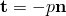
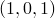
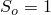
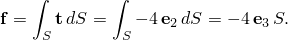
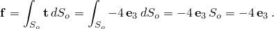

# 1.4.18 分布牵引和边缘载荷

**产品：**Abaqus/Standard  Abaqus/Explicit  

### 测试的功能

本节提供了使用分布单元载荷和表面载荷对牵引载荷标签TRVEC和TRSHR以及边缘载荷标签EDLD、EDNOR、EDSHR和EDTRA进行的基本验证测试。

### I. 分布剪切和一般牵引载荷

### 测试的单元

CPS3、CPE3、CPS4、CPE4、CPS6、CPE6、CPS6M、CPE6M、CPS8、CPE8、

CPEG3、CPEG4、CPEG6、CPEG6M、CPEG8、

CAX3、CAX4、CAX6、CAX6M、CAX8、

CGAX3、CGAX4、CGAX6、CGAX6M、CGAX8、

C3D4、C3D8R、C3D6、C3D10、C3D10M、C3D15、C3D20、C3D27、

CCL9、CCL12、CCL18、CCL24、

S3R、STRI3、S4R、S4R5、STRI65、S8R、S8R5、S9R5、

SC6R、SC8R、

SAX1、SAX2、RAX2、

M3D3、M3D4、M3D6、M3D8、M3D9、

MAX1、MAX2、MGAX1、MGAX2、

MCL6、MCL9、

SFMCL6、SFMCL9、

SFM3D3、SFM3D4、SFM3D6、SFM3D8、

SFMAX1、SFMAX2、SFMGAX1、SFMGAX2、

R2D2、R3D3、R3D4、RAX2、

### 问题描述

本节中的分析使用分布单元载荷和表面载荷测试牵引载荷标签TRVEC和TRSHR。执行单元和双单元测试以验证所有支持单元面上载荷选项。在Abaqus/Standard和Abaqus/Explicit测试中，当每个单元的每个面加载有分布一般牵引和剪切牵引组合时，单元通过运动耦合约束保持固定。输出运动参考节点处的合力，以验证分布载荷是否正确施加到每个单元。

### 结果与讨论

每个组合的结果表明载荷施加正确。

### 输入文件

##### **Abaqus/Standard输入文件**

[tracload2d.inp](../eif/tracload2d.inp)

二维单元的牵引载荷。

[tracloadcpeg.inp](../eif/tracloadcpeg.inp)

广义平面应变单元的牵引载荷。

[tracloadcax.inp](../eif/tracloadcax.inp)

轴对称单元的牵引载荷。

[tracloadcgax.inp](../eif/tracloadcgax.inp)

带扭曲的轴对称单元的牵引载荷。

[tracload3d.inp](../eif/tracload3d.inp)

三维单元的牵引载荷。

[tracloadccl.inp](../eif/tracloadccl.inp)

圆柱单元的牵引载荷。

[tracloadshl.inp](../eif/tracloadshl.inp)

壳单元的牵引载荷。

[tracloadsc.inp](../eif/tracloadsc.inp)

连续体壳单元的牵引载荷。

[tracloadrsax.inp](../eif/tracloadrsax.inp)

轴对称壳单元和轴对称刚性连接单元的牵引载荷。

[tracloadm3d.inp](../eif/tracloadm3d.inp)

三维膜和表面单元的牵引载荷。

[tracloadmax.inp](../eif/tracloadmax.inp)

轴对称膜单元的牵引载荷。

[tracloadmgax.inp](../eif/tracloadmgax.inp)

带扭曲的轴对称膜单元的牵引载荷。

[tracloadmcl.inp](../eif/tracloadmcl.inp)

圆柱膜单元的牵引载荷。

[tracloadsfmax.inp](../eif/tracloadsfmax.inp)

轴对称表面单元的牵引载荷。

[tracloadsfmgax.inp](../eif/tracloadsfmgax.inp)

带扭曲的轴对称表面单元的牵引载荷。

[tracloadr2d.inp](../eif/tracloadr2d.inp)

二维刚性单元的牵引载荷。

[tracloadr3d.inp](../eif/tracloadr3d.inp)

三维刚性单元的牵引载荷。

##### **Abaqus/Explicit输入文件**

[tracload2d_xpl.inp](../eif/tracload2d_xpl.inp)

二维单元的牵引载荷。

[tracloadcax_xpl.inp](../eif/tracloadcax_xpl.inp)

轴对称单元的牵引载荷。

[tracload3d_xpl.inp](../eif/tracload3d_xpl.inp)

三维单元的牵引载荷。

[tracloadshl_xpl.inp](../eif/tracloadshl_xpl.inp)

壳、膜和表面单元的牵引载荷。

[tracloadsc_xpl.inp](../eif/tracloadsc_xpl.inp)

连续体壳单元的牵引载荷。

[tracloadrsax_xpl.inp](../eif/tracloadrsax_xpl.inp)

轴对称壳单元和轴对称刚性连接单元的牵引载荷。

[tracloadr2d2_xpl.inp](../eif/tracloadr2d2_xpl.inp)

二维刚性单元的牵引载荷。

### II. 分布边缘载荷

### 测试的单元

S3R、STRI3、S4R、S4R5、STRI65、S8R、S8R5、S9R5、

### 问题描述

本节中的分析使用分布单元载荷和表面载荷测试边缘载荷标签EDLD、EDNOR、EDSHR和EDTRA。执行单元和双单元测试以验证所有支持壳单元边缘上的载荷选项。在Abaqus/Standard和Abaqus/Explicit测试中，当每个单元的每个边缘加载有分布边缘载荷组合时，单元通过运动耦合约束保持固定。输出运动参考节点处的合力，以验证分布载荷是否正确施加到每个单元。

### 结果与讨论

每个组合的结果表明载荷施加正确。

### 输入文件

##### **Abaqus/Standard输入文件**

[tracloadedge.inp](../eif/tracloadedge.inp)

壳单元的边缘载荷。

##### **Abaqus/Explicit输入文件**

[tracloadedge_xpl.inp](../eif/tracloadedge_xpl.inp)

壳单元的边缘载荷。

### III. 几何非线性分析中的分布剪切和一般牵引载荷

### 测试的单元

CPS3、CPE3、CPS4、CPE4、CPS6、CPE6、CPS6M、CPE6M、CPS8、CPE8、

C3D4、C3D8R、C3D6、C3D10、C3D10M、C3D15、C3D20、

CCL9、CCL12、CCL18、CCL24、

S3R、STRI3、S4R、S4R5、STRI65、S8R、S8R5、S9R5、

SC6R、SC8R、

SAX1、SAX2、

### 问题描述

本节中的分析使用几何非线性分析中的分布单元载荷和表面载荷测试牵引载荷标签TRVEC和TRSHR。测试包括大刚体旋转和大变形下的模型。在单元经历大刚体旋转的测试中，一个面耦合到运动耦合参考节点。牵引载荷施加到另一个面。当单元通过运动耦合参考节点旋转时，此载荷保持恒定。运动参考节点处的反作用力用于验证载荷是否正确施加并随单元旋转。还使用了跟随和非跟随表面载荷以及恒定合力的不同组合。测试中的一些模型具有圆柱几何形状。通过定义局部圆柱坐标系在圆柱表面上施加一般牵引或剪切载荷。

### 结果与讨论

每个组合的结果表明载荷施加正确。

### 输入文件

##### **Abaqus/Standard输入文件**

[traclarge_rotation_2d.inp](../eif/traclarge_rotation_2d.inp)

二维单元的牵引载荷。

[traclarge_rotation_3d.inp](../eif/traclarge_rotation_3d.inp)

三维单元的牵引载荷。

[traclarge_rotation_3d_usub.inp](../eif/traclarge_rotation_3d_usub.inp)

三维单元的用户定义牵引载荷。

[traclarge_rotation_3d_usub.f](../eif/traclarge_rotation_3d_usub.f)

用于traclarge_rotation_3d_usub.inp的用户子程序。

[traclarge_rotation_shl.inp](../eif/traclarge_rotation_shl.inp)

三维壳单元的牵引载荷。

[traclarge_rotation_m3d.inp](../eif/traclarge_rotation_m3d.inp)

三维膜单元的牵引载荷。

[tracnlgeom_ccl9.inp](../eif/tracnlgeom_ccl9.inp)

9节点圆柱单元CCL9的牵引载荷。

[tracnlgeom_ccl12.inp](../eif/tracnlgeom_ccl12.inp)

12节点圆柱单元CCL12的牵引载荷。

[tracnlgeom_ccl12_usub.inp](../eif/tracnlgeom_ccl12_usub.inp)

12节点圆柱单元CCL12的用户定义牵引载荷。

[tracnlgeom_ccl12_usub.f](../eif/tracnlgeom_ccl12_usub.f)

用于tracnlgeom_ccl12_usub.inp的用户子程序。

[tracnlgeom_ccl18.inp](../eif/tracnlgeom_ccl18.inp)

18节点圆柱单元CCL18的牵引载荷。

[tracnlgeom_ccl24.inp](../eif/tracnlgeom_ccl24.inp)

24节点圆柱单元CCL24的牵引载荷。

[tracnlgeom_sax.inp](../eif/tracnlgeom_sax.inp)

轴对称壳单元的牵引载荷。

[trac_cylori.inp](../eif/trac_cylori.inp)

三维圆柱体的牵引载荷。

##### **Abaqus/Explicit输入文件**

[traclarge_rotation_2d_xpl.inp](../eif/traclarge_rotation_2d_xpl.inp)

二维单元的牵引载荷。

[trac_cylori_xpl.inp](../eif/trac_cylori_xpl.inp)

三维圆柱体的牵引载荷。

### IV. 几何非线性分析中的分布边缘载荷

### 测试的单元

S3R、STRI3、S4R、S4R5、STRI65、S8R、S8R5、S9R5、

### 问题描述

本节中的分析使用几何非线性分析中的分布单元载荷和表面载荷测试边缘载荷标签EDLD、EDNOR、EDSHR和EDTRA。一个面耦合到运动耦合参考节点。牵引载荷施加到另一个面。当单元通过运动耦合参考节点旋转时，此载荷保持恒定。运动参考节点处的反作用力用于验证载荷是否正确施加并随单元旋转。还使用了跟随和非跟随表面载荷以及恒定合力的不同组合。

### 结果与讨论

每个组合的结果表明载荷施加正确。

### 输入文件

##### **Abaqus/Standard输入文件**

[tracedgelarge_rotation.inp](../eif/tracedgelarge_rotation.inp)

壳单元的边缘载荷。

[tracnlgeom_edge_usub.inp](../eif/tracnlgeom_edge_usub.inp)

壳单元的用户定义边缘载荷。

[tracnlgeom_edge_usub.f](../eif/tracnlgeom_edge_usub.f)

用于tracnlgeom_edge_usub.inp的用户子程序。

##### **Abaqus/Explicit输入文件**

[traclarge_rotation_edge_xpl.inp](../eif/traclarge_rotation_edge_xpl.inp)

壳单元的边缘载荷。

### V. 使用恒定合力的膜结构静载荷分析

### 测试的单元

M3D4、

### 问题描述

本节提供了在静载荷分析中使用恒定合力的基本验证。当使用牵引来模拟具有已知恒定合力的分布载荷时，恒定合力方法具有某些优点。

如果选择不具有恒定合力，则牵引矢量在当前配置中的表面上进行积分，该表面在几何非线性分析中通常会变形。需要在当前配置中进行积分的牵引的最常见例子是定义为  的活动压力载荷，其中  是当前配置中的法线。压力载荷产生的总合力取决于当前配置中的表面积。在当前表面上积分的活动均匀法向表面牵引等效于施加均匀压力载荷。默认情况下，牵引矢量在当前配置中的表面上进行积分。

如果选择具有恒定合力，则牵引矢量在参考配置中的表面上进行积分，该表面是恒定的。

本节中的分析由一个单元平面膜结构组成，通过运动耦合约束在边缘处固定。平结构的法线方向为 。在负  方向施加均匀静牵引载荷（幅值为4）。这可以被视为带雪载荷的斜坡屋顶的简单模型。

设  和 *S* 分别表示参考和当前配置中板的总表面积。在没有恒定合力的情况下，板上总的积分载荷  为

在这种情况下，均匀牵引导致合力载荷随板的表面积增加而增加，这与固定雪载荷不一致。使用恒定合力方法，板上总的积分载荷为

在第一个步骤中，施加不带恒定合力的载荷。在第二个步骤中，结构卸载。在第三个步骤中，施加带恒定合力的载荷。

### 结果与讨论

第一个步骤结束时运动耦合参考节点处反作用力的大小为4.59。反作用力大于4.0反映了膜的表面积随载荷增加的事实。第三个步骤结束时运动耦合参考节点处反作用力的大小为4.0，符合预期。

### 输入文件

##### **Abaqus/Standard输入文件**

[tracresultant_m3d4.inp](../eif/tracresultant_m3d4.inp)

测试CONSTANT RESULTANT参数。

[tracresultant_m3d4_usub.inp](../eif/tracresultant_m3d4_usub.inp)

使用CONSTANT RESULTANT参数的用户定义牵引载荷。

[tracresultant_m3d4_usub.f](../eif/tracresultant_m3d4_usub.f)

用于tracresultant_m3d4_usub.inp的用户子程序。

##### **Abaqus/Explicit输入文件**

[tracresultant_m3d4_xpl.inp](../eif/tracresultant_m3d4_xpl.inp)

测试CONSTANT RESULTANT参数。

