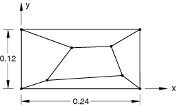
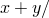
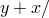
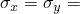
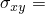
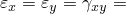
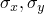
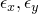

# 1.5.1 Membrane patch test

**Products: **Abaqus/Standard  Abaqus/Explicit  

### Elements tested

CPE3    CPE3H    CPE3T    CPE4    CPE4H    CPE4I    CPE4IH    CPE4R    CPE4RH    CPE4RHT    CPE4RT    

CPE6    CPE6H    CPE6M    CPE6MH    CPE6MHT    CPE6MT    CPE8    CPE8H    CPE8R    CPE8RH    

CPEG3    CPEG3H    CPEG4    CPEG4H    CPEG4I    CPEG4IH    CPEG4R    CPEG4RH    

CPEG6    CPEG6H    CPEG6M    CPEG6MH    CPEG8    CPEG8H    CPEG8R    CPEG8RH    

CPS3    CPS3T    CPS4    CPS4I    CPS4R    CPS4RT    CPS6    CPS6M    CPS6MT    CPS8    CPS8R    

M3D3    M3D4    M3D4R    M3D6    M3D8    M3D8R    M3D9    M3D9R    

S3    S3R    S4    S4R    S4R5    S8R    S8R5    S9R5    STRI3    STRI65    

### Problem description

**Model: **

Thickness, *t*=0.001.

**Material: **

Linear elastic, Young's modulus = 1.0  106, Poisson's ratio = 0.25.

For the coupled temperature-displacement elements dummy thermal properties are prescribed to complete the material definition.

**Loading/boundary conditions for Step 1: **

 103((2),  103(2) at all exterior nodes. For shell elements,  0 at all nodes.

In the Abaqus/Explicit simulations this step is followed by an intermediate step in which the model is returned to its unloaded state.

**Loading/boundary conditions for Step 2: **

Rigid body motion is constrained. Uniform edge pressure = 10000.

**Loading/boundary conditions for Step 3: **

 103(2),  103(2) at all exterior nodes, where *x* and *y* are the nodal coordinates of the undeformed geometry. For shell elements  0 at all nodes.

In the Abaqus/Standard simulations this step is defined as a perturbation step; in the Abaqus/Explicit simulations a velocity boundary condition that gives rise to the perturbation is specified instead.

### Reference solution

The analytical results for each step are presented below.

#### Step 1: PERTURBATION

-  1333 for plane stress, shell, and membrane elements.
-  1600 for plane strain elements.
-  800 for plane strain elements.
-  400 for all elements.
-  103.

#### Step 2: NLGEOM

| Element | Strain | Edge |  |  |
| --- | --- | --- | --- | --- |
| Category | Measure | Thickness |  | (103) |
| Plane strain | Log | Original | 10000 | 6.25 |
| Plane stress | Log | New | 10153 | 7.62 |
| Membrane | Log | New | 10076 | 7.56 |
| Shell | Green's | Original | 9926 | 7.44 |
| F.S. Shells | Log | New | 10076 | 7.56 |

The hand-calculated solutions will differ because of the various assumptions made for each category of element. The assumptions made correspond to those that are implemented in Abaqus. The two that cause significant differences in the results of this step are the strain measure used and the elemental cross-sectional area used to calculate the edge load and output stresses.

The strain measure used for shells, for example, is Green's strain. This strain measure is intended for large displacements and rotations but small strains. The remainder of the elements, including finite-strain shells, use logarithmic strain, which is intended for large-strain analyses.

The use of nonlinear geometric effects implies that the nodal coordinates will change for each element. This, in turn, implies that the cross-sectional area of the elements will change. The change of length and width is taken into account for all elements. This is not the case for the thickness, however. The thickness of the plane strain elements, of course, is assumed to remain constant. The thickness is also assumed to remain constant for the shell elements, excluding finite-strain shells. The remainder of the elements take into account a change in thickness determined by assuming constant elemental volume. This change in thickness, combined with a change in length and width, results in a cross-sectional area that differs from the initial area. This result affects the output stress calculations, as well as the applied edge load.

Since the edge load is calculated as the pressure divided by the area, the edge load will vary because of the variation in the cross-sectional area. Edge loads are presently not available for shells and membranes. Equivalent concentrated nodal forces are applied to these elements in this step, and as a result the load remains constant.

In the Abaqus/Explicit simulations this is the third step. (The second step in the Abaqus/Explicit simulations returns the model to its unloaded state.)

#### Step 3: PERTURBATION

-  1323 for plane stress, shell, and membrane elements.
-  1590 for plane strain elements.
-  795 for plane strain elements.
-  397.0 for plane stress, shell, and membrane elements.
-  397.5 for plane strain elements.
-  9.92 103 for plane stress, shell, and membrane elements.
-  9.94 103 for plane strain elements. In the Abaqus/Explicit simulations this is the fourth step. The results from the third step in the Abaqus/Explicit simulations must be subtracted from the results of the fourth step to obtain the perturbation about the loaded state.

### Results and discussion

All elements yield exact solutions except for the three-dimensional shells (other than the finite-strain shells), which differ from the analytical solution by about 2%. These elements are recommended only for analyses with large displacements and/or large rotations and small strains. The finite-strain shells are recommended for analyses that experience large strains.

To obtain the exact solution, the patch tests of the CPEG3, CPEG4, and CPEG4I elements require a convergence tolerance that is tighter than the default. The necessary tolerance is set with the solution controls.

These tests also verify the specification of a nondefault thickness for plane stress elements and membrane elements. The strain energy, which is dependent on the element thickness, was calculated from the previously verified values of the stress and strain and successfully compared to the Abaqus variable ALLIE. This result indicates that the nondefault thickness is being used correctly.

Section output requests to the results (`.fil`) file and to the data (`.dat`) file are used in some of the input files with CPE3, CPE8H, and CPEG4RH elements to output accumulated quantities in different sections through the model.

### Input files

##### **Abaqus/Standard input files**

[ece3sfp1.inp](../eif/ece3sfp1.inp)

CPE3 elements.

[ece3shp1.inp](../eif/ece3shp1.inp)

CPE3H elements.

[ece4sfp1.inp](../eif/ece4sfp1.inp)

CPE4 elements.

[ece4shp1.inp](../eif/ece4shp1.inp)

CPE4H elements.

[ece4sip1.inp](../eif/ece4sip1.inp)

CPE4I elements.

[ece4sjp1.inp](../eif/ece4sjp1.inp)

CPE4IH elements.

[ece4srp1.inp](../eif/ece4srp1.inp)

CPE4R elements.

[ece4syp1.inp](../eif/ece4syp1.inp)

CPE4RH elements.

[ece4typ1.inp](../eif/ece4typ1.inp)

CPE4RHT elements.

[ece4trp1.inp](../eif/ece4trp1.inp)

CPE4RT elements.

[ece6sfp1.inp](../eif/ece6sfp1.inp)

CPE6 elements.

[ece6shp1.inp](../eif/ece6shp1.inp)

CPE6H elements.

[ece6skp1.inp](../eif/ece6skp1.inp)

CPE6M elements.

[ece6slp1.inp](../eif/ece6slp1.inp)

CPE6MH elements.

[ece6tlp1.inp](../eif/ece6tlp1.inp)

CPE6MHT elements.

[ece6tkp1.inp](../eif/ece6tkp1.inp)

CPE6MT elements.

[ece8sfp1.inp](../eif/ece8sfp1.inp)

CPE8 elements.

[ece8shp1.inp](../eif/ece8shp1.inp)

CPE8H elements.

[ece8srp1.inp](../eif/ece8srp1.inp)

CPE8R elements.

[ece8syp1.inp](../eif/ece8syp1.inp)

CPE8RH elements.

[ecg3sfp1.inp](../eif/ecg3sfp1.inp)

CPEG3 elements.

[ecg3shp1.inp](../eif/ecg3shp1.inp)

CPEG3H elements.

[ecg4sfp1.inp](../eif/ecg4sfp1.inp)

CPEG4 elements.

[ecg4shp1.inp](../eif/ecg4shp1.inp)

CPEG4H elements.

[ecg4sip1.inp](../eif/ecg4sip1.inp)

CPEG4I elements.

[ecg4sjp1.inp](../eif/ecg4sjp1.inp)

CPEG4IH elements.

[ecg4srp1.inp](../eif/ecg4srp1.inp)

CPEG4R elements.

[ecg4syp1.inp](../eif/ecg4syp1.inp)

CPEG4RH elements.

[ecg6sfp1.inp](../eif/ecg6sfp1.inp)

CPEG6 elements.

[ecg6shp1.inp](../eif/ecg6shp1.inp)

CPEG6H elements.

[ecg6skp1.inp](../eif/ecg6skp1.inp)

CPEG6M elements.

[ecg6slp1.inp](../eif/ecg6slp1.inp)

CPEG6MH elements.

[ecg8sfp1.inp](../eif/ecg8sfp1.inp)

CPEG8 elements.

[ecg8shp1.inp](../eif/ecg8shp1.inp)

CPEG8H elements.

[ecg8srp1.inp](../eif/ecg8srp1.inp)

CPEG8R elements.

[ecg8syp1.inp](../eif/ecg8syp1.inp)

CPEG8RH elements.

[ecs3sfp1.inp](../eif/ecs3sfp1.inp)

CPS3 elements.

[ecs4sfp1.inp](../eif/ecs4sfp1.inp)

CPS4 elements.

[ecs4sfp1.f](../eif/ecs4sfp1.f)

User subroutine [`DLOAD`](../sub/sub-link.md#sub-xsl-dload) used in ecs4sfp1.inp.

[ecs4sip1.inp](../eif/ecs4sip1.inp)

CPS4I elements.

[ecs4srp1.inp](../eif/ecs4srp1.inp)

CPS4R elements.

[ecs6sfp1.inp](../eif/ecs6sfp1.inp)

CPS6 elements.

[ecs6skp1.inp](../eif/ecs6skp1.inp)

CPS6M elements.

[ecs8sfp1.inp](../eif/ecs8sfp1.inp)

CPS8 elements.

[ecs8srp1.inp](../eif/ecs8srp1.inp)

CPS8R elements.

[em33sfp1.inp](../eif/em33sfp1.inp)

M3D3 elements.

[em34sfp1.inp](../eif/em34sfp1.inp)

M3D4 elements.

[em34srp1.inp](../eif/em34srp1.inp)

M3D4R elements.

[em36sfp1.inp](../eif/em36sfp1.inp)

M3D6 elements.

[em38sfp1.inp](../eif/em38sfp1.inp)

M3D8 elements.

[em38srp1.inp](../eif/em38srp1.inp)

M3D8R elements.

[em39sfp1.inp](../eif/em39sfp1.inp)

M3D9 elements.

[em39srp1.inp](../eif/em39srp1.inp)

M3D9R elements.

[esf3sxp1.inp](../eif/esf3sxp1.inp)

S3/S3R elements.

[ese4sxp1.inp](../eif/ese4sxp1.inp)

S4 elements.

[esf4sxp1.inp](../eif/esf4sxp1.inp)

S4R elements.

[es54sxp1.inp](../eif/es54sxp1.inp)

S4R5 elements.

[es68sxp1.inp](../eif/es68sxp1.inp)

S8R elements.

[es58sxp1.inp](../eif/es58sxp1.inp)

S8R5 elements.

[es59sxp1.inp](../eif/es59sxp1.inp)

S9R5 elements.

[es63sxp1.inp](../eif/es63sxp1.inp)

STRI3 elements.

[es56sxp1.inp](../eif/es56sxp1.inp)

STRI65 elements.

##### **Abaqus/Explicit input files**

[stresspatch_xpl_cpe3t.inp](../eif/stresspatch_xpl_cpe3t.inp)

CPE3T elements.

[stresspatch_xpl_cpe4rt.inp](../eif/stresspatch_xpl_cpe4rt.inp)

CPE4RT elements.

[stresspatch_xpl_cpe6mt.inp](../eif/stresspatch_xpl_cpe6mt.inp)

CPE6MT elements.

[stresspatch_xpl_cps3t.inp](../eif/stresspatch_xpl_cps3t.inp)

CPS3T elements.

[stresspatch_xpl_cps4rt.inp](../eif/stresspatch_xpl_cps4rt.inp)

CPS4RT elements.

[stresspatch_xpl_cps6mt.inp](../eif/stresspatch_xpl_cps6mt.inp)

CPS6MT elements.

