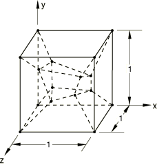
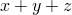
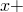
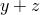
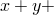
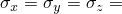
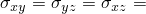
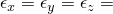
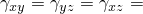

# 1.5.2 Patch test for three-dimensional solid elements

**Products: **Abaqus/Standard  Abaqus/Explicit  

### Elements tested

C3D4    C3D4H    C3D4T    C3D6    C3D6H    C3D6T    

C3D8    C3D8H    C3D8I    C3D8IH    C3D8R    C3D8RH    C3D8RT    C3D8T    

C3D10    C3D10H    C3D10I    C3D10M    C3D10MH    C3D10MHT    C3D10MT    

C3D15    C3D15H    C3D15V    C3D15VH    

C3D20    C3D20H    C3D20R    C3D20RH    C3D27    C3D27H    C3D27R    C3D27RH    

### Problem description

**Material: **

Linear elastic, Young's modulus = 1.0  106, Poisson's ratio = 0.25.

For coupled temperature-displacement elements dummy thermal properties are prescribed to complete the material definition.

**Loading for Step 1: **

Displacement boundary conditions at all exterior nodes:  103(2)/2, 103( 2)/2,  103( 2*z*)/2.

In the Abaqus/Explicit simulations this step is followed by an intermediate step in which the model is returned to its unloaded state.

**Loading for Step 2: **

Uniform pressure load: 10000. (Rigid body motion is constrained.)

**Loading for Step 3: **

Displacement boundary conditions at all exterior nodes:  103(2)/2, 103( 2)/2,  103( 2*z*)/2, where *x*, *y*, and *z* are the coordinates of the undeformed geometry.

In the Abaqus/Standard simulations this step is defined as a perturbation step; in the Abaqus/Explicit simulations a velocity boundary condition that gives rise to the perturbation is specified instead.

### Reference solution

The analytical results for each step are presented below.

#### Step 1: PERTURBATION

-  2000.
-  400.
-  103.
-  103.

#### Step 2: NLGEOM

-  10000.
-  0.
-  5.0 103.
-  0.

In the Abaqus/Explicit simulations this is the third step. (The second step in the Abaqus/Explicit simulations returns the model to its unloaded state.)

#### Step 3: PERTURBATION

-  1990.
-  398.0.
-  9.95 104.
-  9.95 104. In the Abaqus/Explicit simulations this is the fourth step. The results from the third step in the Abaqus/Explicit simulations must be subtracted from the results of the fourth step to obtain the perturbation about the loaded state.

### Results and discussion

All elements except C3D27R and C3D27RH yield exact solutions. These elements use a special 14-point reduced-integration scheme since Gaussian 2  2  2 integration leaves too many kinematic nodes. The stiffness matrix is not integrated exactly with the employed integration rule, leading to small discrepancies in the results. The wedge elements and the quadratic reduced-integration brick elements pass only a restricted patch test; i.e., such elements with midside nodes on any edges will pass the patch test only if those edges are straight.

Section output requests to the results (`.fil`) file and to the data (`.dat`) file are used in the input files with C3D8H, C3D10MH, and C3D27RH elements to output accumulated quantities in different sections through the model.

### Input files

##### **Abaqus/Standard input files**

[ec34sfp2.inp](../eif/ec34sfp2.inp)

C3D4 elements.

[ec34shp2.inp](../eif/ec34shp2.inp)

C3D4H elements.

[ec36sfp2.inp](../eif/ec36sfp2.inp)

C3D6 elements.

[ec36shp2.inp](../eif/ec36shp2.inp)

C3D6H elements.

[ec38sfp2.inp](../eif/ec38sfp2.inp)

C3D8 elements.

[ec38shp2.inp](../eif/ec38shp2.inp)

C3D8H elements.

[ec38sip2.inp](../eif/ec38sip2.inp)

C3D8I elements.

[ec38sjp2.inp](../eif/ec38sjp2.inp)

C3D8IH elements.

[ec38srp2.inp](../eif/ec38srp2.inp)

C3D8R elements.

[ec38syp2.inp](../eif/ec38syp2.inp)

C3D8RH elements.

[ec3asfp2.inp](../eif/ec3asfp2.inp)

C3D10 elements.

[ec3ashp2.inp](../eif/ec3ashp2.inp)

C3D10H elements.

[ec3asip2.inp](../eif/ec3asip2.inp)

C3D10I elements.

[ec3askp2.inp](../eif/ec3askp2.inp)

C3D10M elements.

[ec3aslp2.inp](../eif/ec3aslp2.inp)

C3D10MH elements.

[ec3atlp2.inp](../eif/ec3atlp2.inp)

C3D10MHT elements.

[ec3atkp2.inp](../eif/ec3atkp2.inp)

C3D10MT elements.

[ec3fsfp2.inp](../eif/ec3fsfp2.inp)

C3D15 elements.

[ec3fshp2.inp](../eif/ec3fshp2.inp)

C3D15H elements.

[ec3isfp2.inp](../eif/ec3isfp2.inp)

C3D15V elements.

[ec3ishp2.inp](../eif/ec3ishp2.inp)

C3D15VH elements.

[ec3ksfp2.inp](../eif/ec3ksfp2.inp)

C3D20 elements.

[ec3kshp2.inp](../eif/ec3kshp2.inp)

C3D20H elements.

[ec3ksrp2.inp](../eif/ec3ksrp2.inp)

C3D20R elements.

[ec3ksyp2.inp](../eif/ec3ksyp2.inp)

C3D20RH elements.

[ec3rsfp2.inp](../eif/ec3rsfp2.inp)

C3D27 elements.

[ec3rshp2.inp](../eif/ec3rshp2.inp)

C3D27H elements.

[ec3rsrp2.inp](../eif/ec3rsrp2.inp)

C3D27R elements.

[ec3rsyp2.inp](../eif/ec3rsyp2.inp)

C3D27RH elements.

##### **Abaqus/Explicit input files**

[stresspatch_xpl_c3d4t.inp](../eif/stresspatch_xpl_c3d4t.inp)

C3D4T elements.

[stresspatch_xpl_c3d6t.inp](../eif/stresspatch_xpl_c3d6t.inp)

C3D6T elements.

[stresspatch_xpl_c3d8rt.inp](../eif/stresspatch_xpl_c3d8rt.inp)

C3D8RT elements.

[stresspatch_xpl_c3d8t.inp](../eif/stresspatch_xpl_c3d8t.inp)

C3D8T elements.

