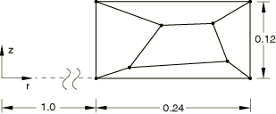
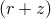
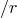
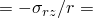
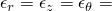

# 1.5.4 轴对称单元片测试

**产品：**Abaqus/Standard  Abaqus/Explicit  

### 测试的单元

CAX3    CAX3H    CAX3T    CAX4    CAX4H    CAX4I    CAX4IH    CAX4R    CAX4RH    CAX4RHT    CAX4RT  

CAX6    CAX6H    CAX6M    CAX6MH    CAX8    CAX8H    CAX8R    CAX8RH  

### 问题描述

**材料：**

线弹性，杨氏模量 = 1.0×10^6，泊松比 = 0.25。

对于耦合温度-位移单元，指定虚拟热特性以完成材料定义。

**步骤1的载荷：**

施加于所有外节点处的位移边界条件： ×10^3×*r*， ×10^3×。

非均匀体积力：为了保持恒定剪应力 = 400并维持平衡，在用户子程序[`DLOAD`](../sub/sub-link.md#sub-xsl-dload)中定义平衡体积力BZNU为BZNU =  ×400×，其中*r*是积分点半径。

在Abaqus/Explicit模拟中，此步骤之后是一个中间步骤，将模型返回到无载荷状态。

**步骤2的载荷：**

施加于所有外节点处的位移边界条件： ×10^2×*r*， ×10^2×*z*。

**步骤3的载荷：**

施加于步骤2变形状上所有外节点处的位移边界条件： ×10^3×*r*， ×10^3×。

非均匀体积力（与步骤1描述相同）：BZNU =  ×400×。

在Abaqus/Standard模拟中，此步骤定义为扰动步骤；在Abaqus/Explicit模拟中，则指定产生扰动的速度边界条件。

### 参考解

每个步骤的分析结果如下所示。

#### 步骤1：PERTURBATION（扰动）

-  = 2000。
-  = 400。
-  = 10^3。
-  = 10^3。

#### 步骤2：NLGEOM（非线性几何）

-  = 19900。
-  = 0。
-  = 9.95×10^3。
-  = 0。

在Abaqus/Explicit模拟中，这是第三个步骤。（Abaqus/Explicit模拟中的第二个步骤将模型返回到无载荷状态。）

#### 步骤3：PERTURBATION（扰动）

-  = 2000。
-  = 400。
-  = 1×10^3。
-  = 1×10^3。

在Abaqus/Explicit模拟中，这是第四个步骤。必须从第四个步骤的结果中减去第三个步骤的结果，以获得关于加载状态的扰动。

### 结果与讨论

所有单元都产生精确解。

### 输入文件

##### **Abaqus/Standard输入文件**

[eca3sfp5.inp](../eif/eca3sfp5.inp)

CAX3单元。

[eca3sfp5.f](../eif/eca3sfp5.f)

在eca3sfp5.inp中使用的用户子程序[`DLOAD`](../sub/sub-link.md#sub-xsl-dload)。

[eca3shp5.inp](../eif/eca3shp5.inp)

CAX3H单元。

[eca3shp5.f](../eif/eca3shp5.f)

在eca3shp5.inp中使用的用户子程序[`DLOAD`](../sub/sub-link.md#sub-xsl-dload)。

[eca4sfp5.inp](../eif/eca4sfp5.inp)

CAX4单元。

[eca4sfp5.f](../eif/eca4sfp5.f)

在eca4sfp5.inp中使用的用户子程序[`DLOAD`](../sub/sub-link.md#sub-xsl-dload)。

[eca4shp5.inp](../eif/eca4shp5.inp)

CAX4H单元。

[eca4shp5.f](../eif/eca4shp5.f)

在eca4shp5.inp中使用的用户子程序[`DLOAD`](../sub/sub-link.md#sub-xsl-dload)。

[eca4sip5.inp](../eif/eca4sip5.inp)

CAX4I单元。

[eca4sip5.f](../eif/eca4sip5.f)

在eca4sip5.inp中使用的用户子程序[`DLOAD`](../sub/sub-link.md#sub-xsl-dload)。

[eca4sjp5.inp](../eif/eca4sjp5.inp)

CAX4IH单元。

[eca4sjp5.f](../eif/eca4sjp5.f)

在eca4sjp5.inp中使用的用户子程序[`DLOAD`](../sub/sub-link.md#sub-xsl-dload)。

[eca4srp5.inp](../eif/eca4srp5.inp)

CAX4R单元。

[eca4srp5.f](../eif/eca4srp5.f)

在eca4srp5.inp中使用的用户子程序[`DLOAD`](../sub/sub-link.md#sub-xsl-dload)。

[eca4syp5.inp](../eif/eca4syp5.inp)

CAX4RH单元。

[eca4syp5.f](../eif/eca4syp5.f)

在eca4syp5.inp中使用的用户子程序[`DLOAD`](../sub/sub-link.md#sub-xsl-dload)。

[eca4typ5.inp](../eif/eca4typ5.inp)

CAX4RHT单元。

[eca4typ5.f](../eif/eca4typ5.f)

在eca4typ5.inp中使用的用户子程序[`DLOAD`](../sub/sub-link.md#sub-xsl-dload)。

[eca4trp5.inp](../eif/eca4trp5.inp)

CAX4RT单元。

[eca4trp5.f](../eif/eca4trp5.f)

在eca4trp5.inp中使用的用户子程序[`DLOAD`](../sub/sub-link.md#sub-xsl-dload)。

[eca6sfp5.inp](../eif/eca6sfp5.inp)

CAX6单元。

[eca6sfp5.f](../eif/eca6sfp5.f)

在eca6sfp5.inp中使用的用户子程序[`DLOAD`](../sub/sub-link.md#sub-xsl-dload)。

[eca6shp5.inp](../eif/eca6shp5.inp)

CAX6H单元。

[eca6shp5.f](../eif/eca6shp5.f)

在eca6shp5.inp中使用的用户子程序[`DLOAD`](../sub/sub-link.md#sub-xsl-dload)。

[eca6skp5.inp](../eif/eca6skp5.inp)

CAX6M单元。

[eca6skp5.f](../eif/eca6skp5.f)

在eca6skp5.inp中使用的用户子程序[`DLOAD`](../sub/sub-link.md#sub-xsl-dload)。

[eca6slp5.inp](../eif/eca6slp5.inp)

CAX6MH单元。

[eca6slp5.f](../eif/eca6slp5.f)

在eca6slp5.inp中使用的用户子程序[`DLOAD`](../sub/sub-link.md#sub-xsl-dload)。

[eca8sfp5.inp](../eif/eca8sfp5.inp)

CAX8单元。

[eca8sfp5.f](../eif/eca8sfp5.f)

在eca8sfp5.inp中使用的用户子程序[`DLOAD`](../sub/sub-link.md#sub-xsl-dload)。

[eca8shp5.inp](../eif/eca8shp5.inp)

CAX8H单元。

[eca8shp5.f](../eif/eca8shp5.f)

在eca8shp5.inp中使用的用户子程序[`DLOAD`](../sub/sub-link.md#sub-xsl-dload)。

[eca8srp5.inp](../eif/eca8srp5.inp)

CAX8R单元。

[eca8srp5.f](../eif/eca8srp5.f)

在eca8srp5.inp中使用的用户子程序[`DLOAD`](../sub/sub-link.md#sub-xsl-dload)。

[eca8syp5.inp](../eif/eca8syp5.inp)

CAX8RH单元。

[eca8syp5.f](../eif/eca8syp5.f)

在eca8syp5.inp中使用的用户子程序[`DLOAD`](../sub/sub-link.md#sub-xsl-dload)。

##### **Abaqus/Explicit输入文件**

[stresspatch_xpl_cax3t.inp](../eif/stresspatch_xpl_cax3t.inp)

CAX3T单元。

[stresspatch_xpl_cax4rt.inp](../eif/stresspatch_xpl_cax4rt.inp)

CAX4RT单元。

[stresspatch_xpl_cax.f](../eif/stresspatch_xpl_cax.f)

用于Abaqus/Explicit模拟的用户子程序[`VDLOAD`](../sub/sub-link.md#sub-xsl-vdload)。

