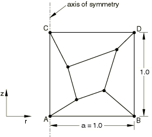
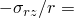
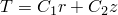
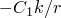
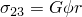
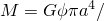
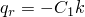
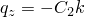

# 1.5.5 Patch test for axisymmetric elements with twist

**Product: **Abaqus/Standard  

### Elements tested

CGAX3    CGAX3H    CGAX3HT    CGAX3T    CGAX4    CGAX4H    CGAX4HT    CGAX4R    CGAX4RH    CGAX4T    CGAX6    CGAX6H    CGAX6M    CGAX6MH    CGAX8    CGAX8H    CGAX8HT    CGAX8R    CGAX8RH    CGAX8RHT    CGAX8RT    CGAX8T    

### Problem description

**Material: **

Linear elastic, Young's modulus = 1.0  106, Poisson's ratio = 0.25, conductivity = 4.85  104.

**Loading for Step 1: **

A twist of 0.01 per unit length applied to face CD.

 1.0  102.

**Loading for Step 2: **

Displacement boundary conditions applied to all exterior nodes:  103*r*,  103,  0.

Nonuniform body force: To maintain a constant shear stress  400 and preserve equilibrium, an equilibrating body force, BZNU, is defined in user subroutine [`DLOAD`](../sub/sub-link.md#sub-xsl-dload) as BZNU =  400, where *r* is the radius of the integration point.

**Loading for Step 3: **

Displacement boundary conditions applied to all exterior nodes:  102*r*,  102*z*,  0.

**Loading for Step 4: **

Displacement boundary conditions applied to the deformed geometry of Step 2 at all exterior nodes: 103*r*,  103,  0.

Nonuniform body force (as described for Step 2): BZNU =  400.

**Loading for Step 5: **

The displacement boundary conditions are the same as those applied in Step 3.

Temperatures are prescribed at every node along the boundary of the mesh. , where *T* is the temperature,  and  are arbitrary constants, and *r*, *z* denote spatial location.

Nonuniform distributed flux: To maintain a uniform heat flux, *q*, a distributed heat flux, BFNU, is defined in user subroutine [`DFLUX`](../sub/sub-link.md#sub-xsl-dflux) as BFNU = , where *r* is the radius of the integration point and *k* is the conductivity.

### Reference solution

The analytical results for each step are presented below.

#### Step 1: perturbation

Shear stress, , where *r* is the radial distance from the axis of symmetry and *G* is the shear modulus.

Resultant moment, 2 = 6283.2.

#### Step 2: perturbation

-  2000.
-  400.
-  103.
-  103.

#### Step 3: geometrically nonlinear

-  19900.
-  0.
-  9.95 103.
-  0.

#### Step 4: perturbation

-  2000.
-  400.
-  1 103.
-  1 103.

#### Step 5: fully coupled thermal-stress

This step is applied only in tests of coupled temperature-displacement elements (CGAX*x*T).

Stresses and strains are the same as in Step 3. ; .

### Results and discussion

The results agree well with the analytical solution for all elements.

Section output requests to the results (`.fil`) file and to the data (`.dat`) file are used in the input files with CGAX8RH elements to output accumulated quantities in different sections through the model.

### Input files

[eca3gfp5.inp](../eif/eca3gfp5.inp)

CGAX3 elements.

[eca3gfp5.f](../eif/eca3gfp5.f)

User subroutine [`DLOAD`](../sub/sub-link.md#sub-xsl-dload) used in eca3gfp5.inp.

[eca3ghp5.inp](../eif/eca3ghp5.inp)

CGAX3H elements.

[eca3ghp5.f](../eif/eca3ghp5.f)

User subroutine [`DLOAD`](../sub/sub-link.md#sub-xsl-dload) used in eca3ghp5.inp.

[eca3hhp5.inp](../eif/eca3hhp5.inp)

CGAX3HT elements.

[eca3hhp5.f](../eif/eca3hhp5.f)

User subroutines [`DLOAD`](../sub/sub-link.md#sub-xsl-dload) and [`DFLUX`](../sub/sub-link.md#sub-xsl-dflux) used in eca3hhp5.inp.

[eca3hfp5.inp](../eif/eca3hfp5.inp)

CGAX3T elements.

[eca3hfp5.f](../eif/eca3hfp5.f)

User subroutines [`DLOAD`](../sub/sub-link.md#sub-xsl-dload) and [`DFLUX`](../sub/sub-link.md#sub-xsl-dflux) used in eca3hfp5.inp.

[eca4gfp5.inp](../eif/eca4gfp5.inp)

CGAX4 elements.

[eca4gfp5.f](../eif/eca4gfp5.f)

User subroutine [`DLOAD`](../sub/sub-link.md#sub-xsl-dload) used in eca4gfp5.inp.

[eca4ghp5.inp](../eif/eca4ghp5.inp)

CGAX4H elements.

[eca4ghp5.f](../eif/eca4ghp5.f)

User subroutine [`DLOAD`](../sub/sub-link.md#sub-xsl-dload) used in eca4ghp5.inp.

[eca4hhp5.inp](../eif/eca4hhp5.inp)

CGAX4HT elements.

[eca4hhp5.f](../eif/eca4hhp5.f)

User subroutines [`DLOAD`](../sub/sub-link.md#sub-xsl-dload) and [`DFLUX`](../sub/sub-link.md#sub-xsl-dflux) used in eca4hhp5.inp.

[eca4grp5.inp](../eif/eca4grp5.inp)

CGAX4R elements.

[eca4grp5.f](../eif/eca4grp5.f)

User subroutine [`DLOAD`](../sub/sub-link.md#sub-xsl-dload) used in eca4grp5.inp.

[eca4gyp5.inp](../eif/eca4gyp5.inp)

CGAX4RH elements.

[eca4gyp5.f](../eif/eca4gyp5.f)

User subroutine [`DLOAD`](../sub/sub-link.md#sub-xsl-dload) used in eca4gyp5.inp.

[eca4hfp5.inp](../eif/eca4hfp5.inp)

CGAX4T elements.

[eca4hfp5.f](../eif/eca4hfp5.f)

User subroutines [`DLOAD`](../sub/sub-link.md#sub-xsl-dload) and [`DFLUX`](../sub/sub-link.md#sub-xsl-dflux) used in eca4hfp5.inp.

[eca6gfp5.inp](../eif/eca6gfp5.inp)

CGAX6 elements.

[eca6gfp5.f](../eif/eca6gfp5.f)

User subroutine [`DLOAD`](../sub/sub-link.md#sub-xsl-dload) used in eca6gfp5.inp.

[eca6ghp5.inp](../eif/eca6ghp5.inp)

CGAX6H elements.

[eca6ghp5.f](../eif/eca6ghp5.f)

User subroutine [`DLOAD`](../sub/sub-link.md#sub-xsl-dload) used in eca6ghp5.inp.

[eca6gkp5.inp](../eif/eca6gkp5.inp)

CGAX6M elements.

[eca6gkp5.f](../eif/eca6gkp5.f)

User subroutine [`DLOAD`](../sub/sub-link.md#sub-xsl-dload) used in eca6gkp5.inp.

[eca6glp5.inp](../eif/eca6glp5.inp)

CGAX6MH elements.

[eca6glp5.f](../eif/eca6glp5.f)

User subroutine [`DLOAD`](../sub/sub-link.md#sub-xsl-dload) used in eca6glp5.inp.

[eca8gfp5.inp](../eif/eca8gfp5.inp)

CGAX8 elements.

[eca8gfp5.f](../eif/eca8gfp5.f)

User subroutine [`DLOAD`](../sub/sub-link.md#sub-xsl-dload) used in eca8gfp5.inp.

[eca8ghp5.inp](../eif/eca8ghp5.inp)

CGAX8H elements.

[eca8ghp5.f](../eif/eca8ghp5.f)

User subroutine [`DLOAD`](../sub/sub-link.md#sub-xsl-dload) used in eca8ghp5.inp.

[eca8hhp5.inp](../eif/eca8hhp5.inp)

CGAX8HT elements.

[eca8hhp5.f](../eif/eca8hhp5.f)

User subroutines [`DLOAD`](../sub/sub-link.md#sub-xsl-dload) and [`DFLUX`](../sub/sub-link.md#sub-xsl-dflux) used in eca8hhp5.inp.

[eca8grp5.inp](../eif/eca8grp5.inp)

CGAX8R elements.

[eca8grp5.f](../eif/eca8grp5.f)

User subroutine [`DLOAD`](../sub/sub-link.md#sub-xsl-dload) used in eca8grp5.inp.

[eca8gyp5.inp](../eif/eca8gyp5.inp)

CGAX8RH elements.

[eca8gyp5.f](../eif/eca8gyp5.f)

User subroutine [`DLOAD`](../sub/sub-link.md#sub-xsl-dload) used in eca8gyp5.inp.

[eca8hfp5.inp](../eif/eca8hfp5.inp)

CGAX8T elements.

[eca8hfp5.f](../eif/eca8hfp5.f)

User subroutines [`DLOAD`](../sub/sub-link.md#sub-xsl-dload) and [`DFLUX`](../sub/sub-link.md#sub-xsl-dflux) used in eca8hfp5.inp.

