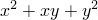
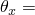
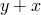
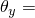
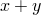
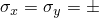
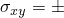

# 1.5.6 Patch test for plate bending

**Product: **Abaqus/Standard  

### Elements tested

S3    S3R    S4    S4R    S4R5    S8R    S8R5    S9R5    STRI3    STRI65    

### Problem description

**Model: **

Thickness, *t* = 0.001.

**Material: **

Linear elastic, Young's modulus = 1.0  106, Poisson's ratio = 0.25.

**Boundary conditions: **

(applied to all exterior nodes)

 0,  103()/2,  103(/2),  103(/2).

### Reference solution

Stress: 0.6667, 0.20.

### Results and discussion

All elements yield exact solutions except S8R. S8R will pass the patch test if the element shapes are rhombic, but they fail the test for general quadrilaterals.

### Input files

[esf3sxp3.inp](../eif/esf3sxp3.inp)

S3/S3R elements.

[ese4sxp3.inp](../eif/ese4sxp3.inp)

S4 elements.

[esf4sxp3.inp](../eif/esf4sxp3.inp)

S4R elements.

[es54sxp3.inp](../eif/es54sxp3.inp)

S4R5 elements.

[es68sxp3.inp](../eif/es68sxp3.inp)

S8R elements.

[es58sxp3.inp](../eif/es58sxp3.inp)

S8R5 elements.

[es59sxp3.inp](../eif/es59sxp3.inp)

S9R5 elements.

[es63sxp3.inp](../eif/es63sxp3.inp)

STRI3 elements.

[es56sxp3.inp](../eif/es56sxp3.inp)

STRI65 elements.

