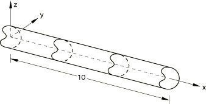
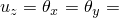
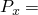
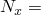
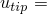

# 1.5.7 梁单元片测试

**产品：**Abaqus/Standard  Abaqus/Explicit  

### 测试的单元

B21    B21H    B22    B22H    B23    B23H    B31    B31H    B31OS    B31OSH  

B32    B32H    B32OS    B32OSH    B33    B33H  

PIPE21    PIPE21H    PIPE22    PIPE22H    PIPE31    PIPE31H    PIPE32    PIPE32H  

### 问题描述

**模型：**

面积，*A* = 0.01。

**材料：**

线弹性，杨氏模量 = 30.0×10^6，泊松比 = 0.3。

**步骤1的载荷和边界条件：**

 = 0.0（在 = 0处）， = 0.0（在 = 10处）；在端部节点施加位移边界条件： = 0.01 + 0.01×*x*。

**步骤2的载荷和边界条件：**

在 = 0处的节点固定；在 = 10处 = 0；在自由端施加集中载荷： = 3000。

**步骤3的载荷和边界条件：**

 = 0.0（在 = 0处）， = 0.0（在 = 10处）；在端部节点施加位移边界条件： = 0.01 + 0.01×*x*，其中*x*是未变形几何中坐标的值。

**Abaqus/Explicit的载荷和边界条件：**

在 = 0处的节点固定；在 = 10处 = 0；在自由端施加集中载荷： = 3000，使用平滑步骤幅值定义。计算时间1.0时的解，包括几何非线性。

### 参考解

每个步骤的分析结果如下所示。

#### 步骤1：PERTURBATION（扰动）

截面力：轴力 = 3000；端点位移： = 1.0×10^1。

#### 步骤2：NLGEOM（非线性几何）

截面力：轴力 = 3000；端点位移： = 1.005×10^1。

#### 步骤3：PERTURBATION（扰动）

截面力：轴力 = 2970；端点位移： = 9.90×10^2。

#### Abaqus/Explicit中的动力步骤：

截面力：轴力 = 3000；端点位移： = 1.005×10^1。

### 结果与讨论

除立方梁外的所有单元都产生精确解，对于NLGEOM步骤和后续扰动步骤，立方梁与分析解相差约2%。这些单元仅推荐用于线性分析。Abaqus/Explicit中管道单元的结果与Abaqus/Standard中的结果相同。

### 输入文件

[eb22rxp6.inp](../eif/eb22rxp6.inp)

B21单元。

[eb2hrxp6.inp](../eif/eb2hrxp6.inp)

B21H单元。

[eb23rxp6.inp](../eif/eb23rxp6.inp)

B22单元。

[eb2irxp6.inp](../eif/eb2irxp6.inp)

B22H单元。

[eb2arxp6.inp](../eif/eb2arxp6.inp)

B23单元。

[eb2jrxp6.inp](../eif/eb2jrxp6.inp)

B23H单元。

[eb32rxp6.inp](../eif/eb32rxp6.inp)

B31单元。

[eb3hrxp6.inp](../eif/eb3hrxp6.inp)

B31H单元。

[ebo2ixp6.inp](../eif/ebo2ixp6.inp)

B31OS单元。

[ebohixp6.inp](../eif/ebohixp6.inp)

B31OSH单元。

[eb33rxp6.inp](../eif/eb33rxp6.inp)

B32单元。

[eb3irxp6.inp](../eif/eb3irxp6.inp)

B32H单元。

[ebo3ixp6.inp](../eif/ebo3ixp6.inp)

B32OS单元。

[eboiixp6.inp](../eif/eboiixp6.inp)

B32OSH单元。

[eb3arxp6.inp](../eif/eb3arxp6.inp)

B33单元。

[eb3jrxp6.inp](../eif/eb3jrxp6.inp)

B33H单元。

[ep22pxp6.inp](../eif/ep22pxp6.inp)

PIPE21单元。

[ep2hpxp6.inp](../eif/ep2hpxp6.inp)

PIPE21H单元。

[ep23pxp6.inp](../eif/ep23pxp6.inp)

PIPE22单元。

[ep2ipxp6.inp](../eif/ep2ipxp6.inp)

PIPE22H单元。

[ep32pxp6.inp](../eif/ep32pxp6.inp)

PIPE31单元。

[ep3hpxp6.inp](../eif/ep3hpxp6.inp)

PIPE31H单元。

[ep33pxp6.inp](../eif/ep33pxp6.inp)

PIPE32单元。

[ep3ipxp6.inp](../eif/ep3ipxp6.inp)

PIPE32H单元。

[ebmod1p6.inp](../eif/ebmod1p6.inp)

用于存储此问题输入文件公共部分的外部文件。

[ebmod2p6.inp](../eif/ebmod2p6.inp)

用于存储此问题输入文件公共部分的外部文件。

[patch_pipe2d_xpl.inp](../eif/patch_pipe2d_xpl.inp)

Abaqus/Explicit中的PIPE21单元。

[patch_pipe3d_xpl.inp](../eif/patch_pipe3d_xpl.inp)

Abaqus/Explicit中的PIPE31单元。

