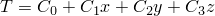

# 1.5.8 Patch test for heat transfer elements

**Products: **Abaqus/Standard  Abaqus/Explicit  

### Elements tested

DC1D2    DC1D3    

DC2D3    DC2D4    DC2D6    DC2D8    

DC3D4    DC3D6    DC3D8    DC3D10    DC3D15    DC3D20    

DCAX3    DCAX4    DCAX6    DCAX8    

DS3    DS4    DS6    DS8    

C3D4T    C3D6T    C3D8RT    C3D8T    C3D10MHT    C3D10MT    SC8RT    

CAX3T    CAX4RHT    CAX4RT    CAX6MT    CGAX4RHT    CGAX4RT    

CPE3T    CPE4RHT    CPE4RT    CPE6MHT    CPE6MT    

CPEG4RHT    CPEG4RT    CPEG6MHT    CPEG6MT    

CPS3T    CPS4RT    CPS6MT    

EC3D8RT    

### Problem description

The meshes used for the heat transfer tests are the same as those used for the corresponding stress elements, except that the axisymmetric heat transfer elements use a larger radius.

For coupled temperature-displacement elements dummy mechanical properties are prescribed to complete the material definition. 

The total simulation time for the Abaqus/Explicit analysis is 20 units. This provides enough time for the transient solution to reach steady-state conditions in this problem.

**Boundary conditions: **

, where *T* is the temperature,  through  are arbitrary constants, and *x*, *y*, *z* denote spatial location. Temperatures are prescribed at every node along the boundary of the mesh. For shell elements *z* denotes the normal direction to the shell surface.

### Reference solution

Fluxes: Since the temperature field is chosen to be linear, it has constant spatial gradients and, thus, has constant fluxes at every integration point.

### Results and discussion

All elements yield exact solutions.

### Input files

##### **Abaqus/Standard input files**

[ec12dfp4.inp](../eif/ec12dfp4.inp)

DC1D2 elements.

[ec13dfp4.inp](../eif/ec13dfp4.inp)

DC1D3 elements.

[ec23dfp4.inp](../eif/ec23dfp4.inp)

DC2D3 elements.

[ec24dfp4.inp](../eif/ec24dfp4.inp)

DC2D4 elements.

[ec26dfp4.inp](../eif/ec26dfp4.inp)

DC2D6 elements.

[ec28dfp4.inp](../eif/ec28dfp4.inp)

DC2D8 elements.

[ec34dfp4.inp](../eif/ec34dfp4.inp)

DC3D4 elements.

[ec36dfp4.inp](../eif/ec36dfp4.inp)

DC3D6 elements.

[ec38dfp4.inp](../eif/ec38dfp4.inp)

DC3D8 elements.

[ec3adfp4.inp](../eif/ec3adfp4.inp)

DC3D10 elements.

[ec3fdfp4.inp](../eif/ec3fdfp4.inp)

DC3D15 elements.

[ec3kdfp4.inp](../eif/ec3kdfp4.inp)

DC3D20 elements.

[eca3dfp4.inp](../eif/eca3dfp4.inp)

DCAX3 elements.

[eca4dfp4.inp](../eif/eca4dfp4.inp)

DCAX4 elements.

[eca6dfp4.inp](../eif/eca6dfp4.inp)

DCAX6 elements.

[eca8dfp4.inp](../eif/eca8dfp4.inp)

DCAX8 elements.

[es33dxp4.inp](../eif/es33dxp4.inp)

DS3 elements.

[es34dxp4.inp](../eif/es34dxp4.inp)

DS4 elements.

[es36dxp4.inp](../eif/es36dxp4.inp)

DS6 elements.

[es38dxp4.inp](../eif/es38dxp4.inp)

DS8 elements.

[ec38trp4.inp](../eif/ec38trp4.inp)

C3D8RT elements.

[ec3atlp4.inp](../eif/ec3atlp4.inp)

C3D10MHT elements.

[ec3atkp4.inp](../eif/ec3atkp4.inp)

C3D10MT elements.

[eca4typ4.inp](../eif/eca4typ4.inp)

CAX4RHT elements.

[eca4trp4.inp](../eif/eca4trp4.inp)

CAX4RT elements.

[eca4hyp4.inp](../eif/eca4hyp4.inp)

CGAX4RHT elements.

[eca4hrp4.inp](../eif/eca4hrp4.inp)

CGAX4RT elements.

[ece4trp4.inp](../eif/ece4trp4.inp)

CPE4RT elements.

[ece6tlp4.inp](../eif/ece6tlp4.inp)

CPE6MHT elements.

[ece6tkp4.inp](../eif/ece6tkp4.inp)

CPE6MT elements.

[ecg4typ4.inp](../eif/ecg4typ4.inp)

CPEG4RHT elements.

[ecg4trp4.inp](../eif/ecg4trp4.inp)

CPEG4RT elements.

[ecg6tlp4.inp](../eif/ecg6tlp4.inp)

CPEG6MHT elements.

[ecg6tkp4.inp](../eif/ecg6tkp4.inp)

CPEG6MT elements.

[ecs4trp4.inp](../eif/ecs4trp4.inp)

CPS4RT elements.

[ecs6tkp4.inp](../eif/ecs6tkp4.inp)

CPS6MT elements.

##### **Abaqus/Explicit input files**

[heatpatch_xpl_c3d4t.inp](../eif/heatpatch_xpl_c3d4t.inp)

C3D4T elements.

[heatpatch_xpl_c3d6t.inp](../eif/heatpatch_xpl_c3d6t.inp)

C3D6T elements.

[heatpatch_xpl_c3d8rt.inp](../eif/heatpatch_xpl_c3d8rt.inp)

C3D8RT elements.

[heatpatch_xpl_sc8rt.inp](../eif/heatpatch_xpl_sc8rt.inp)

SC8RT elements.

[heatpatch_xpl_c3d8t.inp](../eif/heatpatch_xpl_c3d8t.inp)

C3D8T elements.

[heatpatch_xpl_c3d10mt.inp](../eif/heatpatch_xpl_c3d10mt.inp)

C3D10MT elements.

[heatpatch_xpl_cax3t.inp](../eif/heatpatch_xpl_cax3t.inp)

CAX3T elements.

[heatpatch_xpl_cax4rt.inp](../eif/heatpatch_xpl_cax4rt.inp)

CAX4RT elements.

[heatpatch_xpl_cax6mt.inp](../eif/heatpatch_xpl_cax6mt.inp)

CAX6MT elements.

[heatpatch_xpl_cpe3t.inp](../eif/heatpatch_xpl_cpe3t.inp)

CPE3T elements.

[heatpatch_xpl_cpe4rt.inp](../eif/heatpatch_xpl_cpe4rt.inp)

CPE4RT elements.

[heatpatch_xpl_cpe6mt.inp](../eif/heatpatch_xpl_cpe6mt.inp)

CPE6MT elements.

[heatpatch_xpl_cps3t.inp](../eif/heatpatch_xpl_cps3t.inp)

CPS3T elements.

[heatpatch_xpl_cps4rt.inp](../eif/heatpatch_xpl_cps4rt.inp)

CPS4RT elements.

[heatpatch_xpl_cps6mt.inp](../eif/heatpatch_xpl_cps6mt.inp)

CPS6MT elements.

[htpatch_xpl_ec3d8rt.inp](../eif/htpatch_xpl_ec3d8rt.inp)

EC3D8RT elements.

