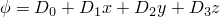

# 1.5.9 热电单元片测试

**产品：**Abaqus/Standard  

### 测试的单元

DCAX3E    DCAX4E    DCAX6E    DCAX8E  

DC2D3E    DC2D4E    DC2D6E    DC2D8E  

DC3D4E    DC3D6E    DC3D8E    DC3D10E    DC3D15E    DC3D20E  

### 问题描述

热电单元测试使用的网格与相应热传导单元使用的网格相同。

**边界条件：**

，其中*T*是温度，至是任意常数，*x*、*y*、*z*表示空间位置。，其中是电势，至是任意常数，*x*、*y*、*z*表示空间位置。沿网格边界在每个节点处指定温度和电势。

### 参考解

热通量：由于温度和电势场选为线性的，因此具有恒定的空间梯度，从而在每个积分点具有恒定的热通量。

### 结果与讨论

所有单元都产生精确解。

### 输入文件

[eca3vfpj.inp](../eif/eca3vfpj.inp)

DCAX3E单元。

[eca4vfpj.inp](../eif/eca4vfpj.inp)

DCAX4E单元。

[eca6vfpj.inp](../eif/eca6vfpj.inp)

DCAX6E单元。

[eca8vfpj.inp](../eif/eca8vfpj.inp)

DCAX8E单元。

[ec23vfpj.inp](../eif/ec23vfpj.inp)

DC2D3E单元。

[ec24vfpj.inp](../eif/ec24vfpj.inp)

DC2D4E单元。

[ec26vfpj.inp](../eif/ec26vfpj.inp)

DC2D6E单元。

[ec28vfpj.inp](../eif/ec28vfpj.inp)

DC2D8E单元。

[ec34vfpj.inp](../eif/ec34vfpj.inp)

DC3D4E单元。

[ec36vfpj.inp](../eif/ec36vfpj.inp)

DC3D6E单元。

[ec38vfpj.inp](../eif/ec38vfpj.inp)

DC3D8E单元。

[ec3avfpj.inp](../eif/ec3avfpj.inp)

DC3D10E单元。

[ec3fvfpj.inp](../eif/ec3fvfpj.inp)

DC3D15E单元。

[ec3kvfpj.inp](../eif/ec3kvfpj.inp)

DC3D20E单元。

