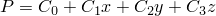

# 1.5.10 声学单元片测试

**产品：**Abaqus/Standard  Abaqus/Explicit  

### 测试的单元

AC1D2    AC1D3  

ACAX3    ACAX4    ACAX4R    ACAX6    ACAX8  

AC2D3    AC2D4    AC2D4R    AC2D6    AC2D8  

AC3D4    AC3D5    AC3D6    AC3D8    AC3D8R    AC3D10    AC3D15    AC3D20  

### 问题描述

声学单元片测试使用的网格与相应热传导单元使用的网格相同。

**注意：**通过稳态动态过程分析模型，其中请求一个小的频率0.01 Hz。在Abaqus/Explicit中，通过执行长期瞬态模拟获得稳态结果。

**边界条件：**

，其中*P*是声压，至是任意常数，*x*、*y*、*z*表示空间位置。沿网格边界在每个节点处指定声压（DOF 8）。

### 参考解

目前无法在Abaqus中报告声学单元的压力梯度。然而，可以将网格内部节点处的声压与从上述P表达式分析计算的值进行比较。

### 结果与讨论

所有单元在模型内部节点处产生精确的P值。

### 输入文件

##### **Abaqus/Standard输入文件**

[ec12afp7.inp](../eif/ec12afp7.inp)

AC1D2单元。

[ec13afp7.inp](../eif/ec13afp7.inp)

AC1D3单元。

[eca3afp7.inp](../eif/eca3afp7.inp)

ACAX3单元。

[eca4afp7.inp](../eif/eca4afp7.inp)

ACAX4单元。

[eca6afp7.inp](../eif/eca6afp7.inp)

ACAX6单元。

[eca8afp7.inp](../eif/eca8afp7.inp)

ACAX8单元。

[ec23afp7.inp](../eif/ec23afp7.inp)

AC2D3单元。

[ec24afp7.inp](../eif/ec24afp7.inp)

AC2D4单元。

[ec26afp7.inp](../eif/ec26afp7.inp)

AC2D6单元。

[ec28afp7.inp](../eif/ec28afp7.inp)

AC2D8单元。

[ec34afp7.inp](../eif/ec34afp7.inp)

AC3D4单元。

[ec35afp7.inp](../eif/ec35afp7.inp)

AC3D5单元。

[ec36afp7.inp](../eif/ec36afp7.inp)

AC3D6单元。

[ec38afp7.inp](../eif/ec38afp7.inp)

AC3D8单元。

[ec3aafp7.inp](../eif/ec3aafp7.inp)

AC3D10单元。

[ec3fafp7.inp](../eif/ec3fafp7.inp)

AC3D15单元。

[ec3kafp7.inp](../eif/ec3kafp7.inp)

AC3D20单元。

##### **Abaqus/Explicit输入文件**

[acousticpatch_xpl_acax3.inp](../eif/acousticpatch_xpl_acax3.inp)

ACAX3单元。

[acousticpatch_xpl_acax4r.inp](../eif/acousticpatch_xpl_acax4r.inp)

ACAX4R单元。

[acousticpatch_xpl_ac2d3.inp](../eif/acousticpatch_xpl_ac2d3.inp)

AC2D3单元。

[acousticpatch_xpl_ac2d4r.inp](../eif/acousticpatch_xpl_ac2d4r.inp)

AC2D4R单元。

[acousticpatch_xpl_ac3d4.inp](../eif/acousticpatch_xpl_ac3d4.inp)

AC3D4单元。

[acousticpatch_xpl_ac3d6.inp](../eif/acousticpatch_xpl_ac3d6.inp)

AC3D6单元。

[acousticpatch_xpl_ac3d8r.inp](../eif/acousticpatch_xpl_ac3d8r.inp)

AC3D8R单元。

