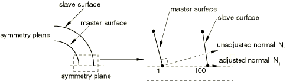

# 1.6.22 对称平面处接触表面法向量的调整

**产品：**Abaqus/Standard  

### 单元测试

C3D8    C3D10M    CPE3    CPE4    CPE8

### 功能测试

在对称平面处测试小滑动和有限滑动接触的接触表面法向量。

### 问题描述

对于小滑动接触，测试验证表面法向量被正确调整，使得从节点在对称平面处找到与弯曲主表面的交点（参见图1.6.22-1）。还验证了在对称平面处计算出正确的间隙。

对于有限滑动接触，测试验证表面法向量被正确调整，并且二维接触表面的端部段在对称平面处被正确平滑。

一些输入文件使用局部节点坐标系来确保表面法向量被正确调整以适应局部系统。

模型由两个同心可变形圆柱体组成。使用四分之一对称模型。两个圆柱体之间的初始间隙为0.1。载荷包括两个步骤。在第一步中，对外圆柱体施加100的压力，使表面与内圆柱体接触。在第二步中，释放压力，使弹性模型返回其原始状态。

**材料：**

| 杨氏模量 | 3.0 103 |
| --- | --- |
| 泊松比 | 0.2 |

### 结果与讨论

间隙和接触压力经过分析验证。由于平滑的主表面，有限滑动测试用例的间隙略大于离散间隙。

### 输入文件

[ei38sisn.inp](../eif/ei38sisn.inp)

C3D8单元，小滑动。

[ei38sisn_surf.inp](../eif/ei38sisn_surf.inp)

C3D8单元，小滑动，表面-表面约束施加方法。

[ei3tsisn.inp](../eif/ei3tsisn.inp)

C3D10M单元，小滑动。

[ei3tsisn_surf.inp](../eif/ei3tsisn_surf.inp)

C3D10M单元，小滑动，表面-表面约束施加方法。

[ei23sfsn.inp](../eif/ei23sfsn.inp)

CPE3单元，有限滑动。

[ei23sisn.inp](../eif/ei23sisn.inp)

CPE3单元，小滑动。

[ei23sisn_surf.inp](../eif/ei23sisn_surf.inp)

CPE3单元，小滑动，表面-表面约束施加方法。

[ei24sfsn.inp](../eif/ei24sfsn.inp)

CPE4单元，有限滑动。

[ei24sisn.inp](../eif/ei24sisn.inp)

CPE4单元，小滑动。

[ei24sisn_surf.inp](../eif/ei24sisn_surf.inp)

CPE4单元，小滑动，表面-表面约束施加方法。

[ei28sfsn.inp](../eif/ei28sfsn.inp)

CPE8单元，有限滑动。

[ei28sfsn_auglagr.inp](../eif/ei28sfsn_auglagr.inp)

CPE8单元，有限滑动。

[ei28sisn.inp](../eif/ei28sisn.inp)

CPE8单元，小滑动。

[ei28sisn_surf.inp](../eif/ei28sisn_surf.inp)

CPE8单元，小滑动，表面-表面约束施加方法。

[ei28sisn_auglagr.inp](../eif/ei28sisn_auglagr.inp)

CPE8单元，小滑动。

[ei28sisn_auglagr_surf.inp](../eif/ei28sisn_auglagr_surf.inp)

CPE8单元，小滑动，表面-表面约束施加方法。

### 图片

**图1.6.22-1** 对称平面处调整后的法向量。

