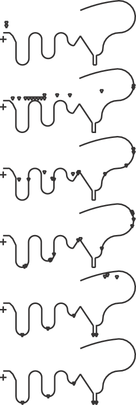

# 1.6.24 解析刚性表面的接触搜索

**产品：**Abaqus/Explicit  

### 单元测试

MASS

### 功能测试

解析刚性表面的接触搜索。

### 问题描述

大量点质量以各种初始速度水平射出，由于重力影响，落在一个复杂的解析刚性表面上。该表面由直线、圆和抛物线段类型组成，包括几个深谷来捕获点质量。测试全局接触跟踪算法的稳健性，因为Abaqus/Explicit必须在整个分析过程中正确确定哪个主段与每个从节点相互作用。时间增量大小为0.5秒，导致每个点质量在每个增量期间产生非常大的相对位移。

### 结果与讨论

图1.6.24-1显示了点质量在各个时间的配置。接触搜索在整个分析过程中成功确定了正确的接触表面相互作用。

### 输入文件

[glb_seg_anl.inp](../eif/glb_seg_anl.inp)

二维问题。

[glb_cyl_anl.inp](../eif/glb_cyl_anl.inp)

三维问题。

### 图片

**图1.6.24-1** 模型在0、1、2、3、11.5和25秒时的配置。

