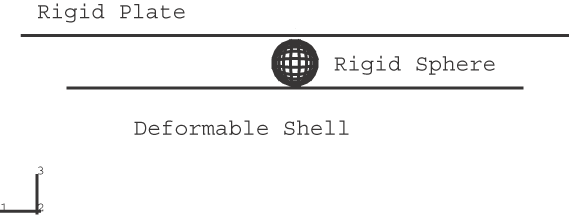
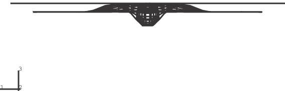
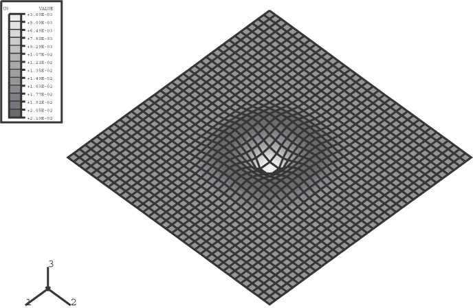
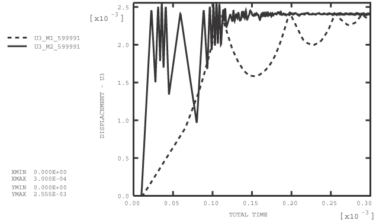
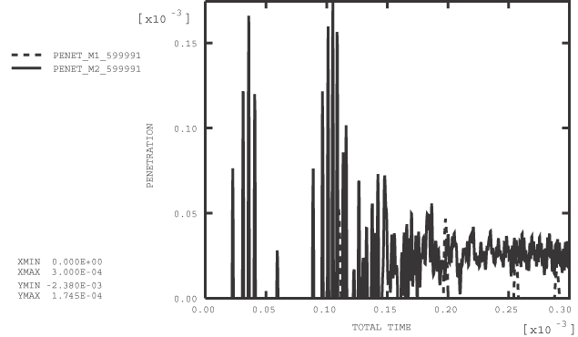
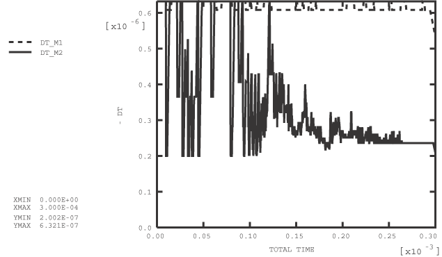

# 1.6.25 使用惩罚法的多表面接触

**产品：**Abaqus/Explicit  

### 单元测试

S4R    R3D4

### 功能测试

三维惩罚接触，考虑惩罚刚度在稳定时间增量中的作用，三维壳厚度在接触中。

此问题测试列出的功能，但不提供响应的独立验证。

### 问题描述

本示例说明了惩罚接触的特性。惩罚法是运动学强制执行接触约束的非默认替代方法，通过指定惩罚方法来强制执行接触约束。在本示例中，惩罚方法用于强制执行三个物体之间的接触：刚性板、刚性球体和最初平坦的壳体。初始配置如图1.6.25-1所示。刚性板被完全约束。刚性球体最初是静止的。壳体的初始速度导致球体被夹在其他两个物体之间，壳体的变形最终导致壳体与刚性板之间的接触。

解析刚性表面用于对刚性板建模。由R3D4单元定义的基于单元的刚性表面用于对刚性球体建模。在壳体上定义可变形表面。每种表面组合之间的接触用三个接触对定义。

最好将球体建模为解析表面，因为基于单元的表面是形状的非平滑近似。然而，解析表面只能作为主表面，而本示例要求球体作为从表面；因此，球体必须用单元建模。基于单元的刚性表面可以使用惩罚方法作为从表面，这与运动学接触方法不同。惩罚方法的这方面允许刚性表面之间的接触建模，例如本示例中刚性板和刚性球体之间。让刚性表面至少部分地作为从表面通常会改善刚性到可变形接触的接触强制，因为纯主表面的节点可以在不产生接触力的情况下穿透从面。在本示例中，对刚性球体和壳体之间的接触使用平衡主-从加权。如果使用运动学接触来模拟球体和壳体之间的接触，则必须将球体加权为纯主表面，并且允许球体节点穿透壳体面。

通常最好尽可能使用解析刚性表面，而不是基于单元的刚性表面，因为平滑表面的基于单元近似可能会在解决方案中产生噪声，如果其他表面的从节点滑过单元面。然而，这种类型的滑动在这个问题中并不显著。

本示例考虑两个球体质量：102和104。刚性球体的质量对壳体变形的影响不大，但这个质量对数值稳定性考虑很重要。数值稳定性允许的最大惩罚刚度与接触质量成正比，与时间增量有复杂的反比关系。接触质量大致对应于参与接触约束的较轻刚体或可变形体节点的质量。对于涉及一个或两个可变形表面的接触，默认选择的惩罚刚度对沿表面的父单元的逐单元稳定时间增量影响较小（最多约4%）。默认选择的用于强制执行刚体之间接触的惩罚刚度不影响时间增量。因此，当接触质量减少时，默认惩罚刚度往往会减少。

惩罚刚度可以通过缩放默认值来修改，这会影响稳定时间增量。稳定时间增量仅在表面接触时才受惩罚接触影响。在较轻球体的分析中，已为涉及刚性球体的接触对指定了10的惩罚比例因子，因此我们可以预期惩罚接触在该分析中将对时间增量产生更大的影响。

### 结果与讨论

第一个分析的变形配置如图1.6.25-2所示。两个分析的壳体垂直位移等值线图如图1.6.25-3和图1.6.25-4所示。在两个模型中，最终壳体配置几乎相同。这些图表明，存储在惩罚接触中的能量是可恢复的，因为壳体节点在撞击刚性板后反弹。默认情况下，粘性接触阻尼被激活用于惩罚接触，因此存储在惩罚接触约束中的一小部分能量被耗散。如果使用运动学接触，则不会发生这种类型的反弹，因为运动学接触假定"完全塑性"冲击。

两个分析的刚性球体位移历史图如图1.6.25-5所示。刚性球体在其他表面之间来回弹跳。对于较轻球体的分析，这种振荡的频率要高得多。超过2.38×103的刚性球体位移对应于基于单元的刚性球体穿透刚性板。对于半径为102的平滑球体，超过2.0×103的位移将对应于穿透。基于单元的球体穿透板的距离如图1.6.25-6所示。在两个分析中，穿透量级相同。如果对较轻球体的分析使用默认惩罚刚度，穿透量将大一个数量级。在大多数分析中，使用默认惩罚刚度时，接触穿透将不显著，但球体在其他两个表面之间的"夹持"导致穿透在本示例中相当显著。可以通过增加惩罚比例因子来减少给定问题中的穿透，但代价是减少稳定时间增量。

稳定时间增量是基于逐单元估计获得的，以证明惩罚接触对单元稳定时间增量的影响。两个分析的时间增量历史图如图1.6.25-7所示。对于使用默认惩罚刚度的分析，对于壳体表面接触任一或两个刚性表面的增量，时间增量下降约4%。对于指定惩罚比例因子为10的分析，与接触相关的时间增量减少更为显著，如预期的那样。在这种情况下，在许多表面接触的增量中，时间增量被削减了近三分之一，分析的增量数量几乎是较重球体分析的两倍。当惩罚比例因子适用于涉及刚性表面的接触对时，在发生接触的增量中，时间增量按惩罚比例因子值的平方根减少。惩罚比例因子对可变形表面之间接触的时间增量的影响不那么显著。

### 输入文件

[multpenaltycont1.inp](../eif/multpenaltycont1.inp)

球体质量等于102且时间增量基于逐单元估计的分析。

[multi1_gcont.inp](../eif/multi1_gcont.inp)

球体质量等于102且时间增量基于逐单元估计的一般接触分析。

[multpenaltycont2.inp](../eif/multpenaltycont2.inp)

球体质量等于104且时间增量基于逐单元估计的分析。

[multi2_gcont.inp](../eif/multi2_gcont.inp)

球体质量等于104且时间增量基于逐单元估计的一般接触分析。

[multpenaltycont3.inp](../eif/multpenaltycont3.inp)

球体质量等于102且时间增量基于全局估计的分析。

[multi3_gcont.inp](../eif/multi3_gcont.inp)

球体质量等于102且时间增量基于全局估计的一般接触分析。

[multpenaltycont4.inp](../eif/multpenaltycont4.inp)

球体质量等于104且时间增量基于全局估计的分析。

[multi4_gcont.inp](../eif/multi4_gcont.inp)

球体质量等于104且时间增量基于全局估计的一般接触分析。

[multpnltykincont.inp](../eif/multpnltykincont.inp)

测试惩罚和运动学接触对的分析。

[multi_kin_gcont.inp](../eif/multi_kin_gcont.inp)

测试一般接触和运动学接触对的分析。

[sphere_n.inp](../eif/sphere_n.inp)

包含这些分析的节点数据的外部文件。

[sphere_e.inp](../eif/sphere_e.inp)

包含这些分析的单元数据的外部文件。

### 图片

**图1.6.25-1** 初始配置。

**图1.6.25-2** 最终配置。

**图1.6.25-3** 较大球体质量分析的壳体变形配置。

**图1.6.25-4** 较小球体质量分析的壳体变形配置。

**图1.6.25-5** 球体位移与时间的关系。

**图1.6.25-6** 球体穿透刚性板的距离与时间的关系。

**图1.6.25-7** 时间增量大小历史。

