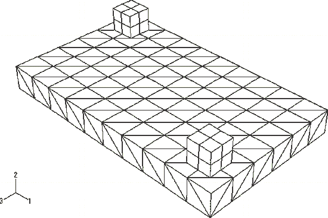

# 1.6.26 Automated contact patch algorithm for finite-sliding deformable surfaces

**Product: **Abaqus/Standard  

### Elements tested

C3D8    C3D10M    SC8R    

### Feature tested

The automatic contact patch and element reordering algorithm.

### Problem description

These tests exercise the automatic contact patch and element reordering algorithm used to minimize the wavefront for three-dimensional deformable-to-deformable finite-sliding simulations.

**Model: **

The model consists of a base block and two slider blocks resting on the base block. The dimension of the base block is 10  6  1, and the dimension of each slider block is 1  1  1. The model is illustrated in [Figure 1.6.26--1](ch01s06abv104.md#verelmcontactpatch-model).

**Mesh: **

Two meshes are defined. The first mesh uses the 10-node modified tetrahedron, C3D10M, element; and the second mesh uses the 8-node solid, C3D8, element to define the base block. The base block consists of 300 C3D10M elements for the first mesh and 60 C3D8 elements for the second mesh. The slider block consists of four C3D8R elements. The master surface is defined on the top of the base block, and the slave surface is defined on the bottom of each slider block. A total of 18 contact elements are generated by Abaqus.

**Material: **

The following elastic properties are used:

| Young's modulus | 3 106 |
| --- | --- |
| Poisson's ratio | 0.0 |

**Boundary conditions: **

The base block is fully restrained on the bottom. Contact is established in the first step by placing the slider blocks onto the base block with a prescribed boundary condition. A uniform pressure of 100 and 200 is applied to the slider blocks in the second step. The slider blocks are moved independently by prescribing a velocity in the subsequent steps.

### Results and discussion

Contact stresses, element stresses in the slider blocks, and nodal displacements are verified. In addition, restart and post analysis jobs exist to verify that the correct analysis databases are accessed.

### Input files

[contactpatch_c3d10m.inp](../eif/contactpatch_c3d10m.inp)

C3D10M element test.

[contactpatch_c3d10m_surf.inp](../eif/contactpatch_c3d10m_surf.inp)

C3D10M element test using surface-to-surface contact.

[contactpatch_c3d10m_restart.inp](../eif/contactpatch_c3d10m_restart.inp)

Restart file for contactpatch_c3d10m.inp.

[contactpatch_c3d10m_postoutput.inp](../eif/contactpatch_c3d10m_postoutput.inp)

[*POST OUTPUT](../key/key-link.md#usb-kws-hpostoutput) file for contactpatch_c3d10m.inp.

[contactpatch_c3d8.inp](../eif/contactpatch_c3d8.inp)

C3D8 element test.

[contactpatch_c3d8_restart.inp](../eif/contactpatch_c3d8_restart.inp)

Restart file for contactpatch_c3d8.inp.

[contactpatch_c3d8_postoutput.inp](../eif/contactpatch_c3d8_postoutput.inp)

[*POST OUTPUT](../key/key-link.md#usb-kws-hpostoutput) file for contactpatch_c3d8.inp.

[contactpatch_sc8r.inp](../eif/contactpatch_sc8r.inp)

SC8R element test.

[contactpatch_sc8r_restart.inp](../eif/contactpatch_sc8r_restart.inp)

Restart file for contactpatch_sc8r.inp.

[contactpatch_sc8r_postoutput.inp](../eif/contactpatch_sc8r_postoutput.inp)

[*POST OUTPUT](../key/key-link.md#usb-kws-hpostoutput) file for contactpatch_sc8r.inp.

### Figure

**Figure 1.6.26–1** Model using the 10-node modified tetrahedral elements.

