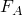
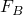

# 1.6.2 Small-sliding contact between coupled temperature-displacement surfaces

**Products: **Abaqus/Standard  Abaqus/Explicit  

### Elements tested

C3D4T    C3D6T    C3D8HT    C3D8RT    C3D8RHT    C3D8T    C3D10MT    C3D10MHT    C3D20HT    C3D20T    

CAX3T    CAX4HT    CAX4RT    CAX4RHT    CAX4T    CAX6MT    CAX6MHT    CAX8HT    CAX8T    

CGAX4HT    CGAX4RT    CGAX4RHT    CGAX4T    CGAX6MT    CGAX6MHT    CGAX8HT    CGAX8T    

CPE3T    CPE4HT    CPE4RT    CPE4RHT    CPE4T    CPE6MT    CPE6MHT    CPE8HT    CPE8T    

CPEG3HT    CPEG3T    CPEG4HT    CPEG4RT    CPEG4RHT    CPEG4T    CPEG6MT    CPEG6MHT    CPEG8HT    CPEG8RHT    CPEG8T    

CPS3T    CPS4RT    CPS4T    CPS6MT    CPS8T    

S3RT    S3T    S4RT    S4T    S8RT    SAX2T    SC6RT    SC8RT    

### Features tested

Gap conductance

Gap heat generation

Gap radiation

Small-sliding contact pair

### Problem description

The models consist of two bodies lying next to each other. Heat transfer across the gap between the two bodies can take place via gap conductance, gap heat generation, or gap radiation. Only heat transfer via gap conductance and gap radiation is tested for the shells.

For the continuum elements we initiate heat flow in the first step by applying different constant temperature fields to each solid body. The steady-state temperature along both sides of the interface is used to verify the numerical solutions. The gap closes due to thermal expansion of the two bodies. In the second step the top block is displaced relative to the bottom block to generate heat due to frictional sliding. In addition, heat transfer occurs due to gap conductance and gap radiation. The upper body is displaced back to its original position in the third step. In Abaqus/Standard a fourth step is also included. This step is a linear perturbation step, wherein a load of sufficient magnitude to open the gap is applied. In addition, in Abaqus/Standard the tied contact pair formulation is verified by defining one of the deformable bodies with this feature. The section output requests to the results (`.fil`) file and to the data (`.dat`) file are used to output the total force and the total heat flux across the contact surfaces; the results match the output of similar output quantities obtained when writing contact variables for surface contact pairs to the results file.

For the shells, heat flow is initiated by applying different constant temperatures to degree of freedom 15 of the top body and to degree of freedom 11 of the bottom body. The steady-state temperature along both sides of the interface is used to verify the numerical solutions.

**Material: **

| Young's modulus | 30 106 |
| --- | --- |
| Poisson's ratio | 0.3 |
| Gap friction | 0.01 |
| Density | 7700. |
| Thermal expansion coeff. | 10 106 |
| Conductivity | 43.0 |
| Specific heat | 600. |
| Gap conductance | 1.0 |
|  | 1 109 |
|  | 1 109 |
|  | 0.5 |

### Results and discussion

The finite element results agree with the analytical results.

### Input files

##### **Abaqus/Standard input files**

[coupledtempsmslcont_s_c3d4t.inp](../eif/coupledtempsmslcont_s_c3d4t.inp)

C3D4T elements.

[coupledtempsmslcont_s_c3d4t_surf.inp](../eif/coupledtempsmslcont_s_c3d4t_surf.inp)

C3D4T elements,  surface-to-surface constraint enforcement method.

[coupledtempsmslcont_s_c3d6t.inp](../eif/coupledtempsmslcont_s_c3d6t.inp)

C3D6T elements.

[coupledtempsmslcont_s_c3d6t_surf.inp](../eif/coupledtempsmslcont_s_c3d6t_surf.inp)

C3D6T elements,  surface-to-surface constraint enforcement method.

[ei34tish.inp](../eif/ei34tish.inp)

C3D8HT elements.

[ei34tish_surf.inp](../eif/ei34tish_surf.inp)

C3D8HT elements, surface-to-surface constraint enforcement method.

[ei34tisr.inp](../eif/ei34tisr.inp)

C3D8RT elements.

[ei34tisr_surf.inp](../eif/ei34tisr_surf.inp)

C3D8RT elements, surface-to-surface constraint enforcement method.

[ei34tisy.inp](../eif/ei34tisy.inp)

C3D8RHT elements.

[ei34tisy_surf.inp](../eif/ei34tisy_surf.inp)

C3D8RHT elements, surface-to-surface constraint enforcement method.

[ei34tisc.inp](../eif/ei34tisc.inp)

C3D8T elements.

[ei34tisc_surf.inp](../eif/ei34tisc_surf.inp)

C3D8T elements, surface-to-surface constraint enforcement method.

[ei36tisc.inp](../eif/ei36tisc.inp)

C3D10MT elements.

[ei36tisc_surf.inp](../eif/ei36tisc_surf.inp)

C3D10MT elements, surface-to-surface constraint enforcement method.

[ei36tish.inp](../eif/ei36tish.inp)

C3D10MHT elements.

[ei36tish_surf.inp](../eif/ei36tish_surf.inp)

C3D10MHT elements, surface-to-surface constraint enforcement method.

[ei38tish.inp](../eif/ei38tish.inp)

C3D20HT elements.

[ei38tish_surf.inp](../eif/ei38tish_surf.inp)

C3D20HT elements, surface-to-surface constraint enforcement method.

[ei38tisc.inp](../eif/ei38tisc.inp)

C3D20T elements.

[ei38tisc_surf.inp](../eif/ei38tisc_surf.inp)

C3D20T elements, surface-to-surface constraint enforcement method.

[ei38tisc_auglagr.inp](../eif/ei38tisc_auglagr.inp)

C3D20T elements, augmented Lagrangian contact model.

[ei38tisc_auglagr_surf.inp](../eif/ei38tisc_auglagr_surf.inp)

C3D20T elements, augmented Lagrangian contact model, surface-to-surface constraint enforcement method.

[coupledtempsmslcont_s_cax3t.inp](../eif/coupledtempsmslcont_s_cax3t.inp)

CAX3T elements.

[coupledtempsmslcont_s_cax3t_surf.inp](../eif/coupledtempsmslcont_s_cax3t_surf.inp)

CAX3T elements,  surface-to-surface constraint enforcement method.

[eia2tish.inp](../eif/eia2tish.inp)

CAX4HT elements.

[eia2tish_surf.inp](../eif/eia2tish_surf.inp)

CAX4HT elements, surface-to-surface constraint enforcement method.

[eia2tisr.inp](../eif/eia2tisr.inp)

CAX4RT elements.

[eia2tisr_surf.inp](../eif/eia2tisr_surf.inp)

CAX4RT elements, surface-to-surface constraint enforcement method.

[eia2tisy.inp](../eif/eia2tisy.inp)

CAX4RHT elements.

[eia2tisy_surf.inp](../eif/eia2tisy_surf.inp)

CAX4RHT elements, surface-to-surface constraint enforcement method.

[eia2tisa.inp](../eif/eia2tisa.inp)

CAX4T elements.

[eia2tisa_surf.inp](../eif/eia2tisa_surf.inp)

CAX4T elements, surface-to-surface constraint enforcement method.

[eia3tisa_cax6mt.inp](../eif/eia3tisa_cax6mt.inp)

CAX6MT elements.

[eia3tisa_cax6mt_surf.inp](../eif/eia3tisa_cax6mt_surf.inp)

CAX6MT elements, surface-to-surface constraint enforcement method.

[eia3tisa_cax6mht.inp](../eif/eia3tisa_cax6mht.inp)

CAX6MHT elements.

[eia3tisa_cax6mht_surf.inp](../eif/eia3tisa_cax6mht_surf.inp)

CAX6MHT elements, surface-to-surface constraint enforcement method.

[eia3tish.inp](../eif/eia3tish.inp)

CAX8HT elements.

[eia3tish_surf.inp](../eif/eia3tish_surf.inp)

CAX8HT elements, surface-to-surface constraint enforcement method.

[eia3tisa.inp](../eif/eia3tisa.inp)

CAX8T elements.

[eia3tisa_surf.inp](../eif/eia3tisa_surf.inp)

CAX8T elements, surface-to-surface constraint enforcement method.

[eig2tish.inp](../eif/eig2tish.inp)

CGAX4HT elements.

[eig2tish_surf.inp](../eif/eig2tish_surf.inp)

CGAX4HT elements, surface-to-surface constraint enforcement method.

[eig2tisr.inp](../eif/eig2tisr.inp)

CGAX4RT elements.

[eig2tisr_surf.inp](../eif/eig2tisr_surf.inp)

CGAX4RT elements, surface-to-surface constraint enforcement method.

[eig2tisy.inp](../eif/eig2tisy.inp)

CGAX4RHT elements.

[eig2tisy_surf.inp](../eif/eig2tisy_surf.inp)

CGAX4RHT elements, surface-to-surface constraint enforcement method.

[eig2tisa.inp](../eif/eig2tisa.inp)

CGAX4T elements.

[eig2tisa_surf.inp](../eif/eig2tisa_surf.inp)

CGAX4T elements, surface-to-surface constraint enforcement method.

[eig3tisa_cgax6mt.inp](../eif/eig3tisa_cgax6mt.inp)

CGAX6MT elements.

[eig3tisa_cgax6mt_surf.inp](../eif/eig3tisa_cgax6mt_surf.inp)

CGAX6MT elements, surface-to-surface constraint enforcement method.

[eig3tisa_cgax6mht.inp](../eif/eig3tisa_cgax6mht.inp)

CGAX6MHT elements.

[eig3tisa_cgax6mht_surf.inp](../eif/eig3tisa_cgax6mht_surf.inp)

CGAX6MHT elements, surface-to-surface constraint enforcement method.

[eig3tish.inp](../eif/eig3tish.inp)

CGAX8HT elements.

[eig3tish_surf.inp](../eif/eig3tish_surf.inp)

CGAX8HT elements, surface-to-surface constraint enforcement method.

[eig3tisa.inp](../eif/eig3tisa.inp)

CGAX8T elements.

[eig3tisa_surf.inp](../eif/eig3tisa_surf.inp)

CGAX8T elements, surface-to-surface constraint enforcement method.

[ei22tish.inp](../eif/ei22tish.inp)

CPE4HT elements.

[ei22tish_surf.inp](../eif/ei22tish_surf.inp)

CPE4HT elements, surface-to-surface constraint enforcement method.

[ei22tise_cpe4rt.inp](../eif/ei22tise_cpe4rt.inp)

CPE4RT elements.

[ei22tise_cpe4rt_surf.inp](../eif/ei22tise_cpe4rt_surf.inp)

CPE4RT elements, surface-to-surface constraint enforcement method.

[ei22tise_cpe4rht.inp](../eif/ei22tise_cpe4rht.inp)

CPE4RHT elements.

[ei22tise_cpe4rht_surf.inp](../eif/ei22tise_cpe4rht_surf.inp)

CPE4RHT elements, surface-to-surface constraint enforcement method.

[coupledtempsmslcont_s_cpe3t.inp](../eif/coupledtempsmslcont_s_cpe3t.inp)

CPE3T elements.

[coupledtempsmslcont_s_cpe3t_surf.inp](../eif/coupledtempsmslcont_s_cpe3t_surf.inp)

CPE3T elements,  surface-to-surface constraint enforcement method.

[ei22tise.inp](../eif/ei22tise.inp)

CPE4T elements.

[ei22tise_surf.inp](../eif/ei22tise_surf.inp)

CPE4T elements, surface-to-surface constraint enforcement method.

[ei23tise_cpe6mt.inp](../eif/ei23tise_cpe6mt.inp)

CPE6MT elements.

[ei23tise_cpe6mt_surf.inp](../eif/ei23tise_cpe6mt_surf.inp)

CPE6MT elements, surface-to-surface constraint enforcement method.

[ei23tise_cpe6mht.inp](../eif/ei23tise_cpe6mht.inp)

CPE6MHT elements.

[ei23tise_cpe6mht_surf.inp](../eif/ei23tise_cpe6mht_surf.inp)

CPE6MHT elements, surface-to-surface constraint enforcement method.

[ei23tish.inp](../eif/ei23tish.inp)

CPE8HT elements.

[ei23tish_surf.inp](../eif/ei23tish_surf.inp)

CPE8HT elements, surface-to-surface constraint enforcement method.

[ei23tise.inp](../eif/ei23tise.inp)

CPE8T elements.

[ei23tise_surf.inp](../eif/ei23tise_surf.inp)

CPE8T elements, surface-to-surface constraint enforcement method.

[ei23tise_auglagr.inp](../eif/ei23tise_auglagr.inp)

CPE8T elements.

[ei23tise_auglagr_surf.inp](../eif/ei23tise_auglagr_surf.inp)

CPE8T elements, surface-to-surface constraint enforcement method.

[eit2tish.inp](../eif/eit2tish.inp)

CPEG3HT elements.

[eit2tish_surf.inp](../eif/eit2tish_surf.inp)

CPEG3HT elements, surface-to-surface constraint enforcement method.

[eit2tise.inp](../eif/eit2tise.inp)

CPEG3T elements.

[eit2tise_surf.inp](../eif/eit2tise_surf.inp)

CPEG3T elements, surface-to-surface constraint enforcement method.

[eip2tish.inp](../eif/eip2tish.inp)

CPEG4HT elements.

[eip2tish_surf.inp](../eif/eip2tish_surf.inp)

CPEG4HT elements, surface-to-surface constraint enforcement method.

[eip2tisr.inp](../eif/eip2tisr.inp)

CPEG4RT elements.

[eip2tisr_surf.inp](../eif/eip2tisr_surf.inp)

CPEG4RT elements, surface-to-surface constraint enforcement method.

[eip2tisx.inp](../eif/eip2tisx.inp)

CPEG4RHT elements.

[eip2tisx_surf.inp](../eif/eip2tisx_surf.inp)

CPEG4RHT elements, surface-to-surface constraint enforcement method.

[eip2tise.inp](../eif/eip2tise.inp)

CPEG4T elements.

[eip2tise_surf.inp](../eif/eip2tise_surf.inp)

CPEG4T elements, surface-to-surface constraint enforcement method.

[eip3tise_cpeg6mt.inp](../eif/eip3tise_cpeg6mt.inp)

CPEG6MT elements.

[eip3tise_cpeg6mt_surf.inp](../eif/eip3tise_cpeg6mt_surf.inp)

CPEG6MT elements, surface-to-surface constraint enforcement method.

[eip3tise_cpeg6mht.inp](../eif/eip3tise_cpeg6mht.inp)

CPEG6MHT elements.

[eip3tise_cpeg6mht_surf.inp](../eif/eip3tise_cpeg6mht_surf.inp)

CPEG6MHT elements, surface-to-surface constraint enforcement method.

[eip3tish.inp](../eif/eip3tish.inp)

CPEG8HT elements.

[eip3tish_surf.inp](../eif/eip3tish_surf.inp)

CPEG8HT elements, surface-to-surface constraint enforcement method.

[eip3tisx.inp](../eif/eip3tisx.inp)

CPEG8RHT elements.

[eip3tisx_surf.inp](../eif/eip3tisx_surf.inp)

CPEG8RHT elements, surface-to-surface constraint enforcement method.

[eip3tise.inp](../eif/eip3tise.inp)

CPEG8T elements.

[eip3tise_surf.inp](../eif/eip3tise_surf.inp)

CPEG8T elements, surface-to-surface constraint enforcement method.

[coupledtempsmslcont_s_cps3t.inp](../eif/coupledtempsmslcont_s_cps3t.inp)

CPS3T elements.

[coupledtempsmslcont_s_cps3t_surf.inp](../eif/coupledtempsmslcont_s_cps3t_surf.inp)

CPS3T elements,  surface-to-surface constraint enforcement method.

[ei22tisr.inp](../eif/ei22tisr.inp)

CPS4RT elements.

[ei22tisr_surf.inp](../eif/ei22tisr_surf.inp)

CPS4RT elements, surface-to-surface constraint enforcement method.

[ei22tiss.inp](../eif/ei22tiss.inp)

CPS4T elements.

[ei22tiss_surf.inp](../eif/ei22tiss_surf.inp)

CPS4T elements, surface-to-surface constraint enforcement method.

[ei23tise_cps6mt.inp](../eif/ei23tise_cps6mt.inp)

CPS6MT elements.

[ei23tise_cps6mt_surf.inp](../eif/ei23tise_cps6mt_surf.inp)

CPS6MT elements, surface-to-surface constraint enforcement method.

[ei23tiss.inp](../eif/ei23tiss.inp)

CPS8T elements.

[ei23tiss_surf.inp](../eif/ei23tiss_surf.inp)

CPS8T elements, surface-to-surface constraint enforcement method.

[ei23tiss_auglagr.inp](../eif/ei23tiss_auglagr.inp)

CPS8T elements, augmented Lagrangian contact model.

[ei23tiss_auglagr_surf.inp](../eif/ei23tiss_auglagr_surf.inp)

CPS8T elements, augmented Lagrangian contact model, surface-to-surface constraint enforcement method.

[coupledtempsmslcont_s_s3rt.inp](../eif/coupledtempsmslcont_s_s3rt.inp)

S3RT elements.

[coupledtempsmslcont_s_s3rt_surf.inp](../eif/coupledtempsmslcont_s_s3rt_surf.inp)

S3RT elements,  surface-to-surface constraint enforcement method.

[coupledtempsmslcont_s_s3t.inp](../eif/coupledtempsmslcont_s_s3t.inp)

S3T elements.

[coupledtempsmslcont_s_s3t_surf.inp](../eif/coupledtempsmslcont_s_s3t_surf.inp)

S3T elements,  surface-to-surface constraint enforcement method.

[coupledtempsmslcont_s_s4rt.inp](../eif/coupledtempsmslcont_s_s4rt.inp)

S4RT elements.

[coupledtempsmslcont_s_s4rt_surf.inp](../eif/coupledtempsmslcont_s_s4rt_surf.inp)

S4RT elements,  surface-to-surface constraint enforcement method.

[coupledtempsmslcont_s_s4t.inp](../eif/coupledtempsmslcont_s_s4t.inp)

S4T elements.

[coupledtempsmslcont_s_s4t_surf.inp](../eif/coupledtempsmslcont_s_s4t_surf.inp)

S4T elements,  surface-to-surface constraint enforcement method.

[ei38tiss.inp](../eif/ei38tiss.inp)

S8RT elements.

[ei38tiss_surf.inp](../eif/ei38tiss_surf.inp)

S8RT elements, surface-to-surface constraint enforcement method.

[ei38tissp.inp](../eif/ei38tissp.inp)

Postprocessing to recover additional output from the restart file of the analysis testing S8RT elements.

[ei38tissp_surf.inp](../eif/ei38tissp_surf.inp)

Postprocessing to recover additional output from the restart file of the analysis testing S8RT elements, surface-to-surface constraint enforcement method.

[eia3tiss.inp](../eif/eia3tiss.inp)

SAX2T elements.

[eia3tiss_surf.inp](../eif/eia3tiss_surf.inp)

SAX2T elements, surface-to-surface constraint enforcement method.

[eia3tiss_surf_nothick.inp](../eif/eia3tiss_surf_nothick.inp)

SAX2T elements, surface-to-surface constraint enforcement method, surface thickness effects ignored.

[eiu1tgc1.inp](../eif/eiu1tgc1.inp)

T3D2T elements with GAPUNIT elements.

[eiu1tgc1_surf.inp](../eif/eiu1tgc1_surf.inp)

T3D2T elements with GAPUNIT elements, surface-to-surface constraint enforcement method.

[coupledtempsmslcont_s_sc6rt.inp](../eif/coupledtempsmslcont_s_sc6rt.inp)

SC6RT elements.

[coupledtempsmslcont_s_sc6rt_surf.inp](../eif/coupledtempsmslcont_s_sc6rt_surf.inp)

SC6RT elements,  surface-to-surface constraint enforcement method.

[coupledtempsmslcont_s_sc8rt.inp](../eif/coupledtempsmslcont_s_sc8rt.inp)

SC8RT elements.

[coupledtempsmslcont_s_sc8rt_surf.inp](../eif/coupledtempsmslcont_s_sc8rt_surf.inp)

SC8RT elements,  surface-to-surface constraint enforcement method.

##### **Abaqus/Explicit input files**

[coupledtempsmslcont_x_c3d4t.inp](../eif/coupledtempsmslcont_x_c3d4t.inp)

C3D4T elements.

[coupledtempsmslcont_x_c3d6t.inp](../eif/coupledtempsmslcont_x_c3d6t.inp)

C3D6T elements.

[coupledtempsmslcont_x_c3d8rt.inp](../eif/coupledtempsmslcont_x_c3d8rt.inp)

C3D8RT elements.

[coupledtempsmslcont_x_c3d8t.inp](../eif/coupledtempsmslcont_x_c3d8t.inp)

C3D8T elements.

[coupledtempsmslcont_x_c3d10mt.inp](../eif/coupledtempsmslcont_x_c3d10mt.inp)

C3D10MT elements.

[coupledtempsmslcont_x_sc8rt.inp](../eif/coupledtempsmslcont_x_sc8rt.inp)

SC8RT elements.

[coupledtempsmslcont_x_cax3t.inp](../eif/coupledtempsmslcont_x_cax3t.inp)

CAX3T elements.

[coupledtempsmslcont_x_cax4rt.inp](../eif/coupledtempsmslcont_x_cax4rt.inp)

CAX4RT elements.

[coupledtempsmslcont_x_cax6mt.inp](../eif/coupledtempsmslcont_x_cax6mt.inp)

CAX6MT elements.

[coupledtempsmslcont_x_cpe3t.inp](../eif/coupledtempsmslcont_x_cpe3t.inp)

CPE3T elements.

[coupledtempsmslcont_x_cpe4rt.inp](../eif/coupledtempsmslcont_x_cpe4rt.inp)

CPE4RT elements.

[coupledtempsmslcont_x_cpe6mt.inp](../eif/coupledtempsmslcont_x_cpe6mt.inp)

CPE6MT elements.

[coupledtempsmslcont_x_cps3t.inp](../eif/coupledtempsmslcont_x_cps3t.inp)

CPS3T elements.

[coupledtempsmslcont_x_cps4rt.inp](../eif/coupledtempsmslcont_x_cps4rt.inp)

CPS4RT elements.

[coupledtempsmslcont_x_cps6mt.inp](../eif/coupledtempsmslcont_x_cps6mt.inp)

CPS6MT elements.

