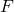

# 1.6.3 耦合热-电-结构曲面间的小滑动接触

**产品：**Abaqus/Standard  

### 单元测试

Q3D4    Q3D6    Q3D8    Q3D8H    Q3D8R    Q3D8RH    Q3D10M    Q3D10MH    Q3D20    Q3D20H    Q3D20R    Q3D20RH  

### 功能测试

间隙热传导

间隙电传导

间隙热生成

间隙辐射

小滑动接触对

### 问题描述

模型由两个相邻的物体组成。通过间隙热传导、间隙热生成、间隙辐射或间隙电传导，热量和电流可以穿过两物体之间的间隙进行传递。

我们在第一个分析步中通过对每个固体施加不同的恒定温度和电势场来启动热流和电流。界面两侧的稳态场用于验证数值解。间隙由于两个物体的热膨胀而闭合。在第二个分析步中，顶部块体相对于底部块体发生位移，以产生由摩擦滑动引起的热量。此外，还会因间隙热传导和间隙辐射而发生热传递；因间隙电传导而发生电流传递。在第三个分析步中，上部物体被移回其原始位置。第四个分析步是线性扰动步，其中施加了足够大的载荷以使间隙打开。此外，还通过使用绑定接触对公式定义其中一个可变形物体来验证绑定接触对公式。对结果（`.fil`）文件和数据（`.dat`）文件的截面输出请求用于输出接触表面的总力以及总热通量和电流通量；结果与将表面接触对的接触变量写入结果文件时获得的类似输出量相匹配。

**材料：**

| 杨氏模量 | 30 106 |
| --- | --- |
| 泊松比 | 0.3 |
| 间隙摩擦 | 0.01 |
| 密度 | 7700。 |
| 热膨胀系数 | 10 106 |
| 导热系数 | 43.0 |
| 电导率 | 43.0 |
| 焦耳热分数 | 0.0 |
| 比热容 | 600。 |
| 间隙热传导系数 | 1.0 |
|  | 0.034664 |
|  | 0.034664 |
|  | 1.0 |
|  | --273.16 |
|  | 0.5 |
|  | 0.5 |
| 间隙电传导系数 | 1.0 |

### 结果与讨论

有限元结果与分析结果一致。

### 输入文件

##### **Abaqus/Standard输入文件**

[tes_smslcont_q3d4.inp](../eif/tes_smslcont_q3d4.inp)

Q3D4单元。

[tes_smslcont_q3d4_surf.inp](../eif/tes_smslcont_q3d4_surf.inp)

Q3D4单元，表面-表面约束施加方法。

[tes_smslcont_q3d6.inp](../eif/tes_smslcont_q3d6.inp)

Q3D6单元。

[tes_smslcont_q3d6_surf.inp](../eif/tes_smslcont_q3d6_surf.inp)

Q3D6单元，表面-表面约束施加方法。

[tes_smslcont_q3d8.inp](../eif/tes_smslcont_q3d8.inp)

Q3D8单元。

[tes_smslcont_q3d8_surf.inp](../eif/tes_smslcont_q3d8_surf.inp)

Q3D8单元，表面-表面约束施加方法。

[tes_smslcont_q3d8h.inp](../eif/tes_smslcont_q3d8h.inp)

Q3D8H单元。

[tes_smslcont_q3d8h_surf.inp](../eif/tes_smslcont_q3d8h_surf.inp)

Q3D8H单元，表面-表面约束施加方法。

[tes_smslcont_q3d8r.inp](../eif/tes_smslcont_q3d8r.inp)

Q3D8R单元。

[tes_smslcont_q3d8r_surf.inp](../eif/tes_smslcont_q3d8r_surf.inp)

Q3D8R单元，表面-表面约束施加方法。

[tes_smslcont_q3d8rh.inp](../eif/tes_smslcont_q3d8rh.inp)

Q3D8RH单元。

[tes_smslcont_q3d8rh_surf.inp](../eif/tes_smslcont_q3d8rh_surf.inp)

Q3D8RH单元，表面-表面约束施加方法。

[tes_smslcont_q3d10m.inp](../eif/tes_smslcont_q3d10m.inp)

Q3D10M单元。

[tes_smslcont_q3d10m_surf.inp](../eif/tes_smslcont_q3d10m_surf.inp)

Q3D10M单元，表面-表面约束施加方法。

[tes_smslcont_q3d10mh.inp](../eif/tes_smslcont_q3d10mh.inp)

Q3D10MH单元。

[tes_smslcont_q3d10mh_surf.inp](../eif/tes_smslcont_q3d10mh_surf.inp)

Q3D10MH单元，表面-表面约束施加方法。

[tes_smslcont_q3d20.inp](../eif/tes_smslcont_q3d20.inp)

Q3D20单元。

[tes_smslcont_q3d20_surf.inp](../eif/tes_smslcont_q3d20_surf.inp)

Q3D20单元，表面-表面约束施加方法。

[tes_smslcont_q3d20_auglagr.inp](../eif/tes_smslcont_q3d20_auglagr.inp)

Q3D20单元，增广拉格朗日接触模型。

[tes_smslcont_q3d20_auglagr_surf.inp](../eif/tes_smslcont_q3d20_auglagr_surf.inp)

Q3D20单元，增广拉格朗日接触模型，表面-表面约束施加方法。

[tes_smslcont_q3d20h.inp](../eif/tes_smslcont_q3d20h.inp)

Q3D20H单元。

[tes_smslcont_q3d20h_surf.inp](../eif/tes_smslcont_q3d20h_surf.inp)

Q3D20H单元，表面-表面约束施加方法。

[tes_smslcont_q3d20r.inp](../eif/tes_smslcont_q3d20r.inp)

Q3D20R单元。

[tes_smslcont_q3d20r_surf.inp](../eif/tes_smslcont_q3d20r_surf.inp)

Q3D20R单元，表面-表面约束施加方法。

[tes_smslcont_q3d20rh.inp](../eif/tes_smslcont_q3d20rh.inp)

Q3D20RH单元。

[tes_smslcont_q3d20rh_surf.inp](../eif/tes_smslcont_q3d20rh_surf.inp)

Q3D20RH单元，表面-表面约束施加方法。

