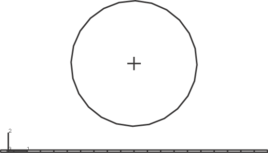
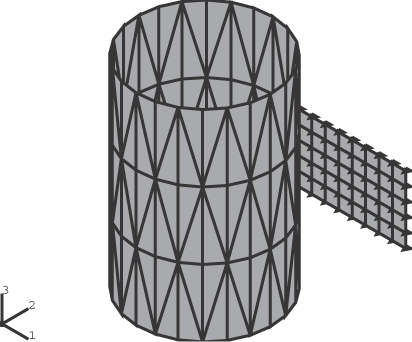

# 1.6.7 可变形体与网格化刚性表面间的有限滑动接触

**产品：**Abaqus/Standard  

### 功能测试

[*CONTACT PAIR](../key/key-link.md#usb-kws-hcontactpair) *DSURF*、*RSURF* *DSURF*是可变形体上的表面，*RSURF*是用刚性单元或声明为刚性的可变形单元网格化的刚性表面。

### 一、二维网格化刚性表面

### 单元测试

B21    CPS4R    R2D2    T2D2  

### 问题描述

这些测试验证二维网格化刚性表面是否正确生成，以及表面方向和法向平滑是否正确。第一个问题涉及在一个封闭的网格化刚性表面周围形成一个弹性梁。这个封闭表面可以看作管道截面。第二个问题与第一个类似，但使用用户定义的法向。

假设表面是刚性的，用2节点刚性单元进行网格化。该梁长6英寸，宽0.05英寸，用20个CPS4R实体单元建模。其相对于第一个刚性表面的原始位置如图1.6.7-1所示。假设它是弹性的，杨氏模量为30.0×10⁶ lb/in²，泊松比为0.3。在可变形体上定义的表面和刚性体上定义的表面配对以强制接触。

**图1.6.7-1** 梁相对于刚性表面的原始位置。

分析由两部分组成。第一部分通过向上移动梁的两端来建立梁与刚性表面之间的接触，同时约束梁端水平。第二部分涉及释放梁端约束，并在梁底部表面施加压力载荷，使其牢固地包裹在管道截面周围。在第一个问题中施加1000 lb/in²的压力，在第二个问题中施加2000 lb/in²的压力。

### 结果与讨论

可变形体符合刚性体的形状。

### 输入文件

[ei22ssr1.inp](../eif/ei22ssr1.inp)

由刚性单元组成的二维刚性表面，使用默认Abaqus生成的法向。

[ei22ssr1_surf.inp](../eif/ei22ssr1_surf.inp)

由刚性单元组成的二维刚性表面，使用默认Abaqus生成的法向，采用表面-表面接触。

[ei22ssr2.inp](../eif/ei22ssr2.inp)

由刚性单元组成的二维刚性表面，使用用户指定的法向。

[ei22srb2.inp](../eif/ei22srb2.inp)

用于模拟接触的Bezier刚性表面。（此功能不再支持。）

[ei22srb2_surf.inp](../eif/ei22srb2_surf.inp)

用于模拟接触的Bezier刚性表面，采用表面-表面方法。（此功能不再支持。）

[ed22ssr1.inp](../eif/ed22ssr1.inp)

由声明为刚性的梁单元组成的二维刚性表面，使用默认Abaqus生成的法向。

[ed22ssr2.inp](../eif/ed22ssr2.inp)

由声明为刚性的梁单元组成的二维刚性表面，使用用户指定的法向。

### 二、三维网格化刚性表面

### 单元测试

R3D3    S3R    S4    S4R  

### 问题描述

此测试验证三维网格化刚性表面是否正确生成，以及用于确定到此类表面最近距离的搜索算法是否稳健。该问题涉及在一个圆柱体周围形成一个弹性薄板。

假设圆柱体是刚性的，半径为5英寸。带有网格化刚性表面的原始网格如图1.6.7-2所示。

**图1.6.7-2** 圆柱体的原始定义。

薄板尺寸为10英寸×5英寸，用50个4节点S4R或S4壳单元建模。一侧对薄板施加ENCASTRE型边界条件。施加700 lb/in²的压力载荷使其在圆柱体周围成形。假设薄板是弹性的，杨氏模量为3×10⁶ lb/in²，泊松比为0.3。薄板厚度为0.25英寸。

在刚性圆柱体和可变形薄板上定义的表面配对以强制接触。

### 结果与讨论

可变形体符合刚性体的形状。

### 输入文件

[eig1ssr3.inp](../eif/eig1ssr3.inp)

用刚性单元网格化的三维刚性表面。与S4R单元接触。

[eig1ssr3_surf.inp](../eif/eig1ssr3_surf.inp)

用刚性单元网格化的三维刚性表面。表面-表面接触与S4R单元。

[eig1ssr4.inp](../eif/eig1ssr4.inp)

用刚性单元网格化的三维刚性表面。与S4单元接触。

[eig1srb3.inp](../eif/eig1srb3.inp)

用于模拟接触的Bezier刚性表面。（此功能不再支持。）

[edg1ssr3.inp](../eif/edg1ssr3.inp)

用声明为刚性的壳单元网格化的三维刚性表面。与S4R单元接触。

[edg1ssr4.inp](../eif/edg1ssr4.inp)

用声明为刚性的壳单元网格化的三维刚性表面。与S4单元接触。

