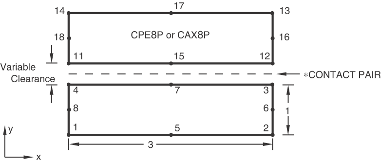
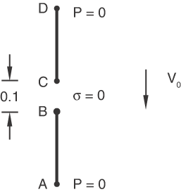
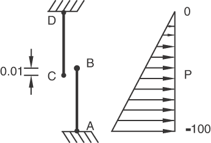
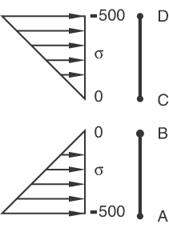
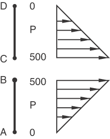
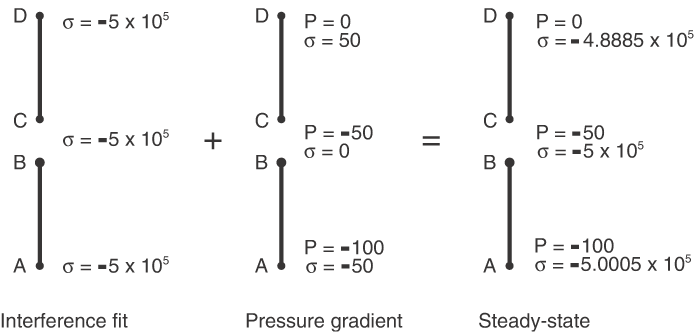

# 1.6.4 耦合孔隙压力-位移单元间的小滑动接触

**产品：**Abaqus/Standard  

### 单元测试

CAX8P    CPE8P  

### 功能测试

小滑动接触对

### 问题描述

**图1.6.4-1** 所有测试的单元拓扑。

**模型：**

所有单元的厚度为0.5。

**材料：**

土壤的弹性属性为杨氏模量=1×10⁸，泊松比=0.0。土壤的渗透率=1×10⁴。所有测试的初始孔隙比=1.0。

**边界条件：**

在所有测试中，节点在1方向上被约束。

### 分析测试

有四种不同的测试。

#### 初始条件测试

此测试验证初始孔隙流体压力过程是否与接触对一起工作。模型中的所有节点初始化为50.0的孔隙压力。

#### 固结测试

固结测试验证接触对过程是否与土壤固结过程正确配合。该测试本质上一个一维问题，两个表面以恒定速率靠拢，如图1.6.4-2所示。

图中A点对应节点1、5和2；B点对应节点4、7和3；等等。当C点和B点相互移动时，流体通过A点和D点流出。这在土壤段AB和CD中产生压应力状态。孔隙压力场发展以平衡有效应力。

#### 稳态测试

稳态测试验证接触对过程是否与土壤固结过程正确配合。问题与固结测试中的建模相同。稳态时应力和孔隙压力为零；因此，有必要使用求解控制来避免因时间平均力和力残差几乎为零而导致的收敛困难。

#### 干涉测试

干涉测试验证接触对过程是否正确处理界面闭合和孔隙压力梯度的组合。该测试本质上一个一维问题，其中两个表面以干涉配合开始，并且两物体之间存在孔隙压力梯度。寻求稳态平衡。

### 结果与讨论

大多数用于这些测试的输入文件使用非对称方程求解器。使用非对称求解器可改善稳态分析中的收敛性。

#### 初始条件测试

每个节点的孔隙压力应为50.0。

#### 固结测试

根据达西定律，我们发现分析第一步的有效应力分布如图1.6.4-4所示。

根据牵引力平衡，我们发现孔隙压力分布如图1.6.4-5所示。表面停止相互移动后，应力和孔隙压力迅速降至零。这在分析的第二步中进行建模。

#### 稳态测试

稳态结果是零应力和零孔隙压力。

#### 干涉测试

此问题可作为两种状态的线性叠加来分析解决，如图1.6.4-6所示。

### 输入文件

[ei13psi1.inp](../eif/ei13psi1.inp)

初始条件测试，CPE8P单元。

[ei13psi1_surf.inp](../eif/ei13psi1_surf.inp)

初始条件测试，CPE8P单元，表面-表面约束施加方法。

[ei13psi1_auglagr.inp](../eif/ei13psi1_auglagr.inp)

初始条件测试，CPE8P单元。

[ei13psi1_auglagr_surf.inp](../eif/ei13psi1_auglagr_surf.inp)

初始条件测试，CPE8P单元，表面-表面约束施加方法。

[eia3psi1.inp](../eif/eia3psi1.inp)

初始条件测试，CAX8P单元。

[eia3psi1_surf.inp](../eif/eia3psi1_surf.inp)

初始条件测试，CAX8P单元，表面-表面约束施加方法。

[ei13psnc.inp](../eif/ei13psnc.inp)

固结测试，CPE8P单元。

[ei13psnc_surf.inp](../eif/ei13psnc_surf.inp)

固结测试，CPE8P单元，表面-表面约束施加方法。

[ei13psnc_auglagr.inp](../eif/ei13psnc_auglagr.inp)

固结测试，CPE8P单元。

[ei13psnc_auglagr_surf.inp](../eif/ei13psnc_auglagr_surf.inp)

固结测试，CPE8P单元，表面-表面约束施加方法。

[eia3psnc.inp](../eif/eia3psnc.inp)

固结测试，CAX8P单元。

[eia3psnc_surf.inp](../eif/eia3psnc_surf.inp)

固结测试，CAX8P单元，表面-表面约束施加方法。

[ei13psns.inp](../eif/ei13psns.inp)

稳态测试，CPE8P单元。

[ei13psns_surf.inp](../eif/ei13psns_surf.inp)

稳态测试，CPE8P单元，表面-表面约束施加方法。

[ei13psns.inp](../eif/ei13psns.inp)

稳态测试，CPE8P单元。

[ei13psns_surf.inp](../eif/ei13psns_surf.inp)

稳态测试，CPE8P单元，表面-表面约束施加方法。

[ei13psni.inp](../eif/ei13psni.inp)

干涉测试，CPE8P单元。

[ei13psni_surf.inp](../eif/ei13psni_surf.inp)

干涉测试，CPE8P单元，表面-表面约束施加方法。

[ei13psni_auglagr.inp](../eif/ei13psni_auglagr.inp)

干涉测试，CPE8P单元。

[ei13psni_auglagr_surf.inp](../eif/ei13psni_auglagr_surf.inp)

干涉测试，CPE8P单元，表面-表面约束施加方法。

[eia3psni.inp](../eif/eia3psni.inp)

干涉测试，CAX8P单元。

[eia3psni_surf.inp](../eif/eia3psni_surf.inp)

干涉测试，CAX8P单元，表面-表面约束施加方法。

### 图片

**图1.6.4-2** 一维固结测试。

**图1.6.4-3** 干涉测试。

**图1.6.4-4** 固结测试第一步的有效应力分布。

**图1.6.4-5** 固结测试的孔隙压力分布。

**图1.6.4-6** 用于求解干涉测试问题的两种状态的线性叠加。

