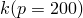
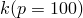
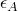

# 1.6.9 Finite-sliding contact between coupled thermal-electrical-structural elements

**Product: **Abaqus/Standard  

### Elements tested

Q3D4    Q3D6    Q3D8    Q3D8R    

### Features tested

Contact pair

Gap conductance

Gap electrical conductance

Gap heat generation

Gap radiation

### Problem description

The tests consist of a small block pressed against a larger block that is fixed on the bottom. The smaller block slides horizontally on the larger block according to the prescribed loading and displacement history. A smoothing factor of 0.05 is used on the contact pairs. A three-dimensional model with width 1.0 is used. The width of the bottom block is chosen to be slightly larger than that of the upper block to ensure that the upper block contacts the lower block.

**Material: **

**Solid**

Linear elastic, Young's modulus = 30.0  106, Poisson's ratio = 0.3, conductivity = 10.0, electrical conductivity = 0.1, joule heat fraction = 0.0, density = 1000.0, specific heat = 0.001.

**Interface**

Friction coefficient (nonzero only for the frictional heat generation tests),  = 0.1.

Gap conductance varies with pressure for the interface conductance tests,  = 5.0,  = 20.0.

Gap electrical conductance varies with pressure for the interface conductance tests,  = 0.05,  = 0.2.

Gap conductance (for the frictional heat generation tests), 20.0.

Gap radiation constants (for the interface radiation tests only),  = = 0.74074, *F*= 1.0 with absolute zero at = 273.16.

### Loading history for interface conductance tests

**Step 1, transient:**

A downward pressure of 100 is applied on top of the smaller block. A flux of 100 and a current flux of 1.0 are applied into the smaller block through its surface. The center element of the large block has a film condition with a film coefficient of 10.0 and sink temperature of 0.0 at the bottom face. This step is used to check the gap conductivity and the gap electrical conductivity. Results should be symmetric about an axis that is parallel to the line joining the centers of the two blocks, and thermal and electrical equilibrium must be satisfied.

**Step 2, transient:**

The top block is made to slide horizontally, back and forth, over the bottom block to assure that the formulation does not fail under large relative sliding. The results are consistent with thermal and electrical equilibrium.

**Step 3, steady state:**

The top block is in the same configuration as at the end of Step 1 but is brought to steady state to eliminate transient effects. This step allows for a more exact check on thermal equilibrium of the assembly because the heat conducted across the interface must equilibrate the heat passed into the assembly by the applied flux.

**Step 4, steady state:**

The pressure is increased on the top surface. This step is designed to test pressure-dependent interface conductivities. The temperature and the electrical potential changes across the interface should be four times that at the end of Step 3 because the interface conductivities are reduced by one-fourth.

**Step 5, transient:**

The applied flux is ramped down quickly, and the small block is made to slide off the larger block. This step tests that the interface heat transfer and current flow are eliminated when a slave node slides off the end of the corresponding master surface. The smaller block becomes insulated, and the temperature and the electrical potential are constant throughout the block.

### Loading history for interface radiation tests

The loading is the same for these tests as for the interface conductance tests, except for the value of the electrical potential, which is now set to zero at all nodes. These problems are designed to test radiation heat transfer in the interface. Since the radiative properties are not pressure dependent, the results for Step 4 are identical to those in Step 3 in these runs.

### Loading history for frictional heat generation tests

The value of the electrical potential is set to zero at all nodes, and the top (outer) surface of the smaller block is constrained to remain straight and nonrotating via constraint equations. The Lagrange friction formulation is used. With this formulation all relative motion is converted into heat. The default friction algorithm uses an automatic penalty method, allowing small relative motions without dissipation. Using the default friction algorithm would cause the generated heat to be underestimated by about 0.7%.

**Step 1:**

A downward force of 200 is applied to the top surface to establish contact. Virtually no heat generation occurs.

**Step 2:**

The top block is made to slide back and forth with friction. Assuming Coulomb friction, a total of 120 units of heat is generated. Of this generated heat 60 units are absorbed by the contacting bodies because the fraction of frictional dissipation converted to heat is specified to be 0.5. Results are consistent with thermal equilibrium.

**STEP 3:**

The assembly sits without thermal loading to reach steady state. Because the assembly is adiabatic, it should attain a constant temperature. Based on the amount of heat generated and the heat capacity of the material, the final temperature of the assembly should be 7.5 for the planar case and 0.68 for the axisymmetric case.

### Results and discussion

The results agree with the analytically obtained values.

### Input files

##### **Abaqus/Standard input files**

#### Interface conductance tests:

[tes_lgslcond_q3d4.inp](../eif/tes_lgslcond_q3d4.inp)

Q3D4 elements.

[tes_lgslcond_q3d6.inp](../eif/tes_lgslcond_q3d6.inp)

Q3D6 elements.

[tes_lgslcond_q3d8.inp](../eif/tes_lgslcond_q3d8.inp)

Q3D8 elements.

[tes_lgslcond_q3d8_surf.inp](../eif/tes_lgslcond_q3d8_surf.inp)

Q3D8 elements using surface-to-surface contact.

[tes_lgslcond_q3d8r.inp](../eif/tes_lgslcond_q3d8r.inp)

Q3D8R elements.

[tes_lgslcond_q3d8r_surf.inp](../eif/tes_lgslcond_q3d8r_surf.inp)

Q3D8R elements using surface-to-surface contact.

#### Interface radiation tests:

[tes_lgslrad_q3d4.inp](../eif/tes_lgslrad_q3d4.inp)

Q3D4 elements.

[tes_lgslrad_q3d6.inp](../eif/tes_lgslrad_q3d6.inp)

Q3D6 elements.

[tes_lgslrad_q3d8.inp](../eif/tes_lgslrad_q3d8.inp)

Q3D8 elements.

[tes_lgslrad_q3d8_surf.inp](../eif/tes_lgslrad_q3d8_surf.inp)

Q3D8 elements using surface-to-surface contact.

[tes_lgslrad_q3d8r.inp](../eif/tes_lgslrad_q3d8r.inp)

Q3D8R elements using surface-to-surface contact.

[tes_lgslrad_q3d8r_surf.inp](../eif/tes_lgslrad_q3d8r_surf.inp)

Q3D8R elements.

#### Frictional heat generation tests:

[tes_lgslfrichg_q3d4.inp](../eif/tes_lgslfrichg_q3d4.inp)

Q3D4 elements.

[tes_lgslfrichg_q3d6.inp](../eif/tes_lgslfrichg_q3d6.inp)

Q3D6 elements.

[tes_lgslfrichg_q3d8.inp](../eif/tes_lgslfrichg_q3d8.inp)

Q3D8 elements.

[tes_lgslfrichg_q3d8_surf.inp](../eif/tes_lgslfrichg_q3d8_surf.inp)

Q3D8 elements using surface-to-surface contact.

[tes_lgslfrichg_q3d8r.inp](../eif/tes_lgslfrichg_q3d8r.inp)

Q3D8R elements.

[tes_lgslfrichg_q3d8r_surf.inp](../eif/tes_lgslfrichg_q3d8r_surf.inp)

Q3D8R elements using surface-to-surface contact.

