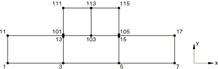
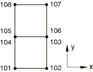

# 1.6.10 Finite-sliding contact between coupled pore pressure-displacement elements

**Product: **Abaqus/Standard  

### Elements tested

CPE4P    CPE6MP    CPE8P    C3D8P    C3D8RP    C3D8PT    C3D8RPT    

C3D10MP    C3D10MPT    C3D20P    

CAX4P    CAX4RP    CAX4PT    CAX6MP    

### Feature tested

Contact pair

### Problem description

Two series of tests each consisting of five input files are documented. In the first series a small block is pressed against a larger block that is fixed on the bottom. The smaller block slides horizontally on the larger block according to the prescribed loading and displacement history to test the formulation in large relative sliding. The axisymmetric tests are essentially the same except that the sliding structures are rings; the outer ring is shorter axially than the inner ring, and the sliding is in the axial direction. The mesh shown in [Figure 1.6.10--1](ch01s06abv88.md#verconttempdisp-mesh), which is used to test element CPE4P, is representative of all meshes used in these tests.

**Figure 1.6.10–1** Representative mesh for the sliding tests.

In the second series of tests two identical blocks are pressed against each other while no sliding occurs. Fixed boundary conditions for the pore pressure degrees of freedom on the edges away from the contact interface enable the exact calculation of the pore pressure on the contact interface. The mesh shown in [Figure 1.6.10--2](ch01s06abv88.md#vercontppressdisp-cpe4p), which is used to test element CPE4P, is representative of all meshes used in these tests.

**Figure 1.6.10–2** Representative mesh for the nonsliding tests.

**Material: **

Linear elastic, Young's modulus = 30.0  106, Poisson's ratio = 0.0, permeability = 1.0  104.

### Loading history for sliding tests

**Step 1, transient:**

A downward pressure of 100 is applied on top of the smaller block. For the two- and three-dimensional tests a pore fluid volume flux of 3  104 is applied into the smaller block through its upper surface (area is two units). To create a constant flux through the contact interface, a pore fluid volume flux of 1  104 is applied out of the larger block lower surface (area is six units). Results should be symmetric about an axis that is parallel to the line joining the centers of the two blocks, and the total pore fluid volume flux through the contact interface should be 6  104.

For the axisymmetric tests a pore fluid volume flux of 1  104 is applied into the smaller block through its outer surface (area is 12), and a pore fluid volume flux of 1  104 is applied out of the larger block inner surface (area is 12). The total pore fluid volume flux through the contact interface should be 3.76  103.

**Step 2, transient:**

The top block is made to slide horizontally (1.5 units) over the bottom block. The total pore fluid volume flux through the contact interface should remain 6  104 in the two- and three-dimensional tests and 3.76  103 in the axisymmetric cases.

### Loading history for the nonsliding tests

A downward pressure of 10.0 is applied on top of the upper block. The pore pressure is fixed and equal to 2.0 on the top surface of the upper block. The pore pressure on the bottom surface of the lower block is fixed and equal to 1.0. A coupled pore pressure analysis is conducted, and the pressure on the contact interface should be 1.5 for the two- and three-dimensional tests and 1.375 for the axisymmetric case.

### Results and discussion

The results agree with the analytically obtained values.

### Input files

#### Sliding tests:

[ei22pfss.inp](../eif/ei22pfss.inp)

CPE4P elements.

[ei22pfss_surf.inp](../eif/ei22pfss_surf.inp)

CPE4P elements using surface-to-surface contact.

[ei23pfss_cpe6mp.inp](../eif/ei23pfss_cpe6mp.inp)

CPE6MP elements.

[ei23pfss_cpe6mp_surf.inp](../eif/ei23pfss_cpe6mp_surf.inp)

CPE6MP elements using surface-to-surface contact.

[ei23pfss.inp](../eif/ei23pfss.inp)

CPE8P elements.

[ei23pfss_auglagr.inp](../eif/ei23pfss_auglagr.inp)

CPE8P elements.

[ei34pfss.inp](../eif/ei34pfss.inp)

C3D8P elements.

[ei34pfss_surf.inp](../eif/ei34pfss_surf.inp)

C3D8P elements using surface-to-surface contact.

[ei34pfss_c3d8rp.inp](../eif/ei34pfss_c3d8rp.inp)

C3D8RP elements.

[ei34ptfss.inp](../eif/ei34ptfss.inp)

C3D8PT elements.

[ei34ptfss_surf.inp](../eif/ei34ptfss_surf.inp)

C3D8PT elements using surface-to-surface contact.

[ei34pfss_c3d8rpt.inp](../eif/ei34pfss_c3d8rpt.inp)

C3D8RPT elements.

[ei39pfss.inp](../eif/ei39pfss.inp)

C3D10MP elements.

[ei39pfss_surf.inp](../eif/ei39pfss_surf.inp)

C3D10MP elements using surface-to-surface contact.

[ei39ptfss.inp](../eif/ei39ptfss.inp)

C3D10MPT elements.

[ei39ptfss_surf.inp](../eif/ei39ptfss_surf.inp)

C3D10MPT elements using surface-to-surface contact.

[ei38pfss.inp](../eif/ei38pfss.inp)

C3D20P elements.

[ei38pfss_auglagr.inp](../eif/ei38pfss_auglagr.inp)

C3D20P elements.

[eia2pfss.inp](../eif/eia2pfss.inp)

CAX4P elements.

[eia2pfss_surf.inp](../eif/eia2pfss_surf.inp)

CAX4P elements using surface-to-surface contact.

[eia2prss.inp](../eif/eia2prss.inp)

CAX4RP elements.

[eia2ptfss.inp](../eif/eia2ptfss.inp)

CAX4PT elements.

[eia2ptfss_surf.inp](../eif/eia2ptfss_surf.inp)

CAX4PT elements using surface-to-surface contact.

[eia3pfss_cax6mp.inp](../eif/eia3pfss_cax6mp.inp)

CAX6MP elements.

#### Nonsliding tests:

[ei22pfsn.inp](../eif/ei22pfsn.inp)

CPE4P elements.

[ei23pfsn_cpe6mp.inp](../eif/ei23pfsn_cpe6mp.inp)

CPE6MP elements.

[ei23pfsn.inp](../eif/ei23pfsn.inp)

CPE8P elements.

[ei23pfsn_auglagr.inp](../eif/ei23pfsn_auglagr.inp)

CPE8P elements.

[ei34pfsn.inp](../eif/ei34pfsn.inp)

C3D8P elements.

[ei34ptfsn.inp](../eif/ei34ptfsn.inp)

C3D8PT elements.

[ei39pfsn.inp](../eif/ei39pfsn.inp)

C3D10MP elements.

[ei39ptfsn.inp](../eif/ei39ptfsn.inp)

C3D10MPT elements.

[ei38pfsn.inp](../eif/ei38pfsn.inp)

C3D20P elements.

[ei38pfsn_auglagr.inp](../eif/ei38pfsn_auglagr.inp)

C3D20P elements.

[eia2pfsn.inp](../eif/eia2pfsn.inp)

CAX4P elements.

[eia2prsn.inp](../eif/eia2prsn.inp)

CAX4RP elements.

[eia2ptfsn.inp](../eif/eia2ptfsn.inp)

CAX4PT elements.

