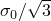
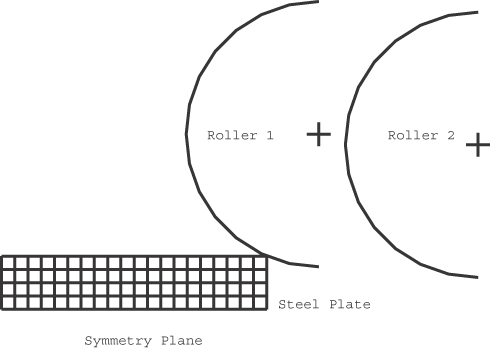
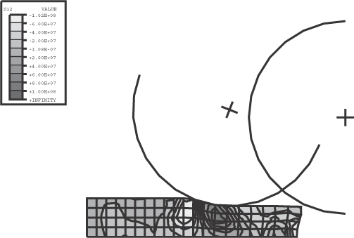
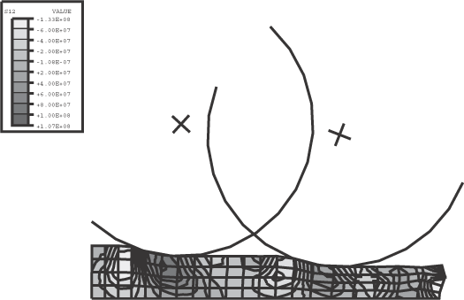
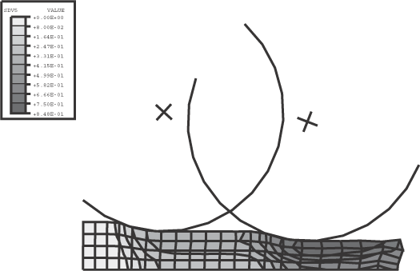
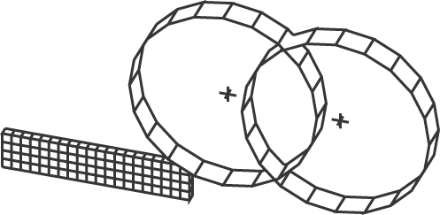
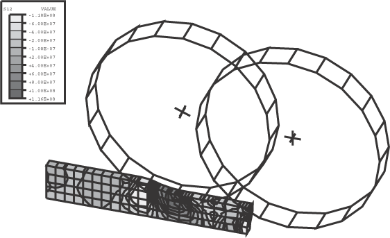
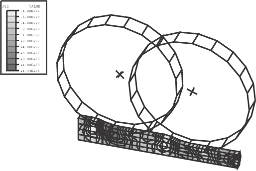
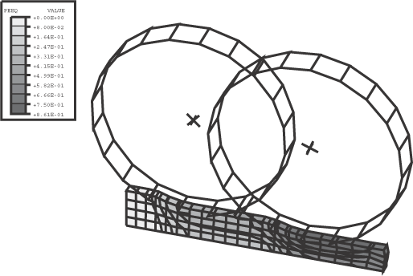
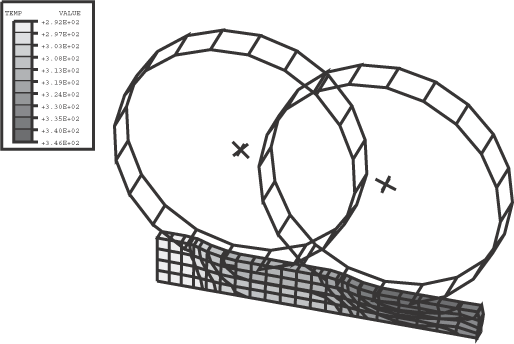

# 1.6.11 钢板轧制

**产品：**Abaqus/Explicit  

### 单元测试

CPE4R    R2D2    C3D8R    R3D4  

### 功能测试

大变形运动学、用户材料、运动学接触、惩罚接触、摩擦、解析刚性表面、多步骤、绝热热生成、在第一步后添加接触表面和边界条件。

### 问题描述

此验证问题类似于"Abaqus实例问题指南"第1.3.6节中的"厚板轧制"问题。此处，轧制问题的二维平面应变情况使用更粗的网格用于钢板。板使用平面应变单元（CPE4R）和8节点砖单元（C3D8R）建模。在三维模型中，所有平面外自由度被规定为零以表示平面应变状态。

钢板总厚度为40 mm，长度为100 mm。此分析模拟钢板通过两个辊架的轧制，每个辊架实现10 mm的厚度减小。每个辊的半径为50 mm。该模型利用了半对称性。

材料被建模为弹性完全塑性材料，弹性模量210 GPa，泊松比0.30，屈服应力250 MPa，密度7500 kg/m³。二维情况使用用户定义的材料行为以及用户子程序[`VUMAT`](../sub/sub-link.md#sub-xsl-vumat)。可以通过指定材料名称ABQTEST1来选择此模型。用户子程序可以选择包含运动硬化。然而，此实例问题仅测试完全塑性情况的用户材料，并通过与标准塑性模型（无硬化）的结果进行比较来验证结果（三维情况）。用户材料的硬化情况由"旋转圆柱问题"验证。 三维模型使用标准弹性和完全塑性材料模型，使用弹性和塑性材料属性指定。它还测试绝热热生成能力、比热容、热膨胀材料属性和非弹性热分数。模型中所有节点的初始温度为294°C。此材料的比热容为460.46焦耳/千克/°C。

轧制过程分两步进行分析。在第一步中，只有第一个辊具有规定的旋转速度。第二步在板即将到达第二个辊时开始。此时，添加了规定第二个辊旋转速度的边界条件。辊与板之间的摩擦系数为0.3。摩擦引起的最大牵引力假设为，即144.3 MPa。

接触约束可以在Abaqus/Explicit中通过运动学方式或惩罚方法强制执行。运动学接触给出约束的严格强制执行，而惩罚接触允许一些渗透。然而，两种约束方法对于涉及塑性变形的问题（如轧制问题）通常会给出几乎相同的结果，因为惩罚接触的接触渗透往往较小。这与以下事实有关：默认惩罚刚度约为接触界面单元弹性刚度的10%。当材料屈服时，惩罚刚度通常会比材料的有效刚度大得多，因此渗透将相当小。对于材料保持弹性的问题（见"Abaqus基准指南"第1.1.11节"Hertz接触问题"），如果使用惩罚方法，接触渗透可能很显著。运动学接触仅在接触对能力中可用，而惩罚接触在Abaqus/Explicit中的接触对能力和通用接触能力中都可用。对于此分析，使用了三种方法来强制执行接触约束：接触对的运动学接触、接触对的惩罚接触和通用接触。在涉及接触对的分析的第一步中，当只有第一个辊具有规定的旋转速度时，只定义了一个接触对。此接触对包含第一个辊的表面和板的外表面。在第二步开始时，当板即将到达第二个辊时，引入了包含第二个辊的表面和板的外表面的第二个接触对。对于使用通用接触的分析，使用通用接触包含过程引用默认的内部生成的包容性接触表面；因此，接触定义不需要从步骤到步骤进行修改。

两个辊使用的辊速度均为600 rad/s。关于轧制速度选择的详细讨论，请参见"Abaqus实例问题指南"第1.3.6节"厚板轧制"。

### 结果与讨论

图1.6.11-1显示了二维模型的原始网格。图1.6.11-2显示了二维模型第一步结束时的剪切应力等值线。请注意，第一辊在第一步期间旋转，而第二个辊保持静止。图1.6.11-3显示了二维模型第二步结束时的剪切应力等值线。图1.6.11-4显示了二维模型第二步结束时的等效塑性应变（SDV5）等值线。由于用户子程序将等效塑性应变值存储为第五个状态变量，因此使用变量SDV5生成等值线图。

图1.6.11-5包含三维模型原始网格的线框图。图1.6.11-6显示了三维模型第一步结束时剪切应力等值线。图1.6.11-7显示了三维模型第二步结束时剪切应力等值线。图1.6.11-8显示了三维模型第二步结束时等效塑性应变（PEEQ）等值线。图1.6.11-9显示了三维模型第二步结束时温度等值线。请注意，此示例中绝热热生成的规定对整体解决方案没有影响，因为所有材料属性都不依赖于温度。它仅用于计算从耗散的塑性功获得的温度场。

### 输入文件

[roll2dapa_anl.inp](../eif/roll2dapa_anl.inp)

使用解析刚性表面的二维运动学接触分析。

[roll3dapa_rev_anl.inp](../eif/roll3dapa_rev_anl.inp)

使用解析刚性表面（TYPE=REVOLUTION）的三维运动学接触分析。

[roll3dapa_rev_anl_gcont.inp](../eif/roll3dapa_rev_anl_gcont.inp)

使用解析刚性表面（TYPE=REVOLUTION）的三维通用接触分析。

[roll2dapa.inp](../eif/roll2dapa.inp)

使用刚性单元的二维运动学接触分析。

[roll3dapa.inp](../eif/roll3dapa.inp)

使用刚性单元的三维运动学接触分析。

[roll3dapa_gcont.inp](../eif/roll3dapa_gcont.inp)

使用刚性单元的三维通用接触分析。

[roll3dapa_cyl_anl.inp](../eif/roll3dapa_cyl_anl.inp)

使用解析刚性表面（TYPE=CYLINDER）的三维运动学接触分析。

[roll3dapa_cyl_anl_gcont.inp](../eif/roll3dapa_cyl_anl_gcont.inp)

使用解析刚性表面（TYPE=CYLINDER）的三维通用接触分析。

[roll2dapa_anl_pnlty.inp](../eif/roll2dapa_anl_pnlty.inp)

使用解析刚性表面的二维惩罚接触分析。

[roll3dapa_rev_pnlty.inp](../eif/roll3dapa_rev_pnlty.inp)

使用解析刚性表面（TYPE=REVOLUTION）的三维惩罚接触分析。

### 图片

**图1.6.11-1** 二维模型的未变形网格。

**图1.6.11-2** 二维模型第1步结束时剪切应力等值线。

**图1.6.11-3** 二维模型第2步结束时剪切应力等值线。

**图1.6.11-4** 二维模型第2步结束时等效塑性应变等值线。

**图1.6.11-5** 三维模型的未变形网格。

**图1.6.11-6** 三维模型第1步结束时剪切应力等值线。

**图1.6.11-7** 三维模型第2步结束时剪切应力等值线。

**图1.6.11-8** 三维模型第2步结束时等效塑性应变等值线。

**图1.6.11-9** 三维模型第2步结束时温度等值线。

