# 1.6.12 Beam impact on cylinder

**Product: **Abaqus/Explicit  

### Elements tested

S4R    R3D4    

### Features tested

Distributed loads, kinematic contact, penalty contact, analytical rigid surfaces, rigid bodies.

### Problem description

This problem involves the analysis of the dynamic response of a cantilever beam subjected to a sudden, impulsively applied, pressure loading. Two cases are considered. First, the response of the cantilever beam is determined. In this case the beam responds in the first bending mode. In the second case a rigid cylinder is introduced beneath the beam and the beam strikes it.

The beam is 500 mm long and 100 mm wide and has a thickness of 2.5 mm. Half of the beam is modeled with a 20  3 mesh of shell elements using symmetry boundary conditions along the centerline of the beam. The beam is made of steel, with a Young's modulus of 200 GPa and a Poisson's ratio of 0.3. The density is 7800 kg/m3. A von Mises elastic, perfectly plastic material model is used with a yield stress of 250 MPa.

The beam is subjected to a constant downward pressure of 0.1 MPa applied instantaneously at the beginning of the step, as shown in [Figure 1.6.12--1](ch01s06abv90.md#exxbeamimpact-impulseload).

In the second case a fixed, rigid cylinder of radius 40 mm is introduced, as shown in [Figure 1.6.12--2](ch01s06abv90.md#exxbeamimpact-impactcyl). Contact surfaces are defined on the lower surface of the beam and the outer surface of the cylinder. Tests are conducted with both kinematic enforcement and penalty enforcement of the contact constraints. Kinematic contact is the default, but the penalty method can be specified as an alternative.

Two approaches for modeling the cylindrical surface are tested: using rigid elements and using analytical rigid surfaces. Analytical rigid surfaces are typically the preferred means for representing simple rigid geometries such as this in terms of both accuracy and computational performance. However, analytical surfaces always act as a pure master surface, and penetrations of a master surface into regions between slave nodes can occur without generating contact forces (see ["Contact constraint enforcement methods in Abaqus/Explicit," Section 38.2.3 of the Abaqus Analysis User's Guide](../usb/usb-link.md#usb-cni-aexpcontactconstraints)). These penetrations may be significant if the slave surface is coarsely discretized. In these cases it may be preferable to use an element-based rigid surface and balanced master-slave penalty contact. Weighting of a rigid surface as a slave surface is allowed only if it is element-based (not an analytical surface) and penalty contact is used.

Additional refinement of the rigid surface in the cylindrical direction has been used for the model in which the rigid surface nodes act partially as slave nodes so that penetrations of the rigid surface into the deformable surface are detected. This refinement adds some computational cost, but it does not affect the stable time increment. Cylindrical refinement would not influence the contact compliance when the rigid surface acts as a pure master surface, so this type of refinement is not used in these cases.

A further comment on rigid surface modeling is that complex three-dimensional surface geometries that often occur in practice must be modeled with element-based rigid surfaces.

### Results and discussion

Verification for this problem is provided by comparing the values of significant problem variables with the values produced by an equivalent model in Abaqus/Standard. The Abaqus/Standard analyses use 5-point Simpson integration only and a half-increment residual force tolerance value of 1.0  103. The Abaqus/Explicit analyses are run with 5-point Simpson integration and 3-point Gauss integration. The rigid surface is modeled as analytical and acts as a pure master surface in the Abaqus/Standard analysis. The contact constraints account for the shell thickness in the Abaqus/Explicit analyses only. The Abaqus/Explicit results shown below are for an element-based rigid surface with kinematic enforcement of contact constraints, except where noted otherwise.

[Table 1.6.12--1](ch01s06abv90.md#table-beamimp-norigid) and [Table 1.6.12--2](ch01s06abv90.md#table-beamimp-rigid) compare tip displacements, tip velocities, and whole model energies at several points along the beam's symmetry axis. Tip displacements and velocities are averaged over the four nodes at the tip of the beam. The results from the Abaqus/Explicit analyses using Simpson (5-point) and Gauss (3-point) integration through the thickness of the shell demonstrate slight sensitivity of the response to the choice of the integration rule. Corresponding components of displacement and velocity at the tip of the beam are within 0.1% and 0.5%, respectively, for the Abaqus/Explicit (Simpson integration) and Abaqus/Standard analyses without the cylinder. For the problem with the cylinder, the significant components of displacement and velocity are within 2% and 8%, respectively, between the Abaqus/Explicit and Abaqus/Standard results with Simpson integration.

[Figure 1.6.12--3](ch01s06abv90.md#exxbeamimpact-xpl-beam) shows contours of equivalent plastic strain on the bottom surface of the beam for the Abaqus/Explicit analysis using Simpson integration without the rigid cylinder. [Figure 1.6.12--4](ch01s06abv90.md#exxbeamimpact-std-beam) shows the corresponding plot for the Abaqus/Standard analysis. The contours are plotted on the deformed shapes of the beam. After 0.08 seconds a plastic hinge has formed at the fixed end of the beam for both cases.

[Figure 1.6.12--5](ch01s06abv90.md#exxbeamimpact-xpl-withcyl) and [Figure 1.6.12--6](ch01s06abv90.md#exxbeamimpact-std-withcyl) show contours of equivalent plastic strain on the bottom surface of the beam impacting the rigid cylinder for the Abaqus/Explicit analysis with Simpson integration and the Abaqus/Standard analysis, respectively.

[Figure 1.6.12--7](ch01s06abv90.md#exxbeamimpact-kine-anal) through [Figure 1.6.12--10](ch01s06abv90.md#exxbeamimpact-pnlty-facet) show the final configuration near the rigid cylinder for four Abaqus/Explicit analyses. [Figure 1.6.12--7](ch01s06abv90.md#exxbeamimpact-kine-anal) corresponds to an analysis with an analytical rigid surface and kinematic contact. [Figure 1.6.12--8](ch01s06abv90.md#exxbeamimpact-pnlty-anal) corresponds to an analysis with an analytical rigid surface and penalty contact. In both of these cases the analytical surface is the pure master surface of the contact pair. Contact is enforced at the slave nodes accounting for the shell thickness, and there is some penetration of the rigid surface into the shell. The final position of the tip is slightly different in [Figure 1.6.12--7](ch01s06abv90.md#exxbeamimpact-kine-anal) and [Figure 1.6.12--8](ch01s06abv90.md#exxbeamimpact-pnlty-anal), which is attributable to impacts being perfectly plastic with kinematic contact and elastic with penalty contact (see ["Contact constraint enforcement methods in Abaqus/Explicit," Section 38.2.3 of the Abaqus Analysis User's Guide](../usb/usb-link.md#usb-cni-aexpcontactconstraints)). [Figure 1.6.12--9](ch01s06abv90.md#exxbeamimpact-kine-facet) corresponds to an analysis with an element-based rigid surface and kinematic contact. [Figure 1.6.12--10](ch01s06abv90.md#exxbeamimpact-pnlty-facet) corresponds to an analysis with an element-based rigid surface and penalty contact. Penetration of the rigid surface into the shell surface is repelled only in [Figure 1.6.12--10](ch01s06abv90.md#exxbeamimpact-pnlty-facet), because this is the only case in which the rigid surface nodes are weighted at all as slave nodes.

### Input files

[beamimpac1.inp](../eif/beamimpac1.inp)

Simpson integration case without the rigid cylinder.

[beamimpac2.inp](../eif/beamimpac2.inp)

Simpson integration case with the rigid cylinder.

[beamimpac2_cyl_anl.inp](../eif/beamimpac2_cyl_anl.inp)

Explicit dynamic analysis using an analytical rigid surface.

[beamimpac2_rev_anl.inp](../eif/beamimpac2_rev_anl.inp)

Explicit dynamic analysis using an analytical rigid surface.

[beamimpac2_pnlty.inp](../eif/beamimpac2_pnlty.inp)

Explicit dynamic analysis using an element-based rigid surface and penalty contact.

[beamimpac2_gcont.inp](../eif/beamimpac2_gcont.inp)

Explicit dynamic analysis using an element-based rigid surface and the general contact capability.

[beamimpac2_gcont_subcyc.inp](../eif/beamimpac2_gcont_subcyc.inp)

Explicit dynamic analysis using an element-based rigid surface and the general contact capability and subcycling.

[beamimpac2_rev_pnlty.inp](../eif/beamimpac2_rev_pnlty.inp)

Explicit dynamic analysis using an analytical rigid surface and penalty contact.

[beamimpac1_gauss.inp](../eif/beamimpac1_gauss.inp)

Gauss integration explicit dynamic analysis of the case without the rigid cylinder.

[beamimpac2_gauss.inp](../eif/beamimpac2_gauss.inp)

Gauss integration explicit dynamic analysis of the case with the rigid cylinder.

[beamstandard1.inp](../eif/beamstandard1.inp)

Implicit dynamic analysis of the case without the rigid cylinder.

[beamstandard2.inp](../eif/beamstandard2.inp)

Implicit dynamic analysis of the case with the rigid cylinder using the hard contact model.

[beamstandard2_auglagr.inp](../eif/beamstandard2_auglagr.inp)

Implicit dynamic analysis of the case with the rigid cylinder using the augmented Lagrangian contact model.

[beamimpac2_offset.inp](../eif/beamimpac2_offset.inp)

Explicit dynamic analysis of the case with the rigid cylinder that demonstrates the effects of shell offset and rigid thickness on contact surfaces.

### Tables

**Table 1.6.12–1** Comparison of results for case without rigid cylinder (results obtained on an SGI R4600 using single precision).
| Variable | Abaqus/Explicit | Abaqus/Standard |
| --- | --- | --- |
| (Gauss) | (Simpson) | (Simpson) |
| 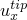 (mm) | 115 | 114 | 114 |
| 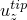 (mm) | 292 | 293 | 293 |
| 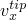 (m/s) | 45.4 | 45.6 | 45.5 |
| 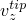 (m/s) | 64.7 | 65.0 | 64.8 |
| ALLKE (joules) | 434 | 429 | 428 |
| ALLIE (joules) | 29.3 | 31.7 | 31.6 |
| ETOTAL (joules) | 7.3 102 | 6.95 102 | 1.58 |

**Table 1.6.12–2** Comparison of results for case with rigid cylinder (results obtained on an SGI R4600 using single precision).
| Variable | Abaqus/Explicit | Abaqus/Standard |
| --- | --- | --- |
| (Gauss) | (Simpson) | (Simpson) |
|  (mm) | 253 | 248 | 250 |
|  (mm) | 122 | 141 | 143 |
|  (m/s) | 20.8 | 38.0 | 41.0 |
|  (m/s) | 77.2 | 56.0 | 56.9 |
| ALLKE (joules) | 82.0 | 83.8 | 86.8 |
| ALLIE (joules) | 114 | 112 | 112 |
| ETOTAL (joules) | 0.528 | 0.380 | 0.654 |

### Figures

**Figure 1.6.12–1** Impulsively loaded cantilever beam.

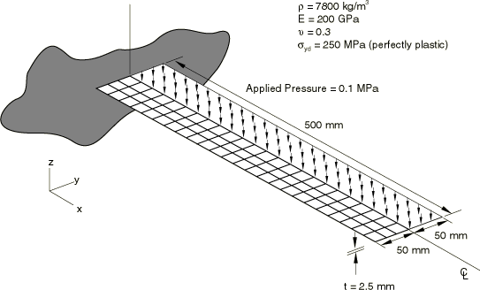

**Figure 1.6.12–2** Cantilever beam impacting on a rigid cylinder.

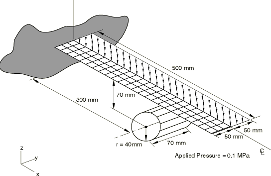

**Figure 1.6.12–3** Plastic strain on bottom surface of beam, Abaqus/Explicit analysis.

**Figure 1.6.12–4** Plastic strain on bottom surface of beam, Abaqus/Standard analysis.

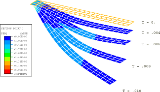

**Figure 1.6.12–5** Plastic strain on bottom surface of beam, Abaqus/Explicit analysis.

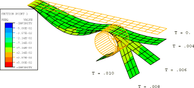

**Figure 1.6.12–6** Plastic strain on bottom surface of beam, Abaqus/Standard analysis.

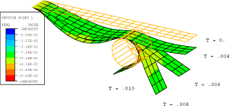

**Figure 1.6.12–7** Deformed configuration near rigid cylinder for an analytical rigid surface and kinematic contact.

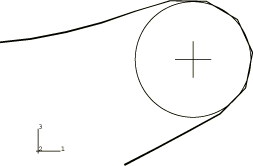

**Figure 1.6.12–8** Deformed configuration near rigid cylinder for an analytical rigid surface and penalty contact.

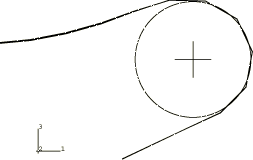

**Figure 1.6.12–9** Deformed configuration near rigid cylinder for an element-based rigid surface and kinematic contact.

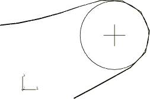

**Figure 1.6.12–10** Deformed configuration near rigid cylinder for an element-based rigid surface and penalty contact.

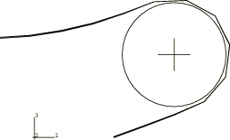

