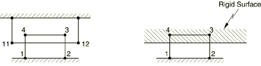
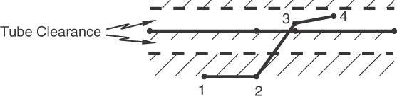

# 1.6.13 Contact with time-dependent prescribed interference values

**Product: **Abaqus/Standard  

### Elements tested

CPE4    C3D8    

### Features tested

Contact interference

Surface on a deformable body, surface on a deformable body or a rigid surface, and magnitude of allowable interference

### Problem description

The tests exercise the three ways in which contact interference can be used. Either a simple amount of allowable interference is specified, an allowable interference along a prescribed direction is specified, or the automatic shrink fit procedure is invoked. In this latter case Abaqus initializes the amount of allowable interference at each contact point with the penetration it calculates at the beginning of the analysis.

Most of the models consist of two elements lying next to each other with their contact surfaces initially interfering by a magnitude of 0.2 units. In the case of rigid surfaces there is only one element initially interfering with a straight rigid surface. The solid elements are either 4-node quads or 8-node bricks, as a substrate for the appropriate contact elements. A contact interference of magnitude 0.2 units is used to resolve the interference in (typically) five increments.

In the case of tube within tube elements (ITT) the model consists of two beams at a variable transverse distance from each other. One is totally fixed, and the other is fixed only axially. An initial tube clearance of 0.5 units produces interferences of up to 0.5 units. This interference is resolved by using the contact interference definition with a magnitude of 0.5 units.

**Material: **

**Solid**

| Young's modulus | 1.0 105 |
| --- | --- |
| Poisson's ratio | 0.0 |
| Conductivity | 5.0 |
| Density | 0.5 |
| Specific heat | 0.3 |

**Interface**

| Friction coefficient | 0.0 |
| --- | --- |
| Gap conductance | 2.0 (coupled temperature-displacement elements) |

### Results and discussion

The interference is resolved in five increments.

### Input files

##### **Surface-based contact**

#### Allowable interference:

[ei34siis.inp](../eif/ei34siis.inp)

C3D8 elements, small-sliding.

[eig1siis.inp](../eif/eig1siis.inp)

C3D8 elements, small-sliding, node-based surface.

[ei34siisf.inp](../eif/ei34siisf.inp)

C3D8 elements, finite-sliding.

[ei31siisf.inp](../eif/ei31siisf.inp)

C3D8 elements, finite-sliding, node-based surface.

[ei22siis.inp](../eif/ei22siis.inp)

CPE4 elements, small-sliding.

[ei22ssis.inp](../eif/ei22ssis.inp)

CPE4 elements, finite-sliding.

[eip1sris.inp](../eif/eip1sris.inp)

CPE4 elements, analytical rigid surface.

#### Allowable interference along a prescribed direction:

[ei34siid.inp](../eif/ei34siid.inp)

C3D8 elements, small-sliding.

[ei34srid.inp](../eif/ei34srid.inp)

C3D8, R3D4 elements.

[eig1siid.inp](../eif/eig1siid.inp)

C3D8 elements, small-sliding, node-based surface.

[ei34siidf.inp](../eif/ei34siidf.inp)

C3D8 elements, finite-sliding.

[ei31siidf.inp](../eif/ei31siidf.inp)

C3D8 elements, finite-sliding, node-based surface. 

[ei22siid.inp](../eif/ei22siid.inp)

CPE4 elements, small-sliding.

[ei22ssid.inp](../eif/ei22ssid.inp)

CPE4 elements, finite-sliding.

[eip1srid.inp](../eif/eip1srid.inp)

CPE4 elements, analytical rigid surface.

#### Automatic shrink fit:

[ei22siif.inp](../eif/ei22siif.inp)

CPE4 elements, small-sliding.

[ei22ssif.inp](../eif/ei22ssif.inp)

CPE4 elements, finite-sliding.

[ei34siiff.inp](../eif/ei34siiff.inp)

C3D8 elements, finite-sliding.

##### **Contact element approach (undocumented)**

#### Allowable interference:

[ei21stvs.inp](../eif/ei21stvs.inp)

B21, ITT21 elements.

[eis1sgvs.inp](../eif/eis1sgvs.inp)

C3D8, GAPSPHER elements.

[eiu1sgvs.inp](../eif/eiu1sgvs.inp)

CPE4, GAPUNI elements.

#### Allowable interference along a prescribed direction:

[ei21stvd.inp](../eif/ei21stvd.inp)

B21, ITT21 elements.

[eis1sgvd.inp](../eif/eis1sgvd.inp)

C3D8, GAPSPHER elements.

[eiu1sgvd.inp](../eif/eiu1sgvd.inp)

CPE4, GAPUNI elements.

