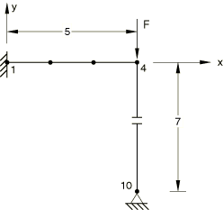
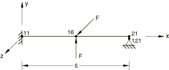
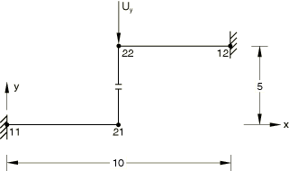
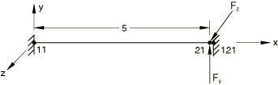

# 1.6.14 离散点之间的接触

**产品：**Abaqus/Standard  

### 单元测试

GAPUNI    GAPCYL    GAPSPHER  

### 问题描述

使用简单的梁模型来验证单向、圆柱和球形间隙单元。

**具有正间隙的GAPUNI：**

GAP数据：初始间隙=0.5。

X、Y、Z闭合方向的方向余弦=（0.，1.，0.）。

边界条件：节点1被夹紧，节点10在x和y方向固定。

载荷情况1：节点4处=50；载荷情况2：节点4处=100。

**具有正间隙的GAPCYL：**

GAP数据：初始间隙=0.0208（正间隙）。

X、Y、Z圆柱轴线的方向余弦=（1.，0.，0.）。

边界条件：节点11被夹紧，节点121在x、y和z方向固定。

载荷：第1步：节点16处=2.0×10⁴；第2步：节点16处=3.0×10⁴。

**具有负间隙的GAPCYL：**

GAP数据：初始间隙=1.0（负间隙）。

X、Y、Z圆柱轴线的方向余弦=（1.，0.，0.）。

边界条件：节点11和12被夹紧，节点22处=5.0。

**具有正间隙的GAPSPHER：**

GAP数据：初始间隙=0.2080。

边界条件：节点11和121被夹紧。

载荷情况1：节点21处=2.0×10⁴和=3.0×10⁴；载荷情况2：节点21处=4.0×10⁴和=6.0×10⁴。使用NLGEOM参数。

### 结果与讨论

接触约束被正确满足。

### 输入文件

[eiu1sgcp.inp](../eif/eiu1sgcp.inp)

具有正间隙的GAPUNI单元，带[*LOAD CASE](../key/key-link.md#usb-kws-hloadcase)的扰动步。

[eic1sgcp.inp](../eif/eic1sgcp.inp)

具有正间隙的GAPCYL单元。

[eic1sgcn.inp](../eif/eic1sgcn.inp)

具有负间隙的GAPCYL单元。

[eis1sgcp.inp](../eif/eis1sgcp.inp)

具有正间隙的GAPSPHER单元，带[*LOAD CASE](../key/key-link.md#usb-kws-hloadcase)的扰动步。

