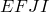
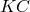
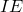
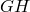
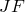
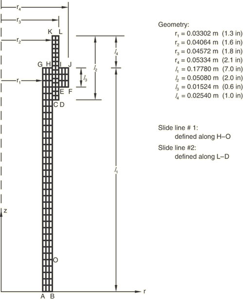

# 1.6.15 同心圆柱体之间的有限滑动——轴对称和CAXA模型

### 1.6.15 同心圆柱体之间的有限滑动——轴对称和CAXA模型

**产品：**Abaqus/Standard  

### 单元测试

ISL21A

### 功能测试

非轴对称-轴对称问题中的接触建模

接触对

滑线单元

可变形体上的表面，以及可变形体或刚性表面上的表面

### 问题描述

此示例说明了Abaqus滑线单元和接触表面定义在可能经受非线性、非轴对称变形的轴对称结构中的使用。此接触问题涉及两个外圆柱体相对于彼此以及相对于一个内部的约束圆柱体的相对运动。轴对称模型如图1.6.15-1所示，其中标识了三个圆柱体：由点定义的内部圆柱体、由点定义的中间圆柱体和由点定义的外圆柱体。此模型中使用了两条滑线：一条沿内部圆柱体的外边缘，从节点*H*通过节点*O*，第二条沿中间圆柱体的外边缘，从节点*L*通过节点*D*。沿中间圆柱体边缘定义的用于有限滑动的轴对称接触单元（滑线单元）与第一条滑线相关联。沿外圆柱体边缘定义的轴对称滑线单元与第二条滑线相关联。

对结构施加局部加压以启动三个物体表面之间的接触，然后迫使两个外圆柱体沿圆柱体向下滑动。这些载荷条件在两个单独的步骤中定义（加压然后滑动）。创建了额外的扰动步骤以测试载荷情况定义。

在轴对称模型中，内部圆柱体沿线和在*z*方向上被约束运动。此外，节点*B*被约束径向运动。在第一步中，对外圆柱体边缘施加207 MPa（30×10³ lb/in²）的压力，同时节点*L*和*J*被垂直约束。在第二步中，保持压力，节点*L*在负*z*方向上位移127 mm（5.0 in），而节点*J*在同一方向上位移114.3 mm（4.5 in）。

在CGAX4模型中，使用了与CAX4模型中相同的步骤和边界条件。添加了额外的第三步，其中最外层圆柱体绕*z*轴扭转0.1弧度，而最内层圆柱体被阻止扭转。

非轴对称模型由CAXA单元和在方向上各个位置的其他滑线单元组成。定义了滑线单元的积分区域以及滑线单元的角位置（以度为单位）。

在CAXA模型中，保持了轴对称模型中应用的边界条件，并将其扩展到方向。载荷条件与轴对称模型相同。在第二步之后，可以对CAXA模型施加任何轴对称或非轴对称载荷。

**材料：**

**实体：**

| 杨氏模量 | 207 GPa（30×10⁶ lb/in²） |
| --- | --- |
| 泊松比 | 0.3 |

**摩擦系数：**

| 中间圆柱体内边缘 | 0.2 |
| --- | --- |
| 外圆柱体 | 0.6 |

### 结果与讨论

轴对称和三维模型的结果匹配。

在CGAX4分析的第三步中（其中最外层圆柱体被扭转0.1弧度），中间圆柱体随最外层圆柱体旋转而不滑动。相对滑动被从/主接触对`DSURF`/`CSURF`之间产生的摩擦阻止。然而，中间圆柱体确实相对于最内层圆柱体滑动。在第二步结束时，计算出的从/主表面接触对`BSURF`/`ASURF`可以传递的关于*z*轴的最大扭矩为0.2×CTRQ=41000 lb-in，其中0.2是接触对的摩擦系数。在第三步中，由从/主表面接触对`BSURF`/`ASURF`关于*z*轴传递的摩擦剪切应力引起的实际力矩为40600 lb-in，与第二步的预测值在1%以内。

### 输入文件

[eia2sssa.inp](../eif/eia2sssa.inp)

使用接触表面方法的CAX4单元轴对称模型，带[*LOAD CASE](../key/key-link.md#usb-kws-hloadcase)的扰动步。

[eia2sssg.inp](../eif/eia2sssg.inp)

使用接触表面方法的CGAX4单元轴对称模型。

[eia2ssca.inp](../eif/eia2ssca.inp)

带有ISL21A和CAX4单元的轴对称模型，带[*LOAD CASE](../key/key-link.md#usb-kws-hloadcase)的扰动步。

[eia2sscn.inp](../eif/eia2sscn.inp)

带有ISL21A和CAXA41单元的非轴对称模型，带[*LOAD CASE](../key/key-link.md#usb-kws-hloadcase)的扰动步。

### 图片

**图1.6.15-1** 圆柱体滑动模型（示意图）。

