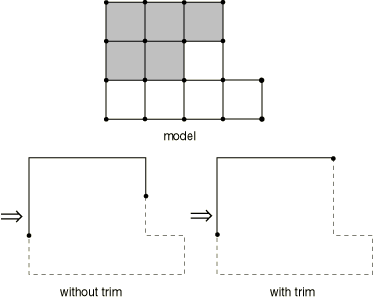
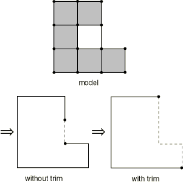
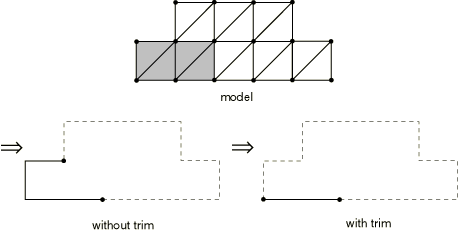
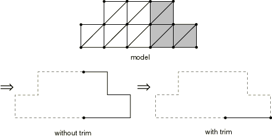
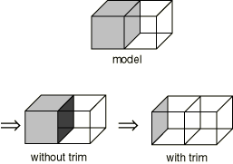
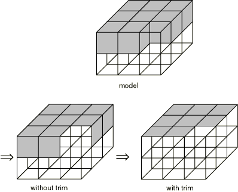
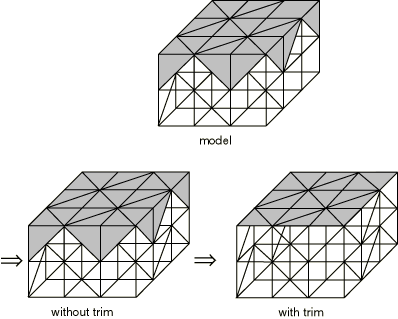
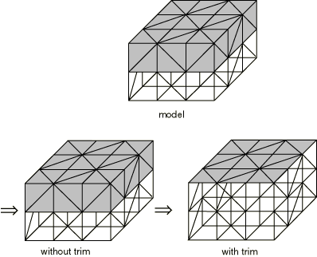

# 1.6.19 自动表面定义和表面修整

**产品：**Abaqus/Standard  

### 单元测试

C3D4    C3D8    CPS3    CPS4  

### 问题描述

输入文件[ele_trim2d.inp](../eif/ele_trim2d.inp)和[ele_trim3d.inp](../eif/ele_trim3d.inp)验证了自动表面生成能力和表面修整。当定义表面而不指定元素的面标识符时，元素集中位于模型外表面（自由表面）上的面形成表面。此定义可能导致包含不需要的面。表面修整为用户提供了对实体单元网格上创建的开放表面范围的一些基本控制。

输入文件[ele_trimdef.inp](../eif/ele_trimdef.inp)测试默认修整选项。Abaqus默认情况下会修整所有接触表面，但涉及有限滑动接触对的主表面除外。

### 结果与讨论

下面显示了一些测试示例。它们说明了二维表面端部和三维表面边缘的递归消除。修整对封闭表面（没有端部或边缘的表面）没有影响。在每个示例中，模型中的阴影元素用作表面定义中的元素集。分别显示自动生成的表面和通过修整生成的表面。

#### 二维表面的修整

图1.6.19-1和图1.6.19-2显示了修整如何用于二维四边形单元。在修整期间，包含端节点和角节点的任何面都会被移除。图1.6.19-3和图1.6.19-4显示了二维三角形单元的表面修整。

#### 三维表面的修整

图1.6.19-5和图1.6.19-6显示了三维砖单元的表面修整。图1.6.19-7和图1.6.19-8显示了修整如何用于三维四面体单元。

#### 接触表面的默认修整

研究了涉及小滑动、有限滑动以及小滑动和有限滑动接触对的表面的默认修整选项。

### 输入文件

[ele_trim2d.inp](../eif/ele_trim2d.inp)

二维表面的修整。

[ele_trim3d.inp](../eif/ele_trim3d.inp)

三维表面的修整。

[ele_trimdef.inp](../eif/ele_trimdef.inp)

接触表面的默认修整。

### 图片

**图1.6.19-1** 四边形单元——示例1。

**图1.6.19-2** 四边形单元——示例2。

**图1.6.19-3** 三角形单元——示例1。

**图1.6.19-4** 三角形单元——示例2。

**图1.6.19-5** 砖单元——示例1。

**图1.6.19-6** 砖单元——示例2。

**图1.6.19-7** 四面体单元——示例1。

**图1.6.19-8** 四面体单元——示例2。

