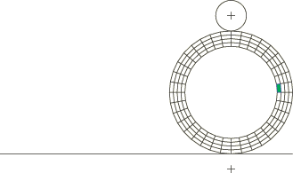
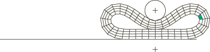
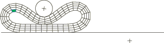

# 1.6.20 自接触有限滑动可变形表面

**产品：**Abaqus/Standard  Abaqus/Explicit  

### 单元测试

CPE3T    CPE4H    CPE4RT    CPE6MH    CPE8H    CPE8HT

C3D4H    C3D8H    C3D10H    C3D10I    C3D10MH    C3D20H

### 功能测试

接触对

可变形体上可能与自身接触的表面

### 问题描述

这些测试通过在接触对中声明单个表面名称来练习有限滑动表面的自接触功能。

模型由一个内半径为2.0、外半径为3.0的可变形环组成。环放置在平刚性表面上。圆形压头，由另一个解析刚性表面表示，最初与环在一点处接触。该压头半径为1.0，与平表面相对。接触对定义了环外表面与两个刚性表面之间以及环内表面与自身之间的接触。环采用平面应变单元建模：4节点四边形、6节点修正三角形或8节点四边形。在Abaqus/Standard模拟中，单元使用混合公式来适应不可压缩的neo-Hookean超弹性材料。虽然环的内表面是封闭的，但通过从表面定义中消除内周长的一个单元来测试开放表面，如图1.6.20-1所示。

载荷包括两个步骤。在第一步中，压头向下移动足够距离以产生内表面的自接触（图1.6.20-2）。在第二步中，压头同时平移（水平方向10.0）和旋转（围绕其中心8.0），使得环沿着平刚性表面滚动（图1.6.20-3）。这产生持续变化的接触区域。通过将刚性表面界面的摩擦系数设置为0.5来提供牵引力。

其中一个案例测试耦合热机械界面。环被分成两半。上半部分给定初始温度100.0，下半部分给定初始温度0.0。在涉及内表面的界面上允许热传递。两个步骤映射为每个100.0单位的时间。这是唯一也使用Abaqus/Explicit求解的案例。

在Abaqus/Explicit模拟中，CPE3T和CPE4RT单元都用于对环进行建模；厚度方向使用四个单元，周向使用72个单元。在材料定义中添加少量可压缩性，并使用质量缩放来获得有效解。还使用非默认沙漏控制来控制单元沙漏。

**材料：**

| 实体： |  | 1.0 103 |
| --- | --- | --- |
|  |  | 1.0 103 |
|  |  | （仅限Abaqus/Explicit） |
|  | 导热系数 | 5.0 104 |
|  | 密度 | 1.0 |
|  | 比热容 | 0.1 |
| 自接触界面： | 摩擦系数 | 0.0 |
|  | 间隙传导率 | 5.0 104 |
|  |  | （耦合温度-位移单元） |
| 刚性表面界面： | 摩擦系数 | 粗糙 |

### 结果与讨论

自接触建立并在整个单一表面上发展。这类问题如果使用部分内表面定义常规接触对将难以分析。

Abaqus/Explicit获得的耦合热机械界面测试的温度结果与Abaqus/Standard获得的结果一致。在这种情况下，两种分析产品预测的应力略有不同，因为Abaqus/Standard中建模的是完全不可压缩材料，而Abaqus/Explicit中建模的是略微可压缩的材料。

### 输入文件

##### **Abaqus/Standard输入文件**

[ei24sssc.inp](../eif/ei24sssc.inp)

CPE4H单元，封闭表面。

[ei24sssc_surf.inp](../eif/ei24sssc_surf.inp)

CPE4H单元，封闭表面，使用表面-表面接触。

[ei26sssc.inp](../eif/ei26sssc.inp)

CPE6MH单元，封闭表面。

[ei26sssc_surf.inp](../eif/ei26sssc_surf.inp)

CPE6MH单元，封闭表面，使用表面-表面接触。

[ei28sssc.inp](../eif/ei28sssc.inp)

CPE8H单元，封闭表面。

[ei28sssc_surf.inp](../eif/ei28sssc_surf.inp)

CPE8H单元，封闭表面，使用表面-表面接触。

[ei28tssc.inp](../eif/ei28tssc.inp)

CPE8HT单元，封闭表面。

[ei24sssu.inp](../eif/ei24sssu.inp)

CPE4H单元，开放表面。

[ei26sssu.inp](../eif/ei26sssu.inp)

CPE6MH单元，开放表面。

[ei28sssu.inp](../eif/ei28sssu.inp)

CPE8H单元，开放表面。

[ei34sssc.inp](../eif/ei34sssc.inp)

C3D4H单元，封闭表面。

[ei34sssc_surf.inp](../eif/ei34sssc_surf.inp)

C3D4H单元，封闭表面，使用表面-表面接触。

[ei38sssc.inp](../eif/ei38sssc.inp)

C3D8H单元，封闭表面。

[ei38sssc_surf.inp](../eif/ei38sssc_surf.inp)

C3D8H单元，封闭表面，使用表面-表面接触。

[ei310sssc.inp](../eif/ei310sssc.inp)

C3D10H单元，封闭表面。

[ei310sssc_surf.inp](../eif/ei310sssc_surf.inp)

C3D10H单元，封闭表面，使用表面-表面接触。

[ei310isssc.inp](../eif/ei310isssc.inp)

C3D10I单元，封闭表面。

[ei310isssc_surf.inp](../eif/ei310isssc_surf.inp)

C3D10I单元，封闭表面，使用表面-表面接触。

[ei310msssc.inp](../eif/ei310msssc.inp)

C3D10MH单元，封闭表面。

[ei310msssc_surf.inp](../eif/ei310msssc_surf.inp)

C3D10MH单元，封闭表面，使用表面-表面接触。

[ei320sssc.inp](../eif/ei320sssc.inp)

C3D20H单元，封闭表面。

[ei320sssc_surf.inp](../eif/ei320sssc_surf.inp)

C3D20H单元，封闭表面，使用表面-表面接触。

##### **Abaqus/Explicit输入文件**

[selfcontact_xpl_cpe3t.inp](../eif/selfcontact_xpl_cpe3t.inp)

CPE3T单元，封闭表面，运动学机械接触。

[selfcontact_xpl_cpe4rt.inp](../eif/selfcontact_xpl_cpe4rt.inp)

CPE4RT单元，封闭表面，运动学机械接触。

[selfcontact_xpl_p_cpe4rt.inp](../eif/selfcontact_xpl_p_cpe4rt.inp)

CPE4RT单元，封闭表面，惩罚机械接触。

### 图片

**图1.6.20-1** 自接触模型，使用4节点四边形和开放表面。

**图1.6.20-2** 步骤1的变形。

**图1.6.20-3** 步骤2的变形。

