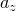

# 1.7.2 声学和结构单元的耦合

**产品：**Abaqus/Standard  

### 单元测试

ASI1    ASI2    ASI2A    ASI3    ASI3A    ASI4    ASI8

### 问题描述

模型由高100个单位、横截面积为400的流体柱组成。流体柱用五个声学单元建模；高度方向五个，横截方向一个。柱顶施加零压力边界条件，表示自由表面。柱底通过声学-结构界面单元连接到结构自由度。

执行动态分析，在此期间通过界面单元向流体柱底部施加正弦加速度。经过一个单位的动态时间后，确定整个流体柱的压力分布。

**材料：**

| 体积模量 | 2×109 |
| --- | --- |
| 密度 | 1000.0 |

**声学连接单元模型：**

| 连接长度 | 20.0 |
| --- | --- |
| 连接面积 | 400.0 |

**二维声学单元模型：**

| 声学单元尺寸 | 20.0×20.0 |
| --- | --- |
| 单元厚度 | 20.0 |

**轴对称声学单元模型：**

| 声学单元尺寸 | 11.28379×20.0 |
| --- | --- |

**三维声学单元模型：**

| 声学单元尺寸 | 20.0×20.0×20.0 |
| --- | --- |

### 结果与讨论

节点1处的在所有测试中相同。

### 输入文件

[ei11aca1.inp](../eif/ei11aca1.inp)

ASI1，AC1D2单元。

[ei11aca2.inp](../eif/ei11aca2.inp)

ASI1，AC1D3单元。

[ei22aca1.inp](../eif/ei22aca1.inp)

ASI2，AC2D4单元。

[eia2aca1.inp](../eif/eia2aca1.inp)

ASI2A，ACAX4单元。

[ei23aca2.inp](../eif/ei23aca2.inp)

ASI3，AC2D8单元。

[eia3aca2.inp](../eif/eia3aca2.inp)

ASI3A，ACAX8单元。

[ei34aca1.inp](../eif/ei34aca1.inp)

ASI4，AC3D8单元。

[ei38aca2.inp](../eif/ei38aca2.inp)

ASI8，AC3D20单元。

