# 1.7.4 Friction models in Abaqus/Standard

**Product: **Abaqus/Standard  

### Elements tested

B21    B31    

### Features tested

Friction

Changes to friction properties

### Problem description

The model consists of two rods perpendicular to a fixed rigid surface forced into contact with the rigid surface by a concentrated load applied in the axial direction at the top of each rod. Subsequently, shear forces are applied, such that 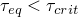, to verify the “stick” condition. Afterward, prescribed displacements are applied to the rods to force them to slide around the surface.

The contact between the bottom end of the rod and the rigid surface is modeled by specifying a master-slave contact pair. The bottom end of the rod constitutes the slave surface created with the node-based surface procedure and has a contact area of unity; hence, the normal force applied on the rod is equal to the contact pressure. Each rod has its separate surface interaction created with the contact property and friction definitions. Further, friction properties are modified during the analysis.

**Model: **

| Average length of all contact elements | 0.5 |
| --- | --- |

**Material: **

| Young's modulus | 30 106 |
| --- | --- |
| Poisson's ratio | 0.3 |

### Coulomb friction model

The first two steps of the analysis establish contact between each rod and the rigid surface and set up an equilibrium solution in which each beam element is compressed by a force of 300. The temperature of the slave node is specified as 20 and that of the rigid surface, as 0; therefore, the average surface temperature is 10 when contact is established. In Step 3 the normal force is increased to 400, and a shear force is applied to the first rod such that  and the rod remains sticking. The shear force is removed in Step 4. In Step 5 the friction model for rod 1 is modified. The normal force is increased to 550, and a shear force is applied such that  and the rod still remains sticking. The shear forces are removed in Step 6. In Step 7 the original friction model is specified with the friction properties reset to their original values. The pressure on rod 1 is increased to 850, and a slip is applied. In Step 8 a slip velocity–dependent friction model is introduced for rod 2. In Step 9 a slip is applied to rod 2 in which the slip rate is varied by prescribing the displacement with an amplitude curve during the static step.

**Surface interaction for rod 1:**

**Step 1**

 0.005 + 2.5  104(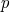  100).

 0.005 + 3.3  104(  100). (Anisotropic model only for case with 2 local tangent directions.)

**Step 5**

 0.002 + 3.3  104 for 100  500.

 0.1650 + 0.002 + 5.5  104(  500) for 500  900.

**Step 7**

Same as specified in Step 1.

**Step 8**

 0.0 for the elastic slip formulation.

Rough friction model for the Lagrange multiplier formulation.

**Surface interaction for rod 2:**

**Step 1**

 0.0 for the elastic slip formulation.

Rough friction model for the Lagrange multiplier formulation.

**Step 8**

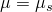 for 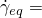 0;

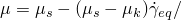2.0 for 0  2.0;

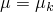 for 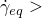 2.0, where

 0.2 and  0.0 for 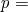 100.0 and

 0.4 and  0.2 for  500.0.

### Exponential decay model

The first two steps of the analysis establish contact between each rod and the rigid surface and set up an equilibrium solution in which each beam element is compressed by a force of 300. The pressure is kept constant throughout the analysis. In Step 3 a shear force is applied to rod 1 such that  and the rod remains sticking. The shear force is removed in Step 4. In Step 5 the friction model for rod 1 is modified by providing test data. A shear force is applied such that  and the rod remains sticking. The shear forces are removed in Step 6. In Step 7 the original friction model is specified with the friction properties reset to their original values. A slip is applied to rod 1. In Step 8 a new friction model is introduced for rod 2. In Step 9 a slip is applied to rod 2 in which the slip rate is varied by prescribing the displacement with an amplitude curve during the static step.

**Surface interaction for rod 1:**

**Step 1**

 0.3;

 0.1;

 4.

**Step 5**

Test data input:

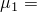 0.5, 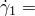 0.0;

 0.3, 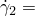 0.2;

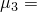 0.2, 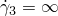.

**Step 7**

Same as specified in Step 1.

**Step 8**

 0.0 for the elastic slip formulation.

Rough friction model for the Lagrange multiplier formulation.

**Surface interaction for rod 2:**

**Step 1**

 0.0 for the elastic slip formulation.

**Step 8**

Test data input:

 0.3,  0.0;

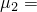 0.1,  0.2.

It is assumed that 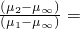 0.05.

### Results and discussion

Contact pressure, shear forces, and slip were verified.

### Input files

#### Coulomb friction model:

[eifricc1e.inp](../eif/eifricc1e.inp)

Elastic slip formulation, 1 local tangent direction.

[eifricc1l.inp](../eif/eifricc1l.inp)

Lagrange multiplier formulation, 1 local tangent direction.

[eifricc2e.inp](../eif/eifricc2e.inp)

Elastic slip formulation, 2 local tangent directions.

[eifricc2l.inp](../eif/eifricc2l.inp)

Lagrange multiplier formulation, 2 local tangent directions.

#### Exponential decay model:

[eifrice1e.inp](../eif/eifrice1e.inp)

Elastic slip formulation, 1 local tangent direction.

[eifrice1l.inp](../eif/eifrice1l.inp)

Lagrange multiplier formulation, 1 local tangent direction.

[eifrice2e.inp](../eif/eifrice2e.inp)

Elastic slip formulation, 2 local tangent directions.

[eifrice2l.inp](../eif/eifrice2l.inp)

Lagrange multiplier formulation, 2 local tangent directions.

