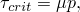
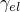
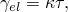
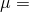
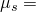
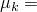
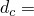
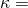

# 1.7.5 Friction models in Abaqus/Explicit

**Product: **Abaqus/Explicit  

### Elements tested

CPE3    MASS    

### Feature tested

Friction surface interaction.

### Problem description

The friction models provided in Abaqus/Explicit are tested on a simple problem, and the results are compared to analytical solutions.

The first example uses the classical Coulomb friction model. The critical shear stress, , at which surfaces begin to slide with respect to each other is given by 

where  is the coefficient of friction and *p* is the normal pressure.

The second example uses the classical Coulomb friction model explained above with softened tangential behavior. While under the condition of sticking friction, the surfaces are allowed to slip, generating “elastic” slip. The amount of elastic slip, , is given by

where  is the slope of the shear stress versus elastic slip curve and  is the shear stress calculated from the friction law. While under the condition of slipping friction, the behavior is identical to the classical Coulomb friction model without softened tangential behavior.

The third example uses a rate-dependent friction model in which the static friction coefficient, , decays to the kinetic friction coefficient, , according to the exponential form, 

where  is a user-defined decay parameter and  is the slip rate. This model is referred to as the exponential decay friction model.

The fourth example uses the Coulomb friction model with dependencies to simulate slip-rate-dependent friction. The coefficient of friction is defined as a function of the slip rate and the normal contact pressure. To facilitate comparison of the analyses, the tabular data are synthesized to approximate the exponential decay model.

The fifth example uses a rough friction model with softened tangential behavior. With this model, all tangential motion is in the form of elastic slip. This model differs from the second example in that the shear stress is no longer limited by , so no frictional slip can occur.

The problem consists of a rectangular block of two CPE3 elements sliding on a rigid surface. The block is 5 inches long, 1 inch high, and 1 inch thick. The elastic modulus is 3  107 psi, and the density is 7.3  104 lbf s2/in4. A uniform pressure of 2000 psi is applied on the top face of the block, and an initial velocity of 200 in/s is prescribed at each node of the block. The same problem is used to test user subroutine [`VFRIC`](../sub/sub-link.md#sub-xsl-vfric) in ["`VFRIC`, `VFRIC_COEF`, and `VFRICTION`," Section 4.1.30](ch04s01abv305.md).

For the classical Coulomb friction model  0.15; for the exponential decay friction model  0.15,  0.05, and  0.01 s/in; for the models including softened tangential behavior  104 psi/in.

### Results and discussion

The results for all five examples are discussed below.

#### Results for the classical Coulomb friction model

The prescribed external load produces a normal pressure of 2000 psi and a frictional stress of 300 psi. This corresponds to a negative acceleration of 4.110  105 in/s2 in the tangential direction, since the frictional stress opposes the motion of the block. Given the initial velocity and the acceleration, the block should come to rest after sliding a distance of 4.866  102 inches over a time period of 4.866  104 s. The corresponding values for sliding distance and time period obtained with the Coulomb finite element model are 4.866  102 inches and 4.878  104 s, respectively. The numerical results show some oscillations in the normal reactions and frictional forces caused by the inertial effect of nodes on the top of the block; there is some oscillation of the block in a shear mode, even after the block stops sliding.

#### Results for the classical Coulomb friction model with softened tangential behavior

As in the preceding example, the critical frictional stress between the block and rigid surface is 300 psi. Elastic slip will be generated until the frictional stress exceeds the critical stress, and frictional slip will be initiated. The block then slows to zero velocity due to the frictional dissipation and reverses direction as the stored elastic slip is converted back into kinetic energy. The analytical solution for a rigid block with the given initial velocity predicts that the block will reverse its direction of travel at a time of 5.638  104 s at a distance of 6.367  102 inches. The corresponding values for time and distance from the finite element model are 5.704  104 s and 6.338  102 inches, respectively.

#### Results for the exponential decay friction model

In this model the velocity of a node in contact corresponds to the slip rate for the friction model. [Table 1.7.5--1](ch01s07abv112.md#table-fricmodels-expdecay) compares the velocity values obtained from a closed-form solution, which assumes the block to be rigid, to the average velocity of the contacting nodes in the finite element model. The differences are caused by the oscillations in the shear mode of the finite element model. The analysis using penalty contact has additional differences due to the default viscous contact damping, which contributes to the contact forces opposing the motion of the block.

#### Results for the Coulomb friction model with dependencies

The tabular data for this model are chosen to approximate the exponential decay model described in the previous subsection. Both slip rate and pressure dependence are included in the model to verify the code. The pressure dependence is defined such that the interpolated values at a pressure equal to 2000 psi correspond to the exponential decay model considered previously. [Table 1.7.5--2](ch01s07abv112.md#table-fricmodels-coulomb) compares the average velocities of the contacting nodes in the finite element model with the velocity values obtained from a closed-form solution based on a rigid block. Small differences occur as a result of oscillations in the finite element model and the linear interpolation of the tabular data.

#### Results for the rough friction model with softened tangential behavior

With rough frictional behavior and tangential softening (without viscous contact damping), this model essentially behaves like an undamped oscillator. The analytical solution to a point mass oscillating on a linear spring without damping gives the amplitude of the oscillation in slip to be 5.404  10—2 inches and the time at which the slip direction first reverses to be 4.244  104 s. The corresponding values for amplitude and time from the finite element model using penalty contact are 5.403  102 inches and 4.273  104 s, respectively. The corresponding values for the amplitude and time from the finite element model using kinematic contact are 5.378  102 inches and 4.234  104 s, respectively.

### Input files

[fric_coulomb.inp](../eif/fric_coulomb.inp)

Coulomb friction model.

[fric_coulomb_soft.inp](../eif/fric_coulomb_soft.inp)

Coulomb friction model with softened tangential behavior.

[fric_exponential_decay.inp](../eif/fric_exponential_decay.inp)

Exponential decay friction model.

[fric_coulomb_dep.inp](../eif/fric_coulomb_dep.inp)

Coulomb friction model with slip rate and pressure dependencies.

[fric_coulomb_deppnlty.inp](../eif/fric_coulomb_deppnlty.inp)

Coulomb friction model with slip rate, pressure dependencies, and penalty contact.

[fric_rough.inp](../eif/fric_rough.inp)

Rough friction model with softened tangential behavior and kinematic contact.

[fric_rough_pnlty.inp](../eif/fric_rough_pnlty.inp)

Rough friction model with softened tangential behavior and penalty contact.

### Tables

**Table 1.7.5–1** Comparison of velocity values for the exponential decay friction model.
| Time | Velocity | Velocity |
| --- | --- | --- |
| 104 s | (analytical) in/s | (model) in/s |
| 1.0301 | 181.7 | 181.8 |
| 2.0042 | 163.6 | 164.2 |
| 3.0001 | 144.1 | 143.5 |
| 4.0064 | 123.1 | 123.9 |
| 5.0000 | 100.6 | 100.5 |
| 6.0284 | 74.73 | 75.2 |
| 7.0022 | 46.87 | 47.98 |
| 8.0017 | 12.88 | 11.85 |
| 8.2289 | 4.054 | 2.931 |

**Table 1.7.5–2** Comparison of velocity values for the Coulomb friction model with dependencies.
| Time | Velocity | Velocity |
| --- | --- | --- |
| 104 s | (analytical) in/s | (model) in/s |
| 1.0301 | 181.7 | 182.0 |
| 2.0042 | 163.6 | 164.4 |
| 3.0001 | 144.1 | 143.9 |
| 4.0064 | 123.1 | 124.4 |
| 5.0000 | 100.6 | 101.1 |
| 6.0284 | 74.73 | 75.98 |
| 7.0022 | 46.87 | 48.93 |
| 8.0017 | 12.88 | 13.25 |
| 8.2289 | 4.054 | 4.454 |

