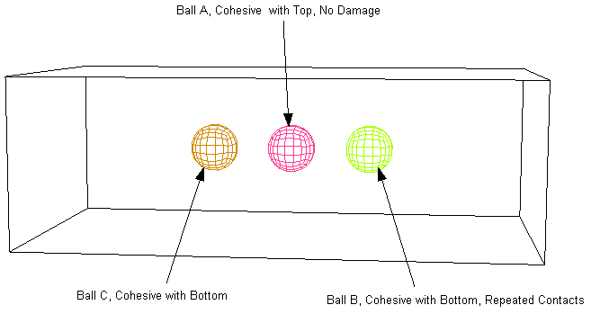

# 1.7.6 Cohesive surface interaction

**Products: **Abaqus/Standard  Abaqus/Explicit  

### Features tested

This section provides verification for the following options:
- Cohesive behavior properties
- Material and contact properties to define damage initiation
- Material properties to define damage evolution

### I. Cohesive behavior options

### Problem description

The following usages of surface-based cohesive behavior are verified in these tests:
- Cohesive behavior properties
- Cohesive behavior restricted to initially contacting nodes
- Cohesive behavior allowing repeated contacts
- Coupled traction-separation behavior

**Model: **

This test consists of four cases, each of which illustrate one of the usages of the cohesive behavior properties listed above. Each case comprises two blocks of solid elements bonded together with cohesive surfaces defined at the interface between the blocks. In all cases except Case 2 the initial configuration is fully compliant, with the slave and master surfaces touching each other exactly without any overclosures or gaps. In Case 2 there is an initial gap between some nodes of the slave surface and the master surface that is not resolved at the start of the analysis.

Case 1 has cohesive behavior defined with default parameters; hence, cohesive behavior is defined for all nodes of the slave surface that are initially in contact with the master surface and also the slave nodes that may come in contact later, and postfailure cohesive behavior is not defined. There are no data line values prescribed, so the default cohesive stiffness values calculated by Abaqus are used to enforce cohesive behavior. Progressive failure of the cohesive bond is modeled using the maximum stress damage initiation criterion and damage evolution with linear displacement–based softening behavior.

Case 2 has cohesive behavior defined with the initially contacting nodes. Since there is an initial gap between some nodes of the slave surface and the master surface, these nodes are not in contact in the initial configuration and, thus, cohesive behavior is not enforced at these nodes. Uncoupled nondefault cohesive stiffness values are prescribed on the data line. No damage model is defined for this case, so the cohesive bond does not degrade and fail.

 Case 3 is similar to Case 1. In addition, postfailure cohesive behavior is enforced for recurrent contacts at nodes on the slave surface. 

 Case 4 has cohesive behavior with coupled traction-separation behavior. Coupled cohesive stiffness values are prescribed on the data line. Progressive failure of the cohesive bond is modeled using the maximum stress damage initiation criterion and damage evolution with linear displacement–based softening behavior.

**Loading: **

The loading is the same in the first three cases: the blocks are first pulled apart in pure normal mode by applying displacement boundary conditions, then they are brought into contact, and finally they are again pulled apart. In the fourth case a mixed mode loading is applied.

### Results and discussion

The response of the cohesive surface is correct in all cases. For Case 1 once the cohesive bond breaks, no further cohesive constraints are enforced. In Case 3, which allows postfailure cohesive behavior, cohesive constraints are reinforced when the surfaces reenter contact following the first debonding.

### Input files

##### **Abaqus/Explicit input file**

[gcont_cohesive_options.inp](../eif/gcont_cohesive_options.inp)

Verification test for different cohesive behavior options.

##### **Abaqus/Standard input files**

[gcont_cohesive_options_std_2d.inp](../eif/gcont_cohesive_options_std_2d.inp)

Verification test for different cohesive behavior options in two dimensions.

[gcont_cohesive_options_std_3d.inp](../eif/gcont_cohesive_options_std_3d.inp)

Verification test for different cohesive behavior options in three dimensions.

### II. Damage modeling with cohesive surfaces in Abaqus/Explicit

### Problem description

This test verifies damage modeling with cohesive surfaces using different damage initiation criteria and damage evolution laws to simulate the failure of cohesive layers. 

The maximum separation and quadratic stress damage initiation criteria are used. Damage evolution is defined based on either effective displacement or energy dissipated. Linear, exponential, and tabular softening laws are defined to specify the nature of the evolution of the damage variable. Each damage model is verified for damage in pure normal and two pure shear modes (one shear mode for two-dimensional and axisymmetric elements). The dependence of damage evolution on the mode mix measure specified in tabular, power law, or Benzeggagh-Kenane form is also considered in this test.

### Results and discussion

Degradation of the response of the cohesive surfaces begins when the specified damage initiation criterion is met. The damage variable evolves according to the evolution law specified in terms of displacement or energy dissipation. 

### Input files

##### **Abaqus/Explicit input files**

[gcont_mxe_damdisp_softlin_xpl.inp](../eif/gcont_mxe_damdisp_softlin_xpl.inp)

MAXU damage initiation, displacement-based damage evolution with LINEAR softening for cohesive surfaces.

[gcont_qds_damdisp_softlin_xpl.inp](../eif/gcont_qds_damdisp_softlin_xpl.inp)

QUADS damage initiation, displacement-based damage evolution with LINEAR softening for cohesive surfaces.

[gcont_mxe_damdisp_softexp_xpl.inp](../eif/gcont_mxe_damdisp_softexp_xpl.inp)

MAXU damage initiation, displacement-based damage evolution with EXPONENTIAL softening for cohesive surfaces.

[gcont_qds_damdisp_softexp_xpl.inp](../eif/gcont_qds_damdisp_softexp_xpl.inp)

QUADS damage initiation, displacement-based damage evolution with EXPONENTIAL softening for cohesive surfaces. 

[gcont_mxe_damdisp_softtab_xpl.inp](../eif/gcont_mxe_damdisp_softtab_xpl.inp)

MAXU damage initiation, displacement-based damage evolution with TABULAR softening for cohesive surfaces.

[gcont_qds_damdisp_softtab_xpl.inp](../eif/gcont_qds_damdisp_softtab_xpl.inp)

QUADS damage initiation, displacement-based damage evolution with TABULAR softening for cohesive surfaces.

[gcont_mxe_damener_softlin_xpl.inp](../eif/gcont_mxe_damener_softlin_xpl.inp)

MAXU damage initiation, energy-based damage evolution with LINEAR softening for cohesive surfaces. 

[gcont_qds_damener_softlin_xpl.inp](../eif/gcont_qds_damener_softlin_xpl.inp)

QUADS damage initiation, energy-based damage evolution with LINEAR softening for cohesive surfaces. 

[gcont_mxe_damener_softexp_xpl.inp](../eif/gcont_mxe_damener_softexp_xpl.inp)

MAXU damage initiation, energy-based damage evolution with EXPONENTIAL softening for cohesive surfaces. 

[gcont_qds_damener_softexp_xpl.inp](../eif/gcont_qds_damener_softexp_xpl.inp)

QUADS damage initiation, energy-based damage evolution with EXPONENTIAL softening for cohesive surfaces. 

[gcont_damdisp_mixtrac_xpl.inp](../eif/gcont_damdisp_mixtrac_xpl.inp)

Displacement-based damage evolution with traction-dependent mode mix measure for cohesive surfaces.

[gcont_damdisp_mixener_xpl.inp](../eif/gcont_damdisp_mixener_xpl.inp)

Displacement-based damage evolution with energy-dependent mode mix measure for cohesive surfaces. 

[gcont_damener_mixtrac_xpl.inp](../eif/gcont_damener_mixtrac_xpl.inp)

Energy-based damage evolution with traction-dependent mode mix measure for cohesive surfaces.

[gcont_damener_mixener_xpl.inp](../eif/gcont_damener_mixener_xpl.inp)

Energy-based damage evolution with energy-dependent mode mix measure for cohesive surfaces.

##### **Abaqus/Standard input files**

[gcont_mxe_damdisp_softlin_std.inp](../eif/gcont_mxe_damdisp_softlin_std.inp)

MAXU damage initiation, displacement-based damage evolution with LINEAR softening for cohesive surfaces.

[gcont_qds_damdisp_softlin_std.inp](../eif/gcont_qds_damdisp_softlin_std.inp)

QUADS damage initiation, displacement-based damage evolution with LINEAR softening for cohesive surfaces.

[gcont_mxe_damdisp_softexp_std.inp](../eif/gcont_mxe_damdisp_softexp_std.inp)

MAXU damage initiation, displacement-based damage evolution with EXPONENTIAL softening for cohesive surfaces.

[gcont_qds_damdisp_softexp_std.inp](../eif/gcont_qds_damdisp_softexp_std.inp)

QUADS damage initiation, displacement-based damage evolution with EXPONENTIAL softening for cohesive surfaces. 

[gcont_mxe_damdisp_softtab_std.inp](../eif/gcont_mxe_damdisp_softtab_std.inp)

MAXU damage initiation, displacement-based damage evolution with TABULAR softening for cohesive surfaces.

[gcont_qds_damdisp_softtab_std.inp](../eif/gcont_qds_damdisp_softtab_std.inp)

QUADS damage initiation, displacement-based damage evolution with TABULAR softening for cohesive surfaces.

[gcont_mxe_damener_softlin_std.inp](../eif/gcont_mxe_damener_softlin_std.inp)

MAXU damage initiation, energy-based damage evolution with LINEAR softening for cohesive surfaces. 

[gcont_qds_damener_softlin_std.inp](../eif/gcont_qds_damener_softlin_std.inp)

QUADS damage initiation, energy-based damage evolution with LINEAR softening for cohesive surfaces. 

[gcont_mxe_damener_softexp_std.inp](../eif/gcont_mxe_damener_softexp_std.inp)

MAXU damage initiation, energy-based damage evolution with EXPONENTIAL softening for cohesive surfaces. 

[gcont_qds_damener_softexp_std.inp](../eif/gcont_qds_damener_softexp_std.inp)

QUADS damage initiation, energy-based damage evolution with EXPONENTIAL softening for cohesive surfaces. 

[gcont_damdisp_mixtrac_std.inp](../eif/gcont_damdisp_mixtrac_std.inp)

Displacement-based damage evolution with traction-dependent mode mix measure for cohesive surfaces.

[gcont_damdisp_mixener_std.inp](../eif/gcont_damdisp_mixener_std.inp)

Displacement-based damage evolution with energy-dependent mode mix measure for cohesive surfaces. 

[gcont_damener_mixtrac_std.inp](../eif/gcont_damener_mixtrac_std.inp)

Energy-based damage evolution with traction-dependent mode mix measure for cohesive surfaces.

[gcont_damener_mixener_std.inp](../eif/gcont_damener_mixener_std.inp)

Energy-based damage evolution with energy-dependent mode mix measure for cohesive surfaces.

### III. Breakable ties with cohesive surfaces

### Problem description

This test verifies modeling “breakable ties” using cohesive behavior and progressive damage. A box and its lid, both modeled with solid elements, are tied together via cohesive behavior at the interface. Default cohesive behavior options are used. The bottom of the box is fixed using prescribed boundary conditions, while the lid is pulled apart via prescribed displacements applied through a kinematic coupling acting on the top surface of the lid.

The maximum stress damage initiation criterion is used. Damage evolution is defined using effective displacement with a linear softening law.

### Results and discussion

This test verifies modeling of “breakable ties” using cohesive surfaces. Degradation of the response of the cohesive surfaces begins when the specified damage initiation criterion is met. The damage variable evolves according to the evolution law specified. 

### Input files

##### **Abaqus/Explicit input file**

[gcont_cohbehv_tiebreak.inp](../eif/gcont_cohbehv_tiebreak.inp)

Verification test for tie break using cohesive surfaces.

##### **Abaqus/Standard input file**

[gcont_cohbehv_tiebreak_std.inp](../eif/gcont_cohbehv_tiebreak_std.inp)

Verification test for tie break using cohesive surfaces.

### IV. Sticky contact with cohesive surfaces

### Problem description

This test verifies modeling “sticky contact” using cohesive behavior and progressive damage. A box, modeled as a rigid body, contains three balls that are modeled using shell elements. The box is completely fixed; the balls, initially suspended in the gap between the top and bottom walls of the rigid box, are given identical initial velocities resulting in their simultaneous impact with the bottom wall of the box. The behavior of each of the balls (Ball A, Ball B, and Ball C) is described below.

Ball A has cohesive behavior without progressive damage defined between its surface and the top wall of the box. No cohesive stiffness is specified, and the default values are used. When this ball impacts the bottom wall, it does not experience any cohesive forces, since no cohesive behavior is prescribed for the interaction between this ball and the bottom wall. The ball rebounds and strikes the top wall of the box, where cohesive forces act to prevent it from rebounding again and ensure that it remains stuck to the top wall for the rest of the analysis. 

Ball B has cohesive behavior with progressive damage defined between its surface and the bottom wall of the box. No cohesive stiffness is specified, and the default values are used. The damage model uses the maximum stress damage initiation criteria and has damage evolution defined based on effective displacement with a linear softening law. In addition, postfailure cohesive behavior is enforced for recurrent contacts at nodes on the slave surface. When this ball impacts the bottom wall and tries to rebound, the cohesive forces act to restrain it from rebounding. However, since the elastic energy of the collision is high, eventually damage initiates, ultimate failure occurs, and the ball breaks free. It then goes on to hit the top wall. There is no cohesive behavior defined with the top wall, so Ball B does not experience any cohesive forces and bounces back and impacts the bottom wall again. Since postfailure cohesive behavior is allowed, cohesive forces reactivate when the ball attempts to rebound again. However, on second impact, the momentum and kinetic energy of the ball is considerably less than during first impact, owing to the dissipation that occurred due to the damage work done during first impact. The cohesive forces this time are sufficiently high to restrain it from rebounding again, and the ball remains stuck to the bottom wall for the rest of the analysis.

Ball C has exactly the same cohesive behavior and progressive damage defined between its surface and the bottom wall as Ball B. As with Ball B, when this ball impacts the bottom wall and tries to rebound, the cohesive forces act to restrain it from rebounding. However, since the elastic energy of the collision is high, eventually damage initiates, ultimate failure occurs, and the ball breaks free. It then goes on to hit the top wall. There is no cohesive behavior defined with the top wall, so Ball C does not experience any cohesive forces and bounces back and impacts the bottom wall again. Since no postfailure cohesive behavior is allowed, cohesive forces are not activated when the ball attempts to rebound following the second impact with the bottom wall. The ball rebounds again and keeps bouncing back and forth between the top and bottom walls throughout the rest of the analysis. 

### Results and discussion

This test verifies modeling of “sticky contact” using cohesive surfaces. Degradation of the response of the cohesive surfaces begins when the specified damage initiation criterion is met. The damage variable evolves according to the evolution law specified. 

### Input files

##### **Abaqus/Explicit input file**

[gcont_cohbehv_stickycont.inp](../eif/gcont_cohbehv_stickycont.inp)

Verification test for sticky contact.

##### **Abaqus/Standard input file**

[gcont_cohbehv_stickycont_std.inp](../eif/gcont_cohbehv_stickycont_std.inp)

Verification test for sticky contact.

##### **Input files required for both Abaqus/Explicit and Abaqus/Standard**

[tennis_ef1.inp](../eif/tennis_ef1.inp)

First file for the sticky contact verification test.

[tennis_ef2.inp](../eif/tennis_ef2.inp)

Second file for the sticky contact verification test.

