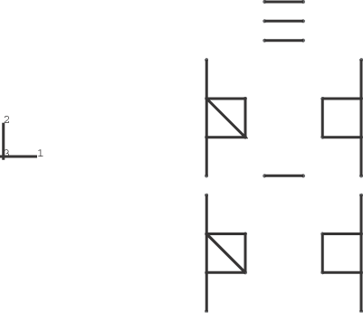
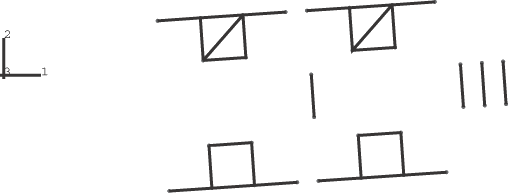

# 1.8.1 刚体质量属性

**产品：**Abaqus/Standard  Abaqus/Explicit  

### 单元测试

B21    B21H    B22    B31    B31H    B31OS    B31OSH    B32    B32H

CAX3    CAX3H    CAX4    CAX4H    CAX4I    CAX4IH    CAX4R    CAX6    CAX6M    CAX6MH    CAX8    CAX8H

CPE3    CPE3H    CPE4    CPE4H    CPE4I    CPE4IH    CPE4R    CPE4RH    CPE6    CPE6M    CPE8    CPS3    CPS4    CPS4I    CPS4R    CPS6    CPS6M    CPS8

C3D6    C3D6H    C3D8    C3D8H    C3D8R    C3D8RH    C3D10    C3D10M    C3D15    C3D15H    C3D15V    C3D20    C3D20H    C3D20R

FRAME2D    FRAME3D

M3D3    M3D4    M3D4R    M3D6    M3D8    MAX1    MAX2

PIPE21    PIPE31    PIPE31H

R2D2    R3D4    R3D3    RAX2

S3R    S4    S4R    S8R    SAX1    SAX2

T2D2    T2D3    T2D3H    T3D2    T3D3    T3D3H

### 功能测试

刚体质量属性的计算，将刚体参考节点重新定位到刚体质心。

### 问题描述

这些问题套件测试了由连续体和结构单元组成的刚体在Abaqus/Standard分析中的质量属性计算，以及由连续体、结构单元和刚性单元在Abaqus/Explicit分析中的质量属性计算。考虑了五种不同的刚体几何情况：

1. 由梁、连续体和桁架单元组成的二维平面刚体（以及Abaqus/Explicit分析中的刚性单元）。
2. 由梁、连续体和桁架单元组成的三维刚体（以及Abaqus/Explicit分析中的刚性单元）。
3. 由梁、膜、壳和桁架单元组成的三维刚体。
4. 由连续体和壳单元组成的轴对称刚体（以及Abaqus/Explicit分析中的刚性单元）。
5. 由几何情况2和3中包含的所有单元以及位于刚体参考节点处的点质量单元组成的三维刚体。

Abaqus自动计算每个刚体的质量、质心和转动惯量，以考虑每个组成单元的截面属性和密度。每个刚体的参考节点位于质心处。

可以通过检查数据（.dat）文件中的打印量来验证刚体计算的质量属性。通过执行两个分析进行进一步的定量和定性验证。在第一个分析中，每个几何情况承受在刚体参考节点处沿*x*方向施加的大小为1.0×106的集中力。在第二个分析中，每个几何情况承受在刚体参考节点处绕*z*轴施加的大小为1.0×108的集中力矩。

### 结果与讨论

对于每个几何情况，刚体的质量和惯性属性被发现与分析值密切匹配。在情况1和4中，在刚体参考节点处施加集中力不会引起刚体绕平面外轴的任何旋转，这验证了参考节点已被定位在刚体质心处。类似地，对于情况2、3和5，对于集中力加载，没有观察到绕全局*x*-、*y*-或*z*轴的旋转。每个情况中的力矩加载导致绕参考节点的大刚体旋转。每个情况中的最终旋转配置被发现与问题的几何形状和施加力矩的大小一致。情况1中力矩载荷情况下刚体的原始和最终配置如图1.8.1-1和图1.8.1-2所示。

### 输入文件

##### **Abaqus/Standard分析**

[rigmass1_std.inp](../eif/rigmass1_std.inp)

情况1，用于力加载。

[rigmass1a_std.inp](../eif/rigmass1a_std.inp)

情况1，用于力加载。

[rigmass1b_std.inp](../eif/rigmass1b_std.inp)

情况1，用于力加载。

[rigmass1c_std.inp](../eif/rigmass1c_std.inp)

情况1，用于力加载。

[rigmass11_std.inp](../eif/rigmass11_std.inp)

情况1，用于力矩加载。

[rigmass11a_std.inp](../eif/rigmass11a_std.inp)

情况1，用于力矩加载。

[rigmass2_std.inp](../eif/rigmass2_std.inp)

情况2，用于力加载。

[rigmass2a_std.inp](../eif/rigmass2a_std.inp)

情况2，用于力加载。

[rigmass2b_std.inp](../eif/rigmass2b_std.inp)

情况2，用于力加载。

[rigmass2c_std.inp](../eif/rigmass2c_std.inp)

情况2，用于力加载。

[rigmass2d_std.inp](../eif/rigmass2d_std.inp)

情况2，用于力加载。

[rigmass2e_std.inp](../eif/rigmass2e_std.inp)

情况2，用于力加载。

[rigmass2f_std.inp](../eif/rigmass2f_std.inp)

情况2，用于力加载。

[rigmass22_std.inp](../eif/rigmass22_std.inp)

情况2，用于力矩加载。

[rigmass22a_std.inp](../eif/rigmass22a_std.inp)

情况2，用于力矩加载。

[rigmass3_std.inp](../eif/rigmass3_std.inp)

情况3，用于力加载。

[rigmass3a_std.inp](../eif/rigmass3a_std.inp)

情况3，用于力加载。

[rigmass3b_std.inp](../eif/rigmass3b_std.inp)

情况3，用于力加载。

[rigmass33_std.inp](../eif/rigmass33_std.inp)

情况3，用于力矩加载。

[rigmass33a_std.inp](../eif/rigmass33a_std.inp)

情况3，用于力矩加载。

[rigmass4_std.inp](../eif/rigmass4_std.inp)

情况4，用于力加载。

[rigmass4a_std.inp](../eif/rigmass4a_std.inp)

情况4，用于力加载。

[rigmass4b_std.inp](../eif/rigmass4b_std.inp)

情况4，用于力加载。

[rigmass4c_std.inp](../eif/rigmass4c_std.inp)

情况4，用于力加载。

[rigmass4d_std.inp](../eif/rigmass4d_std.inp)

情况4，用于力加载。

[rigmass44_std.inp](../eif/rigmass44_std.inp)

情况4，用于力矩加载。

[rigmass44a_std.inp](../eif/rigmass44a_std.inp)

情况4，用于力矩加载。

[rigmass5_std.inp](../eif/rigmass5_std.inp)

情况5，用于力加载。

[rigmass55_std.inp](../eif/rigmass55_std.inp)

情况5，用于力矩加载。

##### **Abaqus/Explicit分析**

[rigmass1.inp](../eif/rigmass1.inp)

线性单元情况1，用于力加载。

[rigmass1a.inp](../eif/rigmass1a.inp)

二次单元情况1，用于力加载。

[rigmass1_pipe.inp](../eif/rigmass1_pipe.inp)

包括管单元的线性单元情况1，用于力加载。

[rigmass11.inp](../eif/rigmass11.inp)

线性单元情况1，用于力矩加载。

[rigmass11a.inp](../eif/rigmass11a.inp)

二次单元情况1，用于力矩加载。

[rigmass11_pipe.inp](../eif/rigmass11_pipe.inp)

包括管单元的线性单元情况1，用于力矩加载。

[rigmass2.inp](../eif/rigmass2.inp)

线性单元情况2，用于力加载。

[rigmass2a.inp](../eif/rigmass2a.inp)

二次单元情况2，用于力加载。

[rigmass2_pipe.inp](../eif/rigmass2_pipe.inp)

包括管单元的线性单元情况2，用于力加载。

[rigmass2b.inp](../eif/rigmass2b.inp)

无减缩积分单元情况2，用于力加载。

[rigmass22.inp](../eif/rigmass22.inp)

线性单元情况2，用于力矩加载。

[rigmass22a.inp](../eif/rigmass22a.inp)

二次单元情况2，用于力矩加载。

[rigmass22_pipe.inp](../eif/rigmass22_pipe.inp)

包括管单元的线性单元情况2，用于力矩加载。

[rigmass22b.inp](../eif/rigmass22b.inp)

无减缩积分单元情况2，用于力矩加载。

[rigmass3.inp](../eif/rigmass3.inp)

线性单元情况3，用于力加载。

[rigmass3a.inp](../eif/rigmass3a.inp)

二次梁单元情况3，用于力加载。

[rigmass3b.inp](../eif/rigmass3b.inp)

无减缩积分单元情况3，用于力加载。

[rigmass33.inp](../eif/rigmass33.inp)

线性单元情况3，用于力矩加载。

[rigmass33a.inp](../eif/rigmass33a.inp)

二次梁单元情况3，用于力矩加载。

[rigmass33b.inp](../eif/rigmass33b.inp)

无减缩积分单元情况3，用于力矩加载。

[rigmass4.inp](../eif/rigmass4.inp)

线性单元情况4，用于力加载。

[rigmass4a.inp](../eif/rigmass4a.inp)

无减缩积分单元情况4，用于力加载。

[rigmass44.inp](../eif/rigmass44.inp)

线性单元情况4，用于力矩加载。

[rigmass44a.inp](../eif/rigmass44a.inp)

无减缩积分单元情况4，用于力矩加载。

[rigmass5.inp](../eif/rigmass5.inp)

线性单元情况5，用于力加载。

[rigmass5a.inp](../eif/rigmass5a.inp)

二次单元情况5，用于力加载。

[rigmass5b.inp](../eif/rigmass5b.inp)

无减缩积分单元情况5，用于力加载。

[rigmass55.inp](../eif/rigmass55.inp)

线性单元情况5，用于力矩加载。

[rigmass55a.inp](../eif/rigmass55a.inp)

二次单元情况5，用于力矩加载。

[rigmass55b.inp](../eif/rigmass55b.inp)

无减缩积分单元情况5，用于力矩加载。

### 图片

**图1.8.1-1** 情况1的原始配置。

**图1.8.1-2** 情况1在参考节点处承受施加扭矩的最终配置。

