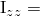
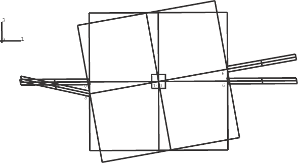
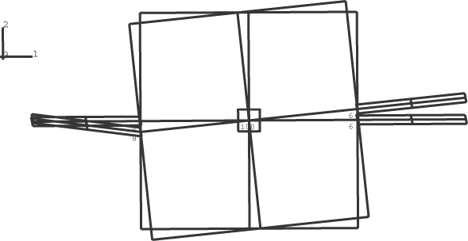
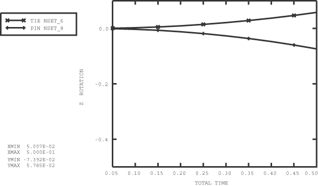

# 1.8.2 Tie and pin node sets

**Products: **Abaqus/Standard  Abaqus/Explicit  

### Elements tested

R3D4    S4R    

### Feature tested

Use of TIE NSET and PIN NSET to define connections between rigid bodies and deformable elements.

### Problem description

A square rigid sheet is connected by one node at each of two opposite edges to deformable rectangular plates consisting of S4R elements. The connection to the first plate at node 6 of the rigid body is assumed to be a tie connection where it is desired to transmit moment and rotation. The connection to the second plate at node 8 is assumed to be a pin connection. A moment of magnitude 1000 is applied to the rigid body reference node about the global *z*-axis. A ROTARYI element with  10 is attached to the rigid body reference node. Two representations for the square rigid sheet are considered:

1. The rigid sheet is modeled with R3D4 elements. These elements have only translational degrees of freedom and, therefore, generate pin nodes on the rigid body by default. To ensure that there is a tie connection at node 6, the TIE NSET parameter is used with a node set containing node 6. For this model the PIN NSET parameter is also used with a node set containing node 8. However, this PIN NSET specification is not necessary (redundant) in this case since node 8 is by default a pin node because of the underlying R3D4 elements.
2. The rigid sheet is modeled with S4R elements. These elements have both translational and rotational degrees of freedom and, therefore, generate tie nodes on the rigid body by default. To ensure that there is a pin connection at node 8, the PIN NSET parameter is used with a node set containing node 8. For this model the TIE NSET parameter is also used with a node set containing node 6. However, this TIE NSET specification is not necessary in this case since node 6 is, by default, a tie node because of the underlying S4R elements.

### Results and discussion

The original and final configurations for Cases 1 and 2 are shown in [Figure 1.8.2--1](ch01s08abv115.md#exxrigidconnect-case1configs) and [Figure 1.8.2--2](ch01s08abv115.md#exxrigidconnect-case2configs). It is clear from the results that at tie connections the plate rotates with the rigid body since there is transfer of moment from the rigid sheet to the rectangular plate at the connecting node. At pin connections moments are not transferred at the connecting node since the rigid body at the connecting node has only translational degrees of freedom. This results in large relative motions between the rigid sheet and the deformable plate at the pin nodes. [Figure 1.8.2--3](ch01s08abv115.md#exxrigidconnect-zaxisrotate) shows the angular rotation about the *z*-axis at the connecting nodes for Case 1. The angular rotation at the pin node, node 8, is negative in response to the applied positive moment, which is the physically intuitive result.

### Input files

##### **Abaqus/Standard analysis**

[rigcon1_std.inp](../eif/rigcon1_std.inp)

Case 1.

[rigcon2_std.inp](../eif/rigcon2_std.inp)

Case 2.

##### **Abaqus/Explicit analysis**

[rigcon1.inp](../eif/rigcon1.inp)

Case 1.

[rigcon2.inp](../eif/rigcon2.inp)

Case 2.

### Figures

**Figure 1.8.2–1** Original and final configurations for Case 1. Deformation magnification factor = 3.0.

**Figure 1.8.2–2** Original and final configurations for Case 2. Deformation magnification factor = 3.0.

**Figure 1.8.2–3** Rotation about the *z*-axis at the connecting nodes for Case 1.

