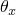
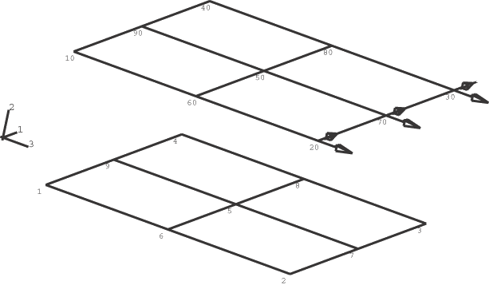
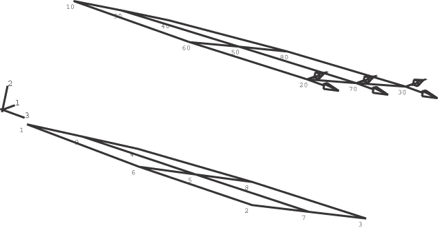
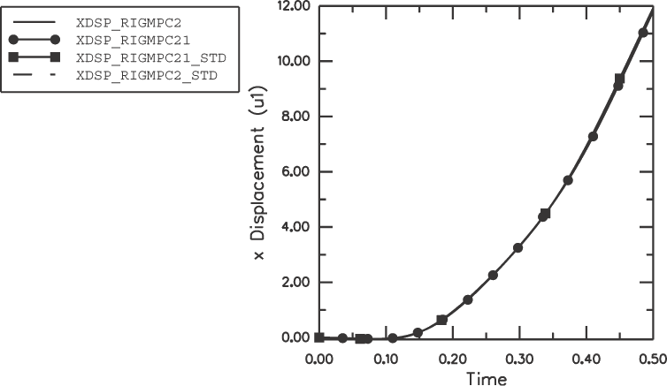
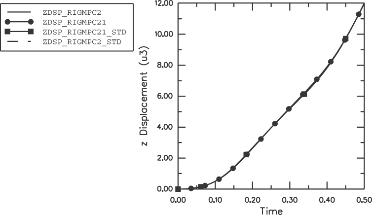
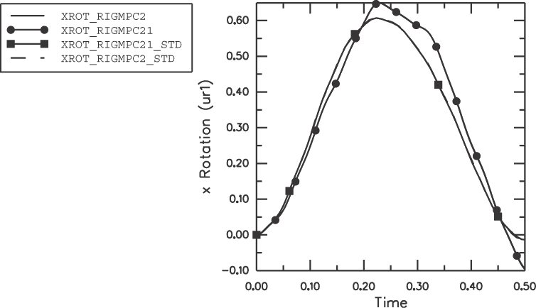

# 1.8.3 作为MPC的刚体

**产品：**Abaqus/Standard  Abaqus/Explicit  

### 单元测试

S4R

### 功能测试

使用带有TIE节点集的刚体在可变形单元之间定义MPC。

### 问题描述

模型由两个相同的矩形板组成，它们平行于*x*–*z*平面，最初在*y*方向上相隔1 m的距离（参见图1.8.3-1）。每个板使用S4R单元建模。沿边缘的三对节点——底板的节点1和顶板的节点10、底板的节点9和顶板的节点90、底板的节点4和顶板的节点40——通过将每对包含在一个TIE NSET中来组合形成三个不同的刚体。在顶板的节点20、70和30处沿正*z*和正*x*方向施加大小为1.0×105 N的集中载荷。结果与相应MPC问题的解进行比较。在MPC问题中，在顶板和底板的相应节点之间定义了三个BEAM型MPC。

### 结果与讨论

问题的最终配置如图1.8.3-2所示。底板与顶板一起移动，因此最终配置与原始配置相似，只是统一的旋转和平移。这是因为刚体TIE NSET约束了属于它的节点的位移和旋转。

使用刚体节点集获得的结果与通过求解相应MPC问题获得的结果密切匹配。从图1.8.3-3、图1.8.3-4和图1.8.3-5可以清楚地看出，解的主要特征——位移、位移和旋转——对于使用刚体求解的问题和相应的BEAM MPC问题几乎相同。在Abaqus/Explicit和Abaqus/Standard之间观察到的旋转差异是由于各自代码中使用的不同公式造成的。

### 输入文件

##### **Abaqus/Standard分析**

[rigmpc2_std.inp](../eif/rigmpc2_std.inp)

包含TIE NSETs的刚体定义的输入文件。

[rigmpc21_std.inp](../eif/rigmpc21_std.inp)

相应的MPC问题。

##### **Abaqus/Explicit分析**

[rigmpc2.inp](../eif/rigmpc2.inp)

包含TIE NSETs的刚体定义的输入文件。

[rigmpc21.inp](../eif/rigmpc21.inp)

相应的MPC问题。

### 图片

**图1.8.3-1** 原始配置。

**图1.8.3-2** 最终配置。

**图1.8.3-3** 节点9处位移与时间的关系。

**图1.8.3-4** 节点9处位移与时间的关系。

**图1.8.3-5** 节点9处旋转与时间的关系。

