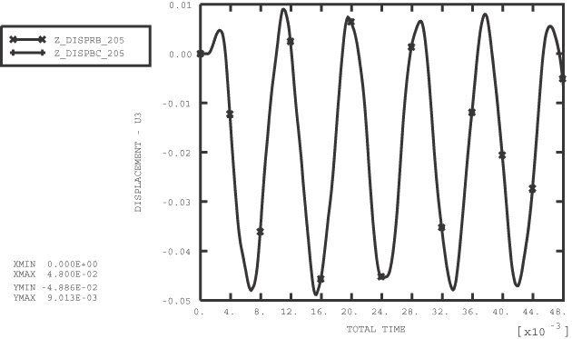
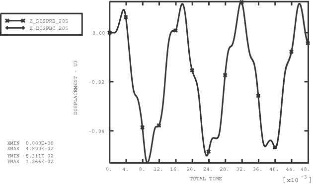
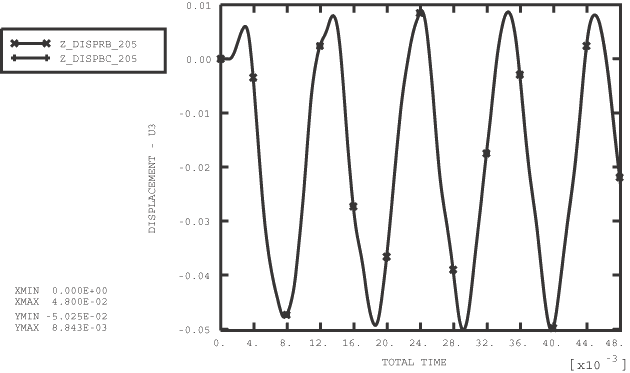

# 1.8.4 刚体约束

**产品：**Abaqus/Standard  Abaqus/Explicit  

### 单元测试

S4R

### 功能测试

使用带有TIE和PIN节点集的刚体为可变形体定义边界条件。

### 问题描述

定义刚体节点集以包含使用壳单元建模的矩形板边缘上的所有节点。刚体参考节点被约束所有旋转和-和位移。在刚体参考节点处施加沿*z*方向作用的锯齿形速度模式。速度从0 m/s开始，在2.0×103 s时降到10 m/s，然后在6.0×103 s时回升到0 m/s。此后，分析继续进行至48.0×103 s。考虑以下三种情况：

1. 定义刚体TIE NSET以包含所有边缘节点。将结果与将刚体TIE NSET替换为施加在边缘节点的等效边界条件的相同问题的解进行比较。
2. 定义刚体PIN NSET以包含所有边缘节点。将结果与将刚体PIN NSET替换为施加在边缘节点的等效边界条件的相同问题的解进行比较。
3. 定义刚体TIE NSET以包含板两个相对边缘上的所有节点。其余边缘节点包含在PIN NSET中。将结果与将刚体TIE和PIN节点集替换为施加在边缘节点的等效边界条件的相同问题的解进行比较。

### 结果与讨论

板响应边界节点处施加的速度而位移，并在边界节点速度降为零后继续振动。板中心节点205处位移的时间变化如图1.8.4-1所示（情况1）。经过初始滞后后，中心节点响应边界运动而振动。使用刚体TIE NSET获得的解决方案被发现与将刚体TIE NSET替换为直接施加在边缘节点的等效边界条件求解的相同问题的结果密切匹配。从情况2的图1.8.4-2和情况3的图1.8.4-3可以得出类似的结论。

### 输入文件

##### **Abaqus/Standard分析**

[rigboun1_std.inp](../eif/rigboun1_std.inp)

情况1。

[rigboun1bc_std.inp](../eif/rigboun1bc_std.inp)

情况1的比较测试。

[rigboun2_std.inp](../eif/rigboun2_std.inp)

情况2。

[rigboun2bc_std.inp](../eif/rigboun2bc_std.inp)

情况2的比较测试。

[rigboun3_std.inp](../eif/rigboun3_std.inp)

情况3。

[rigboun3bc_std.inp](../eif/rigboun3bc_std.inp)

情况3的比较测试。

##### **Abaqus/Explicit分析**

[rigboun1.inp](../eif/rigboun1.inp)

情况1。

[rigboun1bc.inp](../eif/rigboun1bc.inp)

情况1的比较测试。

[rigboun2.inp](../eif/rigboun2.inp)

情况2。

[rigboun2bc.inp](../eif/rigboun2bc.inp)

情况2的比较测试。

[rigboun3.inp](../eif/rigboun3.inp)

情况3。

[rigboun3bc.inp](../eif/rigboun3bc.inp)

情况3的比较测试。

### 图片

**图1.8.4-1** 情况1中节点205处位移与时间的关系。

**图1.8.4-2** 情况2中节点205处位移与时间的关系。

**图1.8.4-3** 情况3中节点205处位移与时间的关系。

