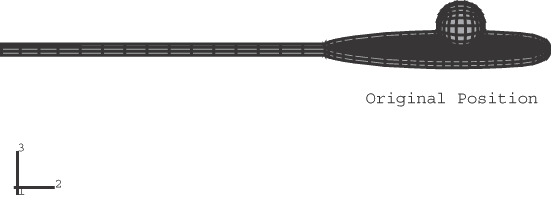
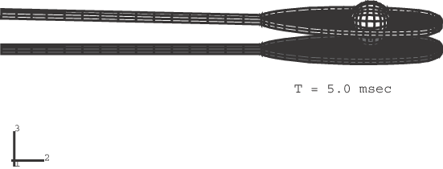
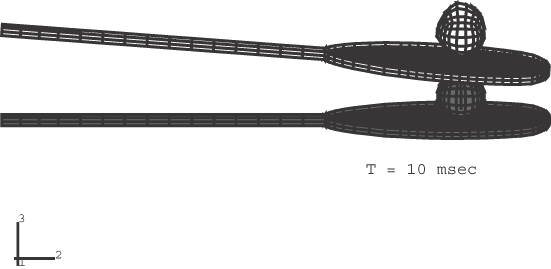
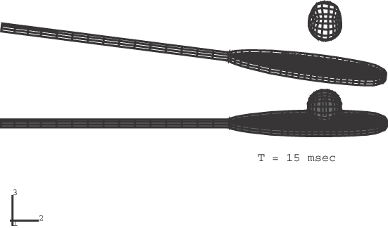

# 1.8.5 在刚体中包含可变形单元类型

**产品：**Abaqus/Explicit  

### 单元测试

C3D8R    B31    S4R    T3D2    F3D4

### 功能测试

将可变形单元定义为刚体的一部分。

### 问题描述

此示例类似于《Abaqus示例问题指南》第2.1.5节中的"网球拍和球"，模拟网球拍对静止球的斜向冲击。网球拍框架被认为是刚性的，并使用C3D8R、B31和S4R类型的实体和结构单元作为刚体的一部分进行建模。

网球拍上的弦使用T3D2桁架单元建模。弦所用材料模型的详细信息可在《Abaqus示例问题指南》第2.1.5节中找到。为弦指定了初始张力。网球建模为使用S4R单元的球体，被认为是橡胶材质。网球内的空气使用基于表面的流体空腔能力进行建模。球和弦之间指定了摩擦系数。在这个示例中，球最初是静止的，拍子以6.706 m/sec（264 in/sec）的速度以15度角撞击球。表示拍的单元密度被选择为使得拍的质量大约是球的10倍。

完整模型如图1.8.5-1所示。

### 结果与讨论

图1.8.5-1显示了未变形配置中球相对于弦的位置。分析不同阶段的变形形状如图1.8.5-2至图1.8.5-4所示。可以看到网球拍框架作为刚体运动，由于冲击点与拍质心之间的距离而轻微旋转。在绘图时使用了2的变形放大系数。

### 输入文件

[tennis_rig.inp](../eif/tennis_rig.inp)

使用接触对方法的分析。

[tennis_rig_gcont.inp](../eif/tennis_rig_gcont.inp)

使用通用接触功能的分析。

[tennis_rig1.inp](../eif/tennis_rig1.inp)

两个分析都引用的外部文件。

[tennis_rig2.inp](../eif/tennis_rig2.inp)

两个分析都引用的外部文件。

[tennis_rig3.inp](../eif/tennis_rig3.inp)

两个分析都引用的外部文件。

[tennis_rig4.inp](../eif/tennis_rig4.inp)

两个分析都引用的外部文件。

### 图片

**图1.8.5-1** 拍和球的原始位置。

**图1.8.5-2** 5毫秒时的配置。

**图1.8.5-3** 10毫秒时的配置。

**图1.8.5-4** 15毫秒时的配置。

