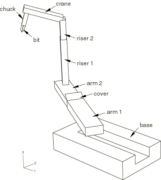
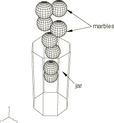
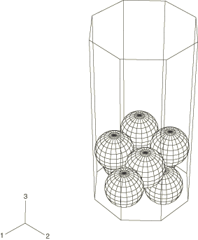
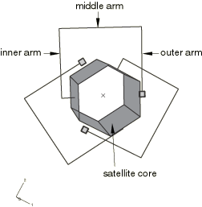
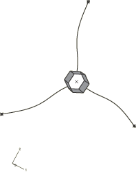
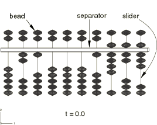
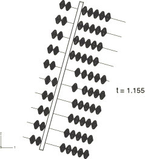
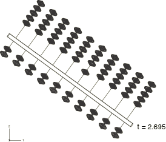
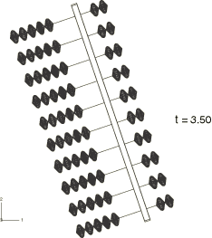

# 1.9.3 连接器单元的多个实例

**产品：**Abaqus/Standard  Abaqus/Explicit  

### I. 连接刚体的驱动

### 单元测试

CONN3D2

### 问题描述

此验证问题测试规定连接器运动以指定铰接结构相对运动的选项。类似机器人的起重机组件，建模为通过连接器单元连接在一起的刚体，承受驱动运动，该运动通过指定的幅值曲线驱动运动学连接。驱动运动，包括相对滑动和双轴旋转，导致组件以平滑顺序打开形成立管起重机。在最外层体的钻孔和向下运动之后，组件关闭并返回其起始配置。测试同时在无摩擦和有摩擦效应的连接中进行。

**模型：**

模型由刚体和连接器单元组成，如下表所述。表中的每个刚体对通过具有连接器运动定义的旋转和平移基本连接器类型连接。

**表1.9.3-1** 刚体和连接器。
| 物体1 | 物体2 | 基本连接器类型 |
| --- | --- | --- |
| 平移 | 旋转 |
| 底座 | 臂1 | SLOT | REVOLUTE |
| 臂1 | 盖 | JOIN | REVOLUTE |
| 臂1 | 臂2 | SLOT | ALIGN |
| 臂2 | 立管1 | CARTESIAN | CARDAN |
| 立管1 | 立管2 | SLOT | ALIGN |
| 立管2 | 起重机 | JOIN | REVOLUTE |
| 起重机 | 卡盘 | JOIN | REVOLUTE |
| 卡盘 | 钻头 | CARTESIAN | CARDAN |

完全打开配置中标记刚体的完整模型如图1.9.3-1所示。

**图1.9.3-1** 完全打开配置的起重机组件。

### 结果与讨论

Abaqus为所有情况提供预期的解决方案。

### 输入文件

[conn_std_craneactuation.inp](../eif/conn_std_craneactuation.inp)

Abaqus/Standard输入文件。

[conn_std_craneactuation_fric.inp](../eif/conn_std_craneactuation_fric.inp)

带摩擦的Abaqus/Standard输入文件。

[conn_xpl_craneactuation.inp](../eif/conn_xpl_craneactuation.inp)

Abaqus/Explicit输入文件。

[conn_xpl_craneactuation_fric.inp](../eif/conn_xpl_craneactuation_fric.inp)

带摩擦的Abaqus/Explicit输入文件。

### II. 罐中的弹珠

### 问题描述

此问题仅使用Abaqus/Explicit进行分析，测试多个间歇接触的连接器止动功能。八个刚性球体（弹珠）落入刚性容器（罐）中。弹珠通过罐向下移动，在一些碰撞之后，在罐底部的平衡位置静止。弹珠之间的相互作用通过为每个弹珠对定义连接器单元进行建模，而弹珠和罐之间的相互作用通过为每个弹珠和罐定义连接器单元进行建模。

**模型：**

罐和弹珠各自建模为刚体。为每个弹珠定义解析旋转刚性表面，仅用于可视化目的表示球形外表面。通过沿罐轴线方向定义初始速度并指定每个刚体参考节点上的力来模拟重力，将每个弹珠投入罐中。为每对弹珠定义AXIAL连接器类型，使用连接器止动来约束每对弹珠的运动，使弹珠不会重叠。在每个弹珠和罐之间定义RADIAL-THRUST连接器类型。这些连接器约束每个弹珠的运动，使弹珠保持在罐内部（即，它不会穿过侧壁或从罐底部掉落），使用连接器止动。

弹珠和罐的初始和最终配置如图1.9.3-2和图1.9.3-3所示。

**图1.9.3-2** 初始配置中的弹珠和罐。

**图1.9.3-3** 最终配置中的弹珠和罐。

### 结果与讨论

Abaqus/Explicit为所有情况提供预期的解决方案。

### 输入文件

[conn_xpl_marblesinjar.inp](../eif/conn_xpl_marblesinjar.inp)

Abaqus/Explicit输入文件。

### III. 卫星展开

### 问题描述

此问题使用Abaqus/Explicit和Abaqus/Standard进行分析，测试铰接可变形结构的连接器锁定程序。分析的复杂运动序列类似于带有柔性臂的旋转卫星在展开过程中的运动。卫星由具有大质量和转动惯量的核心和三个相对轻的铰接臂组成。臂在到达最终展开位置被锁定之前经历一系列大的平移和旋转。每个臂的组件之间以及臂和卫星核心之间的连接使用连接器单元进行建模。

**模型：**

卫星核心建模为刚体。臂由三部分组成——内臂、中臂和外臂——使用弹性梁单元进行建模。卫星核心通过JOIN和REVOLUTE连接连接到每个内臂。每个内臂又使用相同的平移和旋转连接类型连接到相应的中臂。每个中臂同样连接到相应的外臂。为整个模型指定绕全局*z*轴的初始旋转速度。在上述每个连接中，绕局部1轴的旋转被约束在使用连接器锁定一旦它们达到180的最终展开值时锁定到位。此外，使用连接器弹性在内部臂和中臂之间以及中臂和外臂之间的连接中定义扭转弹簧。扭转弹簧除了离心力外还帮助臂达到其最终展开配置。测试同时在无摩擦和有摩擦效应的连接中进行。

初始和最终配置中的完整模型如图1.9.3-4和图1.9.3-5所示。

**图1.9.3-4** 初始配置中的卫星。

**图1.9.3-5** 最终展开配置中的卫星。

### 结果与讨论

Abaqus为所有情况提供预期的解决方案。

### 输入文件

[conn_std_satellitedeploy.inp](../eif/conn_std_satellitedeploy.inp)

Abaqus/Standard输入文件。

[conn_std_satellitedeploy_fric.inp](../eif/conn_std_satellitedeploy_fric.inp)

带摩擦的Abaqus/Standard输入文件。

[conn_xpl_satellitedeploy.inp](../eif/conn_xpl_satellitedeploy.inp)

Abaqus/Explicit输入文件。

[conn_xpl_satellitedeploy_fric.inp](../eif/conn_xpl_satellitedeploy_fric.inp)

带摩擦的Abaqus/Explicit输入文件。

### IV. 受规定运动约束的算盘

### 问题描述

此问题仅使用Abaqus/Explicit进行分析，测试多个间歇接触和运动学约束的连接器止动程序。对由框架和珠子组成的算盘进行建模。当框架经历大运动时，珠子沿框架中的滑槽上下滑动。连接器单元用于建模珠子之间的接触相互作用、珠子和框架之间的接触相互作用以及珠子和框架之间的运动学约束。

**模型：**

由滑槽和分隔板组成的算盘框架建模为单个刚体。每个珠子建模为刚体，并使用解析旋转刚性表面仅为可视化目的对珠子表面进行建模。框架通过指定的幅值曲线承受规定的平移和旋转。在相同滑槽上相邻珠子的AXIAL连接器类型，使用连接器止动来约束相邻珠子之间的相对滑动运动，使珠子不会重叠。每个珠子也通过使用SLOT和ALIGN基本连接类型定义连接器单元连接到框架。这些单元确保每个珠子沿其滑槽移动并与框架一起旋转。为框架和靠近分隔板的珠子之间的连接器单元指定连接器止动。还为框架和每个滑槽末端珠子之间的连接器单元指定连接器止动。这些连接器止动确保珠子仅沿其各自滑槽的长度滑动，并防止珠子离开滑槽。

算盘在其初始、最终和两个中间配置中的位置如图1.9.3-6、图1.9.3-7、图1.9.3-8和图1.9.3-9所示。

**图1.9.3-6** 时间*t* = 0.0时的算盘。

**图1.9.3-7** 时间*t* = 1.155时的算盘。

**图1.9.3-8** 时间*t* = 2.695时的算盘。

**图1.9.3-9** 时间*t* = 3.50时的算盘。

### 结果与讨论

Abaqus/Explicit在所有情况下提供预期的解决方案。

### 输入文件

[conn_xpl_abacusmotion.inp](../eif/conn_xpl_abacusmotion.inp)

Abaqus/Explicit输入文件。

