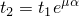
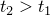
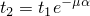
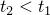
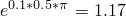
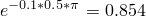

# 1.9.6 Tests for special-purpose connectors

**Products: **Abaqus/Standard  Abaqus/Explicit  

### I. Frictionless SLIPRING connectors

### Element tested

CONN3D2

### Problem description

The SLIPRING connection type is verified via a frictionless pulley and inextensible belt system. Results are compared against well-known analytical results. 

A high elastic modulus is specified for the belt of the SLIPRING via the connector elasticity procedure to achieve inextensible behavior. The analysis compares the results of two separate pulley-belt systems, each displacing similar loads though the same distance. Each system models the belt passing over the pulley using two SLIPRING connector elements sharing a common node. A load of 10 units is applied at the common node of the SLIPRING-type connector elements. In each system one of the ends of the belt is fully fixed, and different sets of boundary conditions are applied at the other free end to displace the applied load by similar distance, as described below.

1. System 1: 1. Apply boundary conditions to constrain degrees of freedom 1, 2, 3, and 10 (the material flow degree of freedom) at the left end of the belt system. 2. Apply boundary conditions at the right end to constrain degrees of freedom 1, 2, and 3. 3. Apply velocity-type boundary conditions on degree of freedom 10 at the free end (to pull out 2.25 units of belt material).
2. System 2: 1. Apply boundary conditions to constrain degrees of freedom 1, 2, 3, and 10 at the left end of the belt system. 2. Apply boundary conditions at the right end to constrain degrees of freedom 1, 3, and 10. 3. Apply velocity-type boundary conditions on degree of freedom 2 at the free end (to displace the node by 2.25 units).

### Results and discussion

 The load displaces by 1.125 units in both systems, which is half the 2.25 unit length of belt material pulled out at the free end, a well-known analytical result. The belt tension in each SLIPRING is 5 units, half the 10 unit load applied to each system and again matching analytical results. In all cases the material flowing out of the first connector element equals the material flowing into the second connector element.

### Input files

##### **Abaqus/Standard input file**

[misc_elasslipring_std_conn3d.inp](../eif/misc_elasslipring_std_conn3d.inp)

SLIPRING with linear elastic connector behavior.

##### **Abaqus/Explicit input file**

[misc_elasslipring_xpl_conn3d.inp](../eif/misc_elasslipring_xpl_conn3d.inp)

SLIPRING with linear elastic connector behavior.

### II. Frictional SLIPRING connectors

### Element tested

CONN3D2

### Problem description

Frictional behavior in the SLIPRING connection types is verified by comparing computed results with the analytical reference solution. Both linear elastic and nonlinear elastic connector behaviors have been verified in separate tests. The test consists of a system of two pulleys and a belt passing over the pulleys, which is modeled using three SLIPRING connections. The angle α between adjacent SLIPRING connections is held constant at 90. Concentrated nodal loads are applied at the two free ends. A time varying amplitude is specified for these loads to cause the belt to slip in one direction first and then reverse and slip in the opposite direction. The coefficient of friction μ is 0.1.

### Results and discussion

 When the belt slips, the ratio of the belt tensions in the adjacent SLIPRING connections in given by  when  and  when . It is verified that for linear and nonlinear elastic behavior, the belt tension ratio changes from  to  as the belt reverses in slip direction.

### Input files

##### **Abaqus/Standard input files**

[misc_slipring3_fric_conn3d_std.inp](../eif/misc_slipring3_fric_conn3d_std.inp)

Linear elastic connector behavior with connector friction.

[misc_slipring3_fric_conn2d_std.inp](../eif/misc_slipring3_fric_conn2d_std.inp)

Linear elastic connector behavior with connector friction.

[misc_slipring_nlelasplas_conn3d_std.inp](../eif/misc_slipring_nlelasplas_conn3d_std.inp)

 Nonlinear elastic-plastic connector behavior with connector friction.

##### **Abaqus/Explicit input files**

[misc_slipring3_fric_conn3d_xpl.inp](../eif/misc_slipring3_fric_conn3d_xpl.inp)

Linear elastic connector behavior with connector friction.

[misc_slipring3_nlelasfric_conn3d_xpl.inp](../eif/misc_slipring3_nlelasfric_conn3d_xpl.inp)

 Nonlinear elastic connector behavior with connector friction.

### III. RETRACTOR connectors

### Elements tested

CONN2D2    CONN3D2    

### Problem description

These verification cases test the RETRACTOR (FLOW-CONVERTER) connection types. Two sets of RETRACTOR connections are used. In the first case the material flow degree of freedom (10) at node b is driven via boundary condition and the degree of freedom 6 is measured at node a (all other degrees of freedom at the nodes are held fixed). In the second case degree of freedom 6 at node a is driven via boundary condition and degree of freedom 10 is measured at node b (all other degrees of freedom at the nodes are held fixed).

### Results and discussion

The measured material flow and rotations agree with the applied boundary conditions.

### Input files

##### **Abaqus/Standard input files**

[misc_flowconverter_std_conn3d.inp](../eif/misc_flowconverter_std_conn3d.inp)

Retractor-type connection.

[misc_flowconverter_std_conn2d.inp](../eif/misc_flowconverter_std_conn2d.inp)

Retractor-type connection.

[misc_slipringretractor_conn3d_std.inp](../eif/misc_slipringretractor_conn3d_std.inp)

SLIPRING- and retractor-type connection.

##### **Abaqus/Explicit input file**

[misc_flowconverter_xpl_conn3d.inp](../eif/misc_flowconverter_xpl_conn3d.inp)

Retractor-type connection.

### IV. ACCELEROMETER connectors

### Element tested

CONN3D2

### Problem description

These verification cases test the ACCELEROMETER and ROTATION-ACCELEROMETER connection types. In the first case an ACCELEROMETER connection is used in conjunction with a BEAM connector. Node 1 of the BEAM connector is constrained in degrees of freedom 1, 2, and 3. Node 1 of the accelerometer is fully constrained, and node 2 of the accelerometer is constrained to move radially by the BEAM connector. Node 2 of the accelerometer is moved via the connector motion procedure, with a velocity history of magnitude *V* in the local 2 direction. The angular velocity at node 1 of the BEAM connector, about the axis of rotation, is *V/R*, where *R* is the length of the BEAM connector.

 The configuration of the second case is identical to that in case 1. However, in this case in addition to an ACCELEROMETER, a ROTATION-ACCELEROMETER is also defined between the same two nodes. In this case an angular velocity of  is applied to node 1 of the BEAM connector. Node 2 of accelerometer moves along the radial path with a velocity of constant magnitude . Node 2 of the accelerometer is constrained to have the same angular velocity  since it is also node 2 of the BEAM connector.

### Results and discussion

For case 1 the angular velocity at node 1 of the BEAM connector agrees with the applied velocity history of the accelerometer, specified via the connector motion procedure. For case 2 the translational velocity in the local system of the accelerometer agrees with the applied angular velocity at node 1 of the BEAM connector. The rotational velocity in the local system of the ROTATION-ACCELEROMETER also agrees with the applied angular velocity at node 1 of the BEAM connector.

### Input file

##### **Abaqus/Explicit input file**

[misc_acclmeter_xpl_conn3d.inp](../eif/misc_acclmeter_xpl_conn3d.inp)

Accelerometer-type connection.

