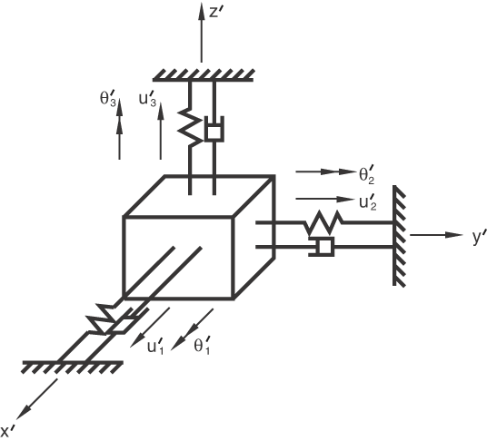
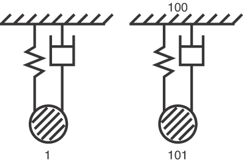
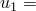
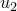
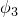
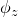
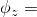

# 1.10.1 Flexible joint element

**Product: **Abaqus/Standard  

### Element tested

JOINTC

### Problem description

The behavior of the joint is defined in a local coordinate system that rotates with the motion of the first node of the JOINTC element. The first three tests consist of linear springs that couple the corresponding components of relative displacement and of relative rotation in the joint.

The fourth test includes linear dashpots. A spring and dashpot system is modeled using SPRING1 and DASHPOT1 elements and also with a JOINTC element utilizing the dashpot coefficient.

**Material properties used for the first three tests: **

Linear elastic; spring stiffnesses for relative displacements are 100, 200, and 300 for degrees of freedom 1, 2, and 3, respectively; spring stiffnesses for relative rotations are 400, 500, and 600 for degrees of freedom 4, 5, and 6, respectively.

**Material properties used for the fourth test: **

Linear elastic, spring stiffnesses = 30.0 for degree of freedom 1, dashpot coefficients = 0.12 for degree of freedom 1, mass = 0.02588 at node 1.

**Boundary conditions for linear behavior: **

Node 1 is clamped.

**Loading for linear behavior: **

Step 1: Displacements at node 2 are prescribed to 1.0  103 for all degrees of freedom.

Step 2: Applied forces and moments at node 2 are equal to 1.0 for all components.

**Boundary conditions and loading for nonlinear behavior with a specified local coordinate system: **

Step 1: Node 1 is clamped.  100 at node 2.

Step 2: A rotation of 90 is prescribed about the global 3-axis at node 1 (see (*) below).

**Boundary conditions and loading for nonlinear behavior with applied rotations and moments: **

Step 1: Node 1 is clamped. A moment of magnitude 80 is applied about the global 1-axis at node 2.

Step 2: The moment is removed.

Step 3: A rotation of 90 is prescribed about the global 3-axis at node 1. All other degrees of freedom at node 1 are suppressed.

Step 4: In addition to the conditions at the end of the previous step, a moment of magnitude 80 is applied about the global 2-axis at node 2.

**Boundary conditions and loading for linear behavior with the dashpot coefficient: **

Step 1 (static): Node 100 is clamped, node 101 has  1.0 and all other degrees of freedom suppressed, node 1 has  1.0.

Step 2 (dynamic): The applied displacements at nodes 1 and 101 are released.

### Results and discussion

The results for each test are tabulated and discussed below.

#### Linear behavior

**Table 1.10.1–1** Displacements at node 2.
| Step |  |  |  |  |  |  |
| --- | --- | --- | --- | --- | --- | --- |
| 1 | 1.0 103 | 1.0 103 | 1.0 103 | 1.0 103 | 1.0 103 | 1.0 103 |
| 2 | 1.0 102 | 5.0 103 | 3.33 103 | 2.5 103 | 2.0 103 | 1.67 103 |

**Table 1.10.1–2** Reactions at node 1.
| Step | RF1 | RF2 | RF3 | RM1 | RM2 | RM3 |
| --- | --- | --- | --- | --- | --- | --- |
| 1 | 0.1 | 0.2 | 0.3 | 0.4 | 0.5 | 0.6 |
| 2 | 1.0 | 1.0 | 1.0 | 1.0 | 1.0 | 1.0 |

**Table 1.10.1–3** Element strains.
| Step | E11 | E22 | E33 | E12 | E13 | E23 |
| --- | --- | --- | --- | --- | --- | --- |
| 1 | 1.0 103 | 1.0 103 | 1.0 103 | 1.0 103 | 1.0 103 | 1.0 103 |
| 2 | 1.0 102 | 5.0 103 | 3.33 103 | 2.5 103 | 2.0 103 | 1.67 103 |

**Table 1.10.1–4** Element stresses.
| Step | S11 | S22 | S33 | S12 | S13 | S23 |
| --- | --- | --- | --- | --- | --- | --- |
| 1 | 0.1 | 0.2 | 0.3 | 0.4 | 0.5 | 0.6 |
| 2 | 1.0 | 1.0 | 1.0 | 1.0 | 1.0 | 1.0 |

#### Nonlinear behavior with the local coordinate system procedure

**Table 1.10.1–5** Displacements at node 2.
|  (*) |  |  |  |  |  |  |
| --- | --- | --- | --- | --- | --- | --- |
| 0.0 | 1.0 | 0.0 | 0.0 | 0.0 | 0.0 | 0.0 |
| 30.0 | 0.875 | 0.217 | 0.0 | 0.0 | 0.0 | 0.524 |
| 90.0 | 0.5 | 1.34 108 | 0.0 | 0.0 | 0.0 | 1.571 |

**Table 1.10.1–6** Reactions at node 1.
|  (*) | RF1 | RF2 | RF3 | RM1 | RM2 | RM3 |
| --- | --- | --- | --- | --- | --- | --- |
| 0.0 | 100.0 | 0.0 | 0.0 | 0.0 | 0.0 | 0.0 |
| 30.0 | 100.0 | 0.0 | 0.0 | 0.0 | 0.0 | 21.65 |
| 90.0 | 100.0 | 0.0 | 0.0 | 0.0 | 0.0 | 1.34 106 |

(*) Prescribed rotation at node 1:  0 at the end of Step 1;  30 at Step 2, increment 3;  90 at Step 2, increment 9.

#### Nonlinear behavior with applied rotations and moments

**Table 1.10.1–7** Displacements at node 2.
| Step | Inc. |  |  |  |
| --- | --- | --- | --- | --- |
| 1 | 1 | 0.1007 | 0.0 | 0.0 |
| 1 | 2 | 0.2058 | 0.0 | 0.0 |
| 4 | 1 | 7.91 102 | 7.91 102 | 1.569 |
| 4 | 2 | 0.1616 | 0.1616 | 1.565 |

**Table 1.10.1–8** Reactions at node 1.
| Step | Inc. | RM1 | RM2 | RM3 |
| --- | --- | --- | --- | --- |
| 1 | 1 | 40.0 | 0.0 | 0.0 |
| 1 | 2 | 80.0 | 0.0 | 0.0 |
| 4 | 1 | 0.0 | 40.0 | 0.0 |
| 4 | 2 | 0.0 | 80.0 | 0.0 |

**Table 1.10.1–9** Element strains.
| Step | Inc. | E12 | E13 | E23 |
| --- | --- | --- | --- | --- |
| 1 | 1 | 0.1005 | 0.0 | 0.0 |
| 1 | 2 | 0.2043 | 0.0 | 0.0 |
| 4 | 1 | 0.1005 | 0.0 | 0.0 |
| 4 | 2 | 0.2043 | 0.0 | 0.0 |

**Table 1.10.1–10** Element stresses.
| Step | Inc. | S12 | S13 | S23 |
| --- | --- | --- | --- | --- |
| 1 | 1 | 40.20 | 0.0 | 0.0 |
| 1 | 2 | 81.72 | 0.0 | 0.0 |
| 4 | 1 | 40.20 | 1.08 106 | 1.09 108 |
| 4 | 2 | 81.72 | 2.18 106 | 4.55 108 |

#### Linear behavior with the dashpot coefficient procedure

The displacement histories of nodes 1 and 101 match.

### Input files

[exjoxlx1.inp](../eif/exjoxlx1.inp)

Linear behavior.

[exjoxox1.inp](../eif/exjoxox1.inp)

Nonlinear behavior with the local coordinate system procedure.

[exjoxrx1.inp](../eif/exjoxrx1.inp)

Nonlinear behavior with applied rotations and moments.

[exjoxdx1.inp](../eif/exjoxdx1.inp)

Linear behavior with the dashpot coefficient procedure.

Input files [exjoxlxa.inp](../eif/exjoxlxa.inp), [exjoxoxa.inp](../eif/exjoxoxa.inp), [exjoxrxa.inp](../eif/exjoxrxa.inp), and [exjoxdxa.inp](../eif/exjoxdxa.inp) are modified versions of files [exjoxlx1.inp](../eif/exjoxlx1.inp), [exjoxox1.inp](../eif/exjoxox1.inp), [exjoxrx1.inp](../eif/exjoxrx1.inp), and [exjoxdx1.inp](../eif/exjoxdx1.inp), respectively. They include temperature- and/or field variable-dependent behavior for spring constants and dashpot coefficients where applicable. These modified files are designed to provide exactly the same results as those files from which they are derived.

