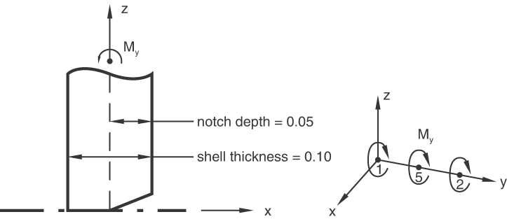
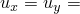
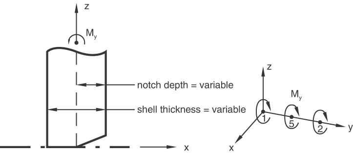
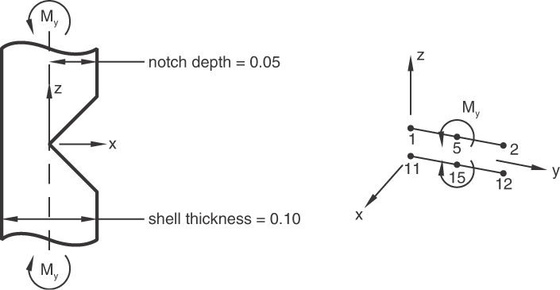
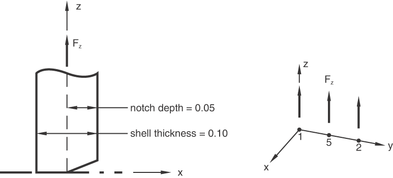
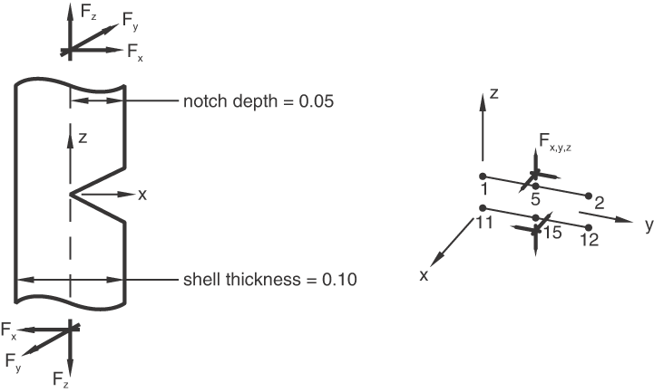

# 1.10.2 Line spring elements


**Product: **Abaqus/Standard  

### I. LS3S with constant-depth notch under far-field bending

### Problem description



```
[*ELEMENT](../key/key-link.md#usb-kws-melement), TYPE=LS3S, ELSET=ALL
1, 2, 5, 1
[*SURFACE FLAW](../key/key-link.md#usb-kws-msurfaceflaw), SIDE=POSITIVE
1, .05
5, .05
2, .05
[*SHELL SECTION](../key/key-link.md#usb-kws-mshellsection), MAT=M1, ELSET=ALL
.1,
```

**Material: **

Linear elastic, Young's modulus = 1.0, Poisson's ratio = 0.0.

**Boundary conditions: **

 0 at nodes 1, 2, and 5.

**Loading: **

M 1.0 at nodes 1 and 2. M 4.0 at node 5.

### Results and discussion

| Element | Pt. | J | K | Jelastic | Jplastic |
| --- | --- | --- | --- | --- | --- |
| 1 | 1 | 4.43 106 | 2105.0 | 4.43 106 | 0.0 |
| 1 | 2 | 4.43 106 | 2105.0 | 4.43 106 | 0.0 |
| 1 | 3 | 4.43 106 | 2105.0 | 4.43 106 | 0.0 |

### Input file

[exls3bx2.inp](../eif/exls3bx2.inp)

Single-edge constant-depth notch strip under far-field bending.

### II. LS3S with variable depth notch under far-field bending

### Problem description



```
[*ELEMENT](../key/key-link.md#usb-kws-melement), TYPE=LS3S, ELSET=ALL
1, 2, 5, 1
[*SURFACE FLAW](../key/key-link.md#usb-kws-msurfaceflaw), SIDE=POSITIVE
1, .07
5, .05
2, .04
[*SHELL SECTION](../key/key-link.md#usb-kws-mshellsection), MAT=M1, ELSET=ALL, NODAL THICKNESS
99,
[*NODAL THICKNESS](../key/key-link.md#usb-kws-mnodalthickness)
1, 0.7
5, 0.5
2, 0.4
3, 0.1
4, 0.1
6, 0.1
7, 0.1
8, 0.1
```

**Material: **

Linear elastic, Young's modulus = 1.0, Poisson's ratio = 0.0.

**Boundary conditions: **

 0 at nodes 1, 2, and 5.

**Loading: **

M 1.0 at nodes 1 and 2. M 4.0 at node 5.

### Results and discussion

| Element | Pt. | J | K | Jelastic | Jplastic |
| --- | --- | --- | --- | --- | --- |
| 1 | 1 | 6891.0 | 83.012 | 6891.0 | 0.0 |
| 1 | 2 | 3528.5 | 59.401 | 3528.5 | 0.0 |
| 1 | 3 | 1286.2 | 35.864 | 1286.2 | 0.0 |

### Input file

[exls3vx2.inp](../eif/exls3vx2.inp)

Single-edge variable-depth notch strip under far-field bending.

### III. LS6 under far-field bending

### Problem description



```
[*ELEMENT](../key/key-link.md#usb-kws-melement), TYPE=LS6, ELSET=ALL
1, 2, 5, 1, 12, 15, 11
[*SURFACE FLAW](../key/key-link.md#usb-kws-msurfaceflaw), SIDE=POSITIVE
1, .05
5, .05
2, .05
[*SHELL SECTION](../key/key-link.md#usb-kws-mshellsection), MAT=M1, ELSET=ALL
.1,
```

**Material: **

Linear elastic, Young's modulus = 1.0, Poisson's ratio = 0.0.

**Boundary conditions: **

Node 17 is fully constrained.  0 for all nodes. Nodes 1, 2, and 5 are constrained to move together. Nodes 11, 12, and 15 are constrained to move together.

**Loading: **

M 6.0 at node 5. M 6.0 at node 15.

### Results and discussion

| Element | Pt. | J | Jelastic | Jplastic | KI | KII | KIII |
| --- | --- | --- | --- | --- | --- | --- | --- |
| 1 | 1 | 4.43 106 | 4.43 106 | 0.0 | 2105.0 | 0.0 | 0.0 |
| 1 | 2 | 4.43 106 | 4.43 106 | 0.0 | 2105.0 | 0.0 | 0.0 |
| 1 | 3 | 4.43 106 | 4.43 106 | 0.0 | 2105.0 | 0.0 | 0.0 |

### Input file

[exls6bx2.inp](../eif/exls6bx2.inp)

Single-edge notch strip under far-field bending about an axis (along the crack-tip line).

### IV. LS3S under far-field tension

### Problem description



```
[*ELEMENT](../key/key-link.md#usb-kws-melement), TYPE=LS3S, ELSET=ALL
1, 2, 5, 1
[*SURFACE FLAW](../key/key-link.md#usb-kws-msurfaceflaw), SIDE=POSITIVE
1, .05
5, .05
2, .05
[*SHELL SECTION](../key/key-link.md#usb-kws-mshellsection), MAT=M1, ELSET=ALL
.1,
```

**Material: **

Linear elastic, Young's modulus = 1.0, Poisson's ratio = 0.0.

**Boundary conditions: **

 0 at nodes 1, 2, and 5.

**Loading: **

F 1.0 at nodes 3 and 4. F 4.0 at node 7.

### Results and discussion

| Element | Pt. | J | K | Jelastic | Jplastic |
| --- | --- | --- | --- | --- | --- |
| 1 | 1 | 4518.0 | 67.22 | 4518.0 | 0.0 |
| 1 | 2 | 4518.0 | 67.22 | 4518.0 | 0.0 |
| 1 | 3 | 4518.0 | 67.22 | 4518.0 | 0.0 |

### Input file

[exls3tx2.inp](../eif/exls3tx2.inp)

Single-edge notch strip under far-field tension.

### V. LS6 under Mode I, II, and III loading

### Problem description



```
[*ELEMENT](../key/key-link.md#usb-kws-melement), TYPE=LS6, ELSET=ALL
1, 2, 5, 1, 12, 15, 11
[*SURFACE FLAW](../key/key-link.md#usb-kws-msurfaceflaw), SIDE=POSITIVE
1, .05
5, .05
2, .05
[*SHELL SECTION](../key/key-link.md#usb-kws-mshellsection), MAT=M1, ELSET=ALL
.1,
```

**Material: **

Linear elastic, Young's modulus = 1.0, Poisson's ratio = 0.0.

**Boundary conditions: **

Node 17 is fully constrained.  0 for all nodes. Nodes 1, 2, and 5 are constrained to move together. Nodes 11, 12, and 15 are constrained to move together.

**Loading: **

 1.0 at node 5.  1.0 at node 15.

### Results and discussion

| Element | Pt. | J | Jelastic | Jplastic | KI | KII | KIII |
| --- | --- | --- | --- | --- | --- | --- | --- |
| 1 | 1 | 170.10 | 170.10 | 0.0 | 11.20 | 4.962 | 4.472 |
| 1 | 2 | 170.10 | 170.10 | 0.0 | 11.20 | 4.962 | 4.472 |
| 1 | 3 | 170.10 | 170.10 | 0.0 | 11.20 | 4.962 | 4.472 |

### Input file

[exls6sx2.inp](../eif/exls6sx2.inp)

Single-edge notch strip under far-field tension (Mode I), in-plane shear (Mode II), and uniform out-of-plane shear (Mode III).


